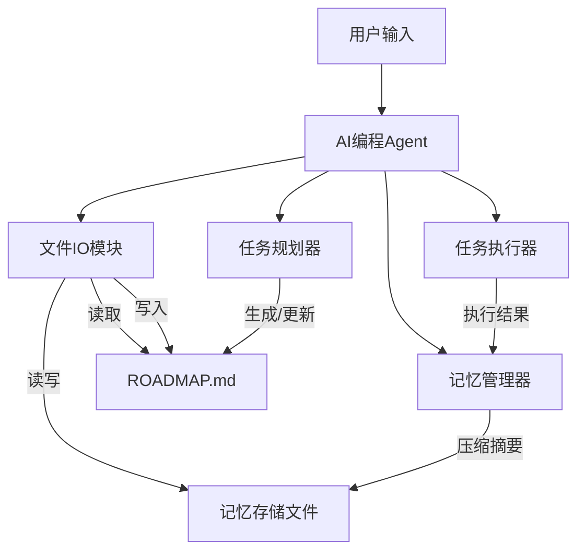

# AI编程Agent设计方案：任务规划分解与记忆持久化

## 概述

设计一个基于大语言模型（LLM）的AI编程Agent，具备以下能力：
- 自动将用户需求分解为可执行子任务，并按依赖关系规划执行顺序。
- 将任务规划与进度持久化到 `ROADMAP.md` 文件中，便于随时查看与恢复。
- 实现对话记忆压缩，避免长上下文溢出，同时保留关键信息。
- 支持新会话时自动读取 `ROADMAP.md` 与压缩记忆，无缝继续之前的开发工作。

## 系统架构



## 核心模块设计

### 1. 任务规划器（Task Planner）

- **输入**：用户需求、当前项目上下文、已有 `ROADMAP.md`
- **输出**：结构化的任务列表（JSON/Markdown表格形式）
- **功能**：
  - 将大需求拆分为原子子任务（每个子任务可独立验证）
  - 识别任务依赖关系（前置任务、并行任务）
  - 为每个任务分配状态：`pending` / `in_progress` / `done` / `blocked`
  - 更新 `ROADMAP.md` 的“总体进度”、“时间戳”等元信息

#### ROADMAP.md 格式示例

```markdown
# 项目ROADMAP

## 元信息
- 项目名称：用户管理系统
- 创建时间：2026-04-12 10:00:00
- 最后更新：2026-04-12 15:30:00
- 当前焦点任务：Task-002

## 任务列表
| ID     | 任务描述                     | 状态        | 依赖       | 备注                 |
|--------|------------------------------|-------------|------------|----------------------|
| Task-001| 设计数据库Schema             | done        | -          | 已实现users表        |
| Task-002| 实现用户注册API              | in_progress | Task-001   | 正在编写密码加密逻辑 |
| Task-003| 实现登录与JWT签发            | pending     | Task-002   |                      |
| Task-004| 编写单元测试                 | pending     | Task-002,003|                      |

## 压缩记忆摘要
[上轮对话摘要] 用户要求添加邮箱验证功能，已确认使用正则校验，尚未开始实现。
```

### 2. 任务执行器（Task Executor）

- **职责**：按规划执行具体任务（编写代码、运行命令、调用工具等）
- **工作流程**：
  1. 从 `ROADMAP.md` 中选取一个状态为 `pending` 且依赖已满足的任务
  2. 调用LLM生成该任务所需的代码/操作
  3. 执行代码（如写入文件、运行测试、启动进程）
  4. 根据执行结果标记任务状态（成功→`done`，失败→记录错误并可能标记为`blocked`）
  5. 调用任务规划器更新 `ROADMAP.md`
  6. 调用记忆管理器压缩并持久化本次交互

### 3. 记忆管理器（Memory Manager）

- **问题**：LLM上下文窗口有限（如8k/128k tokens），长对话会导致信息丢失。
- **策略**：采用 **分层记忆** + **主动压缩**：
  - **短期记忆**：当前会话最近K轮对话（如最近20条消息）
  - **长期记忆**：压缩后的历史摘要，存储于独立文件（如 `memory_summary.txt`）
  - **触发压缩**：当对话轮次超过阈值（如30轮）或token数超过窗口的70%时，执行压缩
- **压缩方法**：
  - 调用LLM对历史对话生成一段200-300字的摘要，突出：
    - 已完成的任务与结果
    - 未完成的任务与下一步计划
    - 重要决策（如选型、API设计）
    - 用户偏好（如代码风格、测试要求）
  - 将摘要写入 `memory_summary.txt`，并替换 `ROADMAP.md` 中的“压缩记忆摘要”字段
  - 清空短期记忆缓冲区，仅保留最近一次交互

```python
# 记忆管理器伪代码
class MemoryManager:
    def __init__(self, max_tokens=8000):
        self.short_term = []   # 消息列表
        self.long_term = ""    # 压缩摘要
        self.max_tokens = max_tokens
        
    def add_message(self, role, content):
        self.short_term.append({"role": role, "content": content})
        if self.estimate_tokens() > self.max_tokens * 0.7:
            self.compress()
            
    def compress(self):
        # 调用LLM生成摘要
        summary_prompt = f"请将以下对话压缩为200字摘要，突出已完成任务、待办事项和关键决策：\n{self.short_term}"
        new_summary = llm(summary_prompt)
        self.long_term = new_summary
        # 保留最近5轮对话作为短期上下文
        self.short_term = self.short_term[-10:]
        # 持久化摘要
        save_file("memory_summary.txt", self.long_term)
        
    def get_context(self):
        # 返回给LLM的上下文 = 长期摘要 + 短期对话
        return self.long_term + "\n" + format_messages(self.short_term)
```

### 4. 文件IO模块

- **职责**：读写 `ROADMAP.md`、`memory_summary.txt` 以及其他项目文件
- **API**：
  - `load_roadmap() -> dict`：解析Markdown表格，返回结构化任务列表
  - `save_roadmap(roadmap_data)`
  - `load_memory() -> str`
  - `save_memory(summary)`

## 主Agent工作流程

### 初始化（新会话启动）

```python
def initialize_agent(project_path):
    roadmap_path = f"{project_path}/ROADMAP.md"
    memory_path = f"{project_path}/memory_summary.txt"
    
    if os.path.exists(roadmap_path):
        roadmap = load_roadmap(roadmap_path)
        memory = load_memory(memory_path) if os.path.exists(memory_path) else ""
        print(f"恢复项目：{roadmap['meta']['project_name']}")
        print(f"当前进度：{get_progress(roadmap)}")
    else:
        roadmap = create_empty_roadmap()
        memory = ""
        print("新项目，请描述您的需求。")
    
    # 构建初始prompt，包含roadmap和记忆摘要
    initial_context = f"""
    当前项目ROADMAP：
    {format_roadmap(roadmap)}
    
    历史记忆摘要：
    {memory}
    
    请根据以上信息继续工作。
    """
    return Agent(roadmap, memory, initial_context)
```

### 主循环（单次用户请求）

```python
def run_agent_cycle(user_input):
    # 1. 更新短期记忆
    memory_manager.add_message("user", user_input)
    
    # 2. 规划与分解（如果需要）
    if user_input.startswith("/plan") or need_planning(user_input, roadmap):
        updated_roadmap = task_planner.plan(user_input, roadmap, memory_manager.get_context())
        save_roadmap(updated_roadmap)
        roadmap = updated_roadmap
    
    # 3. 选择一个可执行任务
    next_task = select_next_task(roadmap)  # 根据依赖和优先级
    
    # 4. 执行任务
    if next_task:
        result = task_executor.execute(next_task, memory_manager.get_context())
        # 根据执行结果更新任务状态
        if result.success:
            next_task.status = "done"
        else:
            next_task.status = "blocked"
            next_task.error = result.error
        save_roadmap(roadmap)
        # 将执行结果加入记忆
        memory_manager.add_message("system", f"任务{next_task.id}执行结果：{result.summary}")
    
    # 5. 可能生成回复给用户
    response = generate_response(user_input, memory_manager.get_context(), roadmap)
    
    # 6. 压缩记忆（自动触发）
    memory_manager.add_message("assistant", response)
    
    return response
```

## 关键技术细节

### 任务依赖解析

在 `ROADMAP.md` 中使用类似表格的“依赖”列，格式为 `Task-001,Task-002`。Agent解析时构建DAG，采用拓扑排序决定执行顺序。当依赖任务全部为 `done` 时，当前任务才可执行。

### 避免无限循环

- 当任务连续失败超过3次，标记为 `blocked` 并请求用户介入
- 规划时限制最大任务数量（如不超过20个原子任务），超出则建议用户拆分需求

### 与外部工具的集成

为支持实际编程，Agent应具备调用工具的能力：
- `write_file(path, content)`：写入代码文件
- `run_command(cmd)`：执行测试、构建命令
- `read_file(path)`：读取现有代码
- `search_code(pattern)`：在项目中搜索

这些工具通过LLM的函数调用（Function Calling）实现。

## 示例对话流程

**用户（新会话）**：帮我写一个Python Flask应用，提供加法计算器API。

**Agent**（无ROADMAP）：
1. 规划任务：
   - Task-001：创建Flask项目结构
   - Task-002：编写加法API路由 `/add?a=1&b=2`
   - Task-003：添加单元测试
2. 写入ROADMAP.md
3. 执行Task-001 → 创建 `app.py` 和基本模板
4. 更新ROADMAP.md（Task-001 done）
5. 回复：已创建项目结构，下一步将实现API。

**用户**：继续。

**Agent**：
- 读取ROADMAP.md，发现Task-002 pending → 生成代码写入文件 → 标记done → 回复。

**用户**：退出（关闭会话）。

**下次新会话**（用户未说话，Agent自动读取ROADMAP.md）：
Agent：欢迎回来。当前进度：Task-001、Task-002已完成，Task-003 pending（单元测试）。是否继续执行测试任务？

## 压缩记忆的效果示例

原始对话（约4000 tokens）：
> 用户：请用FastAPI替代Flask。  
> Agent：好的，我将重构代码。  
> 用户：注意要支持异步。  
> Agent：已改用async def。  
> ...（后续20轮）

压缩后摘要（200 tokens）：
> 用户要求将框架从Flask改为FastAPI，并强调需要异步支持。Agent已重写所有路由为异步函数，测试通过。未完成的任务：添加输入验证（Task-004）。用户偏好使用Pydantic模型。

## 部署建议

- **LLM选型**：GPT-4、Claude 3 Opus 或本地模型如DeepSeek-Coder（需足够上下文长度）
- **持久化**：使用JSON作为中间格式便于解析，同时生成人类可读的 `ROADMAP.md`（Markdown + YAML frontmatter）
- **鲁棒性**：加入状态机，处理读取失败、LLM响应异常等边缘情况

## 总结

该设计方案通过**任务规划分解**、**ROADMAP持久化**、**记忆压缩与恢复**三大机制，构建了一个能够持续工作、跨会话记忆的AI编程Agent。开发者可根据此设计使用LangChain、AutoGen或原生LLM API实现具体代码。该Agent特别适合复杂项目开发、长时间迭代场景，显著减少重复沟通和上下文丢失问题。
