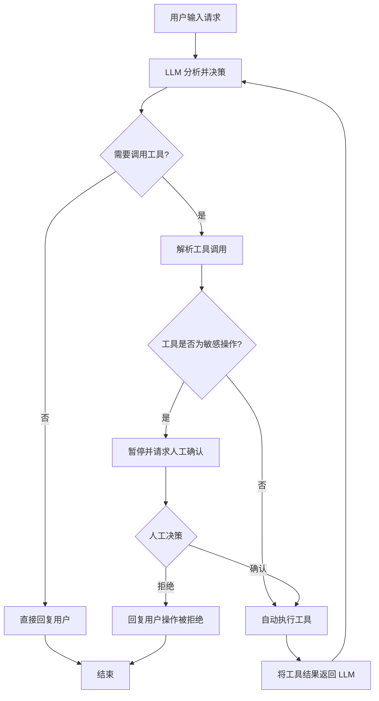
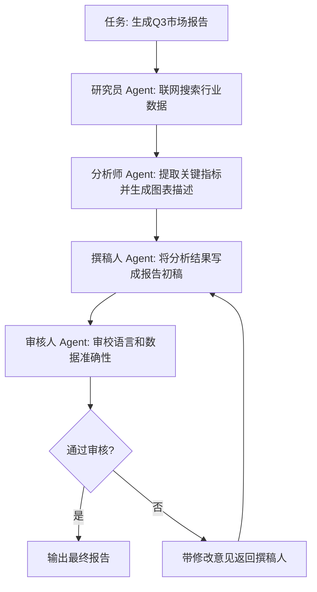
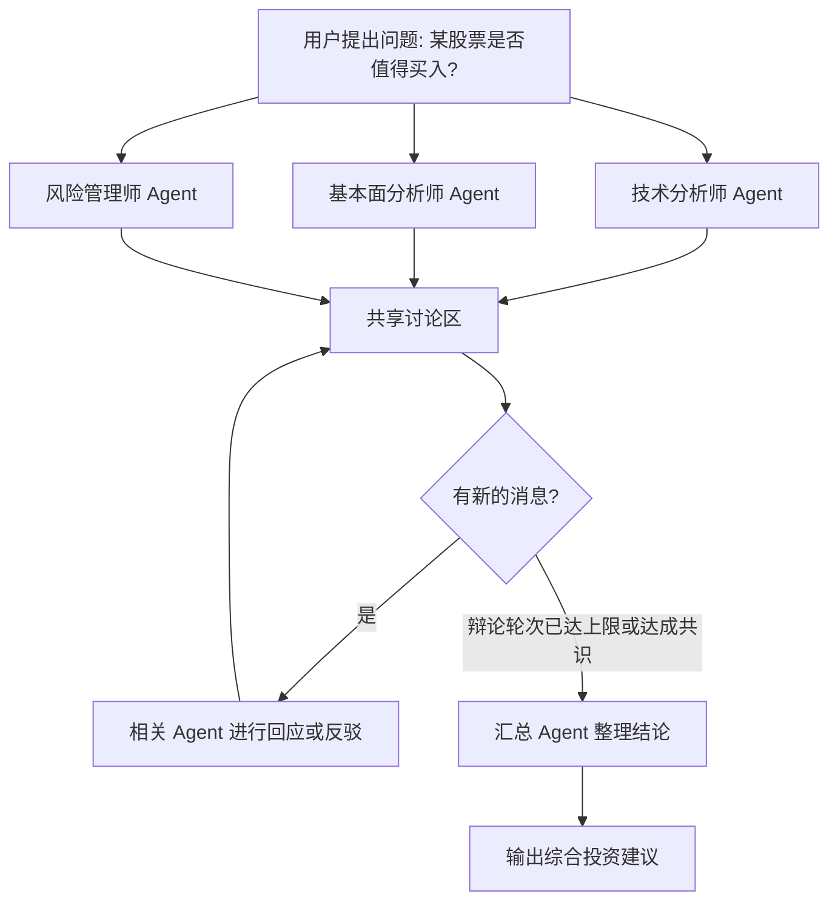
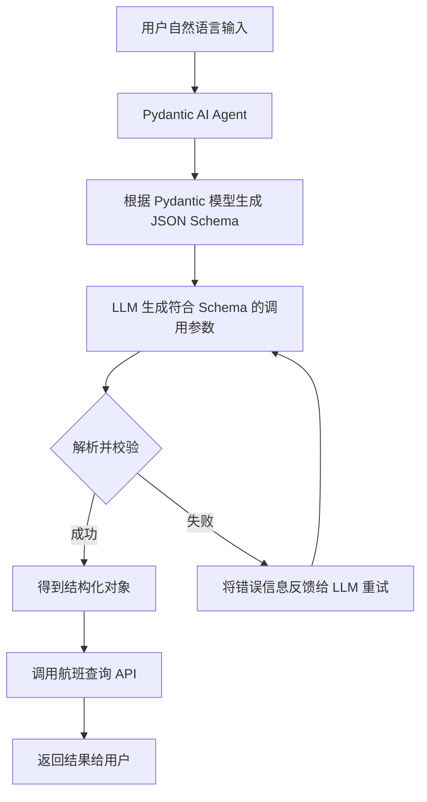
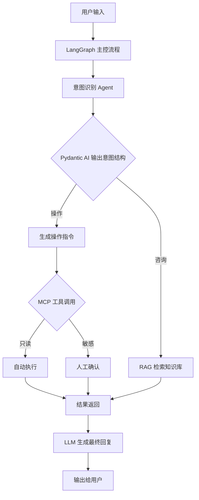

# 四个 Agent 框架/工具的精讲

---

## 1. LangGraph

**白话理解**  
LangGraph 是给 Agent 画流程图的框架。你把 Agent 的每个思考步骤、工具调用、判断分支画成节点和箭头，它就能按图运行，支持循环、条件跳转和暂停等复杂逻辑。

**核心原理**  
LangGraph 本质是一个 **有状态的有向图执行引擎**。图由 `StateGraph` 定义，包含：
- **节点 (Node)**：执行具体逻辑，比如调用 LLM 或工具。
- **边 (Edge)**：控制流，可以是固定连接或条件分支（根据状态选择下一个节点）。
- **状态 (State)**：在节点间传递的结构化数据，通常是 TypedDict，持久化在通道中。

与 LangChain 的线性 Chain 不同，LangGraph 天然支持循环，这使得它非常适合实现 **ReAct 循环** 和 **多 Agent 协同**。运行时可以保存检查点，支持暂停、恢复和人机交互。

**适用场景**  
- 复杂的多步 Agent，需要条件分支和循环
- 多 Agent 协作，如一个规划 Agent 调用多个执行 Agent
- 需要人类审批的工作流

---

## 2. CrewAI

**白话理解**  
CrewAI 是 Agent 的“团队协作平台”。你可以定义多个具有不同角色和目标的 Agent，再指定它们如何组成团队、按什么顺序完成任务。就像给一群 AI 助手分配岗位和流程，它们会自动合作产出结果。

**核心原理**  
CrewAI 的核心是 **角色驱动的多 Agent 编排**。每个 Agent 有：
- **角色 (Role)**：如“研究员”、“撰稿人”
- **目标 (Goal)**：明确的任务目标
- **背景故事 (Backstory)**：角色设定的上下文
- **工具 (Tools)**：可调用的能力

多个 Agent 组成 `Crew`，通过 **顺序 (Sequential) 或层级 (Hierarchical) 流程** 协作。层级流程中有一个管理 Agent 负责分配任务和汇总结果。CrewAI 底层还是调用 LLM，但通过角色的 prompt 工程和流程管理，让多 Agent 协同变得更简单可控。

**适用场景**  
- 内容生成流水线（研究→撰写→审核）
- 需要多个 AI 角色分工的业务场景
- 非技术用户也能快速搭建的多 Agent 应用

---

## 3. MAF (Multi-Agent Framework)

**白话理解**  
MAF 泛指多智能体框架，与 CrewAI 类似，但更强调 **去中心化、动态交互**。你可以想象一个会议室，多个 AI Agent 各自有自己的知识和能力，通过自由讨论、辩论来达成共识或解决问题，而不是一个人分配任务。

**核心原理**  
MAF 的核心是 **基于消息传递的 Actor 模型**。每个 Agent 是一个独立的 Actor，有内部状态和决策逻辑。它们通过发送和接收消息进行交互，交互模式可以是对等协商、投票、辩论等。相比于 CrewAI 的固定流程，MAF 更灵活，Agent 可以根据对话动态决定下一步和谁说话。这需要解决会话管理、冲突解决、共识形成等问题。

**适用场景**  
- 需要多方观点碰撞的复杂决策（如投资分析）
- 开放域问题求解，没有固定的工作流
- 仿真模拟多个角色行为（如社会模拟）

---

## 4. Pydantic AI

**白话理解**  
Pydantic AI 是一个让 LLM 输出结构化数据的库。你不用操心让模型返回合规的 JSON，只需用 Pydantic 定义一个数据类，库自动处理提示词、格式约束和校验，让模型输出严格符合类型定义的对象。

**核心原理**  
它结合了 **Pydantic 数据校验 + LLM 函数调用/结构化输出**。核心流程：
1. 你定义 Pydantic 模型，如 `class User(BaseModel): name: str; age: int`
2. Pydantic AI 自动生成 JSON Schema 并注入到 LLM 的提示词中
3. 使用工具调用（Function Calling）或 JSON mode 让模型输出符合 schema 的内容
4. 接收响应后自动校验，如果解析失败会触发重试或修复策略

它还支持依赖注入、流式结构化输出、多步 Agent 逻辑等。底层可以与 OpenAI、Anthropic 等模型适配，核心优势是 **将类型安全带进 LLM 交互**。

**适用场景**  
- 任何需要 Agent 输出稳定结构化数据的场景
- 构建 API 时，从自然语言提取结构化参数
- 代替传统的手写正则或 Post-Processing 来解析模型输出

---

### 对比总结

| 框架 | 核心定位 | 编排模式 | 典型场景 |
|------|---------|---------|---------|
| **LangGraph** | 状态图引擎 | 图状态机 (循环、条件) | 复杂单/多 Agent 流程 |
| **CrewAI** | 角色式多 Agent 编排 | 顺序/层级流程 | 内容生产流水线 |
| **MAF** | 去中心化多 Agent 交互 | 动态消息传递 | 辩论、协商、仿真 |
| **Pydantic AI** | 结构化输出 + Agent | 函数调用/校验 | 稳定输出数据的 Agent |

选择时，看你的任务需要的是控制流 (LangGraph)、角色分工 (CrewAI)、动态协作 (MAF)，还是类型安全 (Pydantic AI)。它们常常可以组合使用，例如用 Pydantic AI 保证单 Agent 输出格式，再放入 LangGraph 构建复杂流程。

## 四个框架在典型实际应用

---

## 1. LangGraph：带人工审批的 Agent 循环

场景：用户要求 Agent 执行一个可能敏感的操作（如修改数据库记录）。Agent 需要先分析请求，如果涉及敏感操作则暂停等待人工确认，否则自动执行。



**说明**  
- 状态图由 LangGraph 管理，节点包括 `agent_think`、`tool_execute`、`human_approval`。  
- 条件边根据工具元数据（权限标记）决定是否需要人工节点。  
- 检查点机制让流程可以暂停、恢复，非常适合长任务和合规场景。

---

## 2. CrewAI：内容生成流水线（角色分工）

场景：自动生成一篇带数据分析的市场报告。研究员搜索数据，分析师处理数据，撰稿人写报告，审核人最终审校。



**说明**  
- CrewAI 以顺序（Sequential）或层级（Hierarchical）方式调度 Agent。此处为顺序传递，每个 Agent 完成自己的子任务后将结果传递给下一个。  
- 角色和背景故事通过 system prompt 注入，保证输出风格一致。  
- 审核环节可加入少量人工抽查，但大部分情况下由 AI 审核员自动完成。

---

## 3. MAF（多智能体框架）：去中心化投资分析辩论

场景：三个独立 Agent 分别代表技术分析、基本面分析和风险管理，它们通过自由对话和辩论，最终达成一份综合投资建议。



**说明**  
- 基于消息传递的 Actor 模型，每个 Agent 监听共享消息总线。  
- 使用发言控制（如 token 上限、轮次限制）防止无限辩论。  
- 汇总 Agent 可以采用加权投票或由 LLM 进行最终综合。

---

## 4. Pydantic AI：从自然语言到结构化 API 调用

场景：用户说“帮我查一下明天从杭州飞北京的航班”，Agent 输出一个严格符合 `FlightSearch` 结构的对象，用于调用航班查询 API。



**说明**  
- `FlightSearch` 是一个 Pydantic BaseModel，字段有 `origin`, `destination`, `date` 等。  
- Pydantic AI 自动处理 function calling 的 tool_choice 约束，或使用 JSON mode 加正则修复。  
- 校验失败时，库会捕获 ValidationError 并自动发起重试，直至成功或达到最大重试次数。

---

## 组合应用示例：用 Pydantic AI + LangGraph + MCP 构建智能客服

更贴近你简历项目的组合架构：



**关键点**  
- `Pydantic AI` 保证意图识别的输出稳定，如 `{intent: "refund", order_id: "123"}`。  
- `LangGraph` 管理整个对话状态和条件分支。  
- `MCP` 协议让工具调用标准化，权限分级自动触发人工确认。  

## 一个 **Pydantic AI + MCP** 的完整可运行示例

包含两部分：  
1. 一个自带的天气 MCP 服务器（通过 stdio 通信）  
2. Pydantic AI 助手，自动发现并调用 MCP 天气工具

---

## 1. 天气 MCP 服务器 `weather_server.py`

用 `mcp` 官方库编写，提供 `get_weather` 工具。

```python
# weather_server.py
import asyncio
import json
from mcp.server import Server, NotificationOptions
from mcp.server.models import InitializationCapabilities
from mcp.server.stdio import stdio_server

# 创建 MCP 服务器实例
server = Server("weather-server")

@server.list_tools()
async def list_tools():
    """告诉客户端有哪些工具可用"""
    return [
        {
            "name": "get_weather",
            "description": "查询指定城市的天气情况",
            "inputSchema": {
                "type": "object",
                "properties": {
                    "city": {
                        "type": "string",
                        "description": "城市名称，例如 Beijing"
                    }
                },
                "required": ["city"]
            }
        }
    ]

@server.call_tool()
async def call_tool(name: str, arguments: dict):
    """处理工具调用"""
    if name == "get_weather":
        city = arguments.get("city", "未知")
        # 模拟返回天气（实际可接入真实 API）
        return {
            "content": [
                {
                    "type": "text",
                    "text": f"{city} 当前天气：晴，温度 22°C，湿度 45%，风力 2级"
                }
            ]
        }
    raise ValueError(f"Unknown tool: {name}")

async def main():
    async with stdio_server() as (read_stream, write_stream):
        await server.run(
            read_stream,
            write_stream,
            InitializationCapabilities(
                sampling={},
                experimental={},
                roots={"listChanged": True}
            ),
            NotificationOptions()
        )

if __name__ == "__main__":
    asyncio.run(main())
```

---

## 2. Pydantic AI 助手 `agent.py`

助手会自动连接上面的 MCP 服务器，将天气工具注入 Agent。

```python
# agent.py
import asyncio
import os
from typing import Any
from mcp import ClientSession, StdioServerParameters
from mcp.client.stdio import stdio_client
from pydantic_ai import Agent
from pydantic_ai.models.openai import OpenAIModel
from pydantic_ai.mcp import MCPServerStdio  # 官方便捷集成（需要 pydantic-ai >= 0.0.20）

# ------------------------- 方式一：使用官方集成（推荐） -------------------------
# 如果你的 pydantic-ai 版本足够新，可以直接用 MCPServerStdio
async def run_with_official_integration():
    # 启动天气 MCP 服务器进程
    server = MCPServerStdio(
        command="python",           # 命令
        args=["weather_server.py"], # 脚本路径
    )
    
    # 创建 Agent，并通过 mcp_servers 参数注入 MCP 工具
    agent = Agent(
        model=OpenAIModel("gpt-4o-mini"),   # 替换为你的模型
        mcp_servers=[server],
        system_prompt="你是一个天气助手，请使用工具查询天气并友好回复。"
    )
    
    # 运行对话
    result = await agent.run("北京今天天气怎么样？")
    print(result.data)

# ------------------------- 方式二：手动包装 MCP 工具 -------------------------
# 如果不想依赖 pydantic-ai 的 beta 功能，可手动包装
async def run_with_manual_integration():
    # 1. 启动 MCP 客户端连接
    server_params = StdioServerParameters(
        command="python",
        args=["weather_server.py"]
    )
    
    async with stdio_client(server_params) as (read, write):
        async with ClientSession(read, write) as session:
            # 初始化会话
            await session.initialize()
            
            # 获取工具列表
            tools_result = await session.list_tools()
            mcp_tools = tools_result.tools
            
            # 手动构建 Pydantic AI 可用的工具函数
            async def get_weather(city: str) -> str:
                """查询城市天气"""
                result = await session.call_tool("get_weather", {"city": city})
                # 提取返回文本
                return result.content[0].text
            
            # 创建 Agent 并注册工具
            agent = Agent(
                model=OpenAIModel("gpt-4o-mini"),
                system_prompt="你是一个天气助手，请使用 get_weather 工具查询天气并友好回复。"
            )
            
            @agent.tool
            async def query_weather(city: str) -> str:
                """查询指定城市的天气情况"""
                return await get_weather(city)
            
            # 运行对话
            result = await agent.run("上海明天会下雨吗？")
            print(result.data)

if __name__ == "__main__":
    # 任选一种方式运行
    # asyncio.run(run_with_official_integration())
    asyncio.run(run_with_manual_integration())
```

---

## 3. 运行说明

1. **安装依赖**
```bash
pip install pydantic-ai mcp openai
```
（确保 Python ≥ 3.10）

2. **设置 API Key**（如果用 OpenAI）
```bash
export OPENAI_API_KEY="sk-..."
```

3. **先测试服务器**（可选，查看工具列表）
```bash
python weather_server.py
# 该程序通过 stdio 通信，直接运行会等待输入，可以 Ctrl+C 退出
```

4. **运行助手**
```bash
python agent.py
```

输出示例：
```
北京 当前天气：晴，温度 22°C，湿度 45%，风力 2级
```

---

## 架构示意

```
用户输入
   │
   ▼
Pydantic AI Agent
   │
   ├─ 系统提示词 + 工具描述
   │      │
   │      ▼
   │   LLM (gpt-4o-mini)
   │      │
   │      ▼ (决定调用工具)
   │   Agent 执行工具
   │      │
   │      ▼
   │   MCP Client (stdio)
   │      │
   │      ├─ tools/list ──► MCP Server
   │      │                  ├─ get_weather
   │      │                  └─ ...
   │      │
   │      └─ tools/call ──► MCP Server
   │                         └─ 返回天气信息
   │
   ▼
最终回复给用户
```

## 结构化输出保证

### 目标
- 用户问天气 → Agent 调用 MCP 天气工具
- Agent 返回的结果必须是一个 **Pydantic 模型对象**，包含：城市、天气状况、温度、湿度、查询时间
- 如果 LLM 输出缺失字段、类型错误或格式不符，Pydantic AI 会自动校验并触发重试

---

### 1. 天气 MCP 服务器（同前，略）
`weather_server.py` 不变，提供 `get_weather(city: str) -> str` 工具。

---

### 2. 带结构化输出的 Agent

```python
# agent_structured.py
import asyncio
from datetime import datetime
from typing import Optional
from pydantic import BaseModel, Field
from pydantic_ai import Agent
from pydantic_ai.models.openai import OpenAIModel
from mcp import ClientSession, StdioServerParameters
from mcp.client.stdio import stdio_client

# ───────────── 定义输出结构 ─────────────
class WeatherReport(BaseModel):
    """天气报告结构（必须严格满足）"""
    city: str = Field(description="城市名称，如 'Beijing'")
    condition: str = Field(description="天气状况，如 '晴'、'多云'")
    temperature_celsius: float = Field(description="摄氏温度，数字")
    humidity_percent: int = Field(description="相对湿度百分比，整数")
    query_time: str = Field(description="查询时间，ISO 8601 格式")

# ───────────── 手动包装 MCP 工具 ─────────────
async def get_weather_tool(city: str) -> str:
    """调用远程 MCP 天气服务，返回原始天气文本"""
    server_params = StdioServerParameters(
        command="python",
        args=["weather_server.py"]
    )
    async with stdio_client(server_params) as (read, write):
        async with ClientSession(read, write) as session:
            await session.initialize()
            result = await session.call_tool("get_weather", {"city": city})
            return result.content[0].text

# ───────────── 创建 Agent，指定输出类型 ─────────────
agent = Agent(
    model=OpenAIModel("gpt-4o-mini"),
    system_prompt=(
        "你是一个专业的天气助手。请使用 get_weather 工具获取指定城市的天气信息，"
        "然后将结果整理成结构化报告。必须包含城市、天气状况、温度（数字）、"
        "湿度（整数）和当前时间（ISO 8601 格式）。"
    ),
    # ★ 关键：指定 result_type，启用强制结构化输出 ★
    result_type=WeatherReport,
    retries=3  # 校验失败自动重试 3 次
)

# 注册工具
@agent.tool
async def query_weather(city: str) -> str:
    """查询指定城市的天气情况（返回原始文本）"""
    return await get_weather_tool(city)

# ───────────── 运行示例 ─────────────
async def main():
    # 1️⃣ 正常情况
    try:
        result = await agent.run("查一下杭州今天的天气")
        report: WeatherReport = result.data
        print("✅ 结构化输出成功：")
        print(report.model_dump_json(indent=2))
    except Exception as e:
        print(f"❌ 失败：{e}")

    print("\n" + "="*50 + "\n")

    # 2️⃣ 故意测试：如果我们临时给工具返回一个格式错乱的文本，
    #    Agent 可能生成不完整的数据，此时重试机制会发挥作用
    #    （为演示，这里只展示正常流程；重试机制在后台自动运作）

asyncio.run(main())
```

---

### 3. 关键机制说明

#### ✅ 如何保证结构化输出？
1. **定义严格的 Pydantic 模型**  
   `WeatherReport` 的每个字段都有明确的类型和描述，Pydantic AI 会将其转换为 JSON Schema 注入 prompt。

2. **`result_type=WeatherReport`**  
   这是 Pydantic AI 的核心参数。告诉 Agent：“你的最终回复必须可以被解析成 `WeatherReport` 对象”。

3. **自动校验 + 重试**  
   内部流程：
   - LLM 生成文本（可能包含函数调用后自然语言总结）。
   - Pydantic AI 尝试将生成文本或函数调用结果解析为 `WeatherReport`。
   - 如果解析失败（如缺少字段、类型不对），框架会捕获 `ValidationError`，将其作为错误信息反馈给 LLM，要求重新输出。
   - 最多重试 `retries=3` 次，全部失败则抛出异常。

4. **底层实现**  
   对于支持工具调用的模型，Pydantic AI 会自动生成一个名为 `final_result` 的内部工具，该工具的参数 schema 就是 `WeatherReport` 的 JSON Schema。模型通过调用这个工具来输出结构化结果，从而绕过自由文本输出的不确定性。

#### 🔄 对比普通 Agent
- **普通 Agent**：`result = agent.run(...)` → 可能是一段自然语言字符串，需要后处理正则提取。
- **Pydantic AI Agent**：`result.data` 直接是 `WeatherReport` 实例，类型安全，IDE 有智能提示。

---

### 4. 运行输出示例

```
✅ 结构化输出成功：
{
  "city": "杭州",
  "condition": "晴",
  "temperature_celsius": 22.0,
  "humidity_percent": 45,
  "query_time": "2026-08-08T14:30:00"
}
```

如果模型最初返回了 `"杭州今天天气不错"` 这样无法解析的字符串，Pydantic AI 会在重试时告诉模型：“你需要调用 final_result 工具，给出符合 schema 的数据”，从而强制模型修正。

---

### 5. 拓展：流式输出 + 结构化

Pydantic AI 还支持 **流式结构化输出**，适用于逐步构建大模型：

```python
async with agent.run_stream("北京天气") as stream:
    async for chunk in stream.stream_structured():
        # chunk 是部分填充的 WeatherReport 对象
        print(chunk)
```

---

这个例子直接展示了 Pydantic AI 保证结构化输出的 **核心价值**：将 LLM 的不确定性锁死在类型安全的笼子里，让 AI 助手能可靠地接入下游系统。
