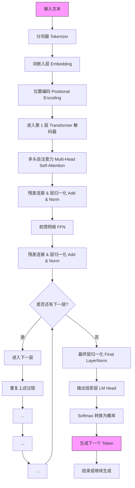
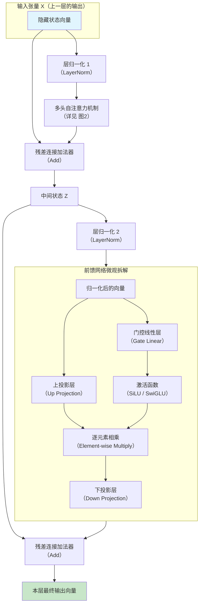
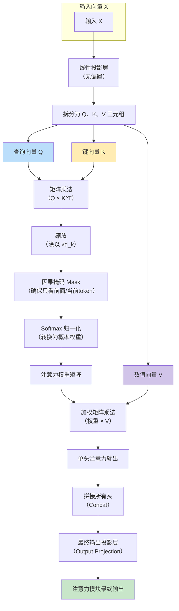
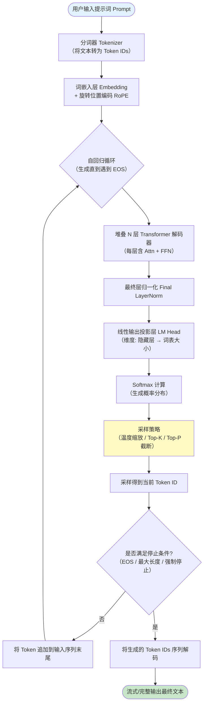
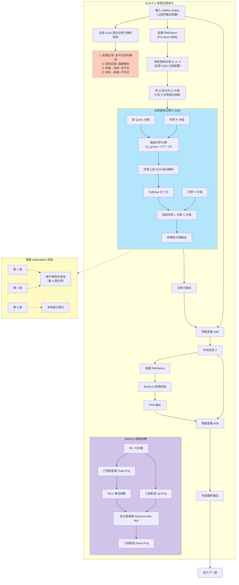

---

## Transformer 解码器

以下代码展示了一个标准的 **Transformer 解码器**（即 GPT、GLM 等生成式模型）处理一个输入 Token 并生成下一个 Token 的完整流程。

> **说明**：每个“层”都包含自注意力、残差连接和前馈网络，整个模型由 N 个这样的层堆叠而成（例如 GLM-5.2 有 70 层）。

### 单个 Transformer 解码器层内部结构（极细粒度）

这张图展示了一个标准层（如 GLM-5.2 的某一层）处理输入向量的完整路径。注意，这里明确拆解了 **残差连接（Add）** 和 **层归一化（Norm）** 的前后顺序（现代模型多采用 Pre-Norm 结构，即先 Norm 再进入子层）。

---

### 多头自注意力机制微观运算（QKV 全过程）

这是大模型最核心的计算单元。下图拆解了一个“头”（Head）的运算，以及多个头如何合并。对于 **GLM-5.2 的 IndexShare 机制**，你可以理解为：在计算下图中的“缩放点积”时，每隔 4 层共享一个索引矩阵来筛选重要的 Key/Value。

## 

1. **通用大模型端到端流程图**（宏观视角：从输入到输出的完整自回归推理闭环）。
2. **GLM-5.2 专用架构流程图**（微观视角：结合了其独特的注意力掩码策略、GQA 分组查询注意力以及 IndexShare 机制的内部细节）。

---

### 图 1：完整大模型（LLM）端到端推理流程图（宏观）
此图覆盖了从用户输入到最终回复生成的**完整自回归循环**，包括 Token 化、位置编码、N 层堆叠、采样策略。

---

### 图 2：GLM-5.2 专用架构流程图（微观层内细节）
此图展示了 GLM-5.2 在处理一个输入序列时的**单层（Layer）内部运算**，并标注了其区别于标准 GPT 的三大核心特征：
- **GLM 混合掩码（Prefix-LM）**：输入被切分为**前缀（Prefix）**和**目标（Target）**，前缀内可双向可见，目标区保持因果自回归。
- **GQA（分组查询注意力）**：为了减少 KV Cache 显存占用，将 Query 分组，每组共享同一个 Key 和 Value 投影。
- **IndexShare 机制**：在每隔 4 层的注意力计算中，共享索引矩阵来筛选重要的 Key/Value（降低计算复杂度）。

---

### 核心区别总结（图解补充）

| 维度 | 通用大模型（标准 GPT 类） | GLM-5.2 专用架构 |
| :--- | :--- | :--- |
| **注意力掩码** | 纯因果掩码（上三角全遮） | **混合掩码**：前缀全双向，后缀因果 |
| **注意力变体** | 标准 MHA（多头注意力） | **GQA（分组查询）** + **IndexShare**（隔层共享索引筛选） |
| **前馈网络** | 标准 FFN（ReLU/GELU） | **SwiGLU**（门控线性单元 + SiLU 激活） |
| **位置编码** | 绝对位置 / RoPE | **RoPE**（旋转位置编码），且与掩码策略联动 |
