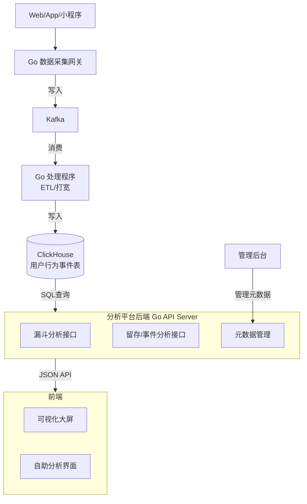

# 使用Go和ClickHouse开发用户行为分析系统

下面我将详细介绍如何使用Go语言和ClickHouse构建用户行为分析系统的完整步骤。

## 系统架构概述

```
用户客户端 → Go数据收集服务 → ClickHouse存储 → Go数据分析API → 前端展示
```

## 环境准备与部署

### 1. 部署ClickHouse

**使用Docker部署ClickHouse：**

```bash
# 创建数据目录
mkdir -p ~/clickhouse/data
mkdir -p ~/clickhouse/config

# 拉取ClickHouse镜像
docker pull clickhouse/clickhouse-server

# 运行ClickHouse容器
docker run -d \
  --name clickhouse-server \
  -p 8123:8123 \
  -p 9000:9000 \
  -p 9009:9009 \
  -v ~/clickhouse/data:/var/lib/clickhouse \
  -v ~/clickhouse/config:/etc/clickhouse-server \
  clickhouse/clickhouse-server
```

**验证安装：**
```bash
# 进入容器
docker exec -it clickhouse-server clickhouse-client

# 或从外部连接
clickhouse-client --host localhost --port 9000 --user default
```

### 2. 安装Go环境

```bash
# 下载并安装Go
wget https://golang.org/dl/go1.19.linux-amd64.tar.gz
sudo tar -C /usr/local -xzf go1.19.linux-amd64.tar.gz

# 设置环境变量
echo 'export PATH=$PATH:/usr/local/go/bin' >> ~/.bashrc
echo 'export GOPATH=$HOME/go' >> ~/.bashrc
source ~/.bashrc

# 验证安装
go version
```

## 数据库设计与建表

### 1. 创建数据库和表

在ClickHouse中执行以下SQL语句：

```sql
-- 创建数据库
CREATE DATABASE IF NOT EXISTS user_analytics;

-- 切换到数据库
USE user_analytics;

-- 创建用户事件表
CREATE TABLE IF NOT EXISTS user_events
(
    event_id UUID DEFAULT generateUUIDv4(),
    user_id UInt64,
    session_id String,
    event_type String,
    event_name String,
    page_url String,
    referrer String,
    device_type Enum8('desktop' = 1, 'mobile' = 2, 'tablet' = 3, 'other' = 4),
    browser String,
    os String,
    country_code FixedString(2),
    region String,
    city String,
    event_time DateTime64(3, 'UTC'),
    properties String,  -- JSON格式的额外属性
    created_at DateTime64(3, 'UTC') DEFAULT now()
)
ENGINE = MergeTree()
PARTITION BY toYYYYMM(event_time)
ORDER BY (event_time, user_id, event_type)
TTL event_time + INTERVAL 6 MONTH
SETTINGS index_granularity = 8192;

-- 创建分布式表（如果使用集群）
CREATE TABLE IF NOT EXISTS user_events_distributed AS user_events
ENGINE = Distributed(cluster_name, user_analytics, user_events, rand());

-- 创建物化视图用于常用聚合
CREATE MATERIALIZED VIEW IF NOT EXISTS user_events_daily_mv
ENGINE = SummingMergeTree()
PARTITION BY toYYYYMM(event_time)
ORDER BY (event_time, event_type, country_code)
AS SELECT
    toDate(event_time) as event_date,
    event_type,
    country_code,
    count() as event_count,
    uniq(user_id) as unique_users
FROM user_events
GROUP BY event_date, event_type, country_code;
```

## Go应用开发

### 1. 项目初始化

```bash
# 创建项目目录
mkdir user-analytics-system
cd user-analytics-system

# 初始化Go模块
go mod init github.com/your-username/user-analytics-system

# 安装依赖
go get github.com/ClickHouse/clickhouse-go/v2
go get github.com/gin-gonic/gin
go get github.com/rs/zerolog/log
```

### 2. 项目结构

```
user-analytics-system/
├── cmd/
│   ├── collector/          # 数据收集服务
│   └── api/               # 数据分析API服务
├── internal/
│   ├── models/            # 数据模型
│   ├── repository/        # 数据访问层
│   └── service/           # 业务逻辑层
├── pkg/
│   └── clickhouse/        # ClickHouse客户端配置
└── configs/               # 配置文件
```

### 3. ClickHouse连接配置

创建 `pkg/clickhouse/client.go`:

```go
package clickhouse

import (
	"context"
	"fmt"
	"log"
	"time"

	"github.com/ClickHouse/clickhouse-go/v2"
	"github.com/ClickHouse/clickhouse-go/v2/lib/driver"
)

type Config struct {
	Host     string
	Port     int
	Database string
	Username string
	Password string
}

func NewConnection(cfg Config) (driver.Conn, error) {
	conn, err := clickhouse.Open(&clickhouse.Options{
		Addr: []string{fmt.Sprintf("%s:%d", cfg.Host, cfg.Port)},
		Auth: clickhouse.Auth{
			Database: cfg.Database,
			Username: cfg.Username,
			Password: cfg.Password,
		},
		DialTimeout: 10 * time.Second,
		Settings: clickhouse.Settings{
			"max_execution_time": 60,
		},
		Compression: &clickhouse.Compression{
			Method: clickhouse.CompressionLZ4,
		},
	})
	
	if err != nil {
		return nil, err
	}
	
	ctx := context.Background()
	if err := conn.Ping(ctx); err != nil {
		return nil, err
	}
	
	log.Println("Connected to ClickHouse successfully")
	return conn, nil
}
```

### 4. 数据模型

创建 `internal/models/event.go`:

```go
package models

import (
	"encoding/json"
	"time"
)

type DeviceType int8

const (
	Desktop DeviceType = iota + 1
	Mobile
	Tablet
	Other
)

type UserEvent struct {
	EventID     string                 `json:"event_id" ch:"event_id"`
	UserID      uint64                 `json:"user_id" ch:"user_id"`
	SessionID   string                 `json:"session_id" ch:"session_id"`
	EventType   string                 `json:"event_type" ch:"event_type"`
	EventName   string                 `json:"event_name" ch:"event_name"`
	PageURL     string                 `json:"page_url" ch:"page_url"`
	Referrer    string                 `json:"referrer" ch:"referrer"`
	DeviceType  DeviceType             `json:"device_type" ch:"device_type"`
	Browser     string                 `json:"browser" ch:"browser"`
	OS          string                 `json:"os" ch:"os"`
	CountryCode string                 `json:"country_code" ch:"country_code"`
	Region      string                 `json:"region" ch:"region"`
	City        string                 `json:"city" ch:"city"`
	EventTime   time.Time              `json:"event_time" ch:"event_time"`
	Properties  map[string]interface{} `json:"properties" ch:"properties"`
	CreatedAt   time.Time              `json:"created_at" ch:"created_at"`
}

func (e *UserEvent) MarshalProperties() string {
	if e.Properties == nil {
		return "{}"
	}
	bytes, _ := json.Marshal(e.Properties)
	return string(bytes)
}
```

### 5. 数据访问层

创建 `internal/repository/event_repository.go`:

```go
package repository

import (
	"context"
	"fmt"
	"time"

	"github.com/your-username/user-analytics-system/internal/models"
	"github.com/ClickHouse/clickhouse-go/v2/lib/driver"
)

type EventRepository struct {
	conn driver.Conn
}

func NewEventRepository(conn driver.Conn) *EventRepository {
	return &EventRepository{conn: conn}
}

func (r *EventRepository) Insert(event *models.UserEvent) error {
	query := `
		INSERT INTO user_events (
			user_id, session_id, event_type, event_name, 
			page_url, referrer, device_type, browser, os, 
			country_code, region, city, event_time, properties
		) VALUES (?, ?, ?, ?, ?, ?, ?, ?, ?, ?, ?, ?, ?, ?)
	`
	
	return r.conn.AsyncInsert(context.Background(), query, false,
		event.UserID,
		event.SessionID,
		event.EventType,
		event.EventName,
		event.PageURL,
		event.Referrer,
		event.DeviceType,
		event.Browser,
		event.OS,
		event.CountryCode,
		event.Region,
		event.City,
		event.EventTime,
		event.MarshalProperties(),
	)
}

func (r *EventRepository) GetEventsByTimeRange(start, end time.Time, limit uint64) ([]models.UserEvent, error) {
	query := `
		SELECT 
			event_id, user_id, session_id, event_type, event_name,
			page_url, referrer, device_type, browser, os,
			country_code, region, city, event_time, properties, created_at
		FROM user_events 
		WHERE event_time >= ? AND event_time <= ?
		ORDER BY event_time DESC
		LIMIT ?
	`
	
	rows, err := r.conn.Query(context.Background(), query, start, end, limit)
	if err != nil {
		return nil, err
	}
	defer rows.Close()
	
	var events []models.UserEvent
	for rows.Next() {
		var event models.UserEvent
		var propertiesStr string
		
		if err := rows.Scan(
			&event.EventID,
			&event.UserID,
			&event.SessionID,
			&event.EventType,
			&event.EventName,
			&event.PageURL,
			&event.Referrer,
			&event.DeviceType,
			&event.Browser,
			&event.OS,
			&event.CountryCode,
			&event.Region,
			&event.City,
			&event.EventTime,
			&propertiesStr,
			&event.CreatedAt,
		); err != nil {
			return nil, err
		}
		
		// 解析JSON属性
		if err := json.Unmarshal([]byte(propertiesStr), &event.Properties); err != nil {
			return nil, fmt.Errorf("failed to unmarshal properties: %v", err)
		}
		
		events = append(events, event)
	}
	
	return events, nil
}

// 添加更多分析方法，如获取用户行为 funnel、留存率等
```

### 6. 数据收集服务

创建 `cmd/collector/main.go`:

```go
package main

import (
	"encoding/json"
	"net/http"
	"time"

	"github.com/gin-gonic/gin"
	"github.com/rs/zerolog/log"
	"github.com/your-username/user-analytics-system/internal/models"
	"github.com/your-username/user-analytics-system/internal/repository"
	"github.com/your-username/user-analytics-system/pkg/clickhouse"
)

func main() {
	// 初始化ClickHouse连接
	cfg := clickhouse.Config{
		Host:     "localhost",
		Port:     9000,
		Database: "user_analytics",
		Username: "default",
		Password: "",
	}
	
	conn, err := clickhouse.NewConnection(cfg)
	if err != nil {
		log.Fatal().Err(err).Msg("Failed to connect to ClickHouse")
	}
	defer conn.Close()
	
	// 初始化仓库
	eventRepo := repository.NewEventRepository(conn)
	
	// 初始化Gin路由
	router := gin.Default()
	
	// 健康检查端点
	router.GET("/health", func(c *gin.Context) {
		c.JSON(http.StatusOK, gin.H{"status": "ok"})
	})
	
	// 事件收集端点
	router.POST("/track", func(c *gin.Context) {
		var event models.UserEvent
		if err := c.BindJSON(&event); err != nil {
			c.JSON(http.StatusBadRequest, gin.H{"error": err.Error()})
			return
		}
		
		// 设置事件时间（如果未提供）
		if event.EventTime.IsZero() {
			event.EventTime = time.Now().UTC()
		}
		
		// 存储事件
		if err := eventRepo.Insert(&event); err != nil {
			log.Error().Err(err).Msg("Failed to insert event")
			c.JSON(http.StatusInternalServerError, gin.H{"error": "Failed to track event"})
			return
		}
		
		c.JSON(http.StatusOK, gin.H{"status": "success"})
	})
	
	// 批量事件收集端点
	router.POST("/batch", func(c *gin.Context) {
		var events []models.UserEvent
		if err := c.BindJSON(&events); err != nil {
			c.JSON(http.StatusBadRequest, gin.H{"error": err.Error()})
			return
		}
		
		for _, event := range events {
			if event.EventTime.IsZero() {
				event.EventTime = time.Now().UTC()
			}
			
			if err := eventRepo.Insert(&event); err != nil {
				log.Error().Err(err).Msg("Failed to insert event in batch")
				// 可以继续处理其他事件或中断，根据需求决定
			}
		}
		
		c.JSON(http.StatusOK, gin.H{"status": "success", "processed": len(events)})
	})
	
	// 启动服务器
	log.Info().Msg("Starting collector server on :8080")
	if err := router.Run(":8080"); err != nil {
		log.Fatal().Err(err).Msg("Failed to start server")
	}
}
```

### 7. 数据分析API服务

创建 `cmd/api/main.go`:

```go
package main

import (
	"net/http"
	"time"

	"github.com/gin-gonic/gin"
	"github.com/rs/zerolog/log"
	"github.com/your-username/user-analytics-system/internal/repository"
	"github.com/your-username/user-analytics-system/pkg/clickhouse"
)

func main() {
	// 初始化ClickHouse连接
	cfg := clickhouse.Config{
		Host:     "localhost",
		Port:     9000,
		Database: "user_analytics",
		Username: "default",
		Password: "",
	}
	
	conn, err := clickhouse.NewConnection(cfg)
	if err != nil {
		log.Fatal().Err(err).Msg("Failed to connect to ClickHouse")
	}
	defer conn.Close()
	
	// 初始化仓库
	eventRepo := repository.NewEventRepository(conn)
	
	// 初始化Gin路由
	router := gin.Default()
	
	// 获取事件数据
	router.GET("/events", func(c *gin.Context) {
		startTime := c.Query("start_time")
		endTime := c.Query("end_time")
		limit := c.DefaultQuery("limit", "100")
		
		var start, end time.Time
		var err error
		
		if startTime != "" {
			start, err = time.Parse(time.RFC3339, startTime)
			if err != nil {
				c.JSON(http.StatusBadRequest, gin.H{"error": "Invalid start_time format"})
				return
			}
		} else {
			start = time.Now().AddDate(0, 0, -7) // 默认过去7天
		}
		
		if endTime != "" {
			end, err = time.Parse(time.RFC3339, endTime)
			if err != nil {
				c.JSON(http.StatusBadRequest, gin.H{"error": "Invalid end_time format"})
				return
			}
		} else {
			end = time.Now()
		}
		
		events, err := eventRepo.GetEventsByTimeRange(start, end, 100)
		if err != nil {
			log.Error().Err(err).Msg("Failed to fetch events")
			c.JSON(http.StatusInternalServerError, gin.H{"error": "Failed to fetch events"})
			return
		}
		
		c.JSON(http.StatusOK, events)
	})
	
	// 获取分析指标
	router.GET("/metrics/:type", func(c *gin.Context) {
		metricType := c.Param("type")
		startTime := c.Query("start_time")
		endTime := c.Query("end_time")
		
		// 实现各种分析指标查询
		switch metricType {
		case "daily-active-users":
			// 实现DAU查询
		case "retention":
			// 实现留存率查询
		case "funnel":
			// 实现漏斗分析
		default:
			c.JSON(http.StatusBadRequest, gin.H{"error": "Unknown metric type"})
		}
	})
	
	// 启动服务器
	log.Info().Msg("Starting API server on :8081")
	if err := router.Run(":8081"); err != nil {
		log.Fatal().Err(err).Msg("Failed to start server")
	}
}
```

## 部署和运行

### 1. 构建和运行服务

```bash
# 构建数据收集服务
go build -o collector ./cmd/collector

# 构建API服务
go build -o api ./cmd/api

# 运行服务
./collector &
./api &
```

### 2. 使用Docker Compose部署（可选）

创建 `docker-compose.yml`:

```yaml
version: '3.8'

services:
  clickhouse:
    image: clickhouse/clickhouse-server
    ports:
      - "8123:8123"
      - "9000:9000"
    volumes:
      - clickhouse_data:/var/lib/clickhouse
      - clickhouse_config:/etc/clickhouse-server
    environment:
      - CLICKHOUSE_DB=user_analytics
      - CLICKHOUSE_USER=admin
      - CLICKHOUSE_PASSWORD=secret

  collector:
    build:
      context: .
      dockerfile: Dockerfile.collector
    ports:
      - "8080:8080"
    depends_on:
      - clickhouse
    environment:
      - CH_HOST=clickhouse
      - CH_PORT=9000
      - CH_DB=user_analytics
      - CH_USER=admin
      - CH_PASSWORD=secret

  api:
    build:
      context: .
      dockerfile: Dockerfile.api
    ports:
      - "8081:8081"
    depends_on:
      - clickhouse
    environment:
      - CH_HOST=clickhouse
      - CH_PORT=9000
      - CH_DB=user_analytics
      - CH_USER=admin
      - CH_PASSWORD=secret

volumes:
  clickhouse_data:
  clickhouse_config:
```

## 测试系统

### 1. 发送测试事件

```bash
curl -X POST http://localhost:8080/track \
  -H "Content-Type: application/json" \
  -d '{
    "user_id": 12345,
    "session_id": "session_abc",
    "event_type": "page_view",
    "event_name": "homepage",
    "page_url": "https://example.com",
    "referrer": "https://google.com",
    "device_type": 2,
    "browser": "Chrome",
    "os": "Android",
    "country_code": "US",
    "region": "California",
    "city": "San Francisco",
    "properties": {"load_time": 1.2, "scroll_depth": 75}
  }'
```

### 2. 查询事件数据

```bash
curl "http://localhost:8081/events?start_time=2023-01-01T00:00:00Z&end_time=2023-12-31T23:59:59Z&limit=10"
```

## 性能优化建议

1. **使用批量插入**：尽量使用批量接口减少插入操作次数
2. **调整ClickHouse配置**：根据数据量调整内存和线程设置
3. **使用数据分区**：按时间分区提高查询性能
4. **添加索引**：为常用查询字段添加索引
5. **使用物化视图**：预计算常用聚合指标

## 监控和维护

1. 监控ClickHouse的系统指标（CPU、内存、磁盘使用率）
2. 定期清理过期数据
3. 监控查询性能，优化慢查询
4. 设置报警规则用于系统异常检测

这个系统提供了一个完整的用户行为分析基础架构，你可以根据具体需求进一步扩展功能，如实时分析看板、用户分群、路径分析等高级功能。

---

### 一、系统架构设计
1. **分层架构**  
    - **数据采集层**：用户行为埋点数据通过Kafka实时接入，结合Flink清洗关联用户属性。  
    - **存储层**：  
      - 行为明细表：`ReplicatedReplacingMergeTree`引擎存储原始行为数据，按用户ID分片（`user_id % shard_num`）确保单用户数据位于同一分片。  
      - 聚合表：`AggregatingMergeTree`引擎预计算留存/漏斗指标，减少实时计算量。  
    - **计算层**：利用分布式表（Distributed Table）并行查询，通过本地表（Local Table）避免写入瓶颈。

2. **数据路由优化**  
    - 避免直接写分布式表：通过MapReduce任务按`user_id`哈希路由到本地表，减少ZooKeeper压力。  
    - 分片数据解耦：同一用户行为仅存于一个分片，实现无跨节点GROUP BY。

---

### 二、数据建模方案
#### 1. 行为明细表
```sql
CREATE TABLE user_events_local ON CLUSTER cluster_name (
    `user_id` UInt64,
    `event_time` DateTime,
    `event_name` String,
    `city` String,
    `device` String,
    `session_id` String
) ENGINE = ReplicatedReplacingMergeTree()
PARTITION BY toYYYYMM(event_time)
ORDER BY (user_id, event_time)
SETTINGS index_granularity = 8192;
```
- **字段说明**：`event_name`（事件名如“login”、“purchase”）、`session_id`（会话标识）。

#### 2. 用户画像宽表
```sql
CREATE TABLE user_profiles_local ON CLUSTER cluster_name (
    `user_id` UInt64,
    `age` UInt8,
    `gender` String,
    `vip_level` UInt8,
    `last_active_date` Date
) ENGINE = ReplicatedReplacingMergeTree()
ORDER BY user_id;
```
- **优化**：行为分析时通过`JOIN`画像宽表，避免实时关联。

---

### 三、核心分析SQL实现
#### 1. **漏斗分析（7步转化）**
```sql
SELECT
    level_index AS step,
    count(1) AS current_users,
    neighbor(current_users, -1) AS previous_users,
    round(current_users / previous_users * 100, 2) AS conversion_rate
FROM (
    SELECT
        level_index,
        user_id
    FROM (
        SELECT
            user_id,
            arrayJoin(arrayEnumerate(arrayWithConstant(level, 1))) AS level_index
        FROM (
            SELECT
                user_id,
                windowFunnel(604800)(event_time,  -- 7天窗口期
                    event_name = 'view_home',
                    event_name = 'click_banner',
                    event_name = 'add_to_cart',
                    event_name = 'confirm_order',
                    event_name = 'payment'
                ) AS level
            FROM user_events_distributed
            WHERE event_time >= now() - INTERVAL 30 DAY
            GROUP BY user_id
        )
        WHERE level >= 1
    )
    GROUP BY level_index
)
ORDER BY step ASC;
```
- **说明**：`windowFunnel`返回用户最大转化步数，`arrayEnumerate`展开为步骤明细。

#### 2. **多周期留存分析（1/3/7/30日）**
```sql
SELECT
    toDate(first_day) AS start_date,
    retention[1] AS retained_1d,
    retention[2] AS retained_3d,
    retention[3] AS retained_7d,
    retention[4] AS retained_30d,
    retained_1d / start_users AS rate_1d,
    retained_3d / start_users AS rate_3d
FROM (
    SELECT
        first_day,
        count() AS start_users,
        retention(
            toDate(event_time) = first_day,  -- 起始事件（如注册）
            toDate(event_time) = first_day + INTERVAL 1 DAY,  -- 1日留存
            toDate(event_time) = first_day + INTERVAL 3 DAY,  -- 3日留存
            toDate(event_time) = first_day + INTERVAL 7 DAY,  -- 7日留存
            toDate(event_time) = first_day + INTERVAL 30 DAY   -- 30日留存
        ) AS retention
    FROM (
        SELECT
            user_id,
            min(toDate(event_time)) AS first_day
        FROM user_events_distributed
        WHERE event_name = 'register'
        GROUP BY user_id
    ) AS start_users
    LEFT JOIN user_events_distributed USING (user_id)
    GROUP BY first_day
);
```
- **说明**：`retention`函数按位标记用户是否满足各时间点条件。

#### 3. **用户画像圈选**
```sql
-- 筛选高价值流失用户（30日内活跃但近7日未付费）
SELECT
    city,
    device,
    countDistinct(user_id) AS users
FROM user_events_distributed
WHERE user_id IN (
    SELECT user_id
    FROM user_profiles_distributed
    WHERE vip_level >= 3
        AND last_active_date >= today() - INTERVAL 30 DAY
        AND user_id NOT IN (
            SELECT user_id
            FROM user_events_distributed
            WHERE event_name = 'payment'
                AND event_time >= now() - INTERVAL 7 DAY
        )
)
GROUP BY city, device;
```

---

### 四、关键优化策略
1. **预计算加速**  
   - 使用`AggregatingMergeTree`预存每日留存结果，查询时直接汇总。  
   - 漏斗分析结果物化到`MATERIALIZED VIEW`。

2. **Bitmap高效人群计算**  
   ```sql
   -- 使用RoaringBitmap计算7日活跃用户
   SELECT groupBitmap(user_id) AS active_users 
   FROM user_events_distributed 
   WHERE event_time >= now() - INTERVAL 7 DAY;
   ```
   - **优势**：压缩存储，支持交并差集运算（`bitmapAnd`/`bitmapOr`）。

3. **分区裁剪与索引**  
   - 按时间分区（`PARTITION BY toYYYYMM(event_time)`），结合`ORDER BY (user_id, event_time)`加速用户行为序列查询。

---

## 常用分析 SQL

# ClickHouse 用户行为分析SQL示例

下面提供一些常用的用户行为分析SQL查询示例，包括漏斗分析、留存分析等。

## 1. 漏斗分析SQL

### 基本漏斗分析（按事件序列）
```sql
-- 分析从浏览->加入购物车->购买的转化漏斗
WITH 
    'page_view' AS step1,
    'add_to_cart' AS step2,
    'purchase' AS step3
SELECT
    countIf(has_step1) AS step1_users,
    countIf(has_step1 AND has_step2) AS step2_users,
    countIf(has_step1 AND has_step2 AND has_step3) AS step3_users,
    round(step2_users / step1_users * 100, 2) AS step1_to_step2_conversion,
    round(step3_users / step2_users * 100, 2) AS step2_to_step3_conversion,
    round(step3_users / step1_users * 100, 2) AS overall_conversion
FROM (
    SELECT
        user_id,
        maxIf(1, event_name = step1) AS has_step1,
        maxIf(1, event_name = step2) AS has_step2,
        maxIf(1, event_name = step3) AS has_step3
    FROM user_events
    WHERE event_time >= today() - 7
    GROUP BY user_id
)
```

### 时间窗口漏斗分析（7天内完成所有步骤）
```sql
-- 分析7天内完成浏览->加入购物车->购买的用户漏斗
WITH 
    'page_view' AS step1,
    'add_to_cart' AS step2,
    'purchase' AS step3
SELECT
    countIf(has_step1) AS step1_users,
    countIf(has_step1 AND has_step2 AND step2_time - step1_time <= interval 7 day) AS step2_users,
    countIf(has_step1 AND has_step2 AND has_step3 AND step2_time - step1_time <= interval 7 day AND step3_time - step2_time <= interval 7 day) AS step3_users,
    round(step2_users / step1_users * 100, 2) AS step1_to_step2_conversion,
    round(step3_users / step2_users * 100, 2) AS step2_to_step3_conversion,
    round(step3_users / step1_users * 100, 2) AS overall_conversion
FROM (
    SELECT
        user_id,
        maxIf(1, event_name = step1) AS has_step1,
        maxIf(1, event_name = step2) AS has_step2,
        maxIf(1, event_name = step3) AS has_step3,
        minIf(event_time, event_name = step1) AS step1_time,
        minIf(event_time, event_name = step2) AS step2_time,
        minIf(event_time, event_name = step3) AS step3_time
    FROM user_events
    WHERE event_time >= today() - 30
    GROUP BY user_id
)
```

### 多步骤漏斗分析（可扩展）
```sql
-- 创建可扩展的多步骤漏斗分析函数
SELECT
    windowFunnel(604800)( -- 7天时间窗口(604800秒)
        event_time,
        event_name = 'page_view',
        event_name = 'add_to_cart',
        event_name = 'initiate_checkout',
        event_name = 'purchase'
    ) AS funnel_steps,
    count() AS user_count
FROM user_events
WHERE event_time >= now() - INTERVAL 30 DAY
GROUP BY funnel_steps
ORDER BY funnel_steps
```

## 2. 留存分析SQL

### 每日新增用户留存分析
```sql
-- 计算每日新增用户的第1、7、30日留存率
WITH 
    first_events AS (
        SELECT
            user_id,
            min(toDate(event_time)) AS first_date
        FROM user_events
        WHERE event_time >= today() - 60
        GROUP BY user_id
    ),
    daily_activity AS (
        SELECT
            user_id,
            toDate(event_time) AS active_date
        FROM user_events
        WHERE event_time >= today() - 60
        GROUP BY user_id, toDate(event_time)
    )
SELECT
    first_date AS cohort_date,
    count(distinct user_id) AS cohort_size,
    count(distinct if(active_date = first_date + 1, user_id, NULL)) AS day1_retained,
    count(distinct if(active_date = first_date + 7, user_id, NULL)) AS day7_retained,
    count(distinct if(active_date = first_date + 30, user_id, NULL)) AS day30_retained,
    round(day1_retained / cohort_size * 100, 2) AS day1_retention_rate,
    round(day7_retained / cohort_size * 100, 2) AS day7_retention_rate,
    round(day30_retained / cohort_size * 100, 2) AS day30_retention_rate
FROM first_events
JOIN daily_activity USING (user_id)
WHERE first_date >= today() - 30
GROUP BY first_date
ORDER BY first_date
```

### 留存矩阵（Cohort分析）
```sql
-- 创建留存矩阵，显示不同时间段的留存情况
WITH 
    first_events AS (
        SELECT
            user_id,
            toMonday(min(event_time)) AS first_week
        FROM user_events
        WHERE event_time >= today() - 90
        GROUP BY user_id
    ),
    weekly_activity AS (
        SELECT
            user_id,
            toMonday(event_time) AS active_week
        FROM user_events
        WHERE event_time >= today() - 90
        GROUP BY user_id, toMonday(event_time)
    )
SELECT
    first_week,
    count(distinct user_id) AS cohort_size,
    count(distinct if(active_week = first_week, user_id, NULL)) AS week0,
    count(distinct if(active_week = first_week + 7, user_id, NULL)) AS week1,
    count(distinct if(active_week = first_week + 14, user_id, NULL)) AS week2,
    count(distinct if(active_week = first_week + 21, user_id, NULL)) AS week3,
    count(distinct if(active_week = first_week + 28, user_id, NULL)) AS week4,
    round(week1 / cohort_size * 100, 1) AS week1_retention,
    round(week2 / cohort_size * 100, 1) AS week2_retention,
    round(week3 / cohort_size * 100, 1) AS week3_retention,
    round(week4 / cohort_size * 100, 1) AS week4_retention
FROM first_events
JOIN weekly_activity USING (user_id)
WHERE first_week >= today() - 60
GROUP BY first_week
ORDER BY first_week
```

## 3. 用户行为路径分析

### 用户最常见的路径分析
```sql
-- 分析用户最常见的行为路径（前10条路径）
SELECT
    path,
    count() AS path_count
FROM (
    SELECT
        user_id,
        session_id,
        groupArray(event_name) AS path
    FROM (
        SELECT
            user_id,
            session_id,
            event_name,
            event_time
        FROM user_events
        WHERE event_time >= today() - 7
        ORDER BY user_id, session_id, event_time
    )
    GROUP BY user_id, session_id
)
GROUP BY path
ORDER BY path_count DESC
LIMIT 10
```

### 热门页面流转分析
```sql
-- 分析页面之间的流转情况
SELECT
    previous_page,
    current_page,
    count() AS transition_count
FROM (
    SELECT
        user_id,
        session_id,
        page_url AS current_page,
        neighbor(page_url, -1) AS previous_page
    FROM (
        SELECT
            user_id,
            session_id,
            page_url,
            event_time
        FROM user_events
        WHERE event_name = 'page_view' AND event_time >= today() - 7
        ORDER BY user_id, session_id, event_time
    )
)
WHERE previous_page != ''
GROUP BY previous_page, current_page
ORDER BY transition_count DESC
LIMIT 20
```

## 4. 用户活跃度分析

### 每日活跃用户(DAU)和每月活跃用户(MAU)
```sql
-- 计算DAU、MAU以及DAU/MAU比率
SELECT
    toDate(event_time) AS date,
    count(distinct user_id) AS dau,
    count(distinct if(event_time >= today() - 30, user_id, NULL)) AS mau,
    round(dau / mau * 100, 2) AS engagement_ratio
FROM user_events
WHERE event_time >= today() - 60
GROUP BY date
ORDER BY date
```

### 用户活跃度分布
```sql
-- 分析用户活跃度分布（按事件数量）
SELECT
    activity_level,
    count() AS user_count
FROM (
    SELECT
        user_id,
        count() AS event_count,
        CASE
            WHEN event_count >= 100 THEN '超级活跃'
            WHEN event_count >= 50 THEN '高度活跃'
            WHEN event_count >= 20 THEN '中度活跃'
            WHEN event_count >= 5 THEN '轻度活跃'
            ELSE '不活跃'
        END AS activity_level
    FROM user_events
    WHERE event_time >= today() - 30
    GROUP BY user_id
)
GROUP BY activity_level
ORDER BY user_count DESC
```

## 5. 用户分群分析

### 新老用户行为对比
```sql
-- 比较新用户和老用户的行为差异
WITH user_cohorts AS (
    SELECT
        user_id,
        if(min(toDate(event_time)) >= today() - 7, 'new', 'existing') AS cohort
    FROM user_events
    WHERE event_time >= today() - 30
    GROUP BY user_id
)
SELECT
    cohort,
    count(distinct user_id) AS users,
    count(*) AS total_events,
    round(count(*) / count(distinct user_id), 1) AS events_per_user,
    count(distinct session_id) AS total_sessions,
    round(count(distinct session_id) / count(distinct user_id), 1) AS sessions_per_user,
    round(avgIf(1, event_name = 'purchase'), 3) AS conversion_rate
FROM user_events
JOIN user_cohorts USING (user_id)
WHERE event_time >= today() - 7
GROUP BY cohort
```

### 按设备类型分析用户行为
```sql
-- 分析不同设备类型用户的行为差异
SELECT
    device_type,
    count(distinct user_id) AS users,
    count(*) AS total_events,
    round(count(*) / count(distinct user_id), 1) AS events_per_user,
    round(avgIf(1, event_name = 'purchase'), 3) AS conversion_rate,
    round(avg(parseJSON(properties).load_time), 2) AS avg_load_time
FROM user_events
WHERE event_time >= today() - 7
GROUP BY device_type
ORDER BY users DESC
```

## 6. 事件分析

### 事件趋势分析
```sql
-- 分析关键事件的日趋势
SELECT
    toDate(event_time) AS date,
    event_name,
    count(*) AS event_count,
    count(distinct user_id) AS unique_users
FROM user_events
WHERE event_time >= today() - 30
    AND event_name IN ('page_view', 'add_to_cart', 'purchase')
GROUP BY date, event_name
ORDER BY date, event_name
```

### 事件属性分析
```sql
-- 分析特定事件的属性分布
SELECT
    parseJSON(properties).button_color AS button_color,
    count(*) AS click_count,
    count(distinct user_id) AS unique_users
FROM user_events
WHERE event_name = 'button_click'
    AND event_time >= today() - 7
    AND button_color != ''
GROUP BY button_color
ORDER BY click_count DESC
```

## 7. 会话分析

### 会话时长分析
```sql
-- 分析用户会话时长分布
SELECT
    session_duration_sec,
    count() AS session_count
FROM (
    SELECT
        user_id,
        session_id,
        max(event_time) - min(event_time) AS session_duration_sec
    FROM user_events
    WHERE event_time >= today() - 7
    GROUP BY user_id, session_id
    HAVING session_duration_sec <= 3600 -- 过滤掉超过1小时的会话（可能是异常）
)
GROUP BY session_duration_sec
ORDER BY session_duration_sec
```

### 会话深度分析
```sql
-- 分析用户会话深度（每会话事件数量）
SELECT
    events_per_session,
    count() AS session_count
FROM (
    SELECT
        user_id,
        session_id,
        count() AS events_per_session
    FROM user_events
    WHERE event_time >= today() - 7
    GROUP BY user_id, session_id
)
GROUP BY events_per_session
ORDER BY events_per_session
```

## 性能优化提示

1. 对于常用分析，考虑创建物化视图预计算结果：
```sql
-- 创建每日事件汇总的物化视图
CREATE MATERIALIZED VIEW user_events_daily_mv
ENGINE = SummingMergeTree()
PARTITION BY toYYYYMM(event_date)
ORDER BY (event_date, event_type, country_code)
AS SELECT
    toDate(event_time) AS event_date,
    event_type,
    country_code,
    count() AS event_count,
    uniq(user_id) AS unique_users
FROM user_events
GROUP BY event_date, event_type, country_code;
```

2. 为常用查询字段添加索引：
```sql
-- 添加索引（如果尚未添加）
ALTER TABLE user_events ADD INDEX event_time_idx (event_time) TYPE minmax GRANULARITY 32;
ALTER TABLE user_events ADD INDEX event_name_idx (event_name) TYPE set(0) GRANULARITY 32;
ALTER TABLE user_events ADD INDEX user_id_idx (user_id) TYPE set(0) GRANULARITY 32;
```

这些SQL查询示例涵盖了用户行为分析中的常见场景，您可以根据实际业务需求进行调整和扩展。在实际使用时，请注意根据数据量和性能需求适当调整时间范围和查询条件。

## 漏斗分析

### **一、 核心架构设计 (Go + ClickHouse)**

数据流如下所示：



**各组件职责：**

1.  **数据采集与接入**：同上阶段，使用 Go 网关接收数据，写入 Kafka。
2.  **数据处理**：Go 程序消费 Kafka，进行清洗、格式化、打宽（将常用属性从 JSON 中提取成单独的列），然后批量写入 ClickHouse。
3.  **数据存储**：**ClickHouse** 是核心。所有原始用户行为事件存入一张大的 `events` 表。
4.  **分析计算层**：由 **Go 编写的后端 API 服务** 构成。它不承担复杂计算，而是作为“SQL 生成器”和“查询路由器”。
    *   接收前端分析请求（如生成一个漏斗）。
    *   根据元数据，将其转换为高效的 ClickHouse SQL 查询。
    *   执行查询并将结果返回给前端。
5.  **应用层**：前端界面、可视化大屏等。

---

### **二、 ClickHouse 表设计**

这是方案成败的关键。合理的表设计能极大提升查询性能。

```sql
-- 创建用户行为事件表
CREATE TABLE analysis.user_events
(
    -- 1. 事件唯一标识与时间
    event_id      String COMMENT '事件唯一ID',
    event_time    DateTime64(3, 'UTC') COMMENT '事件发生时间',
    -- 2. 用户标识
    user_id       String COMMENT '用户ID',
    device_id     String COMMENT '设备ID',
    -- 3. 事件上下文
    event_name    String COMMENT '事件名称 (e.g., pageview, click, purchase)',
    platform      Enum8('web'=1, 'ios'=2, 'android'=3, 'mini_program'=4),
    -- 4. 常用维度 (打宽成列，查询更快)
    page_url      String COMMENT '页面URL',
    page_title    String COMMENT '页面标题',
    country       String COMMENT '国家',
    region        String COMMENT '省份/州',
    city          String COMMENT '城市',
    -- 5. 自定义属性 (存储在Map中，保证灵活性)
    properties Map(String, String) COMMENT '用户自定义属性'
)
ENGINE = ReplacingMergeTree() -- 使用ReplacingMergeTree处理潜在重复数据
PARTITION BY toYYYYMM(event_time)
ORDER BY (event_name, user_id, event_time) -- 按事件名、用户ID、时间排序，对漏斗和序列查询极佳
TTL event_time + toIntervalMonth(6)
SETTINGS index_granularity = 8192;
```

**设计要点：**
*   **`ORDER BY` 子句**：`(event_name, user_id, event_time)` 是点睛之笔。这让相同用户的所有事件在物理上相邻存储，并且按时间排序，**使基于用户的漏斗分析查询速度极快**。
*   **打宽常用维度**：将高频过滤和分组使用的维度（如 `page_url`, `country`）设为单独列，利用 ClickHouse 的索引加速查询。
*   **使用 `Map` 类型**：存储灵活多变的自定义属性，避免频繁改表。

---

### **三、 漏斗分析实现方案 (Go + ClickHouse SQL)**

这是最核心的部分。我们将使用 ClickHouse 的 **`windowFunnel`** 函数来实现漏斗查询。

#### **1. `windowFunnel` 函数简介**

`windowFunnel(window)(timestamp, cond1, cond2, ..., condN)` 函数可以在一个时间窗口内，寻找按顺序满足条件的事件序列，并返回用户完成的最大步骤数。

*   `window`：滑动窗口大小（单位：秒）。
*   `timestamp`：事件时间戳。
*   `cond1, cond2, ...`：条件表达式，定义了漏斗的每一步。

#### **2. Go 服务中的实现步骤**

假设前端传来一个漏斗分析请求：分析“过去7天内，用户从 `首页浏览` -> `搜索商品` -> `添加购物车` -> `成功支付` 的转化情况”，时间窗口为1小时。

**Step 1: Go 服务接收请求，生成查询参数**

```go
// 漏斗步骤定义
type FunnelStep struct {
    EventName string            `json:"event_name"`
    Properties map[string]string `json:"properties"` // 可指定每一步的属性条件
}

type FunnelRequest struct {
    Steps        []FunnelStep `json:"steps"`
    StartTime    int64        `json:"start_time"`    // 开始时间戳(毫秒)
    EndTime      int64        `json:"end_time"`      // 结束时间戳(毫秒)
    WindowSize   int64        `json:"window_size"`   // 漏斗窗口大小(秒)
}

func (req *FunnelRequest) BuildSQL() string {
    // ... 构建SQL的逻辑
}
```

**Step 2: 动态生成 ClickHouse SQL 查询**

这是 Go 服务的核心逻辑。

```go
func (req *FunnelRequest) BuildSQL() string {
    // 1. 构建 WHERE 子句
    whereClause := fmt.Sprintf("event_time >= FROM_UNIXTIME(%d) AND event_time <= FROM_UNIXTIME(%d)", req.StartTime/1000, req.EndTime/1000)

    // 2. 构建 windowFunnel 的条件表达式
    var conditions []string
    for _, step := range req.Steps {
        cond := fmt.Sprintf("(event_name = '%s')", step.EventName)
        // 可以进一步添加属性条件，例如：
        // if value, exists := step.Properties["product_type"]; exists {
        //     cond += fmt.Sprintf(" AND properties['product_type'] = '%s'", value)
        // }
        conditions = append(conditions, cond)
    }

    condStr := strings.Join(conditions, ", ")

    // 3. 构建完整的 SQL
    // 计算完成每一步的用户数
    sql := fmt.Sprintf(`
        SELECT
            step, -- 完成的步骤
            count(*) AS count -- 用户数
        FROM (
            SELECT
                user_id,
                windowFunnel(%d)(event_time, %s) AS step -- 计算每个用户完成的最高步骤
            FROM analysis.user_events
            WHERE %s
            GROUP BY user_id
        )
        WHERE step > 0 -- 过滤出至少完成第一步的用户
        GROUP BY step
        ORDER BY step;
    `, req.WindowSize, condStr, whereClause)

    return sql
}
```
生成的 SQL 类似这样：
```sql
SELECT
    step,
    count(*) AS count
FROM (
    SELECT
        user_id,
        windowFunnel(3600)(event_time, 
            (event_name = 'pageview'),
            (event_name = 'search'),
            (event_name = 'add_to_cart'),
            (event_name = 'purchase')
        ) AS step
    FROM analysis.user_events
    WHERE event_time >= FROM_UNIXTIME(1717027200) AND event_time <= FROM_UNIXTIME(1717632000)
    GROUP BY user_id
)
WHERE step > 0
GROUP BY step
ORDER BY step;
```

**Step 3: Go 服务执行查询并处理结果**

```go
// 在Go服务中，使用 clickhouse-go 执行查询
func (s *AnalysisService) GetFunnelResult(ctx context.Context, req *FunnelRequest) ([]FunnelResult, error) {
    sqlQuery := req.BuildSQL()
    rows, err := s.clickhouseClient.Query(ctx, sqlQuery)
    if err != nil {
        return nil, err
    }
    defer rows.Close()

    var results []FunnelResult
    for rows.Next() {
        var step uint8
        var count uint64
        if err := rows.Scan(&step, &count); err != nil {
            return nil, err
        }
        results = append(results, FunnelResult{Step: step, UserCount: count})
    }

    // 结果转换为前端需要的格式
    // [ {step: 1, count: 10000}, {step: 2, count: 2000}, ... ]
    return results, nil
}
```

**Step 4: 解释结果**
查询返回的结果如下：
| step | count |
| :--- | :--- |
| 1 | 10000 |
| 2 | 2000 |
| 3 | 500 |
| 4 | 100 |

这表示：
*   完成第一步（首页浏览）的用户有：10000 人
*   完成第二步（搜索商品）的用户有：2000 人 → **第一步到第二步的转化率为 20%**
*   完成第三步（加购）的用户有：500 人 → **转化率为 2.5%**
*   完成第四步（支付）的用户有：100 人 → **转化率为 0.5%**

---

### **四、 方案优势与总结**

1.  **性能极致**：`windowFunnel` 是 ClickHouse 的内置函数，用 C++ 实现，且其 `ORDER BY` 键设计（`user_id, event_time`）与查询模式完美匹配，性能远超自己在应用层（Go）实现。
2.  **架构简洁**：Go 负责应用逻辑、SQL 生成和连接管理，ClickHouse 负责重型计算，职责清晰。
3.  **灵活扩展**：通过 Go 动态生成 SQL，可以支持非常复杂的漏斗条件（包括事件属性过滤）。未来要新增分析功能，只需在 Go 服务中添加新的 SQL 模板即可。
4.  **成本低廉**：完全基于开源技术，可控性强。

这个 **Go + ClickHouse** 的方案，在保证了开发效率和系统灵活性的同时，通过将复杂的计算下推给 ClickHouse，获得了极致的数据分析性能，是进行用户行为分析的绝佳组合。

# 用户行为分析系统开发文档

## 1. 系统概述

本系统用于收集和分析用户行为数据，包括登录、浏览产品、下单和支付等关键事件。系统采用Go语言开发数据收集服务，Kafka作为消息队列，ClickHouse作为数据存储和分析引擎，支持用户留存分析和漏斗分析。

## 2. 技术选型

- **编程语言**: Go (Golang)
- **消息队列**: Apache Kafka
- **数据存储**: ClickHouse
- **数据传输协议**: JSON over HTTP

## 3. 系统架构

```
前端应用 → Go采集服务 → Kafka → Go消费服务 → ClickHouse → 数据分析
```

## 4. 数据采集设计

### 4.1 埋点事件定义

```go
// 事件基础结构
type BaseEvent struct {
    EventID     string `json:"event_id"`
    EventType   string `json:"event_type"`
    UserID      string `json:"user_id"`
    SessionID   string `json:"session_id"`
    DeviceID    string `json:"device_id"`
    Timestamp   int64  `json:"timestamp"`
    Platform    string `json:"platform"` // web, ios, android
    AppVersion  string `json:"app_version"`
}

// 登录事件
type LoginEvent struct {
    BaseEvent
    LoginMethod string `json:"login_method"` // phone, email, social
    IsSuccess   bool   `json:"is_success"`
}

// 浏览产品事件
type ViewProductEvent struct {
    BaseEvent
    ProductID   string `json:"product_id"`
    Category    string `json:"category"`
    PageURL     string `json:"page_url"`
    Duration    int    `json:"duration"` // 浏览时长(秒)
}

// 下单事件
type OrderEvent struct {
    BaseEvent
    OrderID     string  `json:"order_id"`
    ProductID   string  `json:"product_id"`
    Quantity    int     `json:"quantity"`
    TotalAmount float64 `json:"total_amount"`
}

// 支付事件
type PaymentEvent struct {
    BaseEvent
    OrderID     string  `json:"order_id"`
    PaymentType string  `json:"payment_type"` // wechat, alipay, bank
    Amount      float64 `json:"amount"`
    IsSuccess   bool    `json:"is_success"`
}
```

### 4.2 Go采集服务

```go
package main

import (
    "encoding/json"
    "log"
    "net/http"
    "github.com/segmentio/kafka-go"
)

var kafkaWriter *kafka.Writer

func init() {
    kafkaWriter = &kafka.Writer{
        Addr:     kafka.TCP("localhost:9092"),
        Topic:    "user_events",
        Balancer: &kafka.LeastBytes{},
    }
}

func eventHandler(w http.ResponseWriter, r *http.Request) {
    var baseEvent BaseEvent
    if err := json.NewDecoder(r.Body).Decode(&baseEvent); err != nil {
        http.Error(w, err.Error(), http.StatusBadRequest)
        return
    }
    
    eventJSON, err := json.Marshal(baseEvent)
    if err != nil {
        http.Error(w, err.Error(), http.StatusInternalServerError)
        return
    }
    
    err = kafkaWriter.WriteMessages(r.Context(), kafka.Message{
        Value: eventJSON,
    })
    
    if err != nil {
        http.Error(w, err.Error(), http.StatusInternalServerError)
        return
    }
    
    w.WriteHeader(http.StatusOK)
}

func main() {
    http.HandleFunc("/track", eventHandler)
    log.Fatal(http.ListenAndServe(":8080", nil))
}
```

## 5. Kafka配置

创建Kafka主题用于用户行为事件：
```bash
kafka-topics.sh --create --topic user_events \
--bootstrap-server localhost:9092 \
--partitions 3 \
--replication-factor 1
```

## 6. ClickHouse表设计

### 6.1 用户事件表

```sql
CREATE TABLE user_events
(
    event_date Date DEFAULT toDate(timestamp),
    event_time DateTime,
    event_id String,
    event_type String,
    user_id String,
    session_id String,
    device_id String,
    platform String,
    app_version String,
    
    -- 登录事件特有字段
    login_method Nullable(String),
    login_success Nullable(UInt8),
    
    -- 浏览事件特有字段
    product_id Nullable(String),
    category Nullable(String),
    page_url Nullable(String),
    duration Nullable(Int32),
    
    -- 订单事件特有字段
    order_id Nullable(String),
    quantity Nullable(Int32),
    total_amount Nullable(Float64),
    
    -- 支付事件特有字段
    payment_type Nullable(String),
    payment_amount Nullable(Float64),
    payment_success Nullable(UInt8)
)
ENGINE = MergeTree()
PARTITION BY toYYYYMM(event_date)
ORDER BY (event_date, event_type, user_id)
TTL event_date + INTERVAL 90 DAY;
```

### 6.2 用户留存分析表

```sql
CREATE TABLE user_retention
(
    event_date Date,
    cohort_date Date,
    new_users Int32,
    retained_1d Int32,
    retained_3d Int32,
    retained_7d Int32,
    retained_30d Int32
)
ENGINE = MergeTree()
ORDER BY (event_date, cohort_date);
```

## 7. Go消费服务

```go
package main

import (
    "context"
    "encoding/json"
    "log"
    "github.com/segmentio/kafka-go"
    "github.com/ClickHouse/clickhouse-go/v2"
)

func main() {
    // 连接ClickHouse
    conn, err := clickhouse.Open(&clickhouse.Options{
        Addr: []string{"localhost:9000"},
        Auth: clickhouse.Auth{
            Database: "default",
            Username: "default",
            Password: "",
        },
    })
    if err != nil {
        log.Fatal(err)
    }
    defer conn.Close()

    // 创建Kafka reader
    reader := kafka.NewReader(kafka.ReaderConfig{
        Brokers:   []string{"localhost:9092"},
        Topic:     "user_events",
        GroupID:   "clickhouse-consumer",
        MinBytes:  10e3, // 10KB
        MaxBytes:  10e6, // 10MB
    })
    defer reader.Close()

    for {
        msg, err := reader.ReadMessage(context.Background())
        if err != nil {
            log.Printf("Error reading message: %v", err)
            continue
        }

        var event map[string]interface{}
        if err := json.Unmarshal(msg.Value, &event); err != nil {
            log.Printf("Error unmarshaling event: %v", err)
            continue
        }

        // 构建插入语句
        err = conn.AsyncInsert(context.Background(), `
            INSERT INTO user_events (
                event_time, event_id, event_type, user_id, session_id, 
                device_id, platform, app_version, login_method, login_success,
                product_id, category, page_url, duration, order_id, quantity,
                total_amount, payment_type, payment_amount, payment_success
            ) VALUES (?, ?, ?, ?, ?, ?, ?, ?, ?, ?, ?, ?, ?, ?, ?, ?, ?, ?, ?, ?)
        `, false, 
            event["timestamp"], event["event_id"], event["event_type"], event["user_id"], event["session_id"],
            event["device_id"], event["platform"], event["app_version"], event["login_method"], event["is_success"],
            event["product_id"], event["category"], event["page_url"], event["duration"], event["order_id"], event["quantity"],
            event["total_amount"], event["payment_type"], event["amount"], event["is_success"],
        )

        if err != nil {
            log.Printf("Error inserting into ClickHouse: %v", err)
        }
    }
}
```

## 8. 数据分析实现

### 8.1 用户留存分析查询

```sql
-- 计算每日留存率
INSERT INTO user_retention
SELECT 
    event_date,
    cohort_date,
    new_users,
    SUMIf(1, event_date = cohort_date + INTERVAL 1 DAY) AS retained_1d,
    SUMIf(1, event_date = cohort_date + INTERVAL 3 DAY) AS retained_3d,
    SUMIf(1, event_date = cohort_date + INTERVAL 7 DAY) AS retained_7d,
    SUMIf(1, event_date = cohort_date + INTERVAL 30 DAY) AS retained_30d
FROM (
    SELECT 
        event_date,
        min(event_date) OVER (PARTITION BY user_id) AS cohort_date,
        COUNT(DISTINCT user_id) OVER (PARTITION BY cohort_date) AS new_users
    FROM user_events
    WHERE event_type IN ('login', 'view_product')
    GROUP BY event_date, user_id
)
GROUP BY event_date, cohort_date, new_users;
```

### 8.2 漏斗分析查询

```sql
-- 登录→浏览产品→下单→支付漏斗分析
WITH funnel AS (
    SELECT 
        user_id,
        windowFunnel(86400)( -- 24小时窗口
            event_time, 
            event_type = 'login',
            event_type = 'view_product',
            event_type = 'place_order',
            event_type = 'payment' AND payment_success = 1
        ) AS level
    FROM user_events
    WHERE event_date >= today() - 30
    GROUP BY user_id
)
SELECT
    sum(level >= 1) AS login_users,
    sum(level >= 2) AS view_product_users,
    sum(level >= 3) AS place_order_users,
    sum(level >= 4) AS payment_users,
    payment_users / place_order_users AS order_to_payment_rate,
    place_order_users / view_product_users AS view_to_order_rate,
    view_product_users / login_users AS login_to_view_rate
FROM funnel;
```

## 9. 部署和监控

### 9.1 部署建议

1. **Go服务**: 使用Docker容器化部署，配置资源限制和健康检查
2. **Kafka**: 至少3节点集群确保高可用性
3. **ClickHouse**: 根据数据量配置分片和副本
4. **监控**: 使用Prometheus监控各组件状态，Grafana展示关键指标

### 9.2 性能优化

1. **ClickHouse**: 
   - 使用物化视图预聚合数据
   - 合理设置分区和索引
   - 调整merge_tree配置参数

2. **Kafka**:
   - 根据吞吐量调整分区数量
   - 优化生产者批处理大小和压缩设置

3. **Go服务**:
   - 使用连接池管理数据库和Kafka连接
   - 实施批处理写入减少I/O操作

## 10. 扩展性考虑

1. 支持动态事件类型，无需修改表结构
2. 可扩展支持实时用户画像和个性化推荐
3. 添加数据质量监控和异常检测机制
4. 支持多维度下钻分析

---

此文档提供了用户行为分析系统的基本实现方案，实际生产中需要根据具体业务需求进行调整和优化。系统具备高吞吐量、低延迟的特性，能够支持大规模用户行为数据的收集和分析需求。

# 用户行为分析系统开发文档
## 1. 系统架构概述

本系统采用Go作为后端开发语言，Kafka作为消息队列，ClickHouse作为数据存储和分析引擎，实现用户行为数据的采集、传输、存储和分析功能。


### 1.1 系统组件
数据采集层：Go后端服务埋点接口
消息传输层：Kafka消息队列
数据存储层：ClickHouse分析型数据库
数据分析层：Go实现的分析服务
可视化层：前端展示界面(未在本次开发范围内)

## 2. 技术栈详情

### 2.1 后端开发
语言：Go 1.20+
主要框架：Gin(Web框架)、Sarama(Kafka客户端)
埋点SDK：自定义开发

### 2.2 消息队列
Kafka：2.8+
主题设计：按业务类型拆分主题
分区策略：按用户ID哈希

### 2.3 数据存储
ClickHouse：22.3+
表引擎：MergeTree系列
分区键：按日期分区

## 3. 数据采集设计
### 3.1 埋点事件类型
| 事件类型 | 事件名称 | 说明 |
|---------|---------|------|
| login | 用户登录 | 用户登录系统 | 
| product_view | 产品浏览 | 用户查看产品详情 | 
| add_to_cart | 加入购物车 | 用户将产品加入购物车 | 
| order_create | 创建订单 | 用户提交订单 |
| order_pay | 订单支付 | 用户支付订单 | 
| order_complete | 订单完成 | 订单发货完成 |

### 3.2 事件数据结构

```go
// 通用事件结构
type Event struct {
    EventID     string                 `json:"event_id"`      // 事件ID
    UserID      string                 `json:"user_id"`       // 用户ID
    EventType   string                 `json:"event_type"`    // 事件类型
    Timestamp   int64                  `json:"timestamp"`     // 事件时间戳
    DeviceInfo  DeviceInfo             `json:"device_info"`   // 设备信息
    Properties  map[string]interface{} `json:"properties"`    // 事件属性
}

// 设备信息
type DeviceInfo struct {
    DeviceID    string `json:"device_id"`   // 设备ID
    OS          string `json:"os"`          // 操作系统
    OSVersion   string `json:"os_version"`  // 系统版本
    Browser     string `json:"browser"`     // 浏览器
    IPAddress   string `json:"ip_address"`  // IP地址
}
```

### 3.3 埋点API设计

```plainText
POST /api/v1/track
Content-Type: application/json

{
    "event_id": "uuid-123456",
    "user_id": "user-789",
    "event_type": "product_view",
    "timestamp": 1678900000,
    "device_info": {
        "device_id": "device-abc",
        "os": "iOS",
        "os_version": "16.1",
        "browser": "Safari",
        "ip_address": "192.168.1.1"
    },
    "properties": {
        "product_id": "prod-123",
        "product_name": "iPhone 14",
        "category": "electronics"
    }
}
```

## 4. 数据处理流程

### 4.1 数据流向
前端/客户端调用埋点API
Go后端验证并处理事件数据
数据发送至Kafka对应主题
消费者服务从Kafka消费数据
数据清洗转换后写入ClickHouse
分析服务从ClickHouse查询数据生成报表

### 4.2 Kafka主题设计
user-tracking-login: 登录事件
user-tracking-product: 产品浏览事件
user-tracking-order: 订单相关事件
user-tracking-payment: 支付相关事件

### 4.3 消费者服务设计

```go
// Kafka消费者示例
func StartConsumer() {
    config := sarama.NewConfig()
    config.Consumer.Return.Errors = true
    config.Consumer.Group.Rebalance.Strategy = sarama.BalanceStrategyRange
    config.Consumer.Offsets.Initial = sarama.OffsetNewest

    consumerGroup, err := sarama.NewConsumerGroup([]string{"kafka-broker:9092"}, "user-tracking-group", config)
    if err != nil {
        log.Fatalf("Failed to start consumer: %v", err)
    }
    defer consumerGroup.Close()

    handler := &ConsumerHandler{}
    topics := []string{"user-tracking-login", "user-tracking-product", "user-tracking-order", "user-tracking-payment"}

    for {
        err := consumerGroup.Consume(context.Background(), topics, handler)
        if err != nil {
            log.Printf("Error from consumer: %v", err)
            time.Sleep(1 * time.Second)
        }
    }
}

// 消息处理
func (h *ConsumerHandler) ConsumeClaim(sess sarama.ConsumerGroupSession, claim sarama.ConsumerGroupClaim) error {
    for msg := range claim.Messages() {
        event := parseEvent(msg.Value)
        if event != nil {
            err := saveToClickHouse(event)
            if err != nil {
                log.Printf("Failed to save event: %v", err)
            } else {
                sess.MarkMessage(msg, "")
            }
        }
    }
    return nil
}
```

## 5. ClickHouse表结构设计
### 5.1 事件事实表

```sql
CREATE TABLE user_events (
    event_id String,
    user_id String,
    event_type String,
    timestamp DateTime,
    device_id String,
    os String,
    os_version String,
    browser String,
    ip_address String,
    properties Map(String, String),
    product_id String,
    order_id String,
    payment_id String,
    event_date Date DEFAULT toDate(timestamp)
) ENGINE = MergeTree()
PARTITION BY event_date
ORDER BY (user_id, event_type, timestamp)
TTL event_date + INTERVAL 1 YEAR;
```

### 5.2 用户行为宽表

```sql
CREATE TABLE user_behavior_wide (
    user_id String,
    first_login_date Date,
    last_login_date Date,
    login_count UInt32,
    product_view_count UInt32,
    add_to_cart_count UInt32,
    order_count UInt32,
    payment_count UInt32,
    total_payment_amount Float64,
    active_days Array(Date)
) ENGINE = AggregatingMergeTree()
PARTITION BY toYYYYMM(first_login_date)
ORDER BY user_id
TTL first_login_date + INTERVAL 1 YEAR;
```

## 6. 留存分析实现

### 6.1 留存率定义
次日留存：当日新增用户在第2天仍活跃的比例
3日留存：当日新增用户在第4天仍活跃的比例
7日留存：当日新增用户在第8天仍活跃的比例
30日留存：当日新增用户在第31天仍活跃的比例

### 6.2 留存计算SQL

```sql
-- 次日留存率计算
WITH first_login_users AS (
    SELECT user_id, toDate(min(timestamp)) AS first_login_date
    FROM user_events
    WHERE event_type = 'login'
    GROUP BY user_id
),
active_users AS (
    SELECT DISTINCT user_id, toDate(timestamp) AS active_date
    FROM user_events
)
SELECT
    a.first_login_date AS date,
    count(DISTINCT a.user_id) AS new_users,
    count(DISTINCT b.user_id) AS retained_users,
    count(DISTINCT b.user_id) / count(DISTINCT a.user_id) AS retention_rate
FROM first_login_users a
LEFT JOIN active_users b ON a.user_id = b.user_id AND b.active_date = a.first_login_date + INTERVAL 1 DAY
GROUP BY a.first_login_date
ORDER BY a.first_login_date;
```

### 6.3 Go实现留存分析接口

```go
// 留存分析接口
type RetentionService struct {
    chClient *clickhouse.Client
}

// 获取留存数据
func (s *RetentionService) GetRetentionData(startDate, endDate time.Time, retentionType string) ([]RetentionResult, error) {
    // 根据retentionType参数(1d,3d,7d,30d)生成不同的SQL查询
    // 执行查询并返回结果
}
```

## 7. 漏斗分析实现
### 7.1 漏斗定义
浏览-加购漏斗：浏览产品→加入购物车
加购-下单漏斗：加入购物车→创建订单
下单-支付漏斗：创建订单→支付订单
完整转化漏斗：浏览产品→加入购物车→创建订单→支付订单

### 7.2 漏斗计算SQL

```sql
-- 完整转化漏斗计算
WITH
product_view AS (
    SELECT DISTINCT user_id, toDate(timestamp) AS event_date
    FROM user_events
    WHERE event_type = 'product_view' AND toDate(timestamp) BETWEEN '2023-01-01' AND '2023-01-31'
),
add_to_cart AS (
    SELECT DISTINCT user_id, toDate(timestamp) AS event_date
    FROM user_events
    WHERE event_type = 'add_to_cart' AND toDate(timestamp) BETWEEN '2023-01-01' AND '2023-01-31'
),
order_create AS (
    SELECT DISTINCT user_id, toDate(timestamp) AS event_date
    FROM user_events
    WHERE event_type = 'order_create' AND toDate(timestamp) BETWEEN '2023-01-01' AND '2023-01-31'
),
order_pay AS (
    SELECT DISTINCT user_id, toDate(timestamp) AS event_date
    FROM user_events
    WHERE event_type = 'order_pay' AND toDate(timestamp) BETWEEN '2023-01-01' AND '2023-01-31'
)
SELECT
    COUNT(DISTINCT pv.user_id) AS product_view_users,
    COUNT(DISTINCT atc.user_id) AS add_to_cart_users,
    COUNT(DISTINCT oc.user_id) AS order_create_users,
    COUNT(DISTINCT op.user_id) AS order_pay_users,
    COUNT(DISTINCT atc.user_id)/COUNT(DISTINCT pv.user_id) AS view_to_cart_rate,
    COUNT(DISTINCT oc.user_id)/COUNT(DISTINCT atc.user_id) AS cart_to_order_rate,
    COUNT(DISTINCT op.user_id)/COUNT(DISTINCT oc.user_id) AS order_to_pay_rate
FROM product_view pv
LEFT JOIN add_to_cart atc ON pv.user_id = atc.user_id
LEFT JOIN order_create oc ON pv.user_id = oc.user_id
LEFT JOIN order_pay op ON pv.user_id = op.user_id;
```

### 7.3 Go实现漏斗分析接口

```go
// 漏斗分析接口
type FunnelService struct {
    chClient *clickhouse.Client
}

// 获取漏斗数据
func (s *FunnelService) GetFunnelData(startDate, endDate time.Time, funnelType string) (FunnelResult, error) {
    // 根据funnelType参数生成不同的SQL查询
    // 执行查询并返回结果
}
```

## 8. 部署与运维

### 8.1 服务部署
容器化：Docker + Kubernetes
CI/CD：GitLab CI/Jenkins
监控：Prometheus + Grafana

### 8.2 数据备份
ClickHouse数据定期备份
Kafka消息持久化配置

### 8.3 性能优化
Kafka分区合理规划
ClickHouse表结构优化
查询语句优化

### 9. 安全考虑
数据传输加密
用户ID脱敏处理
接口访问权限控制
数据访问审计日志
10. 项目实施计划
| 阶段 | 工作内容 | 时间估计 |
|------|---------|---------|
| 阶段一 | 需求分析与系统设计 | 1周 |
| 阶段二 | 埋点SDK与API开发 | 2周 |
| 阶段三 | Kafka与ClickHouse部署配置 | 1周 |
| 阶段四 | 数据处理服务开发 | 2周 |
| 阶段五 | 留存与漏斗分析功能开发 | 2周 | 
| 阶段六 | 测试与优化 | 1周 |
| 阶段七 | 部署上线 | 1周 |

总计开发周期：约10周
