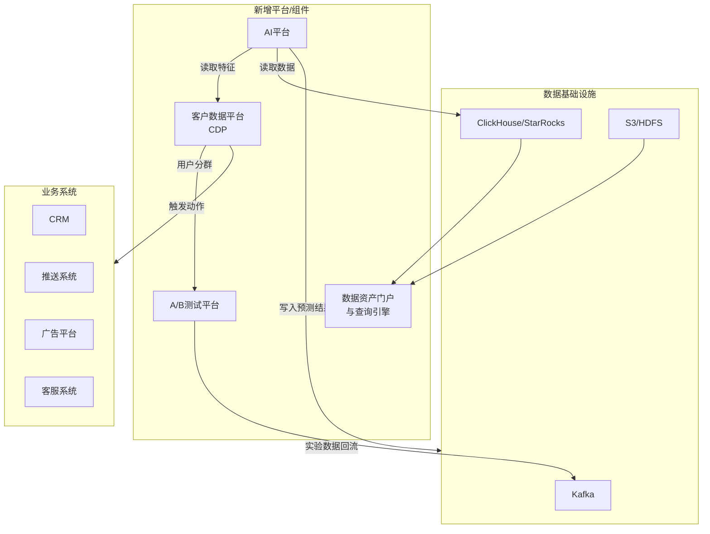

本方案将涵盖**设计目标、核心架构、技术选型、数据流程、关键模块**以及**实施路径**，旨在构建一个高性能、高可用、可扩展的分析平台。

---

### **一、 设计目标与原则**

在设计之初，必须明确系统的核心目标和遵循的原则：

1.  **高吞吐、低延迟**：能实时或近实时处理海量用户行为数据（日处理PB级）。
2.  **可扩展性**：系统组件均可水平扩展，以应对业务增长。
3.  **准确性**：保证数据从采集到处理的全链路数据质量，提供准确的分析结果。
4.  **易用性**：
    *   **对分析师/产品经理**：提供直观的可视化界面和灵活的查询工具（如SQL查询）。
    *   **对开发人员**：提供清晰的SDK和API，便于数据接入和输出。
5.  **隐私与安全**：遵循数据隐私法规（如GDPR、CCPA），支持数据脱敏、权限控制。

---

### **二、 整体系统架构**

一个成熟的用户行为分析系统通常采用**Lambda架构**或**Kappa架构**，以同时满足实时和批处理的需求。以下是结合两者优势的增强型架构：

```mermaid
graph TD
    subgraph “数据采集层 (Client-SDK & Logging)”
        A[Web/App/小程序等客户端] -->|SDK 采集事件| B[数据收集网关]
        C[后端服务] -->|输出日志| D[日志聚合 Agent]
    end

    subgraph “数据处理层 (Stream & Batch)”
        B -->|实时数据| E[消息队列 Kafka]
        D -->|实时数据| E
        E -->|实时流| F[流处理引擎 Flink]
        F -->|实时结果| G[OLAP 数据库 ClickHouse/Druid]
        E -->|原始数据| H[分布式存储 S3/HDFS]
        H -->|批量数据| I[批处理引擎 Spark]
        I -->|ETL & 聚合| G
    end

    subgraph “数据服务与应用层 (API & Application)”
        G --> J[统一查询服务]
        J -->|API| K[BI 可视化工具]
        J -->|API| L[自助分析平台]
        J -->|API| M[告警系统]
        N[元数据管理] --> J
        O[权限管理] --> J
    end
```

---

### **三、 核心模块详解**

#### **1. 数据采集层**

*   **目标**：全端、全量、准确地收集用户行为数据。
*   **实现**：
    *   **客户端SDK** (Web, iOS, Android, 小程序)：
        *   自动采集：页面浏览（`$pageview`）、元素点击（`$click`）、应用启动/后台等通用事件。
        *   自定义事件：允许开发人员上报业务相关事件（如`Purchase`, `Share`）。
        *   **关键特性**：缓存与重试机制（保证网络异常时数据不丢失）、延迟发送（合并请求）、上下文信息（自动采集设备、网络、地理位置等信息）。
    *   **后端数据采集**：
        *   通过**日志埋点**（如Nginx JSON日志）或**API埋点**，将服务端产生的事件（如支付成功、发货）发送到**数据收集网关**。
    *   **数据收集网关**：
        *   一个高可用的HTTP服务，接收所有SDK和后端上报的数据。
        *   职责：流量控制、安全认证（防止恶意请求）、数据初步清洗和格式化，然后迅速将数据推送到**Kafka**队列，实现解耦。

#### **2. 数据处理层**

这是系统的核心，分为实时和离线两条链路。

*   **消息队列 (Kafka)**：
    *   作为系统的“中枢神经”，解耦采集与处理过程。它具备高吞吐量，能缓冲峰值流量，为后续处理提供可靠性保证。
*   **实时处理链路 (Flink)**：
    *   **消费Kafka数据**，进行实时ETL：数据解析、清洗、格式化、字段标准化。
    *   **实时计算**：实现实时看板、实时告警。例如：每分钟的UV/PV、转化漏斗、异常监控。
    *   **输出结果**：将聚合后的实时结果写入OLAP数据库。
*   **批量处理链路 (Spark + HDFS/S3)**：
    *   **数据仓库**：将Kafka中的原始数据持久化到HDFS或S3，构建数据湖，用于长期存储和深度分析。
    *   **批处理作业 (Spark)**：
        *   定时（如每小时/每天）运行ETL任务，对全量数据进行更复杂的清洗、关联和整合。
        *   构建数仓维度模型（如星型模型），生成宽表，为上层查询提供优化后的数据。
        *   将处理后的批量数据导入OLAP数据库，与实时数据合并。

#### **3. 数据存储层**

*   **OLAP数据库 (ClickHouse / Druid / StarRocks)**：
    *   这是直接面向查询的存储引擎，选型至关重要。
    *   **为什么是它们？** 它们为聚合查询做了深度优化，能在秒级甚至毫秒级完成十亿级数据量的多维筛选和聚合操作，非常适合行为分析的高并发即席查询。
    *   **角色**：同时接收实时和批量处理的结果数据，提供统一的查询入口。

#### **4. 数据服务与应用层**

*   **统一查询服务**：
    *   一个封装好的API服务，接收上层的查询请求（如JSON格式的查询条件），将其转换为底层OLAP数据库的SQL语句。
    *   实现查询缓存、熔断降级、多数据源路由等功能，保护底层数据库。
*   **元数据管理**：
    *   管理所有事件和属性的定义（如`Purchase`事件包含`product_id`, `amount`等属性），是系统的“字典”。保证业务人员和分析师对数据有一致的理解。
*   **权限管理**：
    *   控制不同团队和角色对数据、看板、功能的访问权限。
*   **应用平台**：
    *   **自助分析平台**：核心产品。允许用户通过拖拽方式创建事件分析、漏斗分析、留存分析、路径分析等报告。
    *   **BI可视化平台**：集成或自建看板系统，将常用指标固化为监控大屏。
    *   **SQL查询界面**：为高级分析师提供直接编写SQL查询的能力。
    *   **行为圈群与推送**：基于用户行为特征筛选特定用户群（如“过去7天加购但未购买的用户”），并对接推送系统进行精准营销。

---

### **四、 技术选型建议**

| 层级 | 组件类型 | 可选技术 | **推荐选型** | 理由 |
| :--- | :--- | :--- | :--- | :--- |
| **数据采集** | SDK | SensorsDATA, GrowingIO, 自研 | **自研** | 可控性强，无第三方依赖，成本低 |
| **数据缓冲** | 消息队列 | Kafka, Pulsar, RocketMQ | **Kafka** | 生态成熟，吞吐量巨大，社区活跃 |
| **实时处理** | 流处理引擎 | Flink, Spark Streaming, Storm | **Flink** | 真正的流处理，高吞吐低延迟，状态管理强大 |
| **批量处理** | 批处理引擎 | Spark, Hive, Flink | **Spark** | 生态成熟，性能卓越，与Hadoop体系兼容性好 |
| **数据存储** | 分布式存储 | HDFS, S3, OSS | **S3/OSS** | 云原生，免运维，弹性扩展，成本低 |
| **数据存储** | OLAP数据库 | ClickHouse, Druid, StarRocks, Doris | **ClickHouse** | 单表查询性能极致，性价比高；**StarRocks**（Doris）更适合复杂多表关联 |
| **资源调度** | 集群管理 | Kubernetes, YARN | **Kubernetes** | 云原生时代标准，简化部署和运维 |
| **可视化** | BI工具 | Superset, Metabase, Tableau | **Superset/Metabase** | 开源、灵活、支持自定义查询；Tableau功能强大但昂贵 |

---

### **五、 实施路径建议（分阶段）**

1.  **第一阶段：MVP (最小可行产品)**
    *   **目标**：跑通核心数据流，支持基本的事件分析。
    *   **动作**：实现SDK和数据网关 -> 数据入Kafka -> 用Flink进行实时ETL -> 存入ClickHouse -> 集成Metabase进行可视化查询。
2.  **第二阶段：完善与推广**
    *   **目标**：提升数据质量，丰富分析功能。
    *   **动作**：建立元数据管理系统；构建离线数仓链路（Spark + HDFS）；开发自助分析平台（核心功能：漏斗、留存）；建立基本的数据监控和告警。
3.  **第三阶段：成熟与赋能**
    *   **目标**：实现平台化，赋能业务。
    *   **动作**：开发用户分群功能，对接营销系统；完善权限管理和数据安全体系；提供API服务，将数据能力输出给其他业务系统；优化性能，保障高可用。

---

### **六、 核心挑战与应对**

*   **数据准确性**：建立数据校验机制，定期进行数据对账（Reconciliation），确保实时与离线、上报与处理结果一致。
*   **数据治理**：严格管理元数据，避免“数据沼泽”。建立事件设计规范，并在SDK和网关层面进行校验。
*   **查询性能**：根据查询模式对OLAP数据库进行优化（如索引、物化视图、预聚合等）。
*   **成本控制**：对数据进行生命周期管理（冷热分离），优化存储和计算资源的使用。

这个设计方案提供了一个全面的蓝图，企业可以根据自身的规模、技术实力和业务需求，在每个环节选择合适的实现路径和技术栈。

好的，这是一个基于 Go 语言技术栈的第一阶段 MVP (最小可行产品) 详细开发方案。

---

### **第一阶段 MVP：Go 语言实现方案**

#### **一、 MVP 核心目标**

1.  **跑通核心数据流**：客户端 -> 采集SDK -> 收集网关 -> Kafka -> 数据消费与存储 -> 可视化查询。
2.  **支持基本分析功能**：能够查询特定事件的次数、用户数（PV/UV）等简单指标。
3.  **技术栈明确**：主要后端组件使用 Go 语言开发，充分发挥其高并发、高性能、部署简单的特点。
4.  **为后续阶段打好基础**：代码结构清晰，便于后续迭代增加实时处理、元数据管理等功能。

#### **二、 MVP 技术选型**

| 组件 | 技术选型 | 说明 |
| ：--- | ：--- | :--- |
| **客户端 SDK** | 略 (可使用现有开源SDK) | MVP阶段可暂不开发Go语言的客户端SDK（主要用于App/Web）。重点在后端。 |
| **数据收集网关** | **Go** (Gin框架) | 高性能HTTP服务器，接收并验证数据。 |
| **消息队列** | **Apache Kafka** | 行业标准，与Go生态集成好（`confluent-kafka-go`或`sarama`）。 |
| **数据消费与ETL** | **Go** | 编写常驻进程，消费Kafka，进行数据清洗和格式化。 |
| **数据存储** | **ClickHouse** | 极速的OLAP数据库，完美适合聚合查询，单表性能极佳。 |
| **可视化** | **Metabase** | 开源BI工具，支持直接连接ClickHouse，无需额外开发。 |
| **部署** | Docker & Docker Compose | 简化所有组件的部署和依赖管理。 |

#### **三、 详细设计与开发方案**

**系统数据流：**
`Client` -> `Go采集网关` -> `Kafka` -> `Go消费程序` -> `ClickHouse` -> `Metabase`

---

**1. 数据模型设计 (Events Table in ClickHouse)**

首先在ClickHouse中创建一张表来存储用户行为事件。

```sql
-- 在 ClickHouse 中执行
CREATE TABLE analysis_db.events
(
    `event_id` String COMMENT '事件的唯一ID',
    `event_time` DateTime64(3) COMMENT '事件发生时间戳',
    `event_name` String COMMENT '事件名称 (e.g., pageview, click, purchase)',
    `user_id` String COMMENT '用户唯一标识',
    `device_id` String COMMENT '设备唯一标识',
    `session_id` String COMMENT '会话ID',
    `platform` String COMMENT '平台 (e.g., ios, android, web)',
    -- 地理位置信息
    `country` String,
    `region` String,
    `city` String,
    -- 设备信息
    `device_model` String,
    `os_version` String,
    `app_version` String,
    -- 页面信息
    `page_url` String,
    `page_title` String,
    -- 用户自定义属性 (嵌套结构，ClickHouse擅长处理)
    `properties` Nested (
        `key` String,
        `value` String
    )
) ENGINE = MergeTree()
PARTITION BY toYYYYMM(event_time)
ORDER BY (event_name, event_time)
TTL event_time + toIntervalMonth(3) -- 可选：设置数据存活时间
SETTINGS index_granularity = 8192;
```
*   **说明**：使用 `Nested` 结构灵活存储用户自定义属性。`ORDER BY` 子句针对常见查询模式（按事件名和时间）进行了优化。

---

**2. 组件开发**

**a. 数据收集网关 (Go - `ingestion-gateway`)**

*   **职责**：接收HTTP请求，进行基础校验，将合法数据写入Kafka。
*   **技术栈**：Gin框架 + Kafka Go SDK (`sarama` 或 `confluent-kafka-go`)。
*   **核心代码结构**：

```go
// main.go
package main

import (
    "log"
    "net/http"
    "github.com/gin-gonic/gin"
    "github.com/confluentinc/confluent-kafka-go/kafka" // 或者 "github.com/Shopify/sarama"
)

// 定义接收数据的结构体
type EventRequest struct {
    EventName string            `json:"event_name" binding:"required"`
    UserID    string            `json:"user_id"`
    DeviceID  string            `json:"device_id"`
    EventTime int64             `json:"event_time"` // 毫秒时间戳
    Properties map[string]string `json:"properties"` // 自定义属性
    // ... 其他通用字段
}

var kafkaProducer *kafka.Producer
var kafkaTopic string

func main() {
    // 初始化Kafka Producer
    p, err := kafka.NewProducer(&kafka.ConfigMap{"bootstrap.servers": "localhost:9092"})
    if err != nil {
        log.Fatal("Failed to create Kafka producer:", err)
    }
    kafkaProducer = p
    kafkaTopic = "user_events"
    defer kafkaProducer.Close()

    // 初始化Gin路由
    r := gin.New()
    r.Use(gin.Recovery())

    // 路由
    r.POST("/v1/track", trackHandler)

    // 启动服务器
    r.Run(":8080")
}

func trackHandler(c *gin.Context) {
    var eventReq EventRequest

    // 1. 绑定并验证JSON数据
    if err := c.ShouldBindJSON(&eventReq); err != nil {
        c.JSON(http.StatusBadRequest, gin.H{"error": err.Error()})
        return
    }

    // 2. (可选) 补充字段默认值，如接收时间、IP解析的地理信息等
    if eventReq.EventTime == 0 {
        eventReq.EventTime = time.Now().UnixMilli()
    }

    // 3. 将事件序列化为JSON字符串，准备写入Kafka
    eventData, _ := json.Marshal(eventReq)

    // 4. 异步发送消息到Kafka
    deliveryChan := make(chan kafka.Event)
    err := kafkaProducer.Produce(&kafka.Message{
        TopicPartition: kafka.TopicPartition{Topic: &kafkaTopic, Partition: kafka.PartitionAny},
        Value:          eventData,
    }, deliveryChan)

    if err != nil {
        log.Printf("Produce failed: %v\n", err)
        c.JSON(http.StatusInternalServerError, gin.H{"error": "internal error"})
        return
    }

    // 5. 非阻塞地等待发送结果（或使用goroutine）
    e := <-deliveryChan
    m := e.(*kafka.Message)
    if m.TopicPartition.Error != nil {
        log.Printf("Delivery failed: %v\n", m.TopicPartition.Error)
    } else {
        log.Printf("Delivered message to topic %s [%d] at offset %v\n",
            *m.TopicPartition.Topic, m.TopicPartition.Partition, m.TopicPartition.Offset)
    }

    c.JSON(http.StatusOK, gin.H{"status": "ok"})
}
```

**b. 数据消费与ETL程序 (Go - `event-consumer`)**

*   **职责**：作为Kafka Consumer，读取数据，进行清洗/格式化，并批量写入ClickHouse。
*   **技术栈**：Kafka Go SDK + ClickHouse Go SDK (`clickhouse-go`)。
*   **核心代码结构**：

```go
// main.go
package main

import (
    "context"
    "encoding/json"
    "log"
    "time"
    "github.com/ClickHouse/clickhouse-go/v2"
    "github.com/confluentinc/confluent-kafka-go/kafka"
)

// 对应ClickHouse表结构的结构体
type ClickHouseEvent struct {
    EventID     string
    EventTime   time.Time
    EventName   string
    UserID      string
    DeviceID    string
    // ... 其他字段
    Properties  map[string]string // 需要被展平或转换为Nested格式
}

func main() {
    // 1. 初始化Kafka Consumer
    c, err := kafka.NewConsumer(&kafka.ConfigMap{
        "bootstrap.servers": "localhost:9092",
        "group.id":          "event_consumer_group",
        "auto.offset.reset": "earliest",
    })
    // ... 错误处理
    defer c.Close()
    c.SubscribeTopics([]string{"user_events"}, nil)

    // 2. 初始化ClickHouse连接
    conn, err := clickhouse.Open(&clickhouse.Options{
        Addr: []string{"localhost:9000"},
        Auth: clickhouse.Auth{Database: "analysis_db", Username: "default", Password: ""},
    })
    // ... 错误处理
    defer conn.Close()

    // 3. 创建批次处理缓冲区
    batchSize := 1000
    var batch []*ClickHouseEvent

    ctx := context.Background()

    // 4. 主循环：消费 -> 处理 -> 批量插入
    for {
        msg, err := c.ReadMessage(-1)
        if err == nil {
            var rawEvent EventRequest
            json.Unmarshal(msg.Value, &rawEvent)

            // 转换：将API收到的数据转换为ClickHouse格式
            chEvent := transformToClickHouseEvent(&rawEvent)

            batch = append(batch, chEvent)

            // 达到批次大小，执行批量插入
            if len(batch) >= batchSize {
                err := insertBatchIntoClickHouse(ctx, conn, batch)
                if err != nil {
                    log.Println("Insert batch failed:", err)
                } else {
                    log.Printf("Successfully inserted %d events\n", len(batch))
                }
                batch = nil // 清空批次
            }
        } else {
            log.Printf("Consumer error: %v (%v)\n", err, msg)
        }
    }
}

func transformToClickHouseEvent(req *EventRequest) *ClickHouseEvent {
    // 实现数据转换逻辑
    // 例如：将毫秒时间戳转换为time.Time
    return &ClickHouseEvent{
        EventID:   generateUUID(), // 生成唯一ID
        EventTime: time.UnixMilli(req.EventTime),
        EventName: req.EventName,
        UserID:    req.UserID,
        DeviceID:  req.DeviceID,
        // ... 其他字段映射
        Properties: req.Properties,
    }
}

func insertBatchIntoClickHouse(ctx context.Context, conn clickhouse.Conn, batch []*ClickHouseEvent) error {
    tx, err := conn.PrepareBatch(ctx, "INSERT INTO events")
    if err != nil {
        return err
    }

    for _, event := range batch {
        // 添加每一行数据到批量插入语句中
        err := tx.Append(
            event.EventID,
            event.EventTime,
            event.EventName,
            event.UserID,
            event.DeviceID,
            // ... 其他字段
            // 注意：Properties Nested字段需要特殊处理，可能需要拆分成两个数组
        )
        if err != nil {
            return err
        }
    }
    return tx.Send()
}
```

---

**3. 部署与运行**

**a. 使用 Docker Compose 定义基础设施**

创建 `docker-compose.yml` 文件，一键启动Kafka和ClickHouse。

```yaml
version: '3.8'
services:
  zookeeper:
    image: confluentinc/cp-zookeeper:latest
    environment:
      ZOOKEEPER_CLIENT_PORT: 2181

  kafka:
    image: confluentinc/cp-kafka:latest
    depends_on:
      - zookeeper
    ports:
      - "9092:9092"
    environment:
      KAFKA_ZOOKEEPER_CONNECT: zookeeper:2181
      KAFKA_ADVERTISED_LISTENERS: PLAINTEXT://localhost:9092
      KAFKA_OFFSETS_TOPIC_REPLICATION_FACTOR: 1

  clickhouse:
    image: clickhouse/clickhouse-server:latest
    ports:
      - "8123:8123" # HTTP API
      - "9000:9000" # Native protocol
    volumes:
      - ./clickhouse_data:/var/lib/clickhouse
    environment:
      CLICKHOUSE_DB: analysis_db
      CLICKHOUSE_USER: default
      CLICKHOUSE_PASSWORD: ""
      CLICKHOUSE_DEFAULT_ACCESS_MANAGEMENT: 1

  metabase:
    image: metabase/metabase:latest
    ports:
      - "3000:3000"
    depends_on:
      - clickhouse
    environment:
      MB_DB_TYPE: clickhouse
      MB_DB_DBNAME: analysis_db
      MB_DB_HOST: clickhouse
      MB_DB_PORT: 8123
      MB_DB_USER: default
      MB_DB_PASS: ""
```

*   **启动**：`docker-compose up -d`

**b. 编译和运行Go程序**

为两个Go项目创建 `Dockerfile` 或直接在本机编译运行。

```bash
# 在 ingestion-gateway 和 event-consumer 目录下
go mod init
go mod tidy
go build -o main .
./main
```

**4. 测试与验证**

1.  **发送测试数据**：
    ```bash
    curl -X POST http://localhost:8080/v1/track \
    -H "Content-Type: application/json" \
    -d '{
        "event_name": "pageview",
        "user_id": "user_123",
        "device_id": "device_456",
        "event_time": 1717251000000,
        "properties": {
            "page_url": "https://example.com/product/1",
            "referrer": "google.com"
        }
    }'
    ```
2.  **查看Kafka**：使用 `kafka-console-consumer` 查看消息是否成功写入。
3.  **查看ClickHouse**：使用 `clickhouse-client` 连接数据库，执行 `SELECT count() FROM events` 查看数据是否成功插入。
4.  **配置Metabase**：
    *   访问 `http://localhost:3000`，完成Metabase初始化设置。
    *   添加数据源，选择ClickHouse，填写连接信息（Host: `clickhouse`，Port: `8123`）。
    *   在Metabase中创建简单的问题（Question）："`pageview`事件的每日PV趋势"。

#### **四、 MVP 阶段总结**

通过以上方案，我们使用 Go 语言成功构建了一个最小化的用户行为分析系统。它具备了数据接收、缓冲、处理和查询的能力。此阶段代码约500-800行，核心在于打通流程而非功能完美。

**下一步（第二阶段）可以在此基础上：**
*   增强数据清洗和校验规则。
*   将 `event-consumer` 升级为更强大的 Flink/Go 流处理作业。
*   开发元数据管理系统来管理 `event_name` 和 `properties`。
*   在前端集成正式的SDK。

用户行为分析系统 **第二阶段：完善与推广** 的详细方案，侧重于**提升数据质量**和**丰富分析功能**，并给出具体的统计与实现方法。

---

### **第二阶段：完善与推广 - 详细方案**

#### **一、 核心目标**

1.  **数据可信**：建立完善的数据监控、校验和治理体系，确保数据准确、可靠、一致。
2.  **功能强大**：提供产品、运营、分析师最需要的核心分析功能：漏斗分析、留存分析、用户分群。
3.  **初步平台化**：建设元数据管理系统和初步的权限控制，降低使用门槛，促进跨部门使用。

#### **二、 架构演进**

在MVP架构基础上，新增或强化以下组件（黄色部分）：

```mermaid
flowchart TD
    subgraph DataFlow
        direction LR
        A[客户端SDK] -->|上报| B[Go采集网关]
        B -->|写入| C[Kafka]
        C -->|消费| D[Go ETL Consumer<br/>强化: 数据打宽]
        D -->|写入| E[ClickHouse]
    end

    subgraph NewComponents[新增/强化组件]
        F[元数据管理系统<br/>(Go + Vue)]
        G[数据质量监控平台<br/>(Go)]
        H[自助分析平台<br/>(Vue + Go API)]
    end

    D -.->|获取元数据定义| F
    G -->|校验规则| F
    G -->|读取监控| C
    G -->|校验数据| E
    H -->|查询API| E
    H -->|获取元数据| F

    E -->|被查询| I[Metabase/BI]
```

---

### **三、 详细设计与实现方案**

#### **1. 提升数据质量**

目标是建立一套从 **“接入->处理->消费”** 的全链路数据质量保障体系。

| 问题 | 解决方案 | 具体统计/实现方法 |
| :--- | :--- | :--- |
| **数据丢失** | **端到端监控** | 在**数据网关**入口为每条数据生成全局唯一`UUID`。在**数据消费程序**和**ClickHouse**表尾部分别计数。**统计方法**：<br>`丢失率 = (网关接收数 - CH成功入库数) / 网关接收数`<br>设定阈值告警（如>0.1%）。 |
| **数据延迟** | **延迟监控** | 在数据中增加`event_time`（客户端时间）和`server_time`（网关接收时间）两个字段。<br>**统计方法**：<br>`延迟分布 = server_time - event_time`<br>在监控系统（如Prometheus）中统计P95, P99分位数，延迟过高时告警。 |
| **数据格式错误** | **Schema强校验** | 基于元数据管理系统（见下文）中定义的`事件模型`（包含每个事件必需的属性及其类型），在**数据网关**和**ETL程序**进行双重校验。丢弃或路由到死信队列(DLQ)供排查。 |
| **数据准确性** | **核心指标一致性校验** | 编写**离线校对任务**（Go脚本，定时运行）。<br>**统计方法**：<br>`差异率 = ABS(实时计算指标 - 离线批量计算指标) / 离线批量计算指标`<br>例如：校对昨日`DAU`。差异率超过1%则告警。 |
| **数据重复** | **幂等处理** | 利用第一阶段设计的`event_id`（唯一ID）。在ETL程序中或ClickHouse表引擎层面（使用`ReplacingMergeTree`）进行去重。**统计方法**：定期执行`OPTIMIZE TABLE ... FINAL`并监测重复数据的数量。 |

**实施步骤：**
1.  开发**数据质量监控平台**(Go)：消费Kafka消息，计算各级节点的流量和延迟，上报Prometheus。
2.  编写**数据校对脚本**(Go)：定期从ClickHouse导出核心指标，与基于原始日志（HDFS/S3）计算的指标进行对比。
3.  强化**数据网关和ETL程序**：集成元数据校验功能，对不符合Schema的数据打标、记录日志并告警。

---

#### **2. 丰富分析功能**

**a. 元数据管理系统 (Metadata Management)**

*   **功能**：管理所有`事件(Events)`和`属性(Properties)`的定义，是数据治理的基石。
*   **技术栈**：Go (Gin)提供API + Vue3前端界面 + MySQL/PostgreSQL（存储元数据）。
*   **核心表设计**：
    *   `events_table`：`id`, `event_name`, `chinese_name`, `description`, `owner`, `status` (上线/下线)...
    *   `event_properties_table`：`id`, `event_id`, `property_name`, `chinese_name`, `data_type` (string, int, double), `description`...
*   **流程**：数据上线前，必须先在元系统注册事件和属性，经审核后方可上报。ETL程序和数据分析平台都依赖于此系统的定义。

**b. 漏斗分析 (Funnel Analysis)**

*   **目标**：分析多步流程的转化与流失情况。
*   **统计方法**：
    1.  **定义步骤**：在UI上由用户选择一系列事件（如`首页浏览->商品点击->加入购物车->下单->支付成功`）作为一个漏斗，并指定时间窗口（如7天）。
    2.  **用户去重**：计算在时间窗口内，完成**每一步**的**独立用户数**。
    3.  **计算转化率**：
        `第N步转化率 = (完成第N步的用户数 / 完成第1步的用户数) * 100%`
    4.  **计算流失点**：相邻两步的用户数差，即为该处的流失用户数。
*   **ClickHouse SQL实现思路**：
    ```sql
    -- 1. 获取每个用户完成每一步的最早时间
    WITH user_events AS (
        SELECT
            user_id,
            minIf(event_time, event_name = 'step1') as step1_time,
            minIf(event_time, event_name = 'step2') as step2_time,
            minIf(event_time, event_name = 'step3') as step3_time
        FROM events
        WHERE event_time BETWEEN [start_time] AND [end_time]
        GROUP BY user_id
    )
    -- 2. 统计每一步的人数 (要求下一步的时间在上一步之后)
    SELECT
        countIf(step1_time > 0) as step1_users,
        countIf(step2_time > step1_time) as step2_users,
        countIf(step3_time > step2_time) as step3_users
    FROM user_events
    ```

**c. 留存分析 (Retention Analysis)**

*   **目标**：分析新用户在未来一段时间内的回来情况。
*   **统计方法（N日留存率）**：
    1.  **定义初始行为**：通常为“新增用户”或“完成某个关键行为（如首次付费）的用户”。
    2.  **定义回访行为**：通常为“任意事件”或“某个特定事件”。
    3.  **计算**：对于某天（X日）的**新增用户 cohort**，计算他们在第1天（X+1）、第7天（X+7）、第30天（X+30）回访的比例。
    `第N日留存率 = (X日新增用户中，在X+N日有回访行为的用户数 / X日新增用户总数) * 100%`
*   **ClickHouse SQL实现思路（以计算7日留存为例）**：
    ```sql
    SELECT
        first_day,
        count(DISTINCT user_id) as new_users, -- 首日新增用户数
        countIf(days_diff = 1) as retention_1d, -- 次日留存人数
        countIf(days_diff = 7) as retention_7d  -- 7日留存人数
    FROM (
        SELECT
            user_id,
            toDate(min(event_time)) as first_day, -- 用户首次出现日期
            toDate(event_time) as active_day,
            active_day - first_day as days_diff   -- 活动日期与首次日期的差值
        FROM events
        WHERE ... -- 限定时间范围
        GROUP BY user_id, active_day
    )
    GROUP BY first_day
    ORDER BY first_day
    ```

**d. 用户分群 (User Segmentation)**

*   **目标**：基于用户行为属性，筛选出特定的用户群体，为精准营销和分析提供支持。
*   **实现方案**：
    1.  **前端界面**：提供可视化“圈选”界面，让用户通过“且”、“或”条件组合规则。
        *  规则示例：`“过去7天内” + “事件【购买】次数 >= 2” + “且 属性【城市】= 北京”`
    2.  **后端实现 (Go API)**：
        *   **解析规则**：将前端提交的JSON规则解析为ClickHouse查询条件。
        *   **生成SQL**：
            ```sql
            SELECT DISTINCT user_id
            FROM events
            WHERE event_time >= now() - INTERVAL 7 DAY
            AND event_name = 'purchase'
            GROUP BY user_id
            HAVING count() >= 2
            INTERSECT -- 取交集
            SELECT DISTINCT user_id
            FROM events
            WHERE event_time >= now() - INTERVAL 7 DAY
            AND getProperty(properties, 'city') = '北京'
            ```
        *   **执行查询**：将生成的SQL发给ClickHouse执行，获取`user_id`列表。
        *   **存储分群**：将分群结果（分群ID + user_id列表）存入MySQL和ClickHouse的特定表，供后续查询和导出。

---

#### **3. 实施路径建议**

1.  **优先级1：元数据管理系统**。这是所有治理和分析的基础，必须先建。
2.  **优先级2：数据质量监控**。建立核心指标监控和告警，确保数据可靠，赢得业务方信任。
3.  **优先级3：漏斗分析与留存分析**。这是产品经理和运营最迫切需要的功能，能直接产生业务价值。
4.  **优先级4：用户分群与权限管理**。分群功能价值高，权限管理为跨部门推广做准备。

通过第二阶段的建设，你的系统将从一个“技术 demo”蜕变成一个真正能为业务团队提供强大支持的**数据产品**，为第三阶段的“成熟与赋能”（如A/B测试平台、个性化推荐集成）打下坚实基础。

---

### **元数据使用方法详解**

元数据（Metadata）不应只是一个孤立的“字典”系统，而应成为驱动整个数据流程的“大脑”。它的价值体现在**数据接入、数据处理、数据应用**的全过程中。

#### **一、 元数据系统的核心模型与API**

首先，元数据系统需要提供一套完整的RESTful API，供其他组件调用。

1.  **数据模型增强**：
    *   `events` 表：存储事件名、中文名、描述、负责人、状态（开发中、已上线、已下线）、创建时间等。
    *   `properties` 表：存储属性名、中文名、数据类型（String, Number, Boolean, DateTime, List）、描述、是否预置、是否必填等。
    *   `event_property_relation` 表：关联表和事件，表示“某个事件拥有哪些属性”。这是核心关系。

2.  **关键API端点**：
    *   `GET /api/metadata/events`：获取所有已上线的事件列表。
    *   `GET /api/metadata/events/{event_name}`：获取某个事件的明确定义及其所有属性列表（包括类型、是否必填）。
    *   `POST /api/metadata/events/{event_name}/validate`：接收一个JSON对象，根据元数据定义验证其属性是否合法（类型正确、必填项存在）。

#### **二、 元数据在数据流中的具体应用**

以下是如何在现有数据流中注入元数据校验和管理，从而提升数据质量。

**1. 数据采集网关：实时校验（Schema-on-Write）**

*   **位置**：在数据网关（`ingestion-gateway`）接收数据的接口处理逻辑中。
*   **流程**：
    1.  接收到上报数据 `{ "event_name": "purchase", "properties": { "price": 99.9, "product_name": "Book" } }`。
    2.  网关**同步调用**元数据系统的 `GET /api/metadata/events/purchase` 接口，获取 `purchase` 事件的最新定义。
    3.  根据元定义进行校验：
        *   **存在性校验**：检查必填属性（如 `product_id`）是否存在。
        *   **类型校验**：检查 `price` 是否为数字（Number），`product_name` 是否为字符串（String）。
    4.  **校验结果处理**：
        *   **通过**：数据被赋予 `valid_status=1` 标签，发送至Kafka主Topic（如 `user_events_valid`）。
        *   **不通过**：数据被赋予 `valid_status=0` 及错误原因标签，发送至Kafka的死信Topic（Dead Letter Queue, `user_events_dlq`）供后续排查。**原始数据绝不会被丢弃**。
*   ** benefit **：**将数据质量问题前置**，在入口处第一时间发现并隔离脏数据，避免污染下游数据仓库。

**2. ETL处理程序：数据丰富与打宽**

*   **位置**：在Go实现的ETL消费程序中。
*   **流程**：
    1.  从Kafka主Topic消费到已验证的数据。
    2.  **本地缓存**：ETL程序启动时，一次性从元数据系统拉取全量元数据，并在内存中缓存（如使用Go的 `map` 或 `sync.Map`）。定期（如每5分钟）更新缓存。
    3.  **数据打宽**：根据缓存的元数据，对 `properties` 中的自定义属性进行打宽处理。例如，元数据定义 `price` 是Number类型，那么在写入ClickHouse时，就将其提取为一个单独的 `Float64` 类型的列 `price_value`，而不是永远将其埋在JSON字符串里。
        *   **Before (MVP阶段)**：所有属性都塞在一个 `Nested` 结构的 `properties` 字段中，查询效率低。
        *   **After (本阶段)**：常用的、重要的属性成为ClickHouse表的**独立列**，查询速度极快；不常用的、稀疏属性仍留在 `properties` Map中。
    4.  **再次校验**：作为第二道防线，利用本地缓存的元数据再次进行校验，处理网关可能遗漏的逻辑（如枚举值校验）。

```sql
-- 表结构演进示例
CREATE TABLE events (
    ... -- 所有通用字段
    -- 常用重要属性被打宽成独立列
    `price_value` Nullable(Float64),
    `product_name` Nullable(String),
    `product_id` Nullable(String),
    -- 其余所有属性仍保留在Map中，保证灵活性
    `properties` Map(String, String)
) ENGINE = MergeTree() ...;
```
*   **benefit **：**极大提升查询性能**。对常用属性的筛选和聚合不再需要解析JSON Map，直接对列操作，速度可提升数十倍。

**3. 自助分析平台：驱动查询与可视化**

*   **位置**：自助分析平台的前端和后端。
*   **流程**：
    1.  **前端界面**：
        *   当用户想要配置一个漏斗时，前端调用 `GET /api/metadata/events` 来下拉选择**可用的的事件**。
        *   当用户选择“`purchase`”事件后，前端再调用 `GET /api/metadata/events/purchase`，动态加载出可供筛选的**属性列表**（如“金额”、“商品类别”），并生成相应的筛选器UI（输入框、下拉框）。
    2.  **后端查询生成**：
        *   后端接收到前端传来的分析请求（如：分析“北京”用户的购买漏斗）。
        *   后端根据元数据知道 `city` 是用户属性，`price` 是事件属性，从而生成正确的ClickHouse SQL。
        *   **Example**: `WHERE city = '北京' AND event_name = 'purchase' AND price_value > 100`
*   **benefit **：**降低使用门槛，避免错误**。用户不再需要记忆复杂的事件和属性名，也不会因拼写错误而导致查询失败。平台变得“智能”和“自解释”。

**4. 数据质量监控平台**

*   **位置**：数据质量监控程序。
*   **流程**：
    1.  监控程序读取元数据，获知哪些事件和属性是重要的。
    2.  基于这些定义，自动生成监控任务：
        *   **覆盖率监控**：监控关键属性（如 `product_id`）的填充率（非空比例），低于阈值（如95%）则告警。
        *   **值域监控**：对于定义为枚举值的属性（如 `os=` `iOS`, `Android`），监控是否有非法值出现。
        *   **指标波动监控**：基于元数据定义的核心事件（如 `purchase`），监控其每日总量的波动情况，异常波动则告警。

#### **三、 实施流程（Data Governance）**

元数据的价值最终需要通过管理流程来保障：

1.  **事件设计评审**：数据产品经理、分析师、工程师共同评审新事件的设计文档，明确其用途和属性。
2.  **上线前注册**：开发者在代码中埋点前，必须先在元数据系统注册新事件和属性，经审核通过后，才能开始上报。
3.  **自动扫描与巡检**：定期扫描线上数据，发现未在元数据系统注册的“未知事件”或“未知属性”，推动相关负责人进行补充注册或下线处理。
4.  **版本管理与下线**：当某个事件或属性不再使用时，先在元数据系统中将其标记为“ deprecated ”，通知各方，一段时间后再标记为“下线”，并停止数据采集。

通过以上方法，元数据就从一個被动的“说明书”，变成了主动驱动数据质量、优化数据性能、赋能数据应用的**核心基础设施**。这才是第二阶段成功的真正关键。

---

### **第三阶段：成熟与赋能 - 详细方案**

#### **一、 核心目标**

1.  **平台化与SaaS化**：提供完善、安全、多租户的数据服务，赋能内部所有业务团队，甚至探索对外输出能力。
2.  **智能化**：从“描述过去”的分析，升级到“预测未来”和“自动决策”，融入机器学习能力。
3.  **深度集成**：与公司的营销、产品、客服等系统无缝打通，形成数据闭环。
4.  **卓越性能与成本优化**：应对海量数据增长，保证系统稳定高效，同时精细化控制成本。

#### **二、 架构演进：平台化与智能化**

在第二阶段架构基础上，新增以下核心平台与组件：



---

### **三、 详细设计与实现方案**

#### **1. 平台化与SaaS化：数据资产门户与统一查询服务**

*   **目标**：成为公司唯一的、统一的用户行为数据查询入口，实现对不同业务线（租户）的数据隔离与资源管控。
*   **核心组件**：
    *   **1. 统一查询服务 (Query Service)**：
        *   **功能**：接收所有查询请求（来自BI、API、自助平台），并将其编译优化为底层执行引擎（如ClickHouse、Spark SQL、Presto）的SQL。
        *   **关键能力**：
            *   **SQL方言转换**：自动将标准SQL转换为不同执行引擎的方言。
            *   **查询路由**：根据查询复杂度，决定是发给高效的OLAP数据库，还是发给Spark处理复杂JOIN。
            *   **熔断与降级**：防止慢查询拖垮数据库，设置超时和行数限制。
            *   **审计与计费**：记录所有查询日志，用于审计和按部门计算资源成本。
    *   **2. 数据资产门户 (Data Portal)**：
        *   **功能**：一个Web界面，让用户能像逛“数据超市”一样，发现、理解和申请使用数据。
        *   **内容**：
            *   **数据目录**：集成元数据，展示所有数据表、字段的详细说明和血缘关系。
            *   **指标库**：将核心业务指标（如DAU、GMV、留存率）固化为“原子指标”，明确计算口径，避免重复开发和不一致。
            *   **看板市场**：共享和复用优秀的数据看板。
            *   **数据申请与审批流**：管理敏感数据的访问权限。

#### **2. 智能化：AI平台集成**

*   **目标**：提供预测性洞察和自动化能力。
*   **核心场景与统计方法**：
    *   **1. 用户生命周期价值预测 (LTV Prediction)**：
        *   **方法**：使用**回归模型**（如Gradient Boosting, Random Forest）。利用用户早期行为（如首次付费金额、前7天活跃度、设备信息）作为特征，预测其未来30天或90天的价值。
        *   **集成**：将预测结果写回数据仓库，赋能运营团队优先服务高价值用户。
    *   **2. 流失用户预警 (Churn Prediction)**：
        *   **方法**：使用**分类模型**（如Logistic Regression, XGBoost）。定义“流失”（如未来7天不活跃），提取用户最近行为特征（如活跃度下降、客服咨询增多），计算流失概率。
        *   **集成**：将高流失风险用户名单输出给CDP或推送系统，自动触发召回策略（如发送优惠券）。
    *   **3. 智能异常检测 (Anomaly Detection)**：
        *   **方法**：对核心指标（如GMV、订单量）的时间序列数据，使用**统计模型**（如STL分解)或**机器学习**（如Prophet, LSTM）建立预测基线。自动检测偏离基线且具有统计显著性的点并告警。
        *   **集成**：与监控告警系统打通，减少人工巡检。

#### **3. 深度集成：客户数据平台 (CDP) 与触点对接**

*   **目标**：完成“分析-决策-触达”的闭环，让分析结果直接产生业务动作。
*   **核心组件**：
    *   **1. 客户数据平台 (CDP)**：
        *   **功能**：作为用户分群和触达的**执行大脑**。它从分析系统接收用户分群结果（user_id列表），并维护每个用户的**360°画像**（整合行为数据、交易数据、客服数据）。
        *   **核心能力**：**实时用户圈选**、**用户标签管理**、**旅程编排**。
    *   **2. 触点集成**：
        *   **推送/短信系统**：CDP将需要触达的用户列表和内容模板推送给消息系统，实现精准营销。
        *   **CRM系统**：销售可以在CRM中看到客户的详细行为画像（如“最近浏览了XX产品三次”），辅助跟进。
        *   **广告平台**：将高价值用户或相似人群包同步到广告平台（如Facebook Ads, Google Ads），进行lookalike扩量或再营销。
        *   **A/B测试平台**：**深度集成**。将分群结果作为实验的分层参数，确保用户始终进入同一实验组。同时，A/B测试的结果数据（如哪个版本转化率高）直接回流到分析系统，用于分析实验效果。

#### **4. 性能与成本优化**

*   **目标**：在数据量持续增长的背景下，保障查询体验，控制成本。
*   **具体措施**：
    *   **1. 查询引擎升级**：评估并迁移至更强大的OLAP引擎，如 **StarRocks**（或其商业版Doris），其对多表关联和复杂查询的支持远优于ClickHouse，能更好地支持统一查询服务。
    *   **2. 分层存储与计算**：
        *   **存储**：将冷数据（如3个月前）从SSD自动降级到更便宜的对象存储（S3），并通过ClickHouse的`ATTACH PARTITION FROM`或StarRocks的外部表功能实现冷热数据统一查询。
        *   **计算**：引入Presto/Trino，直接查询S3上的原始数据，用于偶尔的深度历史数据挖掘，避免对主OLAP库造成压力。
    *   **3. 资源治理**：在统一查询服务中实施更精细化的**配额管理**（如每个团队每小时的查询时间上限），并通过计费账单推动业务方优化查询。

#### **四、 实施路径建议**

1.  **优先级1：建设统一查询服务与数据资产门户**。这是平台化的基础，能立即解决数据孤岛和指标不一致问题，产生巨大价值。
2.  **优先级2：与A/B测试平台深度集成**。数据驱动决策的核心就是A/B测试，打通后能极大提升实验的分析效率和可靠性。
3.  **优先级3：构建CDP核心与对接首个触点（如推送系统）**。选择一个业务场景（如“唤醒沉睡用户”），跑通从分析到触达的全链路，树立标杆案例。
4.  **优先级4：引入AI能力**。从其中一个预测场景（如流失预警）开始，与数据科学家合作，交付一个端到端的预测应用，展示智能化潜力。

通过第三阶段的建设，你的用户行为分析系统将不再是后台的一个工具，而真正成为驱动业务增长的**核心引擎**，最终实现“赋能”的终极目标。
