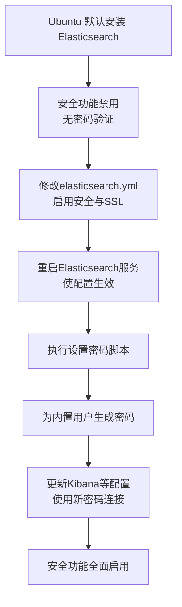

# 安全功能（包括用户验证）

默认是禁用的。 这意味着任何人都可以直接访问你的 Elasticsearch 集群和数据进行操作，这在生产环境中是极其危险的。

下图清晰地展示了为默认安装的Elasticsearch开启安全防护的核心流程：



以下是启用安全认证和设置密码的详细步骤：

第 1 步：启用 Elasticsearch 安全功能

你需要修改 Elasticsearch 的配置文件来开启安全特性。

1. 打开配置文件： 使用你喜欢的文本编辑器（如 nano 或 vim）编辑 elasticsearch.yml。
   ```bash
   sudo nano /etc/elasticsearch/elasticsearch.yml
   ```
2. 修改配置： 在配置文件的末尾，添加或找到并取消注释（删除行首的 #）以下行：
   ```yaml
   # 启用安全功能
   xpack.security.enabled: true
   
   # 启用节点间通信的加密（TLS），这对于安全功能是必须的
   xpack.security.transport.ssl.enabled: true
   ```
   保存并退出编辑器。
3. 重启 Elasticsearch 服务： 修改配置后，必须重启服务才能生效。
   ```bash
   sudo systemctl restart elasticsearch.service
   ```
   等待服务完全启动（可能需要一分钟）。

第 2 步：为内置用户设置初始密码

安全功能启用后，第一步就是为 Elasticsearch 内置的多个用户设置密码。

1. 运行设置密码工具： Elasticsearch 提供了一个交互式脚本来完成这个操作。
   ```bash
   sudo /usr/share/elasticsearch/bin/elasticsearch-setup-passwords interactive
   ```
2. 跟随提示操作： 该脚本会提示你为一系列内置用户设置密码。请务必选择一个强密码并安全地保存它们，尤其是 elastic 用户（超级用户）。
   ```
   Initiating the setup of passwords for reserved users elastic, apm_system, kibana_system, kibana, logstash_system, beats_system, remote_monitoring_user.
   You will be prompted to enter passwords as the process progresses.
   Please confirm that you would like to continue [y/N] y
   
   Enter password for [elastic]:
   Re-enter password for [elastic]:
   Enter password for [apm_system]:
   Re-enter password for [apm_system]:
   ...
   ```
   interactive 参数会让你逐个输入密码。你也可以使用 auto 参数来让系统自动生成强密码。

第 3 步：验证并访问

现在，你的集群已经受到保护。

1. 测试访问： 尝试使用 curl 命令访问集群，现在它会要求你提供凭证。
   ```bash
   curl -u elastic http://localhost:9200
   ```
   输入你为 elastic 用户设置的密码后，你应该能成功看到集群信息。
2. 配置 Kibana（如果使用了的话）： 如果你也安装了 Kibana，你还需要更新 Kibana 的配置以使用新的凭证连接到 Elasticsearch。
   · 编辑 Kibana 配置文件：
     ```bash
     sudo nano /etc/kibana/kibana.yml
     ```
   · 找到并取消注释以下行，填入 elastic 用户和你在上一步设置的密码：
     ```yaml
     elasticsearch.username: "kibana_system"
     elasticsearch.password: "your_kibana_system_password_here"
     ```
   · 重启 Kibana 服务：
     ```bash
     sudo systemctl restart kibana.service
     ```
   之后，当你访问 Kibana 界面时，就需要使用 elastic 用户和其密码登录了。

总结

初始状态 操作 最终状态
❌ 无用户验证 1. 编辑 elasticsearch.yml 启用安全功能 2. 重启服务 3. 运行 elasticsearch-setup-passwords 设置密码 ✅ 启用用户验证
❌ 无通信加密 启用 xpack.security.transport.ssl.enabled ✅ 节点间通信加密
❌ Kibana 无法连接 配置 kibana.yml 中的用户名和密码 ✅ Kibana 可安全连接

重要提醒： 对于生产环境，仅设置密码是基础步骤。你还应该考虑配置 HTTPS 加密、基于角色的访问控制（RBAC）等更全面的安全策略。切勿将未启用安全功能的 Elasticsearch 节点直接暴露在公网上。
