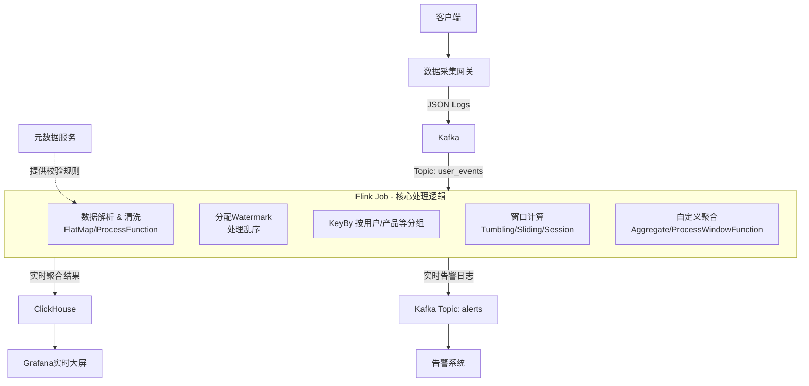

### **Flink 实时用户行为分析方案**

#### **一、 设计目标**

1.  **低延迟**：实现秒级甚至毫秒级的指标计算和更新。
2.  **高吞吐**：稳定处理高峰期的海量用户行为数据流。
3.  **精准一次处理**：确保数据在传输、计算和输出过程中不丢不重。
4.  **灵活应对数据乱序**：处理由于网络延迟等原因导致的乱序数据。
5.  **支撑核心实时分析场景**：如实时大屏、实时告警、实时推荐等。

#### **二、 架构设计**

数据流如下所示：



---

#### **三、 Flink Job 详细设计**

**1. Source: 消费Kafka**

```java
// 设置 Kafka Source
KafkaSource<String> source = KafkaSource.<String>builder()
    .setBootstrapServers("kafka-broker:9092")
    .setTopics("user_events")
    .setGroupId("flink-user-analytics")
    .setStartingOffsets(OffsetsInitializer.latest())
    .setValueOnlyDeserializer(new SimpleStringSchema())
    .build();

DataStream<String> kafkaStream = env.fromSource(
    source,
    WatermarkStrategy.noWatermarks(), // 初始无Watermark，在解析后分配
    "Kafka Source"
);
```

**2. 数据解析与清洗 (ETL)**

使用 `FlatMap` 或 `ProcessFunction` 来解析 JSON，并进行数据校验和清洗。

```java
// 使用 RichFlatMapFunction 可以方便地管理状态和参数
DataStream<ParsedEvent> parsedStream = kafkaStream.flatMap(new RichFlatMapFunction<String, ParsedEvent>() {
    private transient ObjectMapper jsonParser;
    private transient EventValidator validator; // 依赖元数据系统的校验器

    @Override
    public void open(Configuration parameters) {
        jsonParser = new ObjectMapper();
        // 初始化校验器，可定期从元数据服务同步规则
        validator = new EventValidator();
    }

    @Override
    public void flatMap(String value, Collector<ParsedEvent> out) {
        try {
            RawEvent rawEvent = jsonParser.readValue(value, RawEvent.class);
            
            // 1. 基础校验 (必填字段)
            if (!validator.validate(rawEvent)) {
                // 可侧输出流收集错误数据
                return;
            }

            // 2. 数据清洗/标准化
            ParsedEvent parsedEvent = new ParsedEvent();
            parsedEvent.setUserId(rawEvent.getUserId());
            parsedEvent.setEventId(rawEvent.getEventId());
            parsedEvent.setEventTime(new Timestamp(rawEvent.getEventTime())); // 转为Timestamp
            parsedEvent.setEventName(rawEvent.getEventName());
            // ... 其他字段处理

            out.collect(parsedEvent);
        } catch (Exception e) {
            // 解析失败，侧输出到错误流
        }
    }
});
```

**3. 处理时间与乱序 (Watermark)**

这是流处理的核心。为数据流分配 `Watermark`，以应对乱序。

```java
// 分配Watermark和事件时间戳
WatermarkStrategy<ParsedEvent> watermarkStrategy = WatermarkStrategy
    // 允许2秒的乱序
    .<ParsedEvent>forBoundedOutOfOrderness(Duration.ofSeconds(2)) 
    // 从数据中提取事件时间戳
    .withTimestampAssigner((event, timestamp) -> event.getEventTime().getTime()); 

DataStream<ParsedEvent> eventWithWatermarkStream = parsedStream.assignTimestampsAndWatermarks(watermarkStrategy);
```

**4. 核心统计分析实现**

以下是一些常见指标的 Flink 实现方法。

**a. 实时总PV (滚动窗口)**

```java
// 每5秒统计一次全网PV
DataStream<PVResult> pvStream = eventWithWatermarkStream
    .map(event -> Tuple2.of("all", 1L))
    .returns(Types.TUPLE(String.class, Long.class))
    .keyBy(value -> value.f0) // 所有数据分到同一个组
    .window(TumblingEventTimeWindows.of(Time.seconds(5))) // 5秒滚动窗口
    .reduce((value1, value2) -> Tuple2.of(value1.f0, value1.f1 + value2.f1))
    .map(tuple -> new PVResult(tuple.f0, tuple.f1, getCurrentWatermark()));
```

**b. 实时分页面PV/UV (滚动窗口 + HyperLogLog)**

UV需要去重，精确去重对状态压力大。常用近似算法 **HyperLogLog**。

```java
// 1. 定义HyperLogLog的AggregateFunction
public class HyperLogLogAccumulator implements AggregateFunction<Long, HyperLogLog, Long> {
    @Override
    public HyperLogLog createAccumulator() {
        return new HyperLogLog(14); // 精度参数
    }

    @Override
    public HyperLogLog add(Long userId, HyperLogLog accumulator) {
        accumulator.add(userId);
        return accumulator;
    }

    @Override
    public Long getResult(HyperLogLog accumulator) {
        return accumulator.cardinality();
    }

    @Override
    public HyperLogLog merge(HyperLogLog a, HyperLogLog b) {
        a.addAll(b);
        return a;
    }
}

// 2. 应用
DataStream<PageUVResult> pageUvStream = eventWithWatermarkStream
    .filter(event -> "pageview".equals(event.getEventName()))
    .keyBy(event -> event.getProperties().get("page_url")) // 按页面URL分组
    .window(TumblingEventTimeWindows.of(Time.minutes(1))) // 1分钟窗口
    .aggregate(new HyperLogLogAccumulator(), new ProcessWindowFunction<Long, PageUVResult, String, TimeWindow>() {
        @Override
        public void process(String pageUrl, Context context, Iterable<Long> elements, Collector<PageUVResult> out) {
            Long uv = elements.iterator().next();
            out.collect(new PageUVResult(pageUrl, uv, context.window().getEnd()));
        }
    });
```

**c. 实时漏斗分析 (模式匹配 - CEP)**

Flink CEP 库非常适合处理复杂的事件序列模式。

```java
// 1. 定义漏斗模式：浏览->点击->加购
Pattern<ParsedEvent, ?> funnelPattern = Pattern.<ParsedEvent>begin("view")
    .where(new SimpleCondition<ParsedEvent>() {
        @Override
        public boolean filter(ParsedEvent event) {
            return "pageview".equals(event.getEventName());
        }
    })
    .next("click")
    .where(new SimpleCondition<ParsedEvent>() {
        @Override
        public boolean filter(ParsedEvent event) {
            return "item_click".equals(event.getEventName());
        }
    })
    .next("add_cart")
    .where(new SimpleCondition<ParsedEvent>() {
        @Override
        public boolean filter(ParsedEvent event) {
            return "add_to_cart".equals(event.getEventName());
        }
    })
    .within(Time.minutes(10)); // 10分钟内完成整个流程

// 2. 应用模式
PatternStream<ParsedEvent> patternStream = CEP.pattern(
    eventWithWatermarkStream.keyBy(event -> event.getUserId()), // 按用户分组匹配
    funnelPattern
);

// 3. 处理匹配结果
DataStream<FunnelResult> funnelStream = patternStream.process(
    new PatternProcessFunction<ParsedEvent, FunnelResult>() {
        @Override
        public void processMatch(Map<String, List<ParsedEvent>> match, Context ctx, Collector<FunnelResult> out) {
            ParsedEvent view = match.get("view").get(0);
            ParsedEvent click = match.get("click").get(0);
            ParsedEvent addCart = match.get("add_cart").get(0);

            out.collect(new FunnelResult(
                view.getUserId(),
                view.getEventTime(),
                addCart.getEventTime()
            ));
        }
    });
```

**5. Sink: 输出到外部存储**

将计算结果输出到 ClickHouse 或其他目的地。

```java
// 写入ClickHouse (使用JDBC Sink)
pvStream.addSink(JdbcSink.sink(
    "INSERT INTO realtime_pv (time_window, pv_count) VALUES (?, ?) ON DUPLICATE KEY UPDATE pv_count = ?",
    (statement, result) -> {
        statement.setTimestamp(1, new Timestamp(result.getWindowEnd()));
        statement.setLong(2, result.getPvCount());
        statement.setLong(3, result.getPvCount());
    },
    JdbcExecutionOptions.builder()
        .withBatchSize(1000)
        .withBatchIntervalMs(200)
        .build(),
    new JdbcConnectionOptions.JdbcConnectionOptionsBuilder()
        .withUrl("jdbc:clickhouse://ch-server:8123/analysis_db")
        .withDriverName("com.clickhouse.jdbc.ClickHouseDriver")
        .build()
));
```

---

#### **四、 关键配置与优化**

1.  **Checkpointing**: 开启并配置 Checkpoint 以实现容错和精确一次语义。
    ```java
    env.enableCheckpointing(60_000); // 60秒一次Checkpoint
    env.getCheckpointConfig().setCheckpointingMode(CheckpointingMode.EXACTLY_ONCE);
    env.getCheckpointConfig().setMinPauseBetweenCheckpoints(30_000); // 最小间隔
    ```

2.  **状态后端**: 使用 RocksDBStateBackend，尤其当状态很大时。
    ```java
    env.setStateBackend(new EmbeddedRocksDBStateBackend());
    ```

3.  **Watermark 与延迟处理**: 根据业务对延迟和数据准确性的要求，合理设置 `forBoundedOutOfOrderness`。允许的乱序时间越长，结果越准确，但延迟也越高。

4.  **并行度设置**: 根据 Kafka Partition 数量和计算复杂度设置合适的并行度。通常 `Source` 的并行度与 Kafka Partition 数一致。

#### **五、 总结**

通过上述 Flink 方案，我们能够：
*   **实时计算**核心业务指标（PV/UV、转化漏斗），支撑决策。
*   **精准处理**乱序数据，保证计算结果准确。
*   **通过 CEP** 实现复杂业务场景的实时监测（如用户路径、安全风控）。
*   **以端到端精确一次**的语义可靠地输出数据。

此方案将用户行为分析的能力从“T+1”的离线模式全面升级为“T+0”的实时模式，是构建数据驱动型业务的关键一步。
