# 数字图像处理基础

[TOC]

### 1. HVS(human vision system)：

**人类视觉系统特性**
> - **空间频率上看是个低通线性系统，对高频不敏感**
> - **对亮度的响应是对数函数**
> - **对亮度的分辨能力大于对颜色的分辨能力**
> - **对图像的边缘敏感**
> - **人眼视觉的掩盖效应是一种局部效应，受背景照度，纹理复杂性，信号频率的影响**

### 2. 空间图像的一般约定:
**matlab中为1开始，原点为(1,1)**
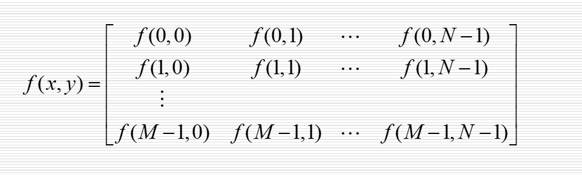
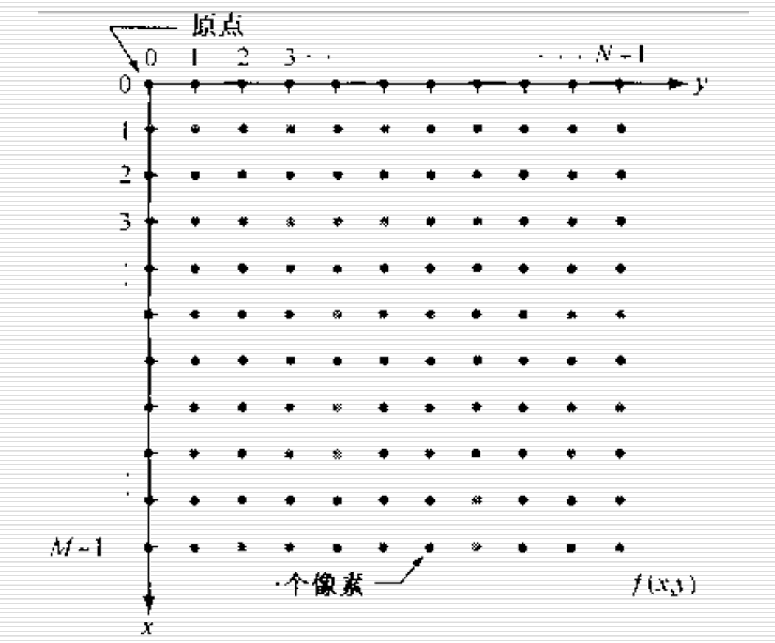

### 3. 空间分辨率与图像分辨率：
> **空间分辨率**：图像可分辨的最小细节，单位长度黑白线对的数量(线对/毫米),不考虑实际大小时用**行数X列数**表示，如1920*1080
### 4. 灰度：

### 5.图像的放缩
> **最邻近插值**
> **双线性内插法**
#### 5.1：最邻近插值：
>为放大后的图像画个栅格，然后缩小拟合到原来图像，把离栅格最近的点赋给栅格。

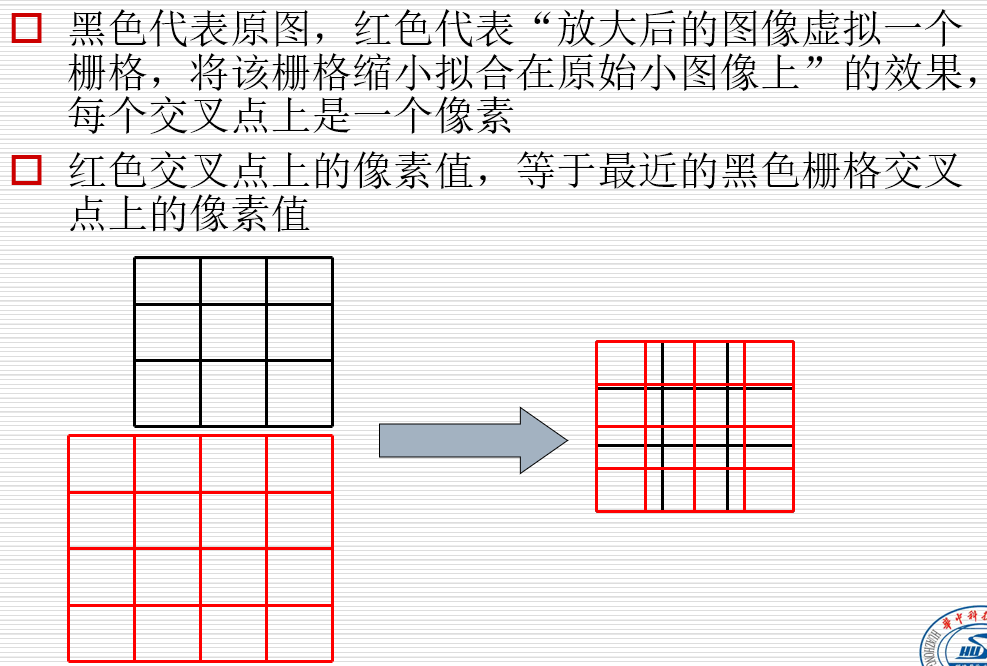
**matlab实现**
```matlab
% ./pic/girl.jpg
img = imread('girl.jpg');
img = rgb2gray(img);
imshow(img);
[m n]=size(img);%128 x 124
w = m*6;
h = n*6;
imgn = zeros(w,h);
% 放大后行列间距是原图行列间距的倍数
% plus:间距数量为：  行数（列数） - 1，压缩后小方格长宽
% w_step，h_step倍 （小于1）
w_step = (m-1)/(w-1);
h_step = (n-1)/(h-1);

for x=1:w
    for y=1:h
        %原点（1，1）还对应（1，1）
        pix = [(x-1)*w_step (y-1)*h_step];
        %依据四舍五入来判断离哪个最近
        imgn(x,y)=img(round(pix(1))+1,round(pix(2))+1);
    end
end
figure,imshow(uint8(imgn))
```
#### 5.2：双线性内插法：
> **离哪个点越近越接近那个值**
> **1.先在x轴做一次线性插值，得到点R1,R2**
> **2.R1,R2在y轴做一次线性插值,得到点P**

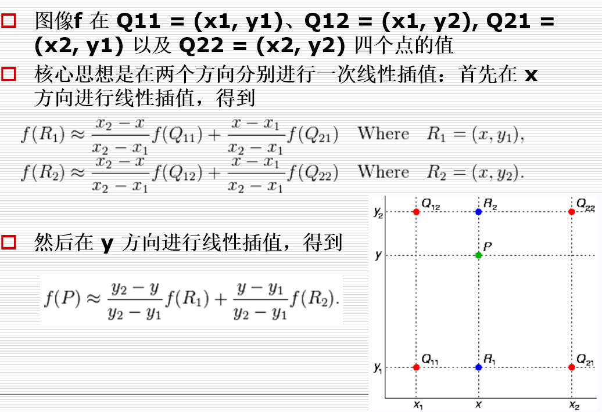
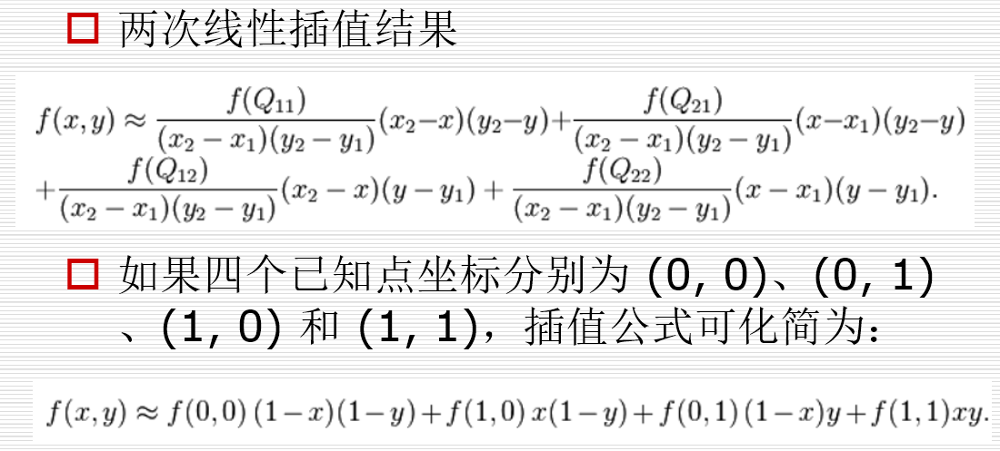
**matlab实现**
```matlab
% BILINEAR-INTERPLOT SOUCE-IMAGE TO GET A DESTINATE-IMAGE 
% MAXIMUM SCALOR == 5.0, MINIMUM SCALOR == 0.2 
% read source image into memory, and get the primitive rows and cols  
close all; clear all;
I=imread('girl.jpg'); 
imshow(I);
I = rgb2gray(I);
[nrows,ncols]=size(I);  

% acquire scale-factor, the range is 0.2-5.0 
K = str2double(inputdlg('please input scale factor (must between 0.2 - 5.0)', 'INPUT scale factor', 1, {'0.5'}));  
% Validating  
if (K < 0.2) | (K > 5.0) 
    errordlg('scale factor beyond permitted range(0.2 - 5.0)', 'ERROR');  
    error('please input scale factor (must between 0.2 - 5.0)');  
end

% output image width and height are both scaled by factor K  
width = K * nrows;  
height = K * ncols;  
J = uint8(zeros(width,height));  

% width scale and height scale  
heightScale = nrows/width;  
widthScale = ncols/height;  

% bilinear interplot  
for x = 5:width - 5  
    for y = 5:height - 5  
        xx = x * widthScale;  
        yy = y * heightScale;  
        if (xx/double(uint16(xx)) == 1.0) & (xx/double(uint16(xx)) == 1.0)  
            J(x,y) = I(int16(xx),int16(yy));  
        else % a or b is not integer  
        %  b+1->y2  b->y1 a->x1  a+1->x2
        % matlab中int8这类为四舍五入，所以x1<a<x2,y1<b<y2
            a = double(uint16(xx)); % (a,b) is the base-dot 
            b = double(uint16(yy));  
            q11 = double(I(a,b)); % q11 <- I(a,b)  
            q12 = double(I(a,b+1)); % q12 <- I(a,b+1)  
            q21 = double(I(a+1,b)); % q21 <- I(a+1,b)  
            q22 = double(I(a+1,b+1)); % q22 <- I(a+1,b+1)  
            J(x,y) = uint8( (b+1-yy) * ((xx-a)*q21 + (a+1-xx)*q11) + (yy-b) * ((xx-a)*q22 +(a+1-xx) * q12) ); % calculate J(x,y)  
        end
    end
end  % show the interplotted image  

imwrite(J, 'girl2.jpg', 'jpg');  
figure;  
imshow(J);
```
### 6.影响图像清晰度的因素
> - 亮度
> - 对比度：图像中灰度反差的大小，最大亮度/最小亮度
> - 分辨率
> - 细微层次
> - 颜色饱和度

### 7.像素间的关系
> **相邻** ： 4邻域，D邻域，8邻域
> **联通** : 4连通，8连通，m连通;用来描述区域和边界

**7.1 相邻：**
4邻域：
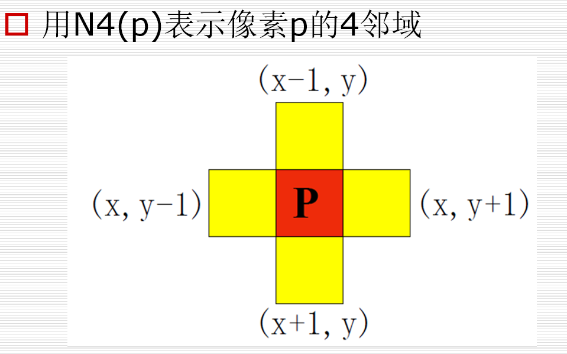

D邻域:
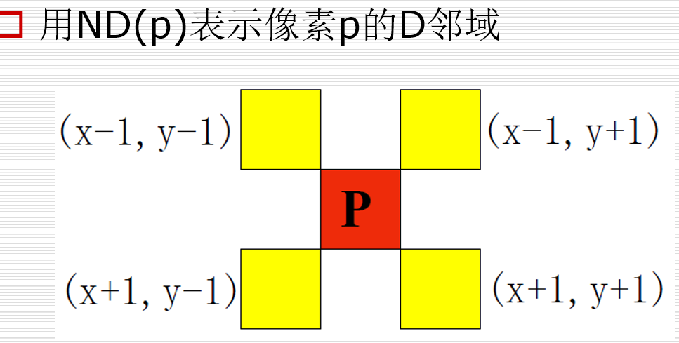

8邻域:
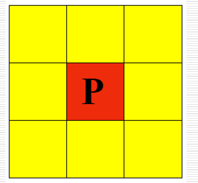

**7.2 联通：**
对于具有**集合V**中数值的像素p,q
4联通：两像素在各自四邻域内
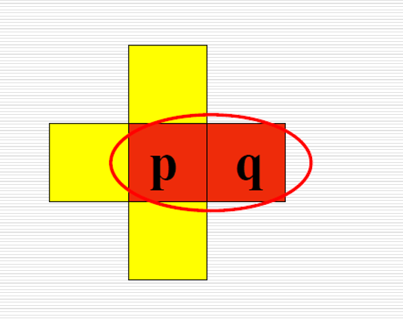
8联通：同理
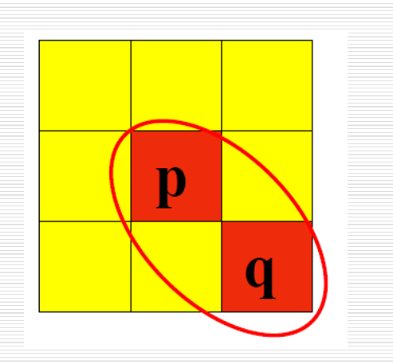
m联通：
>q在p的四邻域内  或者
>q在p的D邻域内，但相交的4邻域的值不属于V

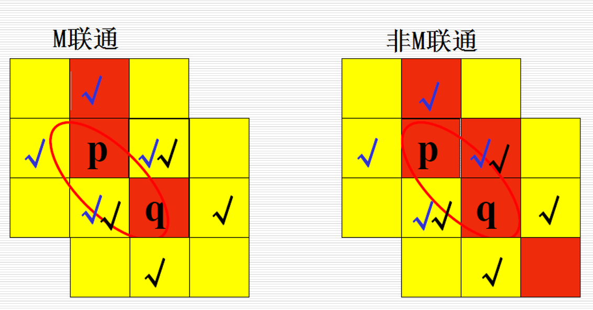

### 8.像素间的距离
>欧式
D4
D8

欧式
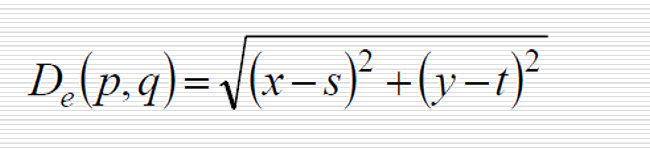
D4
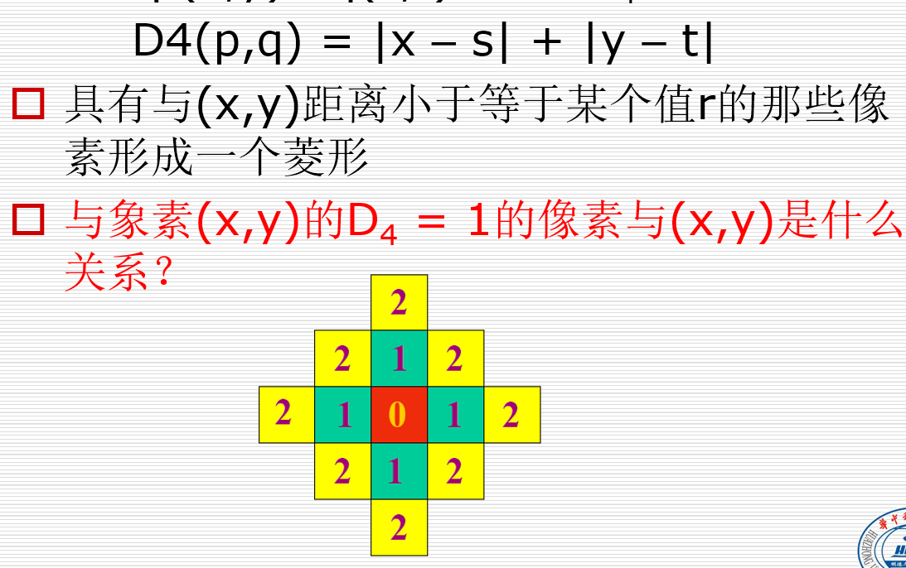
D8
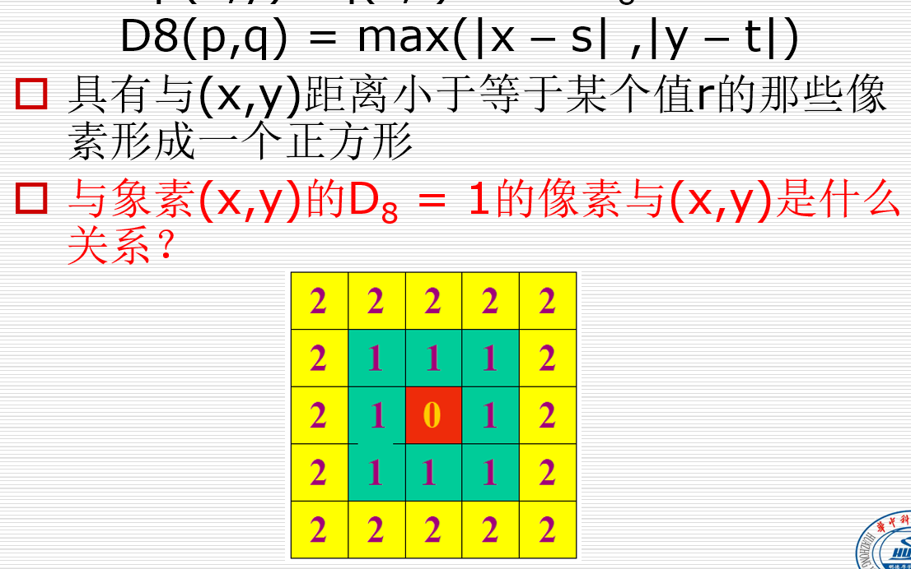


### 9.习题

- 图像出现虚假轮廓的本质原因：图像的灰度级不够多，导致像素间的变化不够平缓，时不时产生阶跃
- 