# 频域图像增强

[TOC]

#### [二维傅里叶变换](https://www.zhihu.com/question/22611929/answer/621009581)
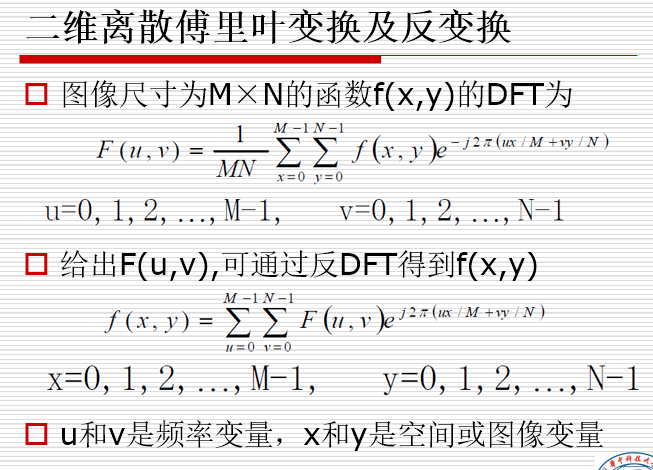
**1.1 性质**

**与图像的对应关系**

- 频谱图中最亮的部分对应着原始图像的慢变化量
- 图像纹理分布稀疏，则低频分量较多；图像纹理分布密集，则高频分量较多
- 空域锐化等价于频域低通，空域锐化等价于频域高通
- 空域中周期性的图像会在频域的水平轴上产生周期性的亮点

**平移性质**
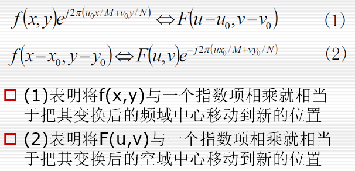
**中点化**
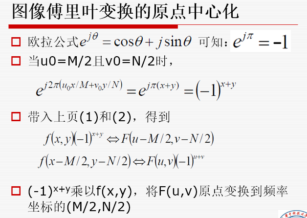

```matlab
clear all;close all;
im = zeros(400,400);
im(195:255,195:205)=255;
subplot(1,4,1);imshow(im);title('空域');
im_DFT1 = fft2(im);
subplot(1,4,2);imshow(log(abs(im_DFT1)),[]);title('未中心化频域');
im_DFT2 = fftshift(im_DFT1);
subplot(1,4,3);imshow(log(abs(im_DFT2)),[]);title('中心化频域');
im2 = ifft2(im_DFT2);
subplot(1,4,4);imshow(im2);title('空域');
figure();mesh(log(abs(im_DFT1)));title('未中心化频域');
figure();mesh(log(abs(im_DFT2)));title('中心化频域');
```

**旋转不变性**
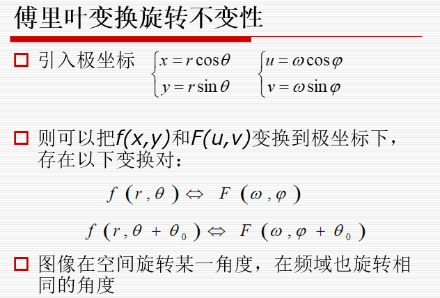
**相关定理**
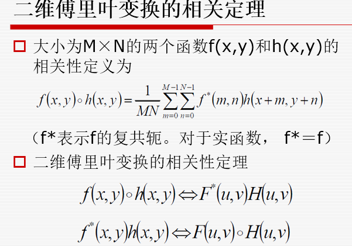
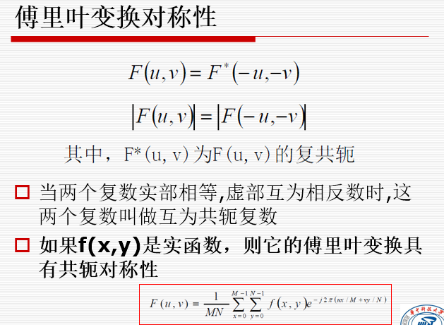
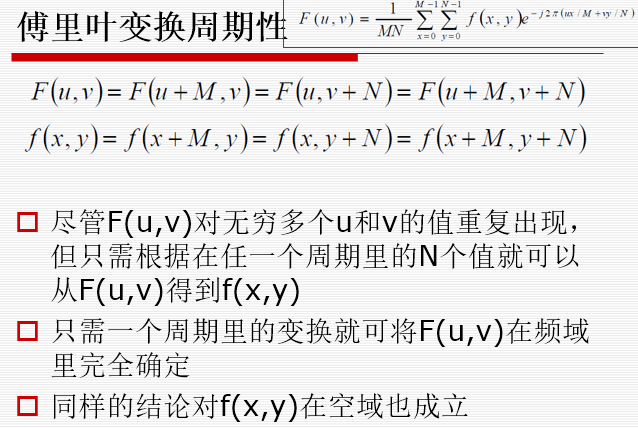

#### 频域滤波
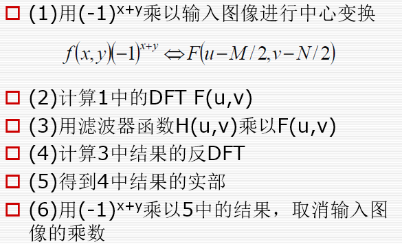
> - **中心化后中点对应低频分量，外围为高频分量**

**滤波器类型**
> - 陷波滤波器
> - 低通(平滑)滤波器
> - 高通(锐化)滤波器

**1. 陷波滤波器**
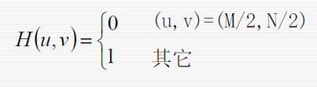
> - 将均值点设为0，降低了图像的整体灰度级
> - 用于识别特定，局部化频域成分引起的空间图像效果
> - 若均值为0则会出现负灰度级
```matlab
clear all;close all;
I = imread('./pics/Fig4.jpg');
figure;imshow(I);
F = fft2(I);
F = fftshift(F);
[M , N ] = size(F);
h = ones(M,N);
h(M/2+1,N/2+1)=0;
figure;mesh(h);
result = h.*F;
result = ifftshift(result);
I2 = ifft2(result);
I3 = uint8(real(I2));
figure;imshow(I3);
```
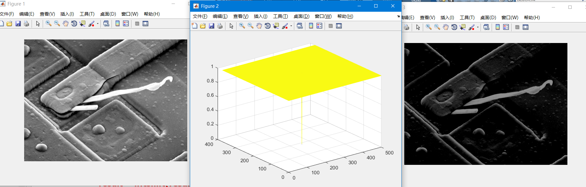

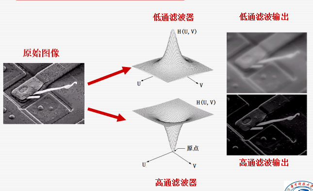

> - 可以在高通滤波器的中心加个常量防止图像灰度级过低

**2. 低通滤波器**
- 理想低通
- 巴特沃斯低通
- 高斯低通
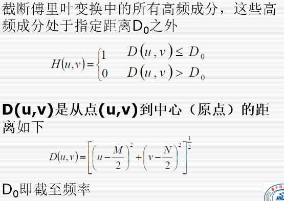
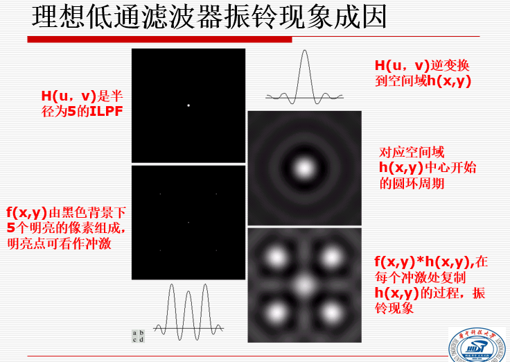
**原因：** 矩形窗的傅里叶变换为sinc函数

**3. 低通巴特沃斯**
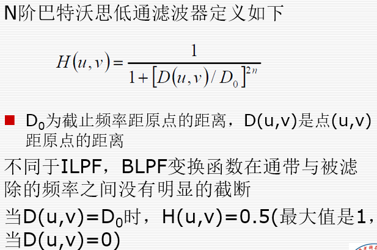
> - 用于平滑处理，如当图像由于量化不足时产生虚假轮廓，常用低通滤波器进行平滑以改进图像质量
> - 效果比理想低通好

**4. 高斯低通**
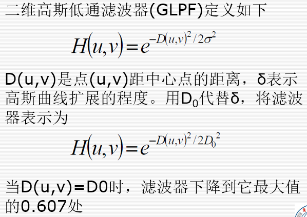
> - 不能达到有相同截至频率的二阶巴特沃斯平滑效果
> - 无振铃

#### 低通滤波器的应用
> - 字符识别： 通过模糊图像，桥接断裂字符的裂缝
> - 印刷和出版业：将尖锐的原始图像改为平滑，柔和的，如人脸减少皮肤细纹的锐化程度和小斑点
> - 处理卫星和航空图像：模糊细节，保留重要特征

**高通滤波器**
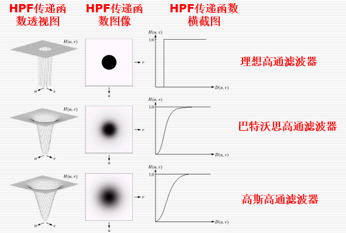
**理想高通**

**高通滤波器 空域图在原点处存在一个尖峰的原因：**

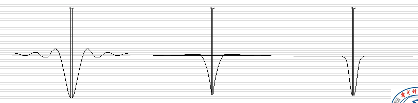

这些滤波器函数在频域中的函数为 $H_h(u,v) = 1 - H_l(u,v)$，而 频域中的**1** 在空域中为一个冲量

**巴特沃斯高通**
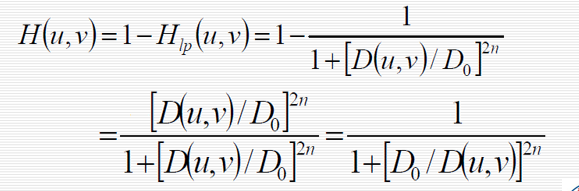
**高斯高通**
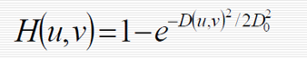

#### 同态滤波
在频域中压缩动态范围增强局部对比度，减少低频，增加高频

当光照明显不均匀是，同态滤波有助于表现图像中暗处的细节

**同态滤波的实现**


