# 图像复原

[TOC]

#### 1. 图像退化
图像在形成、记录、处理和传输过程中,由于成像系统、记录设备、传输介质和处理方法得不完善，导致图像质量下降
#### 2. 图像复原
2.1 估计退化过程，再加以补偿

2.2 图像复原的过程

> - 弄清退化原因
> - 建立退化模型
> - 反向推演
> - 恢复图像

#### 3. 噪声模型
> * 高斯噪声
> * 瑞利噪声
> * 伽马噪声
> * 指数分布噪声
> * 均匀分布噪声
> * 脉冲(椒盐噪声)
> * 周期噪声

**高斯噪声**
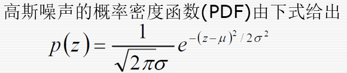
**瑞利噪声**
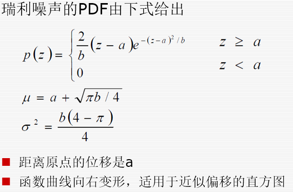
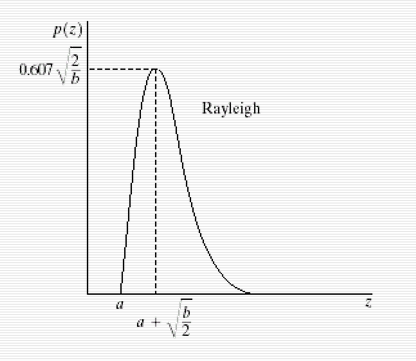
**伽马噪声**
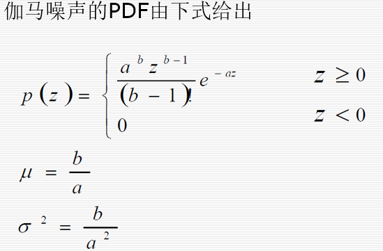

**脉冲噪声(椒盐噪声)**
椒噪声：黑色

> Q > 0的逆波均值滤波器，最大值滤波器

盐噪声：白色

> 最小值滤波器，谐波滤波器，Q<0逆波均值滤波器

**周期噪声**

图像获取中电力或机电干扰

通过频域滤波去除，如用带阻滤波器

**去除方法：**

- 空域中：中值滤波器，自适应中值滤波器
- 频域中：低通滤波器

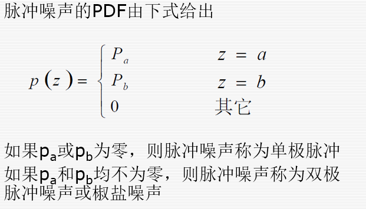

* 建模
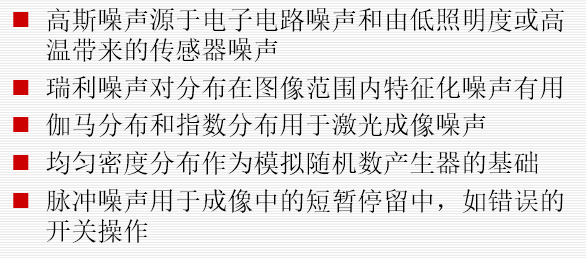

#### 4. 噪声估计

- 周期噪声：检测图像的傅里叶变换
- 成像系统噪声

> * 选取均匀灰度的区域
> * 分析该区域的灰度直方图
> * 计算灰度值的均值和方差
- 脉冲噪声

> 选择中等灰度区域，得到上下脉冲

```matlab
clear all;close all;
I(1:256,1:256)=uint8(50);
I(20:120,50:100)=140;
I(150:220,20:230)=200;

I1 = imnoise(I,'salt & pepper', 0.02);
I2 = imnoise(I,'gaussian',0, 0.0025);
figure(1);
subplot(1,2,1);imshow(I,[]);subplot(1,2,2);imhist(I);
figure(2);
subplot(1,2,1);imshow(I1,[]);subplot(1,2,2);imhist(I1);
figure(3);
subplot(1,2,1);imshow(I2,[]);subplot(1,2,2);imhist(I2);
```
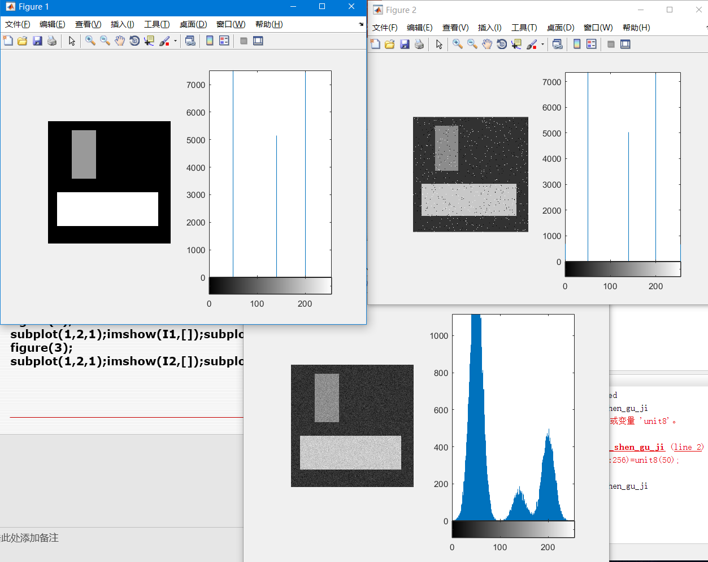
#### 5.空域滤波复原
##### 5.1 均值滤波器

* 算术均值

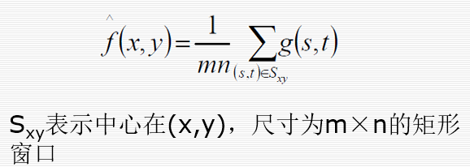
>平滑了局部变化，模糊图像的同时减少了噪声

* 几何均值

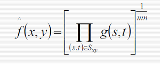
> 平滑程度和算术均值相当，但会损失更多细节
* 谐波均值

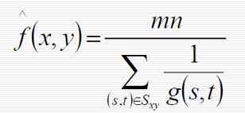
> 对盐噪声效果好，不适用胡椒噪声
> 适用于处理高斯等其他噪声

* 逆波均值

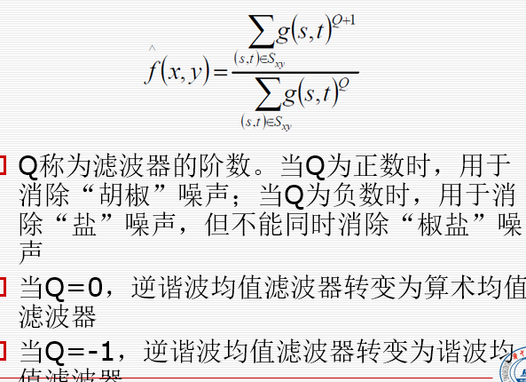

##### 5.2 统计排序滤波器

* 中值
> 相同尺度下比均值引起的模糊更小，对单极和双极脉冲噪声更有效
* 最值
> 最大值 : 有效过滤‘胡椒’噪声
> 最小值 : 有效过滤盐噪声
* 中点
取最大最小值的平均
> 适用于高斯和均匀分布噪声
* 修正后的阿尔法均值

去掉d/2最低灰度，d/2最高灰度，剩下的均值
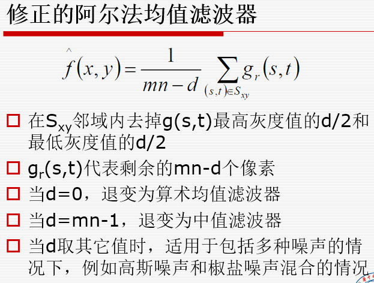
##### 5.3 自适应滤波器
> 基于窗口定义区域内图像的统计特征
优点：性能更好
缺点：复杂度更高

* 自适应局部噪声消除滤波器

利用了全局及窗口的统计特性

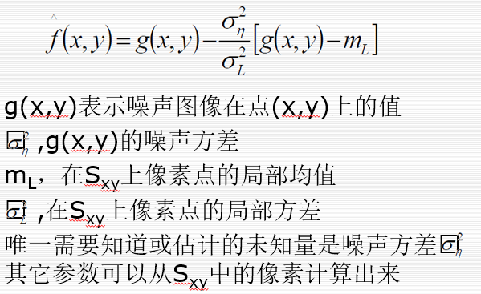
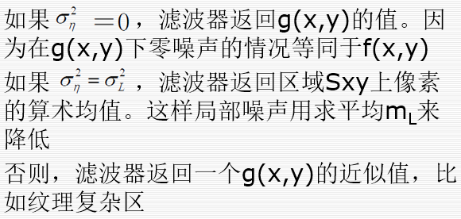
* 自适应中值滤波器
传统中值滤波器只能处理空间密度不大的冲激噪声,自适应能够处理具有更大概率的冲激噪声

自适应中值滤波器的目的：
> - 除去椒盐噪声
> - 平滑其他非冲激噪声
> - 减少物体边界细化或粗化等失真

自适应中值滤波器下符号规定

- $ Z_{min}=S_{xy}中灰度的最小值$
- $ Z_{max}=S_{xy}中灰度的最大值$
- $ Z_{med}=S_{xy}中灰度的中值$
- $ Z_{xy}=坐标(x,y)像素的灰度级$
- $S_{max}=S_{xy}允许的最大尺寸$

**算法**

分为两个进程：

A：调整窗口大小，使中值非脉冲，成功转B，否则输出中值

> 为了防止出现 [0,0,0,255] 或者 [0,255,255,255]这类情况

B:   检查当前像素是否是脉冲，是脉冲则输出中值，不是则直接输出$Z_{xy}$

* A：
    $A_1 = z_{med} - z_{min}$
    $A_2 = z_{med} - z_{max}$
    如果$A_1>0且A_2<0$，转到进程B
    否则：增大窗口尺寸
    如果窗口尺寸小于最大规定窗口尺寸，重复进程A
    否则:    输出$z_{med}$
* B：
    $B_1 = z_{xy} - z_{min}$
    $B_2 = z_{xy} - z_{max}$
    $如果B_1>0且B_2<0,输出z_{xy},否则输出z_{med}$
#### 6.频域滤波复原

* 带阻
* 带通
* 陷波：阻止事先定义的中心频率一定范围内的频率  
* 最佳陷波

**带阻滤波器**

- 可以去除周期性噪声

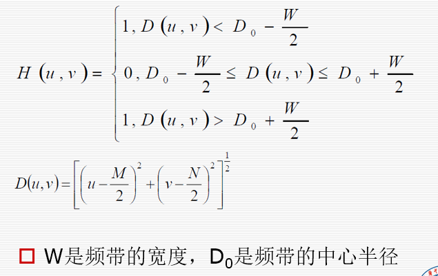
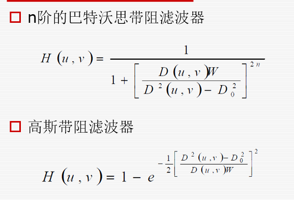
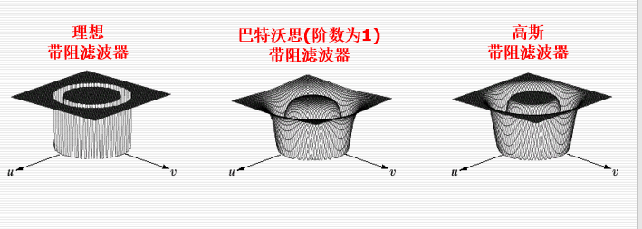

**陷波**
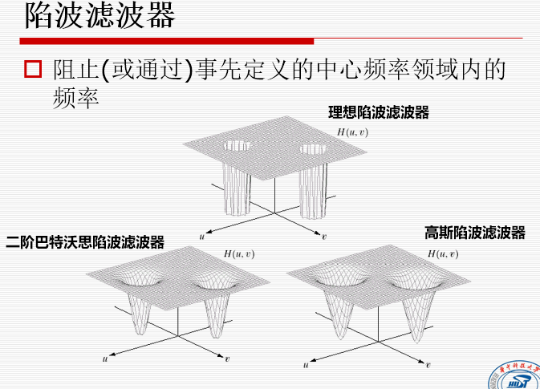
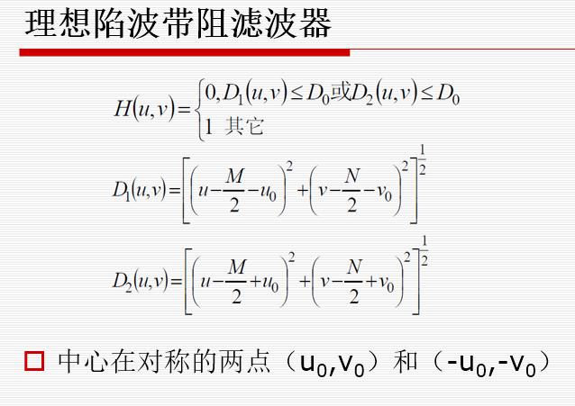
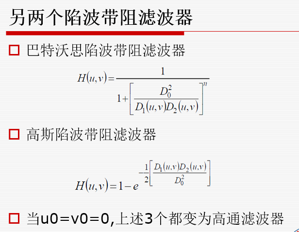

**交互式恢复**

在处理过程中通过人眼观察来设计滤波器，眼睛瞄法

#### 7.线性位置不变退化

#### 8.估计退化函数
> - 图像观察
> - 实验估计
> - 模型估计

源图像：$f(x,y)$

实际用的图像：$g(x,y)$

传输函数估计：$H(u,v)$ 

1. **观察法**：

- 选一个强信号区 $g_s(x,y)$
- 对该区域原图像进行估计$f_s(x,y)$
- 对以上两个进行傅里叶变换 $G_s(u,v) F_s(u,v)$
- 得到该区域的估计退化函数$H_s(u,v)=\frac{G_s(u,v)}{F_s(u,v)}$
- 在全图范围进行等比例拓展

2. **试验估计法**:

**当成像环境可再现时**，对孤立亮点实验成像

- 孤立亮点的傅里叶变换为常数A
- 图像的傅里叶变换为$G(u,v)$

- 传输函数的估计为$H(u,v)=\frac{G(u,v)}{A}$

3. **模型估计法**

对特定的退化过程建立数学模型，如相对运动模型，大气湍流模型, 匀速运动模型

#### 9. 逆滤波图像复原

复原一些 因运动产生的退化，如湍流退化

在实际退化过程中，还存在加性噪声

$G(u,v) = H(u,v)F(u,v) + N(u,v)$

#### 10.几何变换复原

[详见](https://ww2.mathworks.cn/help/images/find-image-rotation-and-scale.html)

**对几何畸变的矫正**

**操作**：

>1. 空间变换
>2. 插值

- 空间变换

> 双线性方程建立几何联系


- 灰度插值

利用 最邻近插值 或者 双线性插值

