# 图像压缩

[TOC]

## 1.基础原理和类别

**原理**：消除冗余数据

**两类**：

- 有损压缩：较高的压缩率，但会损失信息

- 无损压缩：压缩和解压缩都不会损失信息

**压缩方法**:

- 预测编码方法：对应空域
- 变换编码方法：对应频域

**数据冗余**：

- 编码冗余：

- 像素间冗余：一个像素的值可以以相邻像素未基础进行预测，包括空间冗余，几何冗余，帧间冗余等

  > 例如：原图像数据：234, 223 ,231, 238 ,235
  > 		    差值数据：234, -11, 8 ,7, -3

- 心理视觉冗余：一些在视觉过程中不是特别重要的信息，去除后也不会明显降低图像质量。消除心理冗余也会导致一定程度的信息丢失，所以这一过程也称**量化**。

  心理视觉的冗余压缩是不可恢复的，有损的。

**保真度准则:**

衡量解码图像与原始图像的偏离程度 , 分为客观保真度准则，主观保真度准则 

- 客观保真度准则：

常用的客观保真度准则

1. 均方根误差：

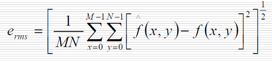

2. 均方信噪比误差：

   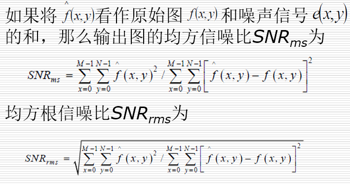

   

- 主观保真度准则：

  好，差，不能用  这类

## 2.图像编码模型

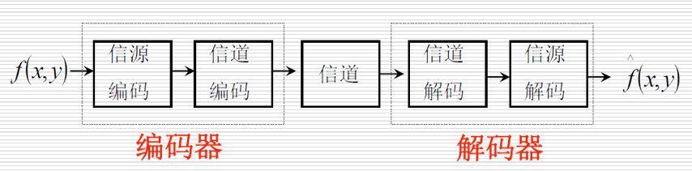

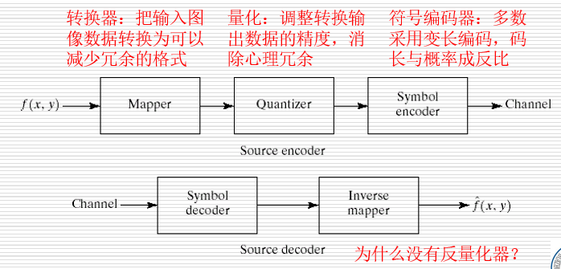

## 3.图像压缩

- 编码信息率：编码后平均每个信源符号载荷的最大信息量

  $R' = \frac{K长字最大信息量}{信源符号序列长度}$

  > 例： 对L长的信源符号定长编码，编码后每个序列对应的码长度K
  >
  > $R' = \frac{Klog(m)}{L}$,m为码符号数，二元码m=2

- 编码效率：$\eta=\frac{信源每个符号载荷的信息量}{编码后平均每个符号载荷的最大信息量}=\frac{最小可能码长}{编码后实际码长}=\frac{H(x)}{R'}$

- 信息传输率：平均每个码元载荷的信息量

  ​	$R = \frac{H(x)}{K}$

###  3.1 无损压缩：

####  3.1.1 变长编码：

- 哈夫曼编码：

- 算术编码：对整个符号序列进行编码，需要每个符号的出现概率和整个符号的排列顺序

  ​					理论上可以达到无失真编码定理的编码极限

  编码：依据概率区间划分得到一个10进制小数，将其转换成2进制，再去掉小数点和前面的0

  解码：一层一层放回概率区间中

  [详情见](https://blog.csdn.net/qq_36752072/article/details/77986159)
  
- LZW编码：消除像素间冗余,利用字典来存储信息
  
  一边编码，一边生成字典
  
  应用：是Unix操作系统的文件压缩标准方法

​       [详情见](https://segmentfault.com/a/1190000011425787)

- 位平面编码：

  将图片分解为多个位图，每个位图都是二值，进行二元编码

  - 存在问题：127(01111111)    128(10000000) 即像素点的微小变化对位平面产生较大的影响

  - 改进：首位不变，对其余位进行异或

    ​			得 127(01000000)    128(11000000)

  - 游程编码：

    ​    例： AAAABBB -> 4A3B     

    ​			00001100  ->  422

- 无损预测编码

### 3.2 有损压缩

#### 3.2.1 有损预测编码：

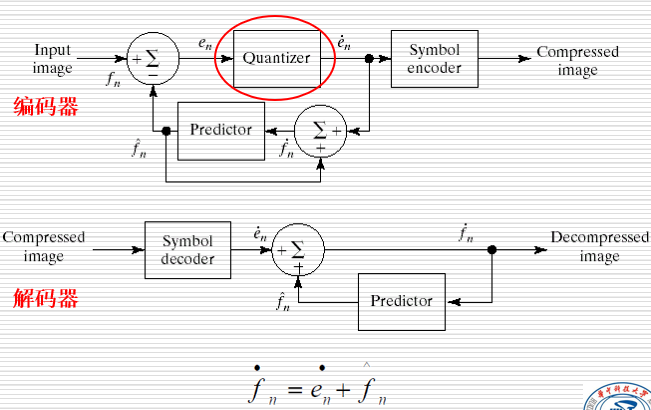

$e_n$为量化误差，反馈环得输入为 过去预测结果与量化误差得函数

#### 3.2.2 变换编码

**1. 变换编码的思想与问题**

- 基于空间冗余压缩得思想

- 变换编码要解决的几个问题
  - 变换的选择
  - 基于运算效率与数据相关性考虑的子图选择
  - 变换域中有用信息的选取原则
  - 信息的量化编码

**2. 编码系统**
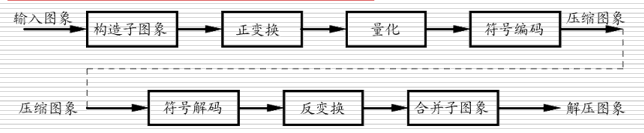
**目的**：

- 子图构造与图像分解：
	减少计算复杂度，其中子图间要尽可能少的图像相关性
- 变换：解除图像内部像素点间的相关性，将信息集中到较少的变换系数上
- 量化：压缩过程是在量化变换系数时

**3. 变换的选择**

变换与反变换：

- **DFT**  : 

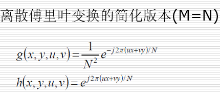

- **WHT**

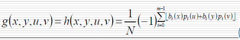

- **DCT** : 离散余弦变换

  **一维DCT 及其反变换：**

  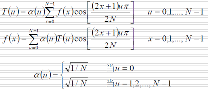
  
  **二维DCT 及其反变换：**

  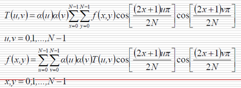
  
  
  
  DCT 压缩能力最强，应用最广泛，在单一集成电路就能实现

**4. 子图像尺寸的选择**：

**原因**：

- 图像跨子图像的相关性不多，相关性的集中利于减少误差
- 压缩量与计算复杂度虽子图像尺寸增大而增大

**选择条件**：

- 子图像间相关性要小

- 长宽都是$2^n$,常见`8X8`,`16X16`

**5.比特分配：**

5.1 对变换后子图像的系数截断，量化，编码的全过程

5.2 保留系数的2个准则：

* 最大方差准则，依此准则构成分区编码
* 最大幅度准则，依此准则构成阈值编码

**分区编码**：

​			具有最大方差的变换系数带有最多的图像信息，本算法的模板又事先指定

​		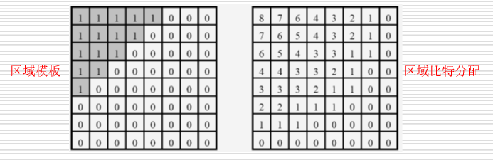

**阈值编码**:

## 4.  JPEG的压缩过程

[详见](https://www.cnblogs.com/Arvin-JIN/p/9133745.html)

先游程编码，在霍夫曼编码

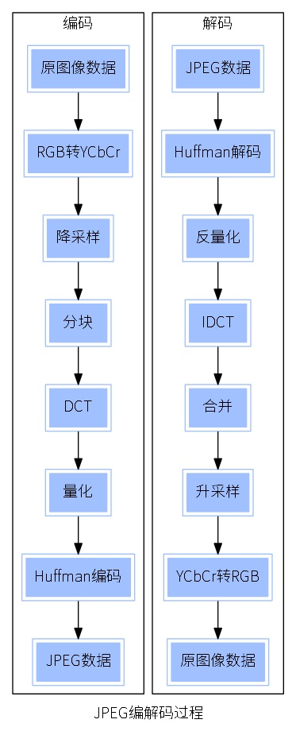

