# 形态学图像处理

[代码](https://www.cnblogs.com/daxiongblog/p/6289551.html)

[TOC]

### 1.基本概念：

​     **概念**：用具有一定形态的**结构元素**去量度和提取图像中的对应形状，达到对图像分析和识别的目的

​     **基本运算**：膨胀，腐蚀，开操作，闭操作， 击中击不中

​    **处理对象**：二值图，灰度图

### 2.膨胀

B在点z位置时至少与A有一个交点

$A \bigoplus B$

- B的中心点绕A的边界区域平移,
	如下图所示：
	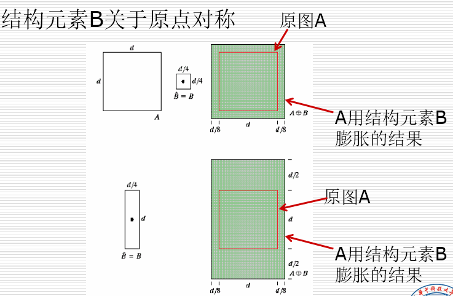
- 膨胀会增长，粗化二值图中的物体
- 应用：桥接裂缝，如处理断裂字符
	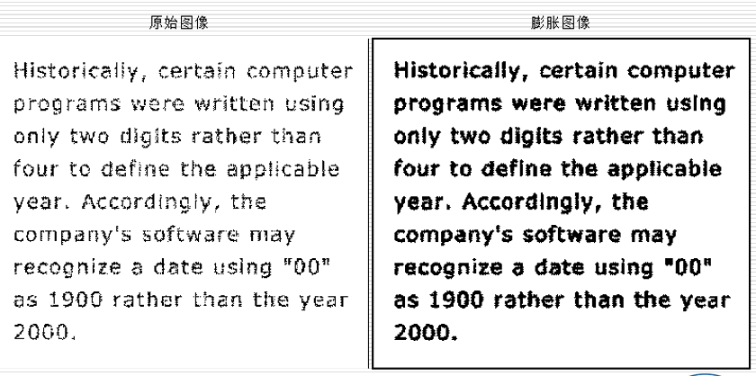
### 3.腐蚀

B在点z时，B所覆盖的范围必须都在A内

$A \ominus B$

- B 平移平移Z所覆盖的点 ，必须在A内

  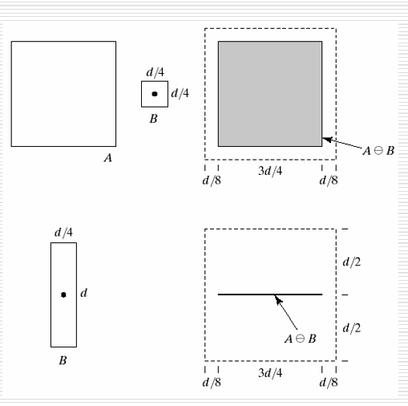

- 腐蚀是一种收缩或细化操作，细化了物体，将小的细节滤去

  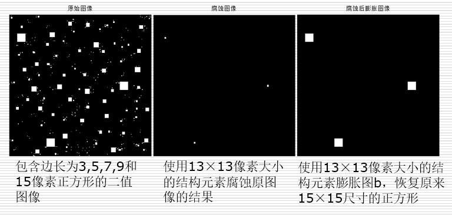
#### 3.1 对偶性

令$\hat{B}$ 为模板B的中心对称，$A^c$为A的补，则有:

- $(A\ominus B )^c = A^c \oplus  \hat{B}$
- $(A\oplus B )^c = A^c \ominus  \hat{B}$

**腐蚀-膨胀组合**

- 膨胀-腐蚀：去毛刺，恢复目标尺寸
- 腐蚀-膨胀： 填空洞，恢复目标尺寸

### 4.开操作和闭操作

**开操作**：

$(A \ominus B)\oplus B$

- 先腐蚀再膨胀
- 除去细小的突出物，断开狭窄的裂缝，来平滑目标

**闭操作**

$(A \oplus B)\ominus B$

- 先膨胀再腐蚀
- 填充小孔洞，消除狭窄的裂缝，来平滑目标

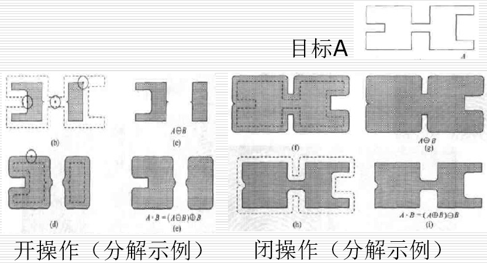

### 5.击中击不中变换

$A \odot B = (A \ominus X ) \cap (A ^c\ominus (W-X))$

- 对多个目标构成的图像用腐蚀操作来进行目标检测

**操作步骤**

- 用`W`腐蚀`A`，得到比`D`大或和`D`一样大的目标
- 用`W-D`腐蚀$A^c$,得到比`D`小或和`D`一样大的目标
- 综合得到`D`

例：


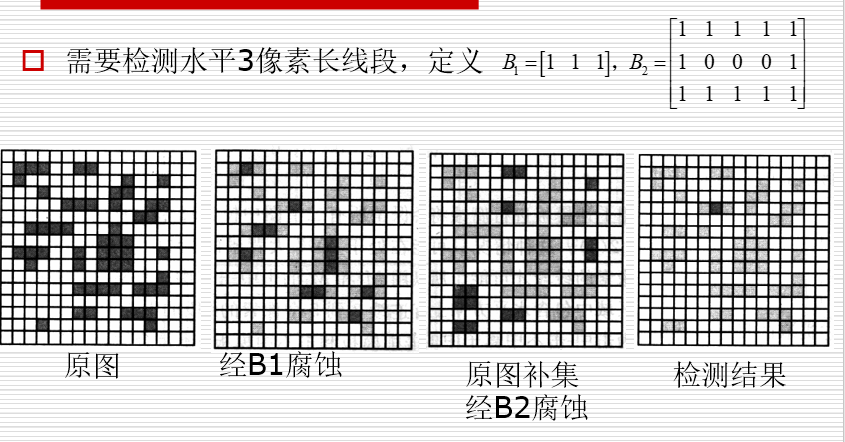

### 6.边界提取

$\beta(A) = A - (A \ominus B)$

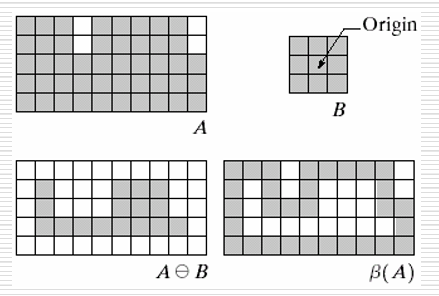

### 7.区域填充

**步骤**：

1. 从每一个孔洞对应的$X_0$开始
2. $X_k = (X_{k-1} \bigoplus B) \cap A^c    k = 1,2,3,...$
3. 当$X_k = X_{k+1}$时结束


​	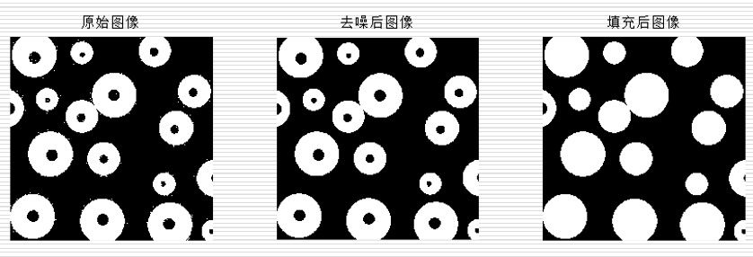

### 8.细化

- $A \otimes B = A - (A \odot B) = A \cap(A \odot B)^c$

- 细化是将需要消除的目标检测并剔除，用击中击不中来检测目标

可以用来提取骨架

### 9.粗化

- 消除间断点
- 先细化$A^c$,再求补

### 10.Matlab 操作实现

**10.1膨胀**

```matlab
%% 膨胀
clc
clear

A1 = imread('./pics/Fig9.05(a).jpg');
A1 = 255 - A1;
B =[0 1 0
    1 1 1
    0 1 0];
A2 = imdilate(A1,B);
A3 = imdilate(A2,B);
A4 = imdilate(A3,B);

subplot(2,2,1),imshow(A1),title('A1');
subplot(2,2,2),imshow(A2),title('A2');
subplot(2,2,3),imshow(A3),title('A3');
subplot(2,2,4),imshow(A4),title('A4');
```

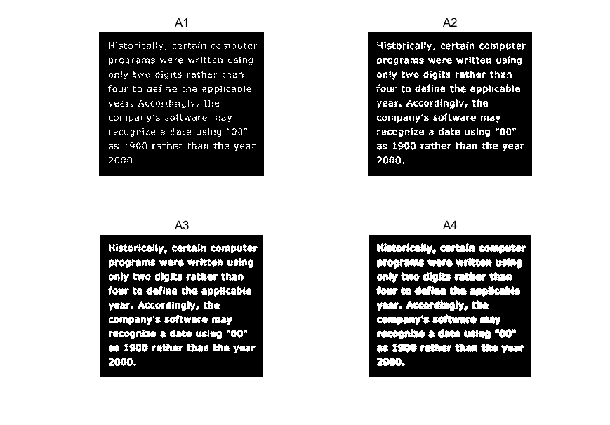

**10.2腐蚀**

```matlab
%% 腐蚀
clc 
clear
A1 = imread('./pics/Fig9.07(a).jpg');

se1 = strel('disk',5);
A2 = imerode(A1,se1);

se2 = strel('disk',10);
A3 = imerode(A1,se2);

se3 = strel('disk',15);
A4 = imerode(A1,se3);

subplot(2,2,1),imshow(A1),title('A1');
subplot(2,2,2),imshow(A2),title('A2');
subplot(2,2,3),imshow(A3),title('A3');
subplot(2,2,4),imshow(A4),title('A4');
```

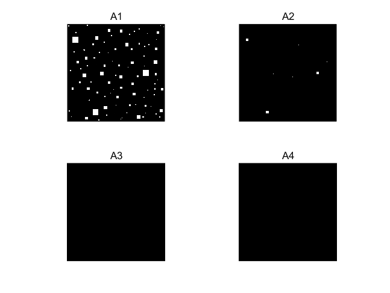

**10.3开闭运算**

```matlab
%% 开闭运算
clc 
clear
A1 = imread('./pics/Fig0905(a)(wirebond-mask).tif');
se1 = strel('disk',10);
A2 = imopen(A1,se1);
A3 = imclose(A1,se1);
subplot(2,2,1),imshow(A1),title('原始图像');
subplot(2,2,2),imshow(A2),title('开运算');
subplot(2,2,3),imshow(A3),title('闭运算');
%subplot(2,2,4),imshow(A4),title('A4');
```

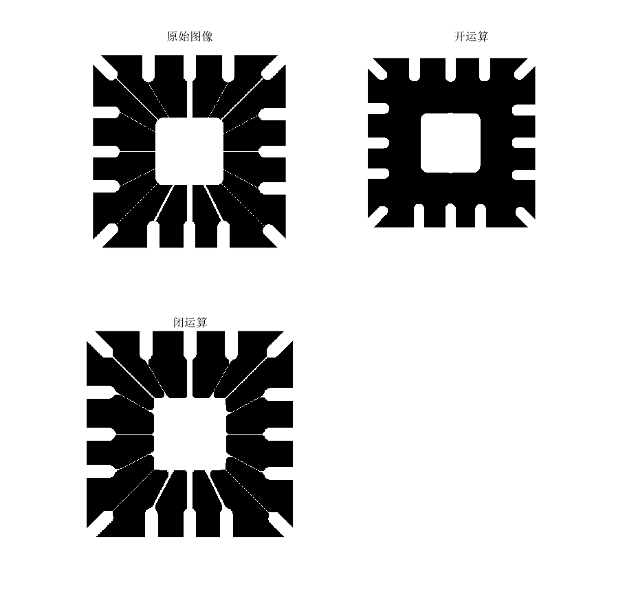


