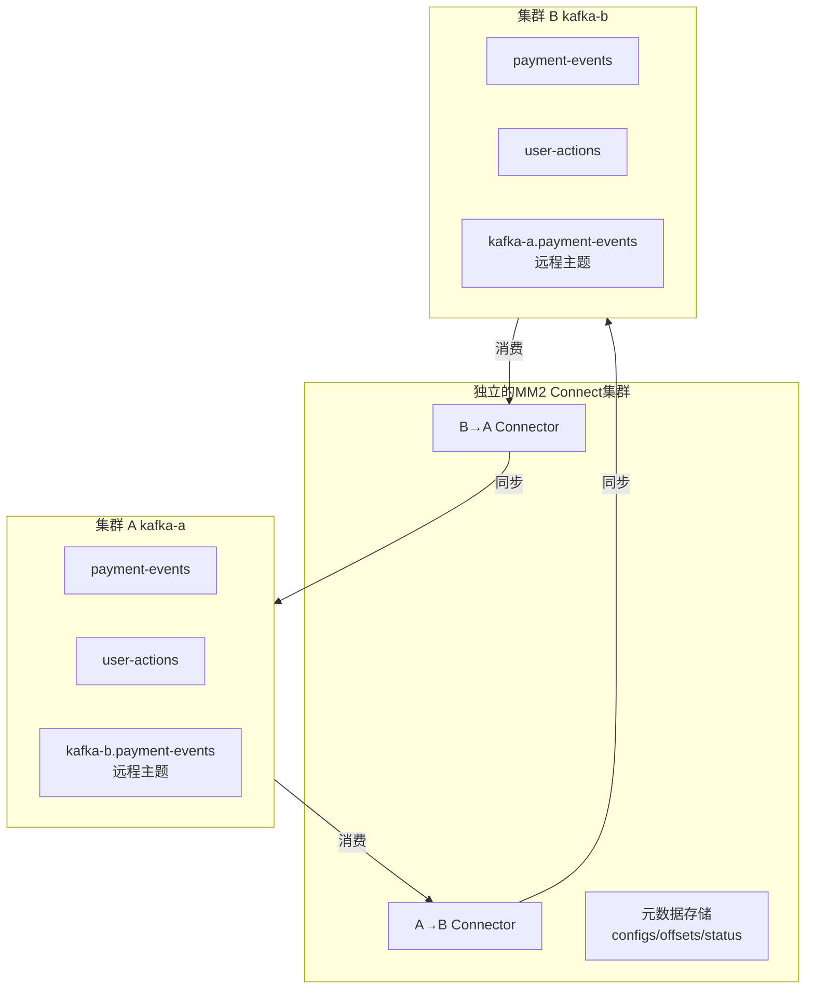

##

在两个地域（北京-上海）部署 Kafka 集群，实现数据的互相同步。

---

### 一、核心概念与避免循环复制

在双向同步中，最大的技术挑战是**避免循环复制**：A 集群的消息被同步到 B 集群，然后又从 B 集群同步回 A 集群，形成无限循环。

**MirrorMaker 2.0 的解决方案：**

1.  **自动主题重命名**：MM2 会自动为远程集群同步过来的主题添加**集群别名作为前缀**。
    - 从 `kafka-a` 集群同步到 `kafka-b` 集群的主题 `orders`，在 `kafka-b` 集群中会变成 `kafka-a.orders`。
    - 同理，从 `kafka-b` 同步到 `kafka-a` 的主题 `orders`，在 `kafka-a` 中会变成 `kafka-b.orders`。

2. **内部偏移量跟踪**：MM2 通过内部主题（如 `mm2-offset-syncs.*.internal`）跟踪同步进度，不会重复同步已同步的消息。

3. **心跳机制**：MM2 会生成特殊的心跳消息，这些消息不会被重复复制。

---

### 二、集群规划与配置

假设我们有两个集群：

- **集群 A** (别名: `kafka-a`)
  - Bootstrap Servers: `kafka-a-1:9092,kafka-a-2:9092,kafka-a-3:9092`
  - 需要同步的主题: `payment-events, user-actions`

- **集群 B** (别名: `kafka-b`)
  - Bootstrap Servers: `kafka-b-1:9092,kafka-b-2:9092,kafka-b-3:9092`
  - 需要同步的主题: `payment-events, user-actions`

**目标**：实现 `payment-events` 和 `user-actions` 主题在两个集群间的双向同步。

---

### 三、部署架构

有两种常见的部署模式：

#### 模式一：集中式部署（推荐）
在**一个独立的 Connect 集群**中部署所有 MM2 Connector，同时管理 A→B 和 B→A 的同步。

**优点**：
- 管理简单，运维成本低
- 资源利用率高
- 易于监控和故障排查



#### 模式二：分布式部署
在每个 Kafka 集群旁部署一个 Connect 集群，分别管理单向同步。

**优点**：
- 网络拓扑更优（同步流量不经过第三方）
- 故障隔离更好

**选择**：对于大多数场景，**模式一（集中式部署）** 更简单实用。

---

### 四、详细配置步骤

#### 步骤 1: 准备 MM2 配置文件

创建 `mm2-config.properties`：

```properties
# mm2-config.properties

# 为两个集群定义别名和连接地址
clusters = kafka-a, kafka-b

# 集群A配置
kafka-a.bootstrap.servers = kafka-a-1:9092,kafka-a-2:9092,kafka-a-3:9092
# 集群B配置  
kafka-b.bootstrap.servers = kafka-b-1:9092,kafka-b-2:9092,kafka-b-3:9092

# 设置复制流（双向）
kafka-a->kafka-b.enabled = true
kafka-b->kafka-a.enabled = true

# 要同步的主题（支持正则表达式）
kafka-a->kafka-b.topics = payment-events, user-actions
kafka-b->kafka-a.topics = payment-events, user-actions

# 要同步的消费者组（可选）
kafka-a->kafka-b.groups = .*
kafka-b->kafka-a.groups = .*

# 同步主题配置
sync.topic.configs.enabled = true

# 同步消费者组偏移量（高级功能，谨慎使用）
sync.group.offsets.enabled = false

# 启用心跳，用于监控
emit.heartbeats.enabled = true
emit.heartbeats.interval.seconds = 5

# 自动创建远程主题的配置
replication.factor = 3
checkpoints.topic.replication.factor = 3
heartbeats.topic.replication.factor = 3
offset-syncs.topic.replication.factor = 3

# 任务并行度
tasks.max = 4
```

#### 步骤 2: 启动 Kafka Connect 分布式集群

创建 Connect Worker 配置文件 `connect-distributed.properties`：

```properties
# connect-distributed.properties

# 可以指向任意一个集群，或独立的Kafka集群
bootstrap.servers=kafka-a-1:9092,kafka-a-2:9092,kafka-a-3:9092

group.id=mm2-cluster
key.converter=org.apache.kafka.connect.converters.ByteArrayConverter
value.converter=org.apache.kafka.connect.converters.ByteArrayConverter

# 内部主题配置
config.storage.topic=mm2-configs
offset.storage.topic=mm2-offsets  
status.storage.topic=mm2-status

config.storage.replication.factor=3
offset.storage.replication.factor=3
status.storage.replication.factor=3

# REST API
rest.port=8083
rest.host.name=0.0.0.0

# 插件路径
plugin.path=/opt/kafka/plugins
```

启动 Connect Worker：
```bash
./bin/connect-distributed.sh ./config/connect-distributed.properties
```

#### 步骤 3: 创建双向同步 Connector

使用 REST API 创建 MirrorMaker 2.0 Connector：

```bash
curl -X POST -H "Content-Type: application/json" \
  --data @mm2-config.json \
  http://connect-host:8083/connectors
```

其中 `mm2-config.json` 内容为：
```json
{
  "name": "mm2-bidirectional-connector",
  "config": {
    "connector.class": "org.apache.kafka.connect.mirror.MirrorSourceConnector",
    "clusters": "kafka-a, kafka-b",
    
    "kafka-a.bootstrap.servers": "kafka-a-1:9092,kafka-a-2:9092,kafka-a-3:9092",
    "kafka-b.bootstrap.servers": "kafka-b-1:9092,kafka-b-2:9092,kafka-b-3:9092",
    
    "kafka-a->kafka-b.enabled": "true",
    "kafka-b->kafka-a.enabled": "true",
    
    "kafka-a->kafka-b.topics": "payment-events,user-actions",
    "kafka-b->kafka-a.topics": "payment-events,user-actions",
    
    "kafka-a->kafka-b.groups": ".*",
    "kafka-b->kafka-a.groups": ".*",
    
    "sync.topic.configs.enabled": "true",
    "sync.group.offsets.enabled": "false",
    
    "emit.heartbeats.enabled": "true",
    "emit.heartbeats.interval.seconds": "5",
    
    "replication.factor": "3",
    "checkpoints.topic.replication.factor": "3",
    "heartbeats.topic.replication.factor": "3",
    "offset-syncs.topic.replication.factor": "3",
    
    "tasks.max": "4"
  }
}
```

---

### 五、验证与监控

#### 1. 验证同步状态

**检查 Connector 状态：**
```bash
curl http://connect-host:8083/connectors/mm2-bidirectional-connector/status
```

**查看目标集群中的主题：**
```bash
# 在集群B中查看从A同步过来的主题
./bin/kafka-topics.sh --bootstrap-server kafka-b-1:9092 --list | grep "kafka-a"

# 应该看到：
# kafka-a.payment-events
# kafka-a.user-actions
# heartbeats
# mm2-offset-syncs.kafka-b.internal
```

**测试消息同步：**
```bash
# 在集群A生产消息
./bin/kafka-console-producer.sh --bootstrap-server kafka-a-1:9092 \
  --topic payment-events

# 在另一个终端，从集群B消费远程主题
./bin/kafka-console-consum.sh --bootstrap-server kafka-b-1:9092 \
  --topic kafka-a.payment-events --from-beginning
```

#### 2. 关键监控指标

- **复制延迟**：监控 `replication-latency-ms` 指标
- **吞吐量**：`record-count` 和 `byte-rate`
- **积压量**：检查消费者组的 lag
- **错误率**：生产者和消费者的错误计数

使用以下命令查看监控指标：
```bash
# 查看MM2内部主题，了解同步进度
./bin/kafka-console-consumer.sh --bootstrap-server kafka-a-1:9092 \
  --topic heartbeats --from-beginning
```

---

### 六、应用程序如何消费

在双向同步架构中，应用程序有几种消费模式：

#### 模式 1: 消费本地主题 + 远程主题
```java
// 订阅本地主题和所有远程主题
Properties props = new Properties();
props.put("bootstrap.servers", "kafka-a-1:9092");
props.put("group.id", "my-app");
props.put("enable.auto.commit", "true");

KafkaConsumer<String, String> consumer = new KafkaConsumer<>(props);

// 同时消费本地主题和从B集群同步过来的主题
consumer.subscribe(Arrays.asList("payment-events", "kafka-b.payment-events"));
```

#### 模式 2: 使用 MirrorCheckpointConnector 创建别名
可以配置 MirrorCheckpointConnector 在目标集群自动创建指向远程主题的别名，让应用程序无需感知集群别名。

#### 模式 3: 逻辑主题层
在应用程序和 Kafka 之间增加一个代理层，自动路由到正确的物理主题。

---

### 七、故障处理与优化建议

1. **网络分区**：确保集群间的网络稳定，配置合理的重试和超时参数。
2. **性能调优**：
   - 根据数据量调整 `tasks.max`
   - 优化生产者配置：`batch.size`, `linger.ms`, `compression.type`
   - 调整消费者配置：`fetch.min.bytes`, `max.poll.records`
3. **监控告警**：设置复制延迟告警，延迟持续增长可能意味着同步跟不上。
4. **定期验证**：定期进行端到端的同步测试，确保双向同步正常工作。
