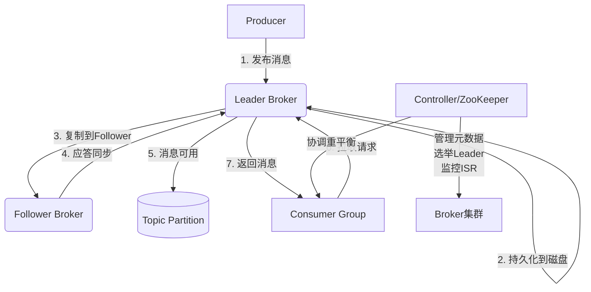
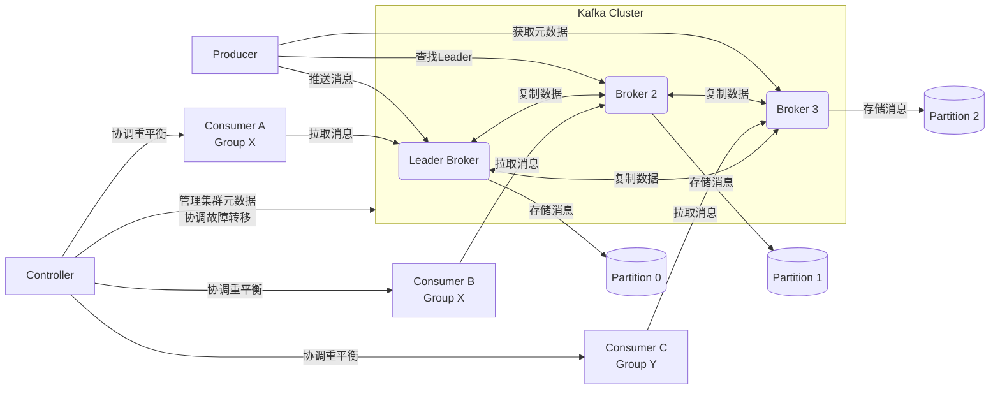
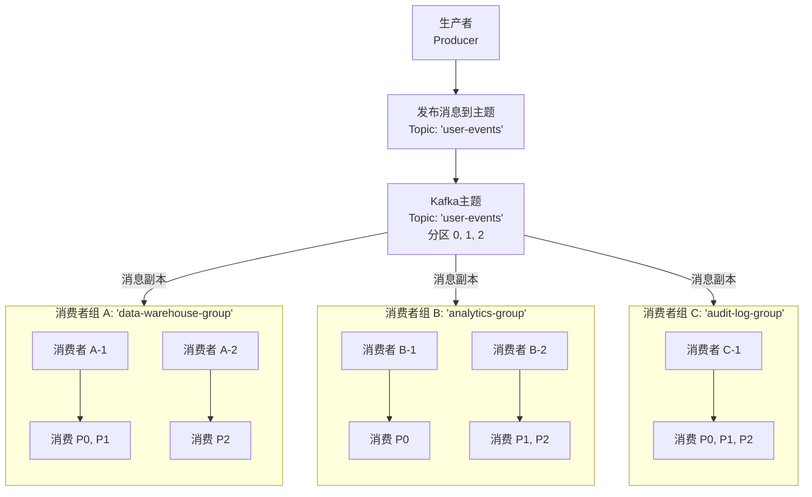

好的，详解 Kafka 各个组件之间的运作流程是一个非常重要的话题。Kafka 的设计是一个精妙的分布式系统，其核心组件各司其职，协同工作以提供高吞吐、高可用的消息服务。

我们将从**核心组件解析**和**数据流运作流程**两个方面来深入讲解。

---

### 第一部分：核心组件解析

#### 1. Producer（生产者）
*   **职责**：创建并向 Kafka Topic 推送消息的客户端应用程序。
*   **关键行为**：
    *   **序列化**：将消息的 Key 和 Value 转换为字节数组。
    *   **分区选择**：确定消息应该发送到 Topic 的哪个分区。规则可以是：
        *   指定 `Partition`（直接指定）。
        *   指定 `Key`：相同 Key 的消息总是去往同一分区（保证顺序性）。
        *   轮询（Round-robin）或粘性分区策略（默认，为提升性能）。

#### 2. Topic（主题） & Partition（分区）
*   **Topic**：消息的类别或主题，是逻辑上的概念。生产者向特定 Topic 发送消息，消费者从特定 Topic 读取消息。
*   **Partition**：**Topic 的物理分片**。一个 Topic 可以被分为多个 Partition，分布在不同 Broker 上。
    *   每个 Partition 是一个**有序、不可变**的消息序列。
    *   消息在 Partition 内被分配一个唯一的、递增的序列号，称为 **Offset（偏移量）**。
    *   **分区是实现 Kafka 高吞吐、水平扩展和并行处理的基石。**

#### 3. Broker（代理）
*   **职责**：一个独立的 Kafka 服务器节点。一个 Kafka 集群由多个 Broker 组成。
*   **关键行为**：
    *   接收生产者发送的消息。
    *   为消息分配 Offset。
    *   将消息持久化到磁盘。
    *   响应消费者（组）的拉取请求，提供服务。
    *   每个 Broker 托管某些 Topic 的某些 Partition。**一个 Partition 的多个副本会分散在不同的 Broker 上，以实现高可用。**

#### 4. Replica（副本）& Leader/Follower 模型
*   **Replica**：每个 Partition 的数据都会被复制到多个 Broker 上，形成多个副本。这提供了数据冗余和故障转移能力。
*   **Leader Replica**：每个 Partition 都有一个 Leader 副本。**所有生产者的写入和消费者的读取都必须与 Leader 副本交互。**
*   **Follower Replica**：其他副本都是 Follower。它们的工作就是**不断地从 Leader 副本异步拉取数据，保持与 Leader 的同步**。
*   **ISR（In-Sync Replica Set，同步副本集合）**：所有与 Leader 保持同步（延迟在一定阈值内）的副本（包括 Leader 自己）组成的集合。只有 ISR 中的副本才有资格在 Leader 宕机时被选举为新的 Leader。

#### 5. Consumer（消费者） & Consumer Group（消费者组）
*   **Consumer**：从 Topic 拉取消息并进行处理的客户端应用程序。
*   **Consumer Group**：**实现并行消费和水平扩展的核心机制**。
    *   一个 Group 由多个 Consumer 实例组成。
    *   **规则**：一个 Partition **只能被同一个 Group 内的一个 Consumer** 消费；但**一个 Consumer 可以消费多个 Partition**。
    *   不同 Group 之间的消费行为**完全独立**（发布-订阅模式）。

#### 6. ZooKeeper / KRaft (Controller)
*   **Kafka 的“元大脑”**（在旧版中由 ZooKeeper 担任，新版正逐步迁移到 KRaft 模式）。
*   **管理元数据**：负责管理和管理集群的元数据，例如：
    *   Broker 节点的注册和健康状态。
    *   Topic 的配置以及其 Partition 和 Replica 的分配信息。
    *   选举 Partition 的 **Leader** 和监控 **ISR** 的变化。
    *   触发**消费者组的重平衡（Rebalance）**。

---

### 第二部分：核心运作流程

为了更直观地理解上述组件如何协同工作，我们可以通过以下流程图来俯瞰整个数据生命周期的核心路径：

#### 流程 1: 消息发布 (Write)
1.  **Producer** 连接到任意一个 Broker（通过 `bootstrap.servers` 获取集群元数据），找到目标 Topic Partition 的 **Leader Broker**。
2.  **Producer** 将消息发送给该 Leader Broker。
3.  **Leader** 将消息**持久化**到本地磁盘的日志文件中。
4.  **Leader** 等待其所有 **ISR 中的 Follower** 副本都成功拉取并复制了这条消息（可配置的ACK机制）。
5.  一旦复制成功，**Leader** 向 **Producer** 发送一个成功确认（Acknowledgment）。
6.  此时，消息才被视为“已提交”（Committed），消费者才能看到它。

#### 流程 2: 消息消费 (Read)
1.  **Consumer** 启动，使用 `group.id` 标识自己属于哪个消费者组，并连接到 Broker。
2.  消费者组会触发一个 **重平衡（Rebalance）** 过程，由 Group Coordinator（一个特殊的Broker）协调，将 Topic 的 Partition **公平地分配**给组内的各个 Consumer。
3.  **Consumer** 向其分配到的每个 Partition 的 **Leader Broker** 发送**拉取请求（Fetch Request）**。
4.  **Broker** 响应请求，将一批消息（从指定的 Offset 开始）发送给 Consumer。
5.  **Consumer** 处理消息。处理完成后，它可以选择**自动或手动**地将当前消费到的 Offset 提交到 Kafka 的一个内部 Topic（`__consumer_offsets`）中。这样即使消费者重启，也知道从哪里继续消费。

#### 流程 3: 故障容错 (Failover)
**场景：某个 Broker（假设是 Broker 1，它是某个 Partition 的 Leader）宕机了。**
1.  **Controller**（通过 ZooKeeper 或 KRaft 共识机制）检测到 Broker 1 失联。
2.  **Controller** 从该 Partition 的 **ISR 列表**中，为每个受影响的 Partition **选举一个新的 Leader**（例如，选择原本在 Broker 2 上的 Follower 副本）。
3.  **Controller** 将新的元数据（哪个 Broker 是新的 Leader）广播给所有存活的 Broker。
4.  **Producer** 和 **Consumer** 客户端会从 Broker 获取到最新的元数据，并自动将后续的请求路由到新的 Leader（Broker 2）。
5.  整个故障转移过程对应用程序是**透明**的，无需人工干预。当宕机的 Broker 恢复后，它会作为 Follower 重新加入 ISR，并从新的 Leader 那里同步数据。

---

### 总结：组件协同全景图

**Producer** 是数据的源头，**Broker** 集群是数据的“中枢神经系统”，负责接收、存储和分发数据，而 **Consumer** 是数据的最终目的地。**Controller** 则是整个集群的“大脑”，负责指挥和协调所有动作，确保整个系统高效、稳定地运行。而 **Topic** 和 **Partition** 是数据组织的逻辑和物理形式，**Replica** 和 **Consumer Group** 则是实现高可用和高并发的核心机制。

**当多个消费者组订阅了同一个主题（Topic）时，每个消费者组都会收到该主题下所有消息的完整副本，并且可以独立、互不干扰地进行消费。**

这正是Kafka实现“发布-订阅”模式（Pub-Sub）的基石，也是它和传统消息队列（如RabbitMQ，一个消息只能被一个消费者取走）的关键区别。

---

### 核心概念：消费者组（Consumer Group）的隔离性

Kafka的消息传递语义是基于**消费者组**来定义的。你可以把每个消费者组看作一个独立的“订阅者”。

*   **组内竞争（Queue模式）**：在**同一个消费者组内**的多个消费者实例，它们共同消费一个Topic。每条消息只会被组内的**某一个**消费者实例消费。这是为了在组内实现并行处理和负载均衡。
*   **组间广播（Pub-Sub模式）**：**不同的消费者组**之间是完全隔离的。每个组都被视为一个独立的、完整的订阅者。一条消息发布后，它会被**每一个**订阅了该Topic的消费者组消费一次。

### 工作原理示意图

下图直观展示了不同消费者组如何同时消费同一条消息，以及组内如何分配分区：

如上图所示，生产者发布一条消息到 `user-events` 主题。这条消息会存在于主题的某个分区中（比如 P1）。随后：

1.  **消费者组 A** 中的某个消费者（例如 A-1）会从分区 P1 拉取到这条消息，用于数据仓库ETL。
2.  **消费者组 B** 中的某个消费者（例如 B-2）**同样**会从分区 P1 拉取到**同一条消息**，用于实时分析。
3.  **消费者组 C** 中的消费者 C-1 也会消费到这条消息，用于审计日志记录。

**这三个消费者组之间的消费行为是完全独立的。** 它们有各自的偏移量（Offset）管理，互不影响。一个组的失败或延迟不会影响另一个组。

---

### 为什么要这样设计？典型应用场景

这种“一对多”的广播能力非常强大，是构建解耦、可扩展系统的关键。

1.  **数据复用（Data Replication）**：这是最核心的用途。一份数据可以被多个不同的下游系统使用，而无需生产者发送多次。
    *   **场景**：一个用户下单行为消息，可以被：
        *   **推荐系统**消费，用于实时更新用户画像。
        *   **库存系统**消费，用于扣减库存。
        *   **数据分析系统**消费，用于计算实时销售额。
        *   **日志审计系统**消费，用于永久存档。

2.  **环境隔离（Environment Isolation）**
    *   **场景**：同一个Topic，可以被`dev-group`（开发测试组）、`staging-group`（预发布组）和`prod-group`（生产组）同时消费，用于在不同环境中测试和验证数据流。

3.  **不同处理逻辑的隔离（Different Processing Logic）**
    *   **场景**：对于同一批用户活动事件，`group-a`可能负责计算简单的计数统计（如PV/UV），而`group-b`则负责运行复杂的机器学习模型进行实时预测。它们可以用不同的代码和逻辑处理同样的消息。

---

### 重要注意事项

1.  **性能与资源**：虽然多个组消费同一主题在逻辑上是隔离的，但在物理上，每个组都需要从Kafka Broker拉取完整的消息流。这会增加Broker的网络出口流量（egress traffic）和负载。你需要确保Broker和网络有足够的容量。
2.  **偏移量（Offset）是按组管理的**：每个消费者组对自己消费到每个分区的哪个位置（Offset）进行独立提交和记录。这意味着一个消费者组可以随时重置自己的偏移量（例如从头开始消费）而完全不影响其他组。
3.  **消息保留策略（Retention Policy）**：消息能被多个组消费的前提是，消息还在Kafka的日志保留期限内（例如保存了7天）。如果一个消费者组宕机了一周，它回来后就无法消费一周前的消息了（除非配置了`retention.ms=-1`永久保存）。消费速度慢的组需要监控延迟，确保不会因为落后太多而丢失数据。

### 总结

**任何时候，只要你希望同一份数据被多个独立的、互不干扰的应用程序或服务进行处理时，就应该为每个应用程序创建一个独立的消费者组，让它们同时订阅和消费同一个Topic。**

这是Kafka解耦生产者和消费者、实现数据管道复用的核心设计模式。
