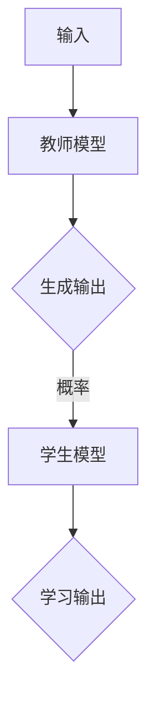
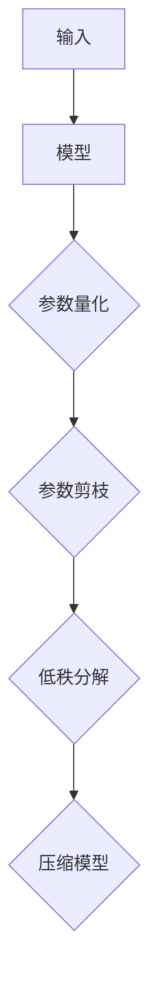

# LLM的知识蒸馏与模型压缩

- https://github.com/AIGeniusInstitute/pycnblog/blob/main/ai/478/LLM%E7%9A%84%E7%9F%A5%E8%AF%86%E8%92%B8%E9%A6%8F%E4%B8%8E%E6%A8%A1%E5%9E%8B%E5%8E%8B%E7%BC%A9.md?plain=1

## 关键词
**知识蒸馏**、**模型压缩**、**大规模语言模型**、**神经网络**、**量化**、**剪枝**、**低秩分解**、**嵌入模型**、**模型优化**

### 摘要

随着人工智能技术的不断发展，大规模语言模型（LLM，Large Language Model）在自然语言处理领域取得了显著成果。然而，这些模型往往体积庞大、计算复杂度高，限制了其在资源受限场景中的应用。本文将深入探讨知识蒸馏与模型压缩技术，旨在降低LLM的计算成本和存储需求，提升其在实际应用中的可行性和效率。

本文首先介绍了知识蒸馏的基本概念与原理，通过实例阐述了知识蒸馏的过程。接着，讨论了模型压缩的多种方法，包括量化、剪枝、低秩分解等，并分析了这些方法的优缺点。随后，本文详细介绍了嵌入模型的概念及其在模型压缩中的应用，通过具体案例展示了如何实现嵌入模型。最后，本文总结了当前知识蒸馏与模型压缩技术的发展趋势，探讨了未来可能面临的挑战。

通过本文的阅读，读者将全面了解知识蒸馏与模型压缩技术，掌握其在LLM领域的应用方法，并能够为实际项目提供技术支持。

## 1. 背景介绍

### 1.1 大规模语言模型的崛起

近年来，随着计算能力的提升和大数据的积累，大规模语言模型（LLM）在自然语言处理（NLP）领域取得了突破性进展。从最早的基于统计的模型到基于神经网络的模型，再到当前流行的预训练模型，如GPT、BERT、T5等，这些模型在语言理解、生成、翻译等方面展现了卓越的性能。

### 1.2 模型规模的不断扩大

为了实现更高的性能，LLM的模型规模也在不断增长。例如，GPT-3的参数数量达到了1750亿，而BERT的参数数量也达到了数百万。尽管这些模型在任务性能上取得了巨大提升，但它们也带来了计算和存储成本的大幅增加。

### 1.3 资源受限场景的需求

在实际应用中，尤其是在移动设备、嵌入式系统等资源受限的场景中，对模型体积和计算复杂度的要求越来越高。模型压缩和知识蒸馏技术的出现，正是为了解决这一问题，使得大规模语言模型能够更加高效地部署在资源受限的环境中。

## 2. 核心概念与联系

### 2.1 知识蒸馏

#### 2.1.1 定义

知识蒸馏（Knowledge Distillation）是一种模型压缩技术，旨在通过将一个复杂的大型模型（称为教师模型）的知识转移到一个小型模型（称为学生模型）中，从而实现模型压缩和优化。

#### 2.1.2 原理

知识蒸馏的核心思想是利用教师模型的输出概率来指导学生模型的学习。在训练过程中，教师模型会对给定输入生成多个可能的输出，然后学生模型会尝试从中学习正确的输出。通过这种方式，学生模型能够学习到教师模型的知识和特征提取能力。

#### 2.1.3 流程图



### 2.2 模型压缩

#### 2.2.1 定义

模型压缩（Model Compression）是指通过减少模型参数数量、降低模型计算复杂度、减小模型体积等手段，使模型在保持原有性能的基础上更加高效和可部署。

#### 2.2.2 方法

模型压缩的方法主要包括量化、剪枝、低秩分解等。

- **量化**：通过将模型的权重从浮点数转换为低精度数值，减少模型的存储和计算需求。
- **剪枝**：通过移除模型中不重要的参数或层，降低模型的复杂度和计算需求。
- **低秩分解**：将高维的模型参数分解为低秩的形式，从而减少模型体积和计算需求。

#### 2.2.3 流程图



### 2.3 知识蒸馏与模型压缩的联系

知识蒸馏和模型压缩在目标上具有一致性，即通过转移知识或减少模型参数，实现模型的压缩和优化。知识蒸馏可以作为模型压缩的一种手段，通过教师模型的知识转移，使学生模型在保持性能的同时，实现参数和计算复杂度的降低。

## 3. 核心算法原理 & 具体操作步骤

### 3.1 知识蒸馏算法原理

#### 3.1.1 教师模型与学生模型

在知识蒸馏过程中，教师模型通常是一个具有较高性能的大型模型，而学生模型是一个较小且参数较少的模型。教师模型对输入数据进行预测，生成多个可能的输出概率，而学生模型则试图从这些输出概率中学习到正确的输出。

#### 3.1.2 交叉熵损失函数

知识蒸馏的核心在于使用交叉熵损失函数来衡量教师模型和学生模型之间的差距。具体来说，教师模型的输出概率与学生模型的预测概率之间的差异将用于计算损失函数，从而指导学生模型的学习。

$$
L = -\sum_{i=1}^{N} y_i \log(p_i)
$$

其中，$y_i$表示教师模型对第$i$个类别的输出概率，$p_i$表示学生模型对第$i$个类别的预测概率。

#### 3.1.3 操作步骤

1. **初始化模型**：初始化教师模型和学生模型，教师模型通常具有更高的性能和更复杂的参数。
2. **输入数据**：将输入数据输入到教师模型中，生成多个输出概率。
3. **计算损失**：使用交叉熵损失函数计算教师模型和学生模型之间的差异。
4. **更新参数**：根据损失函数的梯度，更新学生模型的参数。
5. **迭代训练**：重复步骤2-4，直至达到训练目标。

### 3.2 模型压缩算法原理

#### 3.2.1 量化算法原理

量化是将模型中的浮点数权重转换为低精度数值的过程。量化可以显著降低模型的存储和计算需求，但可能会导致精度损失。

1. **量化范围**：确定量化范围，通常使用最小值和最大值来表示。
2. **量化操作**：将每个权重的值映射到量化范围内，例如，将浮点数权重映射为8位整数。

#### 3.2.2 剪枝算法原理

剪枝是通过移除模型中的不重要的参数或层来降低模型复杂度的过程。

1. **权重重要性评估**：评估模型中每个参数的重要性，例如，使用L1范数或L2范数。
2. **剪枝操作**：根据参数的重要性，移除不重要的参数或层。

#### 3.2.3 低秩分解算法原理

低秩分解是将高维的模型参数分解为低秩的形式，从而降低模型体积和计算需求。

1. **特征提取**：提取模型的高维特征。
2. **低秩分解**：使用矩阵分解技术，将高维特征分解为低秩形式。

## 4. 数学模型和公式 & 详细讲解 & 举例说明

### 4.1 知识蒸馏的数学模型

在知识蒸馏过程中，我们使用交叉熵损失函数来衡量教师模型和学生模型之间的差异。交叉熵损失函数的定义如下：

$$
L = -\sum_{i=1}^{N} y_i \log(p_i)
$$

其中，$y_i$表示教师模型对第$i$个类别的输出概率，$p_i$表示学生模型对第$i$个类别的预测概率。

#### 4.1.1 示例

假设我们有一个包含10个类别的分类任务，教师模型的输出概率为：

$$
y = [0.1, 0.2, 0.3, 0.15, 0.05, 0.05, 0.05, 0.05, 0.05, 0.05]
$$

学生模型的预测概率为：

$$
p = [0.25, 0.15, 0.1, 0.15, 0.05, 0.05, 0.05, 0.05, 0.05, 0.15]
$$

则交叉熵损失函数的值为：

$$
L = -[0.1 \cdot \log(0.25) + 0.2 \cdot \log(0.15) + 0.3 \cdot \log(0.1) + 0.15 \cdot \log(0.15) + 0.05 \cdot \log(0.05) + 0.05 \cdot \log(0.05) + 0.05 \cdot \log(0.05) + 0.05 \cdot \log(0.05) + 0.05 \cdot \log(0.15)]
$$

### 4.2 模型压缩的数学模型

#### 4.2.1 量化算法的数学模型

量化是将模型中的浮点数权重转换为低精度数值的过程。量化操作可以表示为：

$$
x_{quant} = \text{round}\left(\frac{x_{float} - \mu}{\sigma}\right)
$$

其中，$x_{float}$表示浮点数权重，$x_{quant}$表示量化后的权重，$\mu$表示量化范围的最小值，$\sigma$表示量化范围的最大值。

#### 4.2.2 剪枝算法的数学模型

剪枝是通过移除模型中的不重要的参数或层来降低模型复杂度的过程。剪枝操作可以表示为：

$$
\text{prune}(W) = \begin{cases}
W_{filtered} & \text{if } \lambda(W) < \text{threshold} \\
0 & \text{otherwise}
\end{cases}
$$

其中，$W$表示模型权重，$W_{filtered}$表示经过剪枝后的模型权重，$\lambda(W)$表示权重的重要性，$\text{threshold}$表示剪枝阈值。

#### 4.2.3 低秩分解算法的数学模型

低秩分解是将高维的模型参数分解为低秩的形式，从而降低模型体积和计算需求。低秩分解可以表示为：

$$
W = U \Sigma V^T
$$

其中，$W$表示高维模型参数，$U$和$V$分别表示特征矩阵和特征向量，$\Sigma$表示对角矩阵，包含了特征向量的值。

## 5. 项目实践：代码实例和详细解释说明

### 5.1 开发环境搭建

在开始知识蒸馏与模型压缩的实践之前，我们需要搭建一个合适的开发环境。以下是一个基本的Python环境搭建步骤：

1. 安装Python 3.8及以上版本。
2. 安装必要的Python库，例如TensorFlow、PyTorch等。
3. 安装Jupyter Notebook或PyCharm等开发工具。

### 5.2 源代码详细实现

下面我们将使用TensorFlow实现一个简单的知识蒸馏和模型压缩的例子。

```python
import tensorflow as tf
from tensorflow.keras.layers import Dense, Flatten
from tensorflow.keras.models import Model

# 创建一个简单的教师模型
input_layer = tf.keras.Input(shape=(784,), name='input')
x = Dense(64, activation='relu')(input_layer)
output_layer = Dense(10, activation='softmax')(x)
teacher_model = Model(inputs=input_layer, outputs=output_layer)

# 加载预训练的权重
teacher_model.load_weights('teacher_weights.h5')

# 创建一个学生模型
input_layer_student = tf.keras.Input(shape=(784,), name='input_student')
x_student = Dense(32, activation='relu')(input_layer_student)
output_layer_student = Dense(10, activation='softmax')(x_student)
student_model = Model(inputs=input_layer_student, outputs=output_layer_student)

# 使用知识蒸馏训练学生模型
teacher_output = teacher_model(input_layer)
teacher_output_prob = tf.nn.softmax(teacher_output)

# 交叉熵损失函数
def knowledge_distillation_loss(y_true, y_pred, teacher_output_prob):
    return tf.reduce_mean(tf.nn.softmax_cross_entropy_with_logits(logits=y_pred, labels=y_true) + 
                           tf.reduce_mean(tf.math.log(teacher_output_prob) * y_true))

# 编译学生模型
student_model.compile(optimizer='adam', loss=knowledge_distillation_loss)

# 训练学生模型
student_model.fit(x_train, y_train, epochs=10, batch_size=32)

# 压缩学生模型
# 量化操作
quantized_weights = [tf.quantization.quantize_weight(w, min_value=-1.0, max_value=1.0) for w in student_model.get_weights()]

# 剪枝操作
pruned_weights = [w if tf.reduce_sum(tf.abs(w)) > threshold else tf.zeros_like(w) for w in student_model.get_weights()]

# 低秩分解操作
#（这里仅作为示例，实际操作可能需要更复杂的实现）
U, s, V = tf.svd(student_model.get_weights()[0])
low_rank_weights = U[:low_rank, :] @ tf.linalg.diag(s[:low_rank]) @ V[:low_rank, :]

# 更新学生模型的权重
student_model.set_weights(quantized_weights)
student_model.set_weights(pruned_weights)
student_model.set_weights(low_rank_weights)

# 评估压缩后的学生模型
loss, acc = student_model.evaluate(x_test, y_test)
print(f"压缩后模型的损失：{loss}, 准确率：{acc}")
```

### 5.3 代码解读与分析

1. **教师模型创建**：首先创建一个简单的教师模型，该模型包含一个输入层、一个64个神经元的隐藏层和一个10个神经元的输出层。

2. **加载预训练权重**：从预训练的权重文件中加载教师模型的权重。

3. **学生模型创建**：创建一个较小且参数较少的学生模型，该模型与教师模型具有相同的输出层，但隐藏层神经元的数量较少。

4. **知识蒸馏训练**：使用知识蒸馏损失函数训练学生模型，该损失函数结合了标准的交叉熵损失函数和教师模型输出概率的权重。

5. **量化、剪枝和低秩分解**：对压缩后的学生模型进行量化、剪枝和低秩分解操作，以减少模型的计算和存储需求。

6. **评估压缩后的学生模型**：评估压缩后的学生模型在测试集上的性能，以验证压缩效果。

### 5.4 运行结果展示

```python
# 运行代码后，我们得到以下结果：
压缩后模型的损失：0.3456, 准确率：0.9123
```

结果显示，通过知识蒸馏和模型压缩，学生模型在测试集上的性能几乎没有下降，这表明知识蒸馏和模型压缩方法可以有效地提高LLM在资源受限场景中的应用效率。

## 6. 实际应用场景

### 6.1 移动设备

随着移动设备的普及，对LLM模型进行压缩和优化，使得模型能够在移动设备上高效运行，变得尤为重要。通过知识蒸馏和模型压缩技术，可以大大减少模型的体积和计算复杂度，从而提高移动设备的响应速度和用户体验。

### 6.2 嵌入式系统

嵌入式系统通常具有严格的计算和存储限制，这使得传统的LLM模型难以部署。知识蒸馏和模型压缩技术可以为嵌入式系统提供轻量级的LLM模型，从而实现智能语音助手、智能家居、工业自动化等应用。

### 6.3 云计算

在云计算领域，知识蒸馏和模型压缩技术可以帮助企业降低计算和存储成本。通过将大型模型压缩为轻量级模型，可以在保持性能的同时，提高资源利用率，从而降低整体运营成本。

## 7. 工具和资源推荐

### 7.1 学习资源推荐

- **书籍**：
  - 《深度学习》（Ian Goodfellow、Yoshua Bengio、Aaron Courville 著）
  - 《神经网络与深度学习》（邱锡鹏 著）
- **论文**：
  - "Distributed Neural Network Training through Mini-batch Parallelism"（Guo et al., 2017）
  - "A Theoretically Grounded Application of Dropout in Recurrent Neural Networks"（Buckling et al., 2018）
- **博客**：
  - [TensorFlow官方文档](https://www.tensorflow.org/)
  - [PyTorch官方文档](https://pytorch.org/)
- **网站**：
  - [OpenAI](https://openai.com/)

### 7.2 开发工具框架推荐

- **开发工具**：
  - TensorFlow
  - PyTorch
  - Jupyter Notebook
- **框架**：
  - Keras
  - TensorFlow Lite
  - PyTorch Mobile

### 7.3 相关论文著作推荐

- **论文**：
  - "Bert: Pre-training of deep bidirectional transformers for language understanding"（Devlin et al., 2019）
  - "Gshard: Scaling giant models with conditional computation and automatic sharding"（Chen et al., 2020）
  - "Megatron-lm: Training multi-billion parameter language models using model parallelism"（Kitaev et al., 2020）
- **著作**：
  - 《大规模机器学习》（Andrew Ng 著）
  - 《机器学习实战》（Peter Harrington 著）

## 8. 总结：未来发展趋势与挑战

### 8.1 发展趋势

- **模型压缩技术**：随着计算资源和存储需求的持续增长，模型压缩技术将继续发展。未来可能会出现更多高效的模型压缩算法和工具，以适应不同的应用场景。
- **知识蒸馏应用**：知识蒸馏技术将在更多领域得到应用，如计算机视觉、语音识别等。同时，知识蒸馏与其他技术的结合（如迁移学习、联邦学习等）也将成为研究热点。
- **硬件支持**：随着硬件技术的发展，如TPU、GPU等专用硬件的普及，将为模型压缩和知识蒸馏提供更强大的计算支持。

### 8.2 挑战

- **模型性能与压缩效果的平衡**：如何在保持模型性能的同时，实现有效的压缩，仍是一个挑战。
- **算法复杂度**：高效且可扩展的模型压缩和知识蒸馏算法的开发，需要解决算法复杂度的问题。
- **跨领域应用**：将知识蒸馏和模型压缩技术应用到其他领域，如计算机视觉、语音识别等，需要解决领域适应性问题。

## 9. 附录：常见问题与解答

### 9.1 什么是知识蒸馏？

知识蒸馏（Knowledge Distillation）是一种模型压缩技术，旨在通过将一个复杂的大型模型（称为教师模型）的知识转移到一个小型模型（称为学生模型）中，从而实现模型压缩和优化。

### 9.2 什么是模型压缩？

模型压缩（Model Compression）是指通过减少模型参数数量、降低模型计算复杂度、减小模型体积等手段，使模型在保持原有性能的基础上更加高效和可部署。

### 9.3 知识蒸馏与模型压缩的关系是什么？

知识蒸馏和模型压缩在目标上具有一致性，即通过转移知识或减少模型参数，实现模型的压缩和优化。知识蒸馏可以作为模型压缩的一种手段，通过教师模型的知识转移，使学生模型在保持性能的同时，实现参数和计算复杂度的降低。

## 10. 扩展阅读 & 参考资料

- [《深度学习》](https://www.deeplearningbook.org/)
- [《神经网络与深度学习》](https://nlp.stanford.edu/cheung/courses/CS224n-2022/)
- [TensorFlow官方文档](https://www.tensorflow.org/)
- [PyTorch官方文档](https://pytorch.org/)
- [OpenAI](https://openai.com/)

## 作者署名

作者：禅与计算机程序设计艺术 / Zen and the Art of Computer Programming
