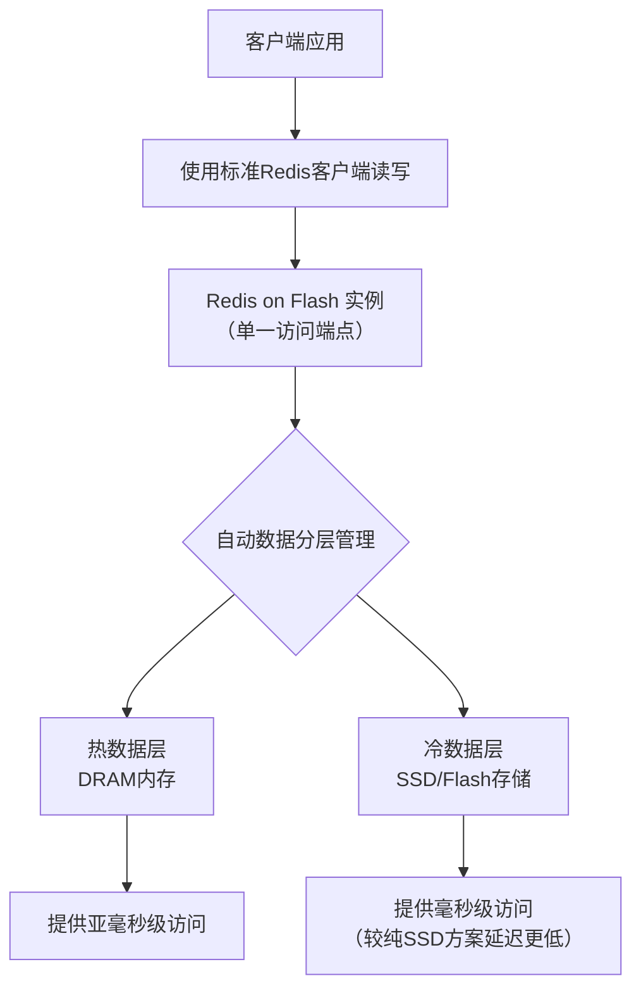

# Redis on Flash

**Redis on Flash = Redis协议兼容 + 热点数据在内存 + 全量数据在SSD**。

### ⚙️ 核心工作原理与优势

它的核心思想是**智能分层**：通过算法自动识别高频访问的“热”数据放在内存，而将低频访问的“冷”数据透明地移至SSD，对客户端保持单一的Redis访问接口。

这种设计带来了两大核心优势：
1.  **显著降低成本**：内存只存放最热的数据（例如总数据量的5%-20%），SSD存放全量数据，总拥有成本远低于纯内存方案。
2.  **保持低延迟与高吞吐**：对热数据的访问依然是内存速度，对冷数据的访问经过深度优化，延迟仍远低于直接读传统数据库。

### 🔄 技术实现：主流方案对比
目前主要有两种技术路径，以下是它们的对比：

| 特性 | **KeyDB / Dragonfly（多线程衍生版）** | **阿里云 Tair（Redis企业版）** |
| :--- | :--- | :--- |
| **实现方式** | Redis衍生版，通过**多线程**充分利用CPU，并可配置**混合存储**。 | 阿里云自研，基于Redis协议，使用**硬件加速和自研引擎**实现分层。 |
| **部署** | 可**自行部署**在自有服务器或云主机上，灵活性高。 | **阿里云全托管服务**，开箱即用，运维简单。 |
| **核心优势** | 性能强，**成本控制灵活**，社区活跃。 | 性能极强（宣称比原生快3倍），**延迟更低更稳定**，功能丰富（如数据持久化模型更优）。 |
| **适用场景** | 追求性价比、有自运维能力、需要深度定制的场景。 | 追求极致性能与稳定性、希望最小化运维投入的生产场景。 |

### 💰 成本效益分析：与传统方案对比
让我们量化对比一下，对于你“100GB数据，10000 QPS”的需求，不同方案的成本差异：

| 方案 | 核心资源需求 | 预估成本/年 (以主流云服务估算) | 优点 | 缺点 |
| :--- | :--- | :--- | :--- | :--- |
| **纯内存Redis** | 约 120GB+ 内存 | **高 (约 $5,000+/月)** | 性能极致，延迟最低 | 成本极高 |
| **RocksDB自研缓存** | 约 5-10GB 内存 + 100GB SSD | **低 (约 $200-$500/月)** | 成本最低 | 开发运维复杂，P99延迟较高 |
| **Redis on Flash** | 约 **10-20GB 内存** + 100GB SSD | **中 (约 $800-$2,000/月)** | **成本与性能的平衡点**，透明自动分层，运维简单 | 冷数据访问延迟高于纯内存 |
