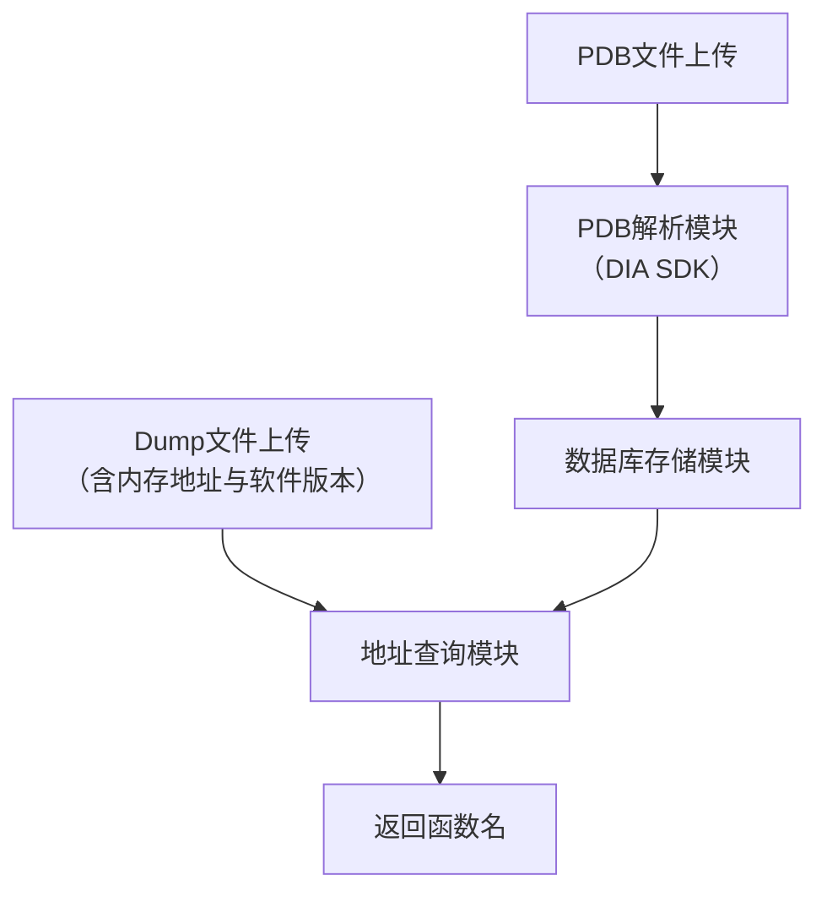

- https://github.com/mozilla/dump_syms
- llvm-pdbutil
- https://github.com/mstange/pdb-addr2line
- windbg
- minidump-stackwalk
- https://github.com/tdeva14/minidump-stackwalk-lite
- https://github.com/ccjuuc/minidump-stackwalk-viewer
- https://github.com/rust-minidump/rust-minidump

## **从“内存地址”到“函数名”的快速索引**

可以通过两种主流的技术路径：

1.  **使用微软官方API**：稳定性好，与Windows系统兼容性最佳，是首选方案。
2.  **解析PDB文件格式**：更灵活，但PDB格式复杂且未公开文档，开发和维护成本高。

下面将以**微软DIA SDK**为核心，为你设计一个完整的系统方案。

---

### 🏗️ 系统架构设计

系统可以分为三个核心模块，协同完成从PDB解析到地址查询的完整流程：

### 🔧 模块一：PDB解析模块

这是系统的核心，负责从PDB文件中提取关键信息。

*   **技术选型**：使用微软的 **DIA SDK**。它是一套COM接口，能稳定、高效地读取PDB文件。DIA SDK通常随Visual Studio一起安装。

*   **工作流程**：
    1.  **初始化**：初始化COM库 (`CoInitialize`)。
    2.  **加载PDB**：创建 `IDiaDataSource` 对象，并调用 `loadDataFromPdb` 加载指定的PDB文件。
    3.  **打开会话**：通过 `IDiaDataSource::openSession` 创建一个查询会话 (`IDiaSession`)。
    4.  **获取符号**：从会话中获取全局符号范围 (`IDiaSymbol`)。
    5.  **遍历函数**：使用 `IDiaSymbol::findChildren` 查找所有 `SymTagFunction` 类型的符号，遍历得到每个函数的`IDiaSymbol`。
    6.  **提取信息**：对每个函数符号，调用以下方法获取信息：
        *   `get_name`：获取函数名。
        *   `get_relativeVirtualAddress` (RVA)：获取相对虚拟地址。
        *   `get_virtualAddress` (VA)：获取绝对虚拟地址。
    7.  **数据整理**：将提取的 `(RVA/VA, 函数名)` 数据对整理好，准备存入数据库。

### 💾 模块二：数据库存储模块

设计合理的数据库结构是快速查询的基础。

*   **数据模型设计（以MySQL为例）**：

    *   **表1：`modules` (模块信息表)**
        *   `id`: 主键
        *   `name`: 模块名 (如 `MyApp.exe`)
        *   `pdb_guid`: PDB文件的GUID，用于精确匹配
        *   `pdb_age`: PDB文件的Age计数器
        *   `version`: 软件版本号 (便于按版本查询)
        *   `created_at`: 入库时间

    *   **表2：`symbols` (符号表)**
        *   `id`: 主键
        *   `module_id`: 外键，关联到 `modules` 表
        *   `rva`: 函数入口点的相对虚拟地址 (RVA)
        *   `va`: 函数入口点的绝对虚拟地址 (VA)
        *   `name`: 函数名
        *   `size`: 函数大小 (可选)
        *   `index`: 索引优化查询

*   **关键设计决策**：
    *   **存储RVA或VA**：推荐存储 **RVA**，因为它与模块加载基址无关，是函数的“固定身份”。查询时，用 `dump地址 - 模块基址` 得到RVA再进行匹配。
    *   **版本管理**：通过 `(pdb_guid, pdb_age)` 实现PDB文件的精确匹配。这样，即使不同版本的代码相同，也能区分不同的编译产物。

### 🔍 模块三：地址查询模块

这是用户直接使用的部分，输入一个内存地址，快速返回对应的函数名。

1.  **接收输入**：接收 `dump文件中的内存地址` 和 `软件版本`。
2.  **定位模块**：根据 `软件版本` 在 `modules` 表中找到对应的 `module_id` 和 `基址`。
3.  **计算RVA**：`RVA = 内存地址 - 模块基址`。
4.  **数据库查询**：在 `symbols` 表中，用 `module_id` 和 `RVA` 进行精确或范围查询，找到对应的函数名。
5.  **返回结果**：将查询到的函数名返回给用户。

### 🛠️ 技术选型与实现建议

*   **编程语言**：**C++** 是与DIA SDK配合最自然的选择。也可以用Python通过 `comtypes` 等库调用DIA COM接口。
*   **数据库**：
    *   **关系型数据库**：如 **PostgreSQL** 或 **MySQL**，用于存储结构化数据，支持复杂查询。
    *   **嵌入式数据库**：如 **SQLite**，适合单机部署，简单轻量。
*   **关键API参考**：
    *   **DIA SDK**：`IDiaDataSource`, `IDiaSession`, `IDiaSymbol`。
    *   **DbgHelp API**：备选方案，使用 `SymFromAddr` 等函数。
*   **参考实现**：
    *   **DIA2Dump**：Visual Studio自带的DIA SDK示例，展示了完整用法。
    *   **pdb-addr2line**：一个Rust库，实现了从PDB解析地址的功能。

### 📈 扩展与优化

*   **支持内联函数**：PDB包含内联函数信息，解析时需一并提取并建立索引。
*   **构建符号服务器**：搭建内部符号服务器，统一存储和管理所有版本的PDB文件。
*   **优化查询性能**：在 `symbols` 表的 `(module_id, rva)` 上建立联合索引，可以极大地提升查询速度。
*   **支持源代码行号**：除了函数名，还可以从PDB中提取 **“地址到源代码行号”** 的映射，提供更丰富的调试信息。

---

### 💎 总结

设计这样一个系统的核心步骤是：

1.  **选型**：选用**DIA SDK**作为解析PDB的技术方案。
2.  **解析**：开发解析模块，遍历PDB提取所有函数的**(RVA, 函数名)**。
3.  **存储**：设计包含`modules`和`symbols`的数据库，将解析结果入库。
4.  **查询**：开发查询接口，根据**内存地址**和**软件版本**，通过计算RVA快速检索函数名。
5.  **优化**：根据实际需求，添加对**内联函数**、**源代码行号**的支持，并考虑搭建**符号服务器**。
