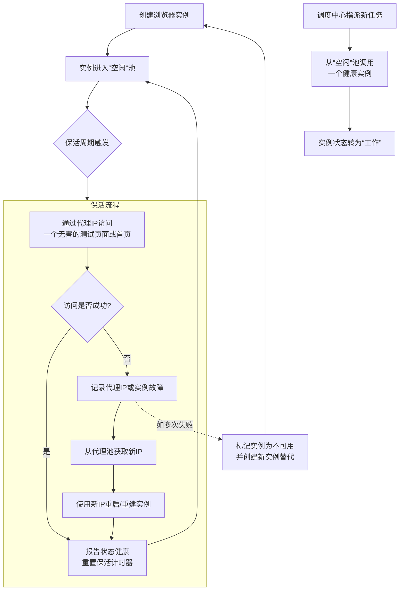
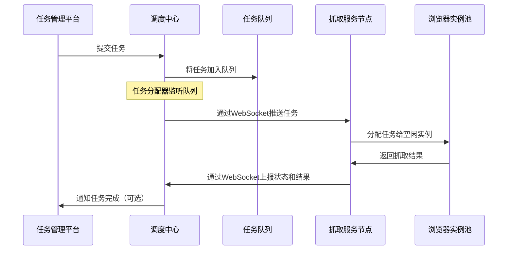
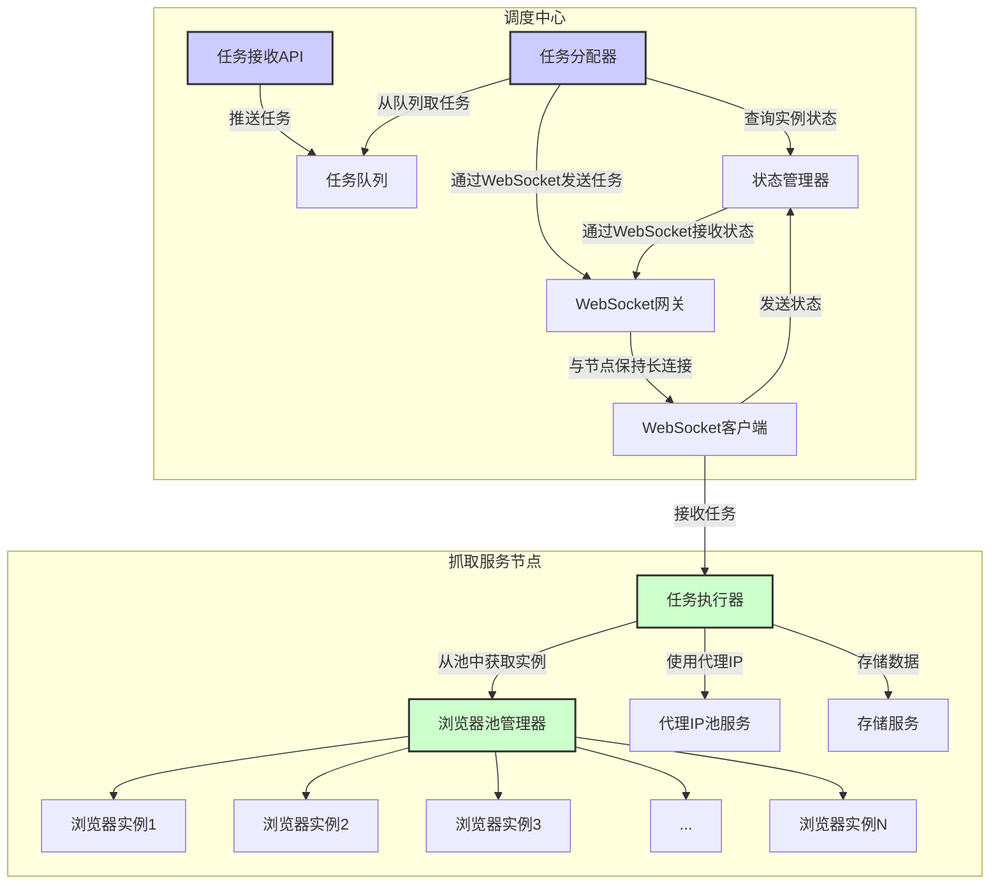

## 流程图

### “空闲实例保活”的闭环生命周期



1.  **状态维持与健康检查**：
    *   通过周期性地让空闲实例执行一个简单的访问任务（如访问测试页面），来模拟真实工作，防止浏览器因长时间无操作而卡死、崩溃或断开连接。
    *   这是一个主动的“心跳”检测，能实时掌握每个空闲实例的健康状况。

2.  **故障转移与自动恢复**：
    *   一旦保活流程失败，系统会立即判断是**代理IP问题**还是**浏览器实例本身问题**。
    *   它会自动尝试更换代理IP并重启实例，力求在原地恢复实例的健康状态。
    *   如果恢复失败，则会启动替代方案，废弃故障实例并创建一个新的来顶替，确保持终有足量的空闲实例备用。

3.  **就绪保证**：
    *   经过成功保活的实例，是一个“热待机”状态，其浏览器会话、Cookie上下文等都是活跃的。
    *   当调度中心有新任务时，可以**立即**将其投入工作，省去了冷启动、加载页面等时间，实现了任务的快速响应和无缝衔接。






### **分布式爬虫架构设计**

#### **一、架构核心目标**

1.  **高可用性**：无单点故障，任何组件宕机不影响整体服务。
2.  **高可伸缩性**：可轻松水平扩展抓取节点和调度器。
3.  **资源高效**：精确管理浏览器实例，平衡资源消耗与抓取效率。
4.  **维护性**：完善的监控、日志和故障自愈机制。
5.  **灵活性**：支持不同类型的抓取任务（如API、静态页面、复杂SPA），并易于配置。

#### **二、优化后的架构组件图**

```
+-----------------------------------------------------------------------+
|                           任务管理平台 (Web UI)                        |
+----------------------------+------------------------------------------+
                             | (提交任务、查看结果)
+----------------------------v------------------------------------------+
|                           调度中心 (Cluster)                           |
|  +-----------------------+  +-----------------------+                  |
|  |   任务调度器          |  |   状态管理器          |                  |
|  |   - 接收任务          |  |   - 节点状态维护      |                  |
|  |   - 任务队列管理      |  |   - 浏览器实例状态    |                  |
|  |   - 负载均衡          |  |   - 心跳检测          |                  |
|  +-----------------------+  +-----------------------+                  |
|  +---------------------------------------------------+                 |
|  |             消息总线 (Redis Pub/Sub 或 RabbitMQ)  |                 |
|  +---------------------------------------------------+                 |
+---------------------------------+-------------------+------------------+
                                  | (分发任务)        | (同步状态)
                                  |                   |
+---------------------------------v-------------------v------------------+
|                       抓取服务节点集群 (Multiple Servers)              |
|  +------------------------------------------------------------------+  |
|  |                        抓取服务节点 (Worker Node)                 |  |
|  |  +-----------------+  +---------------------+  +---------------+ |  |
|  |  |  连接管理器     |  |   浏览器池管理器    |  |  任务执行器   | |  |
|  |  | - WS连接调度中心|  | - 创建/销毁实例     |  | - 执行JS脚本  | |  |
|  |  | - 认证、重连    |  | - 健康检查 & 保活   |  | - 提取数据    | |  |
|  |  | - 发送心跳      |  | - 代理IP轮换        |  | - 错误处理    | |  |
|  |  +-----------------+  +---------------------+  +---------------+ |  |
|  |  +-------------------------------------------------------------+ |  |
|  |  |                   浏览器实例池 (3-6个实例)                   | |  |
|  |  |  [W1] [W2] [W3] [I1] [I2]  (W: Working, I: Idle)           | |  |
|  |  +-------------------------------------------------------------+ |  |
|  +------------------------------------------------------------------+  |
+------------------------------------------------------------------------+

+-----------------------------------------------------------------------+
|                           外部依赖                                    |
|  +-------------+  +------------------+  +--------------------------+  |
|  |   代理IP池   |  |   验证码服务     |  |       存储服务           |  |
|  |             |  |                 |  | (MySQL, MongoDB, S3)    |  |
|  +-------------+  +------------------+  +--------------------------+  |
+-----------------------------------------------------------------------+
```

---

#### **三、核心组件优化详解**

**1. 调度中心**

*   **职责分离**：
    *   **任务调度器**：
        *   接收来自Web UI或API的抓取任务。
        *   将任务推送到**分布式任务队列**（如Redis List或RabbitMQ），而不是直接通过WebSocket发送。这解耦了调度器与节点，并提供了更好的持久化和负载均衡能力。
        *   实现不同的调度策略（轮询、依据节点负载、优先分配等）。
    *   **状态管理器**：
        *   通过WebSocket与所有节点保持长连接，接收其心跳和状态信息（CPU、内存、每个浏览器实例的状态）。
        *   在内存或Redis中维护一个**实时状态表**，为任务调度器提供决策依据。
    *   **消息总线**：使用Redis Pub/Sub或RabbitMQ。任务队列用于分发任务，消息通道可用于广播控制命令（如“全局暂停”）。

**2. 抓取服务节点**

*   **连接管理器**：
    *   主动与调度中心的**状态管理器**建立WebSocket连接，并实现断线重连机制。
    *   定期向调度中心发送心跳包，内容包含：节点负载、浏览器池概况。
    *   接收来自调度中心的即时控制命令。

*   **浏览器池管理器** - **这是优化核心**：
    *   **精细化生命周期管理**：
        *   **预热**：节点启动时，立即创建规定数量的“空闲实例”并进行保活。
        *   **按需创建**：当工作实例不够时，从空闲池中取出实例转为工作状态。如果空闲池为空，且总实例数未达上限（如6个），则动态创建新实例。
        *   **智能销毁**：工作完成后，实例不会立即销毁，而是根据策略决定是放回空闲池还是销毁（例如，空闲实例超过2个时，销毁最旧的一个以释放资源）。
    *   **健康检查与保活**：
        *   对空闲实例定期执行一个简单的`page.goto('about:blank')`操作，防止因超时而断开。
        *   发现实例崩溃或无响应时，自动销毁并创建一个新的替补实例，并更新状态到调度中心。
    *   **代理IP集成**：
        *   从代理池获取IP时，**为每个浏览器实例独立配置**，而不是全局使用一个IP。
        *   在创建新的浏览器实例时，从代理池获取一个IP并绑定。
        *   可以实现**按任务切换IP**：任务执行器在运行任务前，可以根据任务要求让浏览器实例更换代理。

*   **任务执行器**：
    *   从**分布式任务队列**中拉取任务（Pull模型），而不是被动接收（Push模型）。这样节点可以根据自身负载控制任务获取速度，避免过载。
    *   从浏览器池中申请一个健康的实例来执行任务。
    *   包含完整的错误处理逻辑：网络错误、被反爬、验证码触发、代理失效等。遇到问题时，将任务重新放回队列（可能需要标记重试次数），并标记该浏览器实例/代理IP为可疑。

---

#### **四、关键工作流程优化**

**1. 任务分配流程**
1.  任务提交到`任务调度器`。
2.  `任务调度器`查询`状态管理器`，找到一个负载较低且有`空闲浏览器实例`的节点。
3.  `任务调度器`将任务推送到该节点专属的任务队列，或一个公共队列。
4.  目标节点的`任务执行器`从队列中拉取到该任务。
5.  节点申请一个浏览器实例，执行任务。
6.  任务完成后，结果上传到存储服务，节点向调度中心汇报“任务完成”和“实例空闲”。

**2. 浏览器池保活与循环流程**
*   **目标**：始终保持有 `N` (如2) 个立即可用的空闲实例。
*   **循环**：
    1.  工作实例(`W1`)完成任务后，执行清理操作（清除Cookies、LocalStorage）。
    2.  该实例被`浏览器池管理器`标记为`空闲`，并执行一次保活操作。
    3.  如果当前空闲实例数 > `N`，`浏览器池管理器`会销毁最老的一个空闲实例，直到数量等于`N`。
    4.  当有新任务到来，且没有空闲实例但总实例数 < `M` (如6) 时，立即创建一个新实例用于工作。这个新实例在工作完成后，会进入空闲池，可能触发步骤3的销毁。

---

#### **五、进阶优化点**

1.  **异构节点与任务标签**：节点可以注册自己的能力（如“支持GPU”、“特定地理位置”）。任务可以打上标签，调度器进行匹配。
2.  **熔断与降级**：如果某个代理IP或目标网站连续失败，可以暂时将其加入黑名单，避免无效请求。
3.  **数据管道**：抓取结果不应通过WebSocket回传，应直接写入一个高吞吐量的中间件（如Kafka）或存储（如S3），再由专门的数据处理服务消费。
4.  **容器化部署**：将每个抓取节点打包为Docker容器，使用Kubernetes进行编排，可以实现极致的弹性伸缩和资源隔离。
5.  **全面监控**：
    *   **节点级**：CPU、内存、网络IO。
    *   **浏览器池级**：实例总数、工作数、空闲数、创建/销毁错误数。
    *   **任务级**：成功率、失败率、平均耗时、各类错误码统计。

### **总结**

通过**组件职责分离、引入消息队列、实现智能的浏览器资源池化管理**，解决了潜在的单点瓶颈和资源浪费问题。它更强调**解耦**、**可观测性**和**弹性**，能够更好地适应大规模、高要求的商业爬虫场景。
