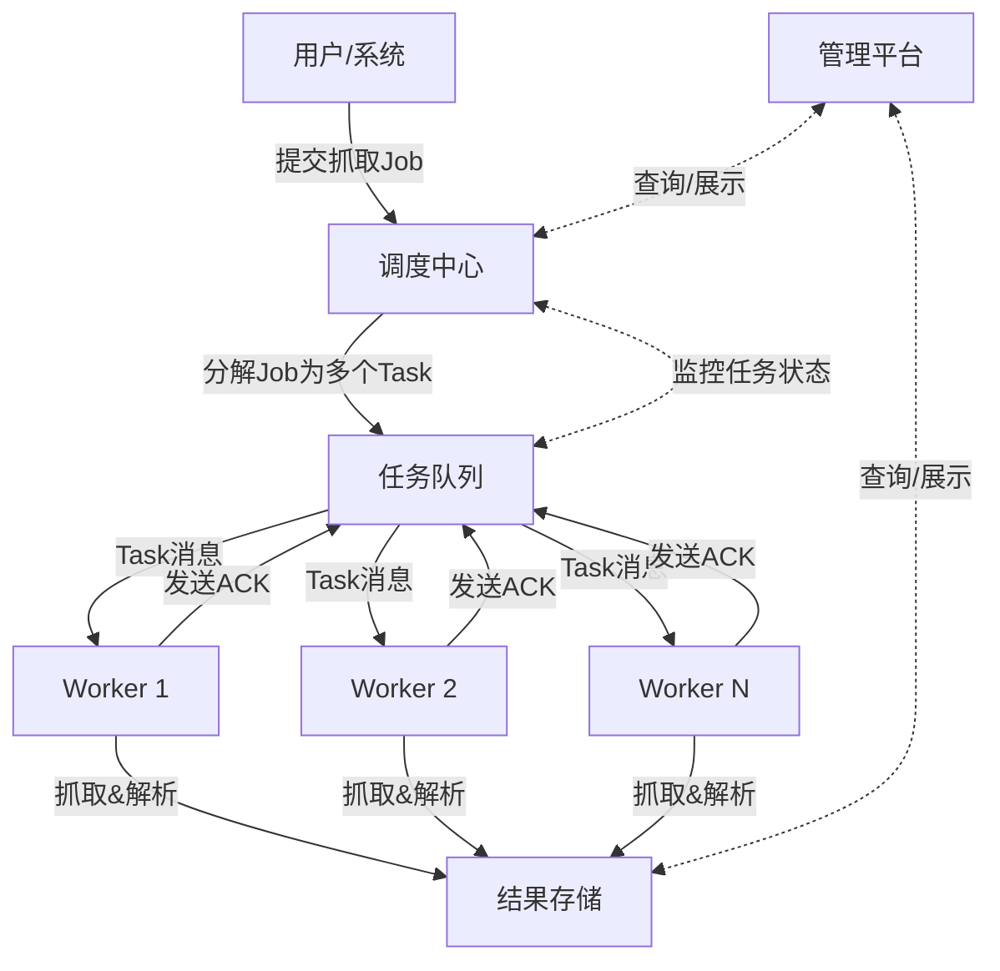

## 内容抓取服务架构

### 架构核心思想

这种架构的核心是 **生产者-消费者模型** 的变种。任务池是生产者，Worker池是消费者。您提到的“任务同时分发给某几个worker”通常不是为了让他们做完全相同的工作（那是冗余备份），而是为了**协同处理一个大型任务**，最常见的方式是**任务分片**。

---

### 架构总体设计

#### 1. 核心组件

1.  **任务调度中心 (Master/Broker)**
    *   **职责**：大脑中枢。负责接收任务、分解任务（分片）、将任务分派到任务队列、监控Worker状态、管理任务优先级、处理失败重试等。
    *   **关键服务**：任务调度器 (Scheduler)、任务队列 (Queue)。

2.  **任务池 (Task Queue/Pool)**
    *   **职责**：缓冲和解耦。存储所有待执行的任务单元。调度中心向里放，Worker从中取。
    *   **实现**：**强烈建议使用外部消息队列**，而不是自建内存池，以保证分布式能力和持久性。
    *   **技术选型**：RabbitMQ, Redis (List/Stream), Kafka, Apache Pulsar。

3.  **Worker池 (Worker Pool)**
    *   **职责**：劳动力。一组无状态的、独立运行的抓取实例。它们从任务队列中领取任务，执行抓取、解析、数据清洗等操作，然后将结果提交到结果存储或下一个流水线。
    *   **特性**：可以轻松地水平扩展（增加或减少机器/容器数量）。

4.  **结果存储 (Result Storage)**
    *   **职责**：存储Worker抓取后的结构化结果。
    *   **实现**：根据数据量和用途选择，如 Elasticsearch (便于搜索)、MySQL/PostgreSQL (关系型数据)、MongoDB (文档型数据)、HDFS/S3 (原始文件存储)。

5.  **配置与协同存储 (Config/Coordination Storage)**
    *   **职责**：存储整个系统的元数据、配置、分布式锁等信息，用于组件间的协同。
    *   **技术选型**：Redis, ZooKeeper, etcd。

6.  **管理与监控平台 (Management & Dashboard)**
    *   **职责**：提供Web界面用于提交任务、查看任务状态、监控系统健康度（队列堆积、Worker在线数、抓取速率、错误日志等）。
    *   **技术选型**：自研Web应用，集成 Grafana + Prometheus 用于监控。

---

### 如何实现“任务同时分发给某几个Worker”

这是架构的关键。这里的“同时分发”通常不是指同一个任务副本发给多个Worker，而是指**将一个大的父任务拆分成多个互不依赖的子任务（分片）**，然后分发给不同的Worker并行执行。

**举例：抓取一个电商网站全站商品**
1.  **父任务**：`抓取网站 example.com 所有商品`
2.  **任务分片**（由调度中心完成）：
    *   **子任务1**：`抓取分类A下第1-100页的商品列表`
    *   **子任务2**：`抓取分类A下第101-200页的商品列表`
    *   **子任务3**：`抓取分类B下第1-100页的商品列表`
    *   ... ...
3.  **分发与执行**：这些子任务被同时投入任务池，空闲的Worker们会各自领取不同的子任务并行抓取。

#### 技术实现方案：

**方案一：基于消息队列 (推荐)**

这是最主流和稳健的方案。

1.  **流程**：
    1.  用户通过API或管理平台提交一个`Job`（父任务）给调度中心。
    2.  调度中心将`Job`分解为多个`Task`（子任务）。
    3.  调度中心将每个`Task`作为一个消息，发送到消息队列（如RabbitMQ）中。
    4.  多个Worker实例同时监听同一个队列。消息队列会确保**每个Task只被一个Worker消费**（避免重复抓取），从而实现负载均衡。
    5.  Worker完成Task后，将结果写入结果存储，并向队列发送ACK确认，该任务即从队列中删除。
    6.  调度中心通过检查所有子任务是否完成，来标记父任务`Job`的状态。

2.  **优势**：解耦彻底、负载均衡自然、容错性好（消息可重试）、易于扩展。

**方案二：基于Redis**

1.  **任务池实现**：使用Redis的`List`或`Set`数据结构存放待执行任务。
2.  **分发机制**：Worker使用`BLPOP`等命令从Redis列表中阻塞地获取任务。这确保了每个任务只会被一个Worker抢到。
3.  **协同**：使用Redis的`Hash`存储任务状态，使用`Set`存储运行中的Worker等。
4.  **优势**：简单快捷，适合数据量不是特别巨大的场景。
5.  **劣势**：需要自己实现更多功能（如优先级、严格的消息确认），可靠性和扩展性不如专业消息队列。

---

### 工作流程时序图

---

### 高级特性与优化考虑

1.  **去重 (Bloom Filter)**
    *   在将任务放入队列前，先检查URL是否已抓取过。可以使用Redis的`Set`或更节省空间的**布隆过滤器 (Bloom Filter)**。

2.  **速率控制 (Rate Limiting)**
    *   针对不同网站域名设置不同的抓取间隔，避免被封IP。可在调度中心或Worker端实现令牌桶等算法。

3.  **优先级队列**
    *   消息队列（如RabbitMQ）支持优先级队列，可以让更重要的任务优先被处理。

4.  **故障转移与重试**
    *   **Worker故障**：如果Worker在处理任务时崩溃，消息队列会因为没收到ACK而自动将该任务重新放入队列，由其他Worker处理。
    *   **调度中心故障**：需要设计为无状态或主从模式，避免单点故障。

5.  **可扩展性**
    *   **Worker**：完全无状态，可以通过增加容器或虚拟机数量轻松扩展。
    *   **队列**：像Kafka和Pulsar这类队列本身就是分布式的，易于扩展。
    *   **调度中心**：可以设计为集群模式。

### 技术选型建议

*   **轻量级/快速上手**：**Redis** (任务队列 + 数据存储) + **Python (Celery)** / **Go** (Worker)
*   **稳健型/生产环境**：**RabbitMQ** (任务队列) + **MySQL/PostgreSQL** (结果存储) + **Redis** (去重/缓存) + **Go/Java** (Worker)
*   **大数据量/高吞吐**：**Kafka/Pulsar** (任务队列) + **Elasticsearch** (结果存储) + **Spark/Flink** (用于流式处理抓取任务)
