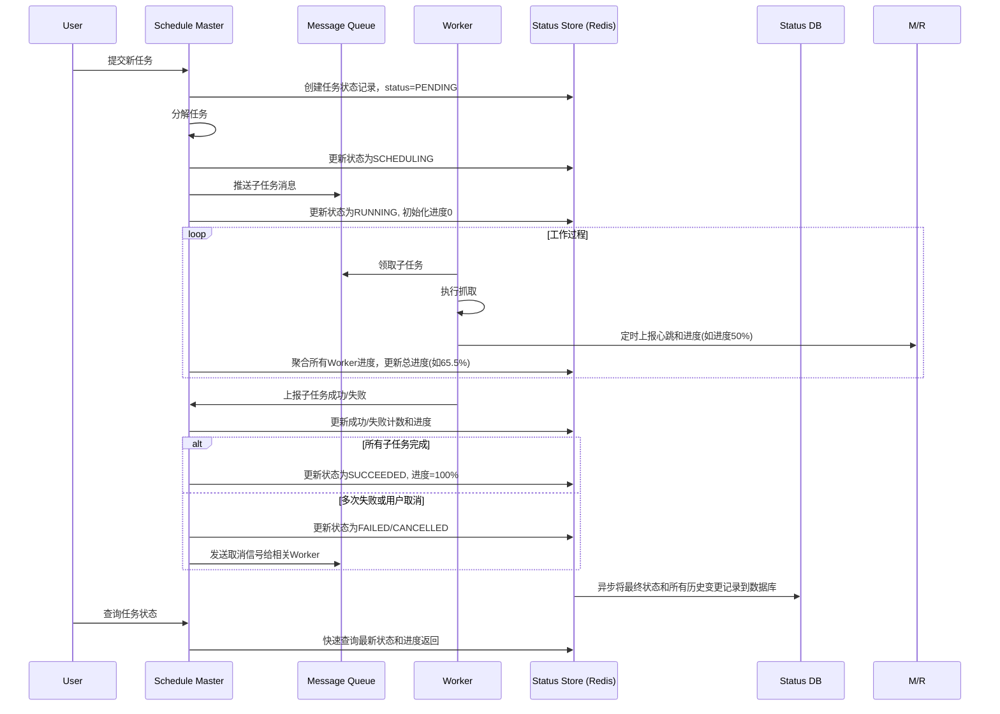

## 内容抓取服务架构

### 架构核心思想

这种架构的核心是 **生产者-消费者模型** 的变种。任务池是生产者，Worker池是消费者。您提到的“任务同时分发给某几个worker”通常不是为了让他们做完全相同的工作（那是冗余备份），而是为了**协同处理一个大型任务**，最常见的方式是**任务分片**。

---

### 架构总体设计

#### 1. 核心组件

1.  **任务调度中心 (Master/Broker)**
    *   **职责**：大脑中枢。负责接收任务、分解任务（分片）、将任务分派到任务队列、监控Worker状态、管理任务优先级、处理失败重试等。
    *   **关键服务**：任务调度器 (Scheduler)、任务队列 (Queue)。

2.  **任务池 (Task Queue/Pool)**
    *   **职责**：缓冲和解耦。存储所有待执行的任务单元。调度中心向里放，Worker从中取。
    *   **实现**：**强烈建议使用外部消息队列**，而不是自建内存池，以保证分布式能力和持久性。
    *   **技术选型**：RabbitMQ, Redis (List/Stream), Kafka, Apache Pulsar。

3.  **Worker池 (Worker Pool)**
    *   **职责**：劳动力。一组无状态的、独立运行的抓取实例。它们从任务队列中领取任务，执行抓取、解析、数据清洗等操作，然后将结果提交到结果存储或下一个流水线。
    *   **特性**：可以轻松地水平扩展（增加或减少机器/容器数量）。

4.  **结果存储 (Result Storage)**
    *   **职责**：存储Worker抓取后的结构化结果。
    *   **实现**：根据数据量和用途选择，如 Elasticsearch (便于搜索)、MySQL/PostgreSQL (关系型数据)、MongoDB (文档型数据)、HDFS/S3 (原始文件存储)。

5.  **配置与协同存储 (Config/Coordination Storage)**
    *   **职责**：存储整个系统的元数据、配置、分布式锁等信息，用于组件间的协同。
    *   **技术选型**：Redis, ZooKeeper, etcd。

6.  **管理与监控平台 (Management & Dashboard)**
    *   **职责**：提供Web界面用于提交任务、查看任务状态、监控系统健康度（队列堆积、Worker在线数、抓取速率、错误日志等）。
    *   **技术选型**：自研Web应用，集成 Grafana + Prometheus 用于监控。

---

### 如何实现“任务同时分发给某几个Worker”

这是架构的关键。这里的“同时分发”通常不是指同一个任务副本发给多个Worker，而是指**将一个大的父任务拆分成多个互不依赖的子任务（分片）**，然后分发给不同的Worker并行执行。

**举例：抓取一个电商网站全站商品**
1.  **父任务**：`抓取网站 example.com 所有商品`
2.  **任务分片**（由调度中心完成）：
    *   **子任务1**：`抓取分类A下第1-100页的商品列表`
    *   **子任务2**：`抓取分类A下第101-200页的商品列表`
    *   **子任务3**：`抓取分类B下第1-100页的商品列表`
    *   ... ...
3.  **分发与执行**：这些子任务被同时投入任务池，空闲的Worker们会各自领取不同的子任务并行抓取。

#### 技术实现方案：

**方案一：基于消息队列 (推荐)**

这是最主流和稳健的方案。

1.  **流程**：
    1.  用户通过API或管理平台提交一个`Job`（父任务）给调度中心。
    2.  调度中心将`Job`分解为多个`Task`（子任务）。
    3.  调度中心将每个`Task`作为一个消息，发送到消息队列（如RabbitMQ）中。
    4.  多个Worker实例同时监听同一个队列。消息队列会确保**每个Task只被一个Worker消费**（避免重复抓取），从而实现负载均衡。
    5.  Worker完成Task后，将结果写入结果存储，并向队列发送ACK确认，该任务即从队列中删除。
    6.  调度中心通过检查所有子任务是否完成，来标记父任务`Job`的状态。

2.  **优势**：解耦彻底、负载均衡自然、容错性好（消息可重试）、易于扩展。

**方案二：基于Redis**

1.  **任务池实现**：使用Redis的`List`或`Set`数据结构存放待执行任务。
2.  **分发机制**：Worker使用`BLPOP`等命令从Redis列表中阻塞地获取任务。这确保了每个任务只会被一个Worker抢到。
3.  **协同**：使用Redis的`Hash`存储任务状态，使用`Set`存储运行中的Worker等。
4.  **优势**：简单快捷，适合数据量不是特别巨大的场景。
5.  **劣势**：需要自己实现更多功能（如优先级、严格的消息确认），可靠性和扩展性不如专业消息队列。

---

### 工作流程时序图


---

### 高级特性与优化考虑

1.  **去重 (Bloom Filter)**
    *   在将任务放入队列前，先检查URL是否已抓取过。可以使用Redis的`Set`或更节省空间的**布隆过滤器 (Bloom Filter)**。

2.  **速率控制 (Rate Limiting)**
    *   针对不同网站域名设置不同的抓取间隔，避免被封IP。可在调度中心或Worker端实现令牌桶等算法。

3.  **优先级队列**
    *   消息队列（如RabbitMQ）支持优先级队列，可以让更重要的任务优先被处理。

4.  **故障转移与重试**
    *   **Worker故障**：如果Worker在处理任务时崩溃，消息队列会因为没收到ACK而自动将该任务重新放入队列，由其他Worker处理。
    *   **调度中心故障**：需要设计为无状态或主从模式，避免单点故障。

5.  **可扩展性**
    *   **Worker**：完全无状态，可以通过增加容器或虚拟机数量轻松扩展。
    *   **队列**：像Kafka和Pulsar这类队列本身就是分布式的，易于扩展。
    *   **调度中心**：可以设计为集群模式。

### 技术选型建议

*   **轻量级/快速上手**：**Redis** (任务队列 + 数据存储) + **Python (Celery)** / **Go** (Worker)
*   **稳健型/生产环境**：**RabbitMQ** (任务队列) + **MySQL/PostgreSQL** (结果存储) + **Redis** (去重/缓存) + **Go/Java** (Worker)
*   **大数据量/高吞吐**：**Kafka/Pulsar** (任务队列) + **Elasticsearch** (结果存储) + **Spark/Flink** (用于流式处理抓取任务)

## 在Go中实现Kafka的重试主题和死信主题（DLQ）

### 核心概念

*   **重试主题 (Retry Topic)**：当消息处理失败时，它不是被直接丢弃，而是被重新发布到一个或多个专门的主题中进行后续重试。通常会为重试设置**延迟**和**最大次数**。
*   **死信主题 (Dead-Letter Topic / DLQ)**：当消息经过多次重试后仍然失败（达到最大重试次数），它就会被发送到一个最终的主题。这个主题用于存放“无法处理”的消息，供开发者或运维人员后续查看、分析和手动处理。

### 架构与工作流程

整个处理流程如下图所示，清晰地展示了消息从主主题到重试主题，最终可能到达死信主题的路径：


### Go 代码实现 (使用 `kafka-go` 库)

这里使用流行的 `segmentio/kafka-go` 库来演示。你需要先安装它：
```bash
go get github.com/segmentio/kafka-go
```

#### 1. 定义常量与创建读写器

```go
package main

import (
	"context"
	"encoding/json"
	"fmt"
	"log"
	"time"
	"strconv"

	"github.com/segmentio/kafka-go"
)

const (
	// 主题定义
	mainTopic    = "orders"
	retryTopic   = "orders-retry"
	deadTopic    = "orders-dead"

	// 消费者组
	consumerGroup = "orders-processor-group"

	brokerAddress = "localhost:9092"

	maxRetryAttempts = 3 // 最大重试次数
	retryDelay       = 10 * time.Second // 重试基础延迟
)

// 你的业务消息结构体
type OrderMessage struct {
	OrderID string `json:"orderId"`
	Amount  int    `json:"amount"`
}
```

#### 2. 主消费者逻辑

主消费者负责从主主题消费，处理成功则提交偏移量，失败则准备重试。

```go
func mainConsumer(ctx context.Context) {
	// 配置主主题消费者
	reader := kafka.NewReader(kafka.ReaderConfig{
		Brokers:  []string{brokerAddress},
		Topic:    mainTopic,
		GroupID:  consumerGroup,
		MinBytes: 10e3, // 10KB
		MaxBytes: 10e6, // 10MB
	})
	defer reader.Close()

	// 配置用于转发消息到重试/死信主题的写入器
	// 注意: 生产环境应为每个Topic创建独立的Writer，这里为简洁使用一个
	writer := &kafka.Writer{
		Addr:      kafka.TCP(brokerAddress),
		Balancer:  &kafka.LeastBytes{},
		Async:     false, // 同步发送，确保消息不丢失
		BatchSize: 1,
	}
	defer writer.Close()

	log.Println("主消费者启动...")

	for {
		// 获取消息
		msg, err := reader.FetchMessage(ctx)
		if err != nil {
			log.Printf("获取消息失败: %v", err)
			continue
		}

		// 解析消息
		var order OrderMessage
		if err := json.Unmarshal(msg.Value, &order); err != nil {
			log.Printf("解析消息失败: %v", err)
			// 即使解析失败，也提交偏移量，避免卡住，或者可以发送到DLQ
			reader.CommitMessages(ctx, msg)
			continue
		}

		// 模拟业务处理：假设有时会失败
		err = processOrder(order)
		if err != nil {
			log.Printf("处理订单 %s 失败: %v。准备重试...", order.OrderID, err)
			
			// 处理失败，准备重试或送入死信
			err = handleFailedMessage(ctx, writer, msg, err)
			if err != nil {
				log.Printf("处理失败消息时发生错误: %v", err)
				continue // 可以选择重试或等待
			}
		} else {
			log.Printf("订单 %s 处理成功。", order.OrderID)
		}

		// 无论成功失败，只要消息已被妥善处理（成功、或已转发），就提交偏移量
		// 重要：避免消息处理失败后卡住偏移量
		if err := reader.CommitMessages(ctx, msg); err != nil {
			log.Printf("提交偏移量失败: %v", err)
		}
	}
}
```

#### 3. 处理失败消息的核心函数

这个函数负责检查重试次数并决定是发送到重试主题还是死信主题。

```go
// handleFailedMessage 处理失败的消息，决定是重试还是送入死信
func handleFailedMessage(ctx context.Context, writer *kafka.Writer, originalMsg kafka.Message, processingErr error) error {
	// 1. 获取当前重试次数
	retryAttempts := 0
	for _, header := range originalMsg.Headers {
		if header.Key == "retry-attempts" {
			if attempts, err := strconv.Atoi(string(header.Value)); err == nil {
				retryAttempts = attempts
			}
			break
		}
	}

	// 2. 检查是否超过最大重试次数
	if retryAttempts >= maxRetryAttempts {
		log.Printf("订单 %s 已达到最大重试次数 %d，送入死信主题。错误: %v", 
			string(originalMsg.Key), maxRetryAttempts, processingErr)
		// 发送到死信主题
		return sendToDeadLetterTopic(ctx, writer, originalMsg, processingErr)
	}

	// 3. 未超限，准备重试
	retryAttempts++
	log.Printf("进行第 %d/%d 次重试", retryAttempts, maxRetryAttempts)

	// 更新重试次数的Header
	newHeaders := updateRetryHeader(originalMsg.Headers, retryAttempts)

	// 构建重试消息（保留原始的Key和Value，只更新Headers）
	retryMessage := kafka.Message{
		Topic:   retryTopic,
		Key:     originalMsg.Key,
		Value:   originalMsg.Value,
		Headers: newHeaders,
		// 可以根据 retryAttempts 设置不同的延迟时间
		Time: time.Now().Add(calculateBackoff(retryAttempts)),
	}

	// 将消息同步发送到重试主题
	err := writer.WriteMessages(ctx, retryMessage)
	if err != nil {
		return fmt.Errorf("无法发送消息到重试主题: %w", err)
	}
	log.Printf("消息已成功发送到重试主题 %s，计划于 %s 后重试", retryTopic, calculateBackoff(retryAttempts))
	return nil
}

// updateRetryHeader 更新或添加重试次数的Header
func updateRetryHeader(existingHeaders []kafka.Header, newAttempts int) []kafka.Header {
	// 先查找是否已存在
	for i, header := range existingHeaders {
		if header.Key == "retry-attempts" {
			existingHeaders[i].Value = []byte(strconv.Itoa(newAttempts))
			return existingHeaders
		}
	}
	// 不存在则添加
	return append(existingHeaders, kafka.Header{
		Key:   "retry-attempts",
		Value: []byte(strconv.Itoa(newAttempts)),
	})
}

// calculateBackoff 计算退避延迟时间（例如指数退避）
func calculateBackoff(attempts int) time.Duration {
	// 简单示例：指数退避，最大不超过1分钟
	delay := retryDelay * time.Duration(attempts*attempts)
	if delay > time.Minute {
		return time.Minute
	}
	return delay
}

// sendToDeadLetterTopic 发送消息到死信主题
func sendToDeadLetterTopic(ctx context.Context, writer *kafka.Writer, originalMsg kafka.Message, originalErr error) error {
	// 可以在消息Value中封装更多错误信息，这里简单示例
	dlqMessage := kafka.Message{
		Topic: deadTopic,
		Key:   originalMsg.Key,
		Value: originalMsg.Value, // 原始消息体
		Headers: append(originalMsg.Headers, 
			kafka.Header{Key: "dlq-reason", Value: []byte(originalErr.Error())},
			kafka.Header{Key: "failed-at", Value: []byte(time.Now().UTC().Format(time.RFC3339))},
		),
	}
	return writer.WriteMessages(ctx, dlqMessage)
}
```

#### 4. 重试消费者

重试消费者监听重试主题，它和主消费者几乎一样，只是Topic不同。它消费到消息后，会**重新执行主消费者的处理逻辑**。

```go
func retryConsumer(ctx context.Context) {
	reader := kafka.NewReader(kafka.ReaderConfig{
		Brokers:  []string{brokerAddress},
		Topic:    retryTopic,
		GroupID:  consumerGroup + "-retry", // 使用不同的消费者组
		MinBytes: 10e3,
		MaxBytes: 10e6,
		// 注意：等待时间要长于你设置的重试延迟，否则会立即拉取到还未到时间的消息
		MaxWait: time.Minute * 2,
	})
	defer reader.Close()

	writer := &kafka.Writer{
		Addr:      kafka.TCP(brokerAddress),
		Balancer:  &kafka.LeastBytes{},
		Async:     false,
		BatchSize: 1,
	}
	defer writer.Close()

	log.Println("重试消费者启动...")

	for {
		msg, err := reader.FetchMessage(ctx)
		if err != nil {
			log.Printf("重试消费者获取消息失败: %v", err)
			continue
		}

		// 检查消息的计划重试时间（Time字段）
		if !msg.Time.IsZero() && time.Now().Before(msg.Time) {
			// 如果还未到重试时间，则不处理，也不提交偏移量
			// Kafka会重新拉取这条消息（因为偏移量未前进）
			// 注意：这会导致频繁拉取同一条消息，在实际应用中可能需要更复杂的机制（如暂停分区）
			time.Sleep(time.Until(msg.Time) + time.Second)
			continue
		}

		var order OrderMessage
		if err := json.Unmarshal(msg.Value, &order); err != nil {
			log.Printf("重试消费者解析消息失败: %v", err)
			reader.CommitMessages(ctx, msg)
			continue
		}

		// 再次尝试处理！
		err = processOrder(order)
		if err != nil {
			log.Printf("重试处理订单 %s 失败: %v", order.OrderID, err)
			// 再次调用相同的失败处理逻辑，它会检查重试次数并决定下一步
			handleFailedMessage(ctx, writer, msg, err)
		} else {
			log.Printf("订单 %s 在重试中处理成功！", order.OrderID)
		}

		if err := reader.CommitMessages(ctx, msg); err != nil {
			log.Printf("重试消费者提交偏移量失败: %v", err)
		}
	}
}
```

#### 5. 模拟业务逻辑和主函数

```go
// processOrder 模拟业务处理，随机失败
func processOrder(order OrderMessage) error {
	// 模拟一个有时会失败的处理过程
	if order.Amount%5 == 0 { // 假设金额是5的倍数就会失败
		return fmt.Errorf("模拟处理失败: 金额 %d 不符合规则", order.Amount)
	}
	// 模拟处理耗时
	time.Sleep(100 * time.Millisecond)
	return nil
}

func main() {
	ctx := context.Background()

	// 启动主消费者协程
	go mainConsumer(ctx)
	// 启动重试消费者协程
	go retryConsumer(ctx)

	// 阻塞主协程
	select {}
}
```

### 关键要点与优化建议

1.  **消息头 (Headers)**：利用Headers来传递**元数据**（如重试次数、错误原因），不要污染消息体（Value）。
2.  **偏移量提交**：务必在确认消息已处理（成功或已转发）后再提交偏移量，避免消息丢失。
3.  **幂等性**：你的 `processOrder` 函数必须是**幂等**的，因为同一条消息可能被处理多次（正常情况+重试）。
4.  **延迟实现**：示例中使用了消息的 `Time` 字段和消费者端的等待。更高级的方案是使用**多个不同延迟的重试主题**（`retry-10s`, `retry-1m`），由不同的消费者组监听，这样可以更精确地控制延迟并且不会阻塞消费。
5.  **错误处理**：生产代码需要更完善的错误处理和日志记录。
6.  **性能**：为每个Topic创建独立的 `Writer`，并根据需要调整 `Async` 和 `Batch` 设置以优化吞吐量。

##

好的，这是一个非常重要且实际的问题。在分布式爬虫系统中实现多用户任务隔离是保证系统稳定性、安全性和公平性的核心。

下面我将为您详细规划一个支持多用户任务隔离的分布式爬虫架构。

### 核心隔离原则

多用户隔离主要围绕以下四个层面展开：

1.  **数据隔离**：确保用户A的任务、配置和抓取数据在任何时候都不会与用户B的混淆。
2.  **资源隔离**：防止单个用户的异常任务（如大量超时、死循环解析）耗尽系统资源（CPU、内存、网络带宽、代理IP、连接数），影响其他用户。
3.  **执行隔离**：任务在独立的运行时环境中执行，防止代码冲突或错误扩散。
4.  **安全隔离**：防止用户自定义的解析脚本对系统造成安全威胁。

---

### 架构规划与设计方案

我们将基于您之前提到的“任务池 + Worker池”架构进行增强。

#### 1. 元数据与身份标识设计

这是所有隔离的基础。每个实体都必须带有租户（用户）标识。

*   **用户标识 (`tenant_id` / `user_id`)**：系统内唯一标识一个用户或租户。
*   **任务标识 (`task_id` / `job_id`)**：与 `user_id` 联合唯一标识一个任务。
*   **请求标识 (`request_id`)**：与 `user_id` 关联，标识一个具体的抓取请求。

**实现方式**：
在所有数据结构中嵌入 `user_id`：
*   **任务消息**：Kafka消息体/头中必须包含 `user_id`。
*   **数据库表**：任务表、结果表等都必须有 `user_id` 字段，并且所有查询都基于 `(user_id, task_id)` 进行。
*   **配置存储**：每个用户的配置（如爬虫规则、提取字段、 headers）独立存储，通过 `user_id` 关联。

#### 2. 任务队列隔离策略 (核心)

这是实现资源隔离和优先级管理的关键。有多种策略，可组合使用。

| 策略 | 实现方式 | 优点 | 缺点 | 适用场景 |
| :--- | :--- | :--- | :--- | :--- |
| **逻辑隔离（Topic + 标签）** | 使用**少数几个Kafka Topic**（如 `urgent-task`, `normal-task`）。在消息Header中设置 `user_id` 和 `priority`。 | 实现简单，队列管理方便。 | 隔离性较弱，一个用户的疯狂投递会影响同Topic内其他用户。 | 用户数量少、信任度高、任务优先级差异大的内部系统。 |
| **物理隔离（多Topic）** | **为每个用户创建独立的Kafka Topic**（如 `task-user-{id}`）。 | **隔离性最强**，一个用户的队列阻塞不影响他人。 | Topic管理复杂，ZooKeeper负载高，成本较高。 | 用户数量不多（<100）的SaaS平台或企业级应用。 |
| **混合策略（用户组）** | 折中方案。将用户分组（如免费用户组、付费用户组），**为每个组分配一个Topic**。 | 在隔离性和复杂度之间取得平衡。 | 组内用户之间仍有轻微影响。 | 最常用的方案，适合大多数多租户SaaS系统。 |

**推荐方案**：采用 **混合策略**。
*   创建不同优先级的Topic，如 `group-vip-task`, `group-free-task`。
*   消息体中包含 `user_id`。
*   Worker消费特定组的Topic，并根据消息头中的 `user_id` 加载对应用户的配置。

#### 3. Worker池调度与资源控制

Worker需要知道正在处理的任务属于哪个用户，并应用相应的资源配置。

*   **动态配置加载**：Worker在接收到消息后，首先从Header中提取 `user_id`，然后从**配置中心**（如Redis、MySQL、Apollo）加载该用户的特定配置（如User-Agent、爬取速率限制、代理IP池、解析规则）。
*   **资源配额与限流**：
    *   **全局限流**：在网关卡或负载均衡器上，对每个 `user_id` 的API调用速率进行限制。
    *   **爬取速率限制**：使用 **令牌桶算法** 为每个 `user_id` 在**Redis**中维护一个独立的令牌桶。Worker在处理用户请求前必须获取令牌，否则等待或丢弃。这防止某个用户过于频繁请求同一网站。
    *   **资源限制**：如果Worker运行在容器中（如Docker, Kubernetes），可以为**处理不同用户组的Worker Pod**设置不同的CPU/Memory **Resource Limits**，实现资源硬隔离。
*   **上下文隔离**：每个任务在处理时都应携带一个纯净的、用户独立的上下文（如Cookie池、Session对象），避免串号。

#### 4. 数据存储隔离

*   **数据库行级隔离**：最常用的方式。所有数据库表都有 `user_id` 字段，使用ORM或SQL中间件确保所有查询都自动带上 `user_id=%s` 条件。
*   **独立数据库/模式**：为重要或大型租户提供独立的数据库或Schema。隔离性最好，但成本最高。
*   **结果存储**：抓取到的结构化数据最好按 `user_id` 分目录或分索引存储。例如，在Elasticsearch中，可以使用别名 `crawled-data-{user_id}`；在S3/MinIO中，路径为 `/{user_id}/{task_id}/result.json`。

#### 5. 代理IP与Cookie池隔离

这是保证抓取质量的关键。

*   **代理IP池**：不应是所有用户共享一个巨大的代理IP池。应为每个用户或用户组分配一个**专属的子代理IP池**。这样，即使某个用户的IP因频繁抓取被目标网站封禁，也不会波及其他用户。
*   **Cookie/JessionID池**：同样需要按用户或任务进行隔离，防止账号登出或风控关联。

---

### 系统工作流程


### 技术选型建议

*   **消息队列**：**Kafka**（首选，高性能，多Topic管理方便）或 **RabbitMQ**（Vhost可作逻辑隔离）。
*   **配置中心**：**Redis**（简单高效，存储用户限流令牌桶和元数据）、**Etcd**、**Apollo**。
*   **资源隔离**：**Docker + Kubernetes**，使用Namespaces和ResourceQuota为不同用户组的Worker做资源限制。
*   **数据库**：**PostgreSQL**或**MySQL**，利用行级安全和视图功能简化数据隔离。
*   **监控**：**Prometheus + Grafana**，为每个 `user_id` 添加标签，监控其任务队列长度、抓取成功率、耗时、消耗资源等。

### 总结

实现分布式爬虫的多用户隔离是一个系统工程，需要从**队列、资源配置、数据存储和运行时**四个层面综合考虑。

1.  **标识是基础**：在所有地方嵌入 `user_id`。
2.  **队列是核心**：采用**按用户组分Topic**的混合隔离模式，是性价比最高的选择。
3.  **配置是枢纽**：Worker动态加载用户配置，是实现差异化执行的关键。
4.  **资源是保障**：通过令牌桶和容器资源限制，防止劣质任务耗尽资源。

对于初创系统，可以从“逻辑隔离（标签）”开始，随着用户增长和需求复杂，逐步升级到“混合策略”甚至“物理隔离”。

## 任务状态

在分布式爬虫架构中增加任务状态管理是至关重要的一步。它使系统从“发射后不管”变为**可观测、可控制、可恢复**的成熟系统。

下面我将为您设计一个完善的任务状态管理系统，并将其无缝集成到现有的架构中。

### 任务状态机的设计

首先，我们需要定义一个清晰的任务生命周期状态机。这是状态系统的核心。


### 架构组件增强：新增“状态中心” (Status Center)

原有的架构（调度中心、任务队列、Worker池、存储）需要与一个专门的**状态中心**进行交互。

| 组件 | 职责增强 |
| :--- | :--- |
| **调度中心 (Master)** | 1. 创建任务时，在**状态存储**中初始化状态为 `PENDING`。<br>2. 任务分片成功后，将状态更新为 `RUNNING`。<br>3. 接收来自Worker的心跳和进度更新，并转发给状态中心。<br>4. 监听状态变化，执行相应操作（如暂停时停止分发新任务）。 |
| **任务状态存储 (Status Store)** | **新增组件**。负责持久化和提供任务状态及进度的查询。**推荐使用Redis（缓存最新状态） + 数据库（持久化历史状态）的组合**。 |
| **Worker** | **职责增强**。1. 领取任务后，定期向调度中心/状态中心发送**心跳**和**进度报告**。<br>2. 任务失败或成功时，上报最终状态。 |
| **API & 控制台** | **职责增强**。提供接口供用户查询任务状态、手动触发状态变更（如暂停、继续、取消）。 |

---

### 状态数据模型设计

在状态存储中，我们需要存储两种主要信息：

#### 1. 任务状态概要 (Task Status Summary)
存在于 **Redis** 中，用于快速查询和展示任务列表。
```json
{
  "task_id": "task_12345",
  "user_id": "user_678",
  "status": "RUNNING", // 当前状态
  "progress": 65.5,    // 总体进度百分比
  "create_time": 1646640000,
  "start_time": 1646640010,
  "end_time": null,
  "total_items": 1000, // 总目标数
  "crawled_items": 655, // 已完成数
  "failed_items": 12,
  "message": "Crawling in progress" // 最新状态信息
}
```

#### 2. 任务状态详情 (Task Status Detail)
存在于 **数据库** (如MySQL) 中，用于详细日志和审计。
| 字段名 | 类型 | 描述 |
| :--- | :--- | :--- |
| `id` | `bigint` | 自增主键 |
| `task_id` | `varchar` | 任务ID |
| `user_id` | `varchar` | 用户ID |
| `status` | `varchar` | 状态值 |
| `timestamp` | `datetime` | 状态更新时间 |
| `message` | `text` | 状态详细信息（如错误堆栈） |
| `subtask_id` | `varchar` | 关联的子任务ID（可选） |
| `worker_id` | `varchar` | 上报状态的Worker ID |

---

### 系统工作流程与数据流



### 关键实现细节

1.  **状态存储的选择**
    *   **Redis (首选)**：使用 `Hash` 存储任务状态概要（`task:status:<task_id>`），使用 `List` 或 `Stream` 作为消息队列来异步持久化状态变更日志。性能极高，适合实时状态更新和查询。
    *   **MySQL/PostgreSQL**：用于最终的状态历史持久化，便于做数据分析和审计。

2.  **进度计算**
    *   **Master聚合**：由调度中心负责聚合所有Worker的进度。Worker上报的是其当前子任务的进度（如“这个列表页的100个链接，我抓了20个”），Master根据所有子任务的权重计算出总进度。
    *   **公式**：`总进度 = (已成功完成的子任务数 + 当前正在执行的子任务进度之和) / 总子任务数`

3.  **故障恢复与状态协调**
    *   **Worker超时**：如果某个Worker长时间没有上报心跳，Master可以将其负责的子任务状态标记为 `FAILED`，并将该子任务**重新放入队列**，由其他Worker领取执行。
    *   **Master故障**：需要将Master本身也设计为高可用的（如基于ZooKeeper/Etcd的Leader选举）。新的Master当选后，可以从状态存储中恢复出所有任务的最后状态，并决定哪些 `RUNNING` 状态的任务需要被恢复或重置。

4.  **用户操作接口 (API)**
    *   `GET /api/tasks/{task_id}/status`：获取任务详细状态和进度。
    *   `POST /api/tasks/{task_id}/pause`：暂停任务。Master将状态改为 `PAUSED` 并停止分发该任务的新子任务，同时通知正在运行的Worker**优雅停止**（完成当前抓取后停止，不接收新任务）。
    *   `POST /api/tasks/{task_id}/resume`：继续任务。将状态从 `PAUSED` 改回 `RUNNING`，并将未完成的子任务重新放入队列。
    *   `POST /api/tasks/{task_id}/cancel`：取消任务。过程类似暂停，但状态最终变为 `CANCELLED`，并会清理队列中该任务的所有剩余子任务。

### 总结

增加任务状态系统后，您的分布式爬虫架构将获得以下**核心优势**：

*   **可观测性**：用户和开发者都能清晰看到任务进行到哪一步，是否有错误。
*   **可操控性**：实现了对任务的精细化管理（暂停、继续、取消）。
*   **可恢复性**：系统能够从各种故障中自动恢复，保证数据一致性。
*   **可审计性**：所有状态变更都有记录，便于排查问题和数据分析。

这个状态系统是构建一个企业级、产品化分布式爬虫平台不可或缺的一部分。

## 任务属性

设计任务属性是构建一个灵活、强大且可维护的分布式爬虫系统的基石。优秀的属性设计能让系统清晰易懂、易于扩展，并能覆盖绝大多数业务场景。

以下将从**设计原则**、**核心属性分类**、**存储与传递**以及**高级用法**四个方面，为您详细规划任务属性的设计。

### 一、设计原则

1.  **清晰性 (Clarity)**：属性命名和用途清晰，无歧义。
2.  **正交性 (Orthogonality)**：属性之间功能独立，减少耦合。
3.  **可扩展性 (Extensibility)**：易于添加新属性，不影响现有逻辑。
4.  **分层/分组 (Grouping)**：将相关属性分组，结构清晰。
5.  **敏感信息隔离**：将密码、API密钥等敏感属性单独处理加密。

---

### 二、核心属性分类与设计

我将任务属性分为以下六大类，这是一个非常实用且全面的结构。

#### 1. 基础标识属性 (Basic Identification)
这是任务的“身份证”，用于唯一标识和归属。

| 属性名 | 类型 | 必选 | 描述与示例 |
| :--- | :--- | :--- | :--- |
| `task_id` | String | 是 | 系统内唯一任务ID，通常由系统生成。`uuid.uuid4().hex` |
| `user_id` / `tenant_id` | String | 是 | **多租户隔离的核心**。标识任务属于哪个用户或团队。 |
| `name` | String | 是 | 任务可读名称，便于管理。`"抓取某某商城商品列表"` |
| `description` | String | 否 | 任务详细描述和目的。 |
| `creator` | String | 否 | 任务创建者。 |
| `labels` | List\<String> | 否 | 标签，用于快速筛选和分类。`["电商", "每日任务", "重要"]` |

#### 2. 调度与生命周期属性 (Scheduling & Lifecycle)
控制任务何时、如何被触发和执行。

| 属性名 | 类型 | 必选 | 描述与示例 |
| :--- | :--- | :--- | :--- |
| `status` | String | 是 | 任务当前状态。`PENDING`, `RUNNING`, `PAUSED`, `COMPLETED`, `FAILED` |
| `priority` | Integer | 否 | 任务优先级，用于调度队列。`10`（最高）到 `1`（最低） |
| `schedule_type` | String | 是 | 调度类型。`ONCE`（立即执行一次）, `CRON`（周期任务） |
| `cron_expression` | String | 条件 | 当`schedule_type=CRON`时有效。`"0 0 2 * * ?"`（每天凌晨2点） |
| `start_time` | Timestamp | 否 | 任务开始执行的时间。 |
| `end_time` | Timestamp | 否 | 任务计划结束的时间。 |
| `max_runtime` | Duration | 否 | 任务最大运行时长，超时则自动终止。`"2h"` |

#### 3. 抓取目标与入口属性 (Target & Entry)
定义“抓什么”和“从哪里开始”。

| 属性名 | 类型 | 必选 | 描述与示例 |
| :--- | :--- | :--- | :--- |
| `seeds` | List\<String> | 是 | 种子URL列表。`["https://example.com/list/1"]` |
| `allowed_domains` | List\<String> | 条件 | 允许抓取的域名列表，用于限制爬虫范围。`["example.com", "api.example.com"]` |
| `start_urls` | List\<String> | 否 | 另一种种子URL的命名方式。 |

#### 4. 抓取行为与控制属性 (Crawling Behavior)
定义“怎么抓”，是控制爬虫行为的核心。

| 属性名 | 类型 | 必选 | 描述与示例 |
| :--- | :--- | :--- | :--- |
| `depth_limit` | Integer | 否 | 最大爬取深度（从种子URL开始算）。`3` |
| `max_pages` | Integer | 否 | 最大抓取页面总数，防止失控。`10000` |
| `politeness_delay` | Integer | 否 | 请求同一域名的最小间隔（毫秒），礼貌性。`1000` |
| `rate_limit` | String | 否 | 更精确的速率限制。`"10/1s"`（每秒10个请求） |
| `http_method` | String | 否 | 默认请求方法。`"GET"`, `"POST"` |
| `request_headers` | Dict | 否 | 默认HTTP请求头。`{"User-Agent": "my-crawler/1.0"}` |
| `request_body` | String/Dict | 否 | POST请求的Body。 |
| `timeouts` | Dict | 否 | 各种超时设置。`{"connection": 10, "read": 30}` |
| `retry_settings` | Dict | 否 | 重试策略。`{"max_attempts": 3, "backoff": 0.5}` |
| `proxy_strategy` | String | 否 | 代理使用策略。`"none"`, `"per_request"`, `"on_failure"` |
| `proxy_list` | List\<String> | 条件 | 代理服务器列表。`["http://proxy1:port", "socks5://proxy2:port"]` |

#### 5. 内容处理与解析属性 (Content Processing)
定义“抓到后怎么处理”。

| 属性名 | 类型 | 必选 | 描述与示例 |
| :--- | :--- | :--- | :--- |
| `extract_rules` | Dict / List | 否 | 定义要提取的数据的规则（CSS/XPath选择器）。 |
| `parser` | String | 否 | 指定使用哪个解析函数/模块。`"product_page_parser"` |
| `item_pipeline` | List\<String> | 否 | 数据清洗和存储的流水线。`["Deduplicator", "ImageDownloader", "MysqlWriter"]` |
| `output_format` | String | 否 | 输出格式。`"JSON"`, `"CSV"` |
| `output_path` | String | 否 | 输出路径/位置。`"s3://my-bucket/results/"` |

#### 6. 高级与扩展属性 (Advanced & Extension)
用于实现更复杂的定制化需求。

| 属性名 | 类型 | 必选 | 描述与示例 |
| :--- | :--- | :--- | :--- |
| `webhook_url` | String | 否 | 任务状态变更时回调的URL。 |
| `max_retries` | Integer | 否 | 任务级别重试次数（整个任务失败后重试）。`2` |
| `notify_on` | List\<String> | 否 | 在何种状态下发送通知。`["FAILURE", "COMPLETED"]` |
| `environment_vars` | Dict | 否 | 任务执行时的环境变量。 |
| `js_rendering` | Boolean | 否 | 是否启用无头浏览器渲染JS。`true` |
| `browser_settings` | Dict | 条件 | 浏览器配置。`{"headless": true, "viewport": {"width": 1920, "height": 1080}}` |
| `ext_options` | Dict | 否 | **万能扩展字段**，用于存放任何未预先定义的配置。 |

---

### 三、存储与传递

#### 1. 存储 (Storage)
*   **数据库 (MySQL/PostgreSQL)**：存储所有任务的**元数据**（上述1, 2, 6类属性）。这些属性需要被查询和索引（如按`user_id`, `status`查询）。
*   **配置中心 (Redis/Etcd/Apollo)**：存储任务的**完整配置快照**（特别是3, 4, 5类行为属性）。当Worker需要执行任务时，可以从这里快速加载整个任务的配置。Redis Hash是绝佳选择。
*   **对象存储 (S3/MinIO)**：如果提取规则非常复杂（如大型JSON/XML文件），可以将其存入对象存储，然后在属性中存储文件地址。

#### 2. 传递 (Propagation)
当调度中心将任务分发给Worker时，需要传递任务属性。有两种方式：
*   **方式一（推荐）：传递ID，Worker自行拉取**
    *   消息队列中只传递 `task_id` 和 `user_id`。
    *   Worker根据这两个ID，去**配置中心**（如Redis）拉取完整的任务配置。
    *   **优点**：消息体小；配置可动态更新（如用户修改了速率限制，无需重新分发任务）。
*   **方式二：全量嵌入消息体**
    *   将所有属性序列化（如JSON）后直接放入消息队列的消息体中。
    *   **优点**：Worker无需额外网络调用，速度快。
    *   **缺点**：消息体大；配置无法动态更新。

---

### 四、实践示例与高级用法

#### 1. 使用JSON Schema进行验证
在任务创建/更新时，使用JSON Schema来验证传入的属性是否合法，避免错误配置进入系统。

```json
// 一个简单的Schema示例，验证extract_rules
{
  "type": "object",
  "properties": {
    "extract_rules": {
      "type": "object",
      "patternProperties": {
        "^[a-zA-Z_][a-zA-Z0-9_]*$": { // 字段名必须是合法标识符
          "type": "object",
          "properties": {
            "selector": {"type": "string"}, // CSS/XPath选择器
            "type": {"type": "string", "enum": ["text", "html", "attr"]}, // 提取类型
            "attr": {"type": "string"} // 属性名，如"src"
          },
          "required": ["selector"]
        }
      }
    }
  }
}
```

#### 2. 配置模板与继承
对于通用配置，可以创建“模板”。新任务只需引用模板ID并覆盖少量属性即可，极大减少配置工作量。
```json
{
  "name": "my-new-task",
  "template_id": "standard-polite-crawler",
  "overrides": {
    "seeds": ["https://my-specific-site.com"],
    "max_pages": 1000
  }
}
```

### 总结

设计任务属性是一个系统性的工程。一个好的设计应该：

1.  **分类清晰**：按功能模块划分属性，易于理解和管理。
2.  **核心明确**：明确必选属性和可选属性，提供合理的默认值。
3.  **留有余地**：通过 `ext_options` 或类似字段保证未来的可扩展性。
4.  **考虑存储和性能**：区分热数据（行为配置）和冷数据（元数据），选择合适的存储介质。
5.  **注重安全**：对敏感配置进行加密处理。

## 抓取规则

一个完整的分布式爬虫任务定义，**抓取规则（Crawling Rules）** 是其灵魂所在。它定义了“如何发现页面”和“从页面中提取什么”，是区别不同抓取任务的核心。

### 抓取规则的核心组成部分

抓取规则可以分解为两个主要部分：**1. 导航规则（如何发现新链接）** 和 **2. 提取规则（如何获取目标数据）**。

---

### 1. 导航规则 (Navigation / Discovery Rules)

这部分规则指导爬虫如何在互联网的“图”中行走，从而发现新的、需要抓取的URL。

| 属性名 | 类型 | 描述 | 示例 |
| :--- | :--- | :--- | :--- |
| **`link_strategy`** | `String` | **链接发现策略**。定义如何从当前页面寻找新链接。 | `ALL_LINKS`（所有链接）, `SAME_DOMAIN`（同域）, `CUSTOM`（自定义选择器） |
| **`link_selectors`** | `List<String>` | 当策略为`CUSTOM`时，用于提取链接的**CSS选择器**或**XPath**。 | `[".pagination a.next", ".product-list a.title"]` |
| **`follow_redirects`** | `Boolean` | 是否跟随HTTP重定向。 | `true` |
| **`allow_patterns`** | `List<Regex>` | **URL允许规则**。只有匹配这些正则表达式的URL才会被加入队列。 | `[".*/product/\\d+.html", ".*/category/.*"]` |
| **`deny_patterns`** | `List<Regex>` | **URL拒绝规则**。匹配这些正则表达式的URL会被忽略。**优先级高于允许规则**。 | `[".*.jpg", ".*/logout"]` |
| **`max_depth`** | `Integer` | 从种子URL开始的最大爬取深度。 | `5` |
| **`priority_strategy`** | `String` / `Dict` | URL优先级调度策略。 | `"BREADTH_FIRST"`（广度优先）, `"DEPTH_FIRST"`（深度优先）, 或按正则赋予权重 |

---

### 2. 提取规则 (Extraction Rules)

这部分规则定义了对于抓取到的页面，需要抽取哪些有价值的结构化数据。

#### A. 页面类型识别 (Page Type Identification)
首先，爬虫需要知道当前页面是什么类型（列表页、详情页、登录页等），从而应用正确的提取规则。

| 属性名 | 类型 | 描述 | 示例 |
| :--- | :--- | :--- | :--- |
| **`page_type_patterns`** | `List<Object>` | 定义一组模式来识别页面类型。 | （见下方JSON示例） |

#### B. 数据提取规则 (Data Extraction Fields)
为每种页面类型定义需要提取的字段。

| 属性名 | 类型 | 描述 | 示例 |
| :--- | :--- | :--- | :--- |
| **`fields`** | `List<Object>` | 定义需要提取的字段列表。每个字段包含名称、选择器、类型和处理逻辑。 | （见下方JSON示例） |
| **`extraction_type`** | `String` | 提取技术。`STATIC_HTML`（默认）, `DYNAMIC_JS`（用于JS渲染页面的无头浏览器）, `JSON_API`（直接抓取API） | `"STATIC_HTML"` |

---

### 完整集成示例：任务属性JSON

我们将上述抓取规则集成到之前设计的任务属性中，主要放在 `extract_rules` 和 `navigator_rules` 下。

```json
{
  "task_id": "task_123",
  "user_id": "user_456",
  "name": "抓取某某电商网站商品",
  "seeds": ["https://example.com/categories/books"],
  "allowed_domains": ["example.com"],
  "politeness_delay": 1000,

  // >>>>>>>>> 【核心新增部分：抓取规则】 <<<<<<<<<
  "navigator_rules": {
    "link_strategy": "CUSTOM",
    "link_selectors": [
      ".pagination a.next", // 列表页的“下一页”
      ".product-card a.title" // 列表页的商品详情链接
    ],
    "allow_patterns": [
      "https://example\\.com/product/\\d+", // 只允许商品详情页
      "https://example\\.com/categories/books(\\?page=\\d+)?" // 允许书籍分类列表页
    ],
    "deny_patterns": [
      ".*/checkout/.*", // 拒绝结算页面
      ".*.pdf" // 拒绝PDF文件
    ],
    "max_depth": 10
  },

  "extract_rules": {
    // 1. 首先定义如何识别页面类型
    "page_type_patterns": [
      {
        "type": "LIST_PAGE",
        "patterns": [ // 如果URL匹配此模式，则是列表页
          {"type": "url", "pattern": "https://example\\.com/categories/.*"}
        ]
      },
      {
        "type": "DETAIL_PAGE",
        "patterns": [ // 如果URL匹配此模式，则是详情页
          {"type": "url", "pattern": "https://example\\.com/product/\\d+"}
        ]
      }
    ],

    // 2. 为每种页面类型定义要提取的数据
    "page_definitions": {
      "LIST_PAGE": { // 列表页通常不需要提取字段，主要是发现链接
        "fields": []
      },
      "DETAIL_PAGE": { // 详情页需要提取丰富的商品信息
        "fields": [
          {
            "name": "product_name",
            "description": "商品名称",
            "selector": "h1.product-title", // CSS选择器
            "type": "Text", // 提取类型：Text, Html, Attribute, ImageUrl
            "required": true // 是否为必填字段，如果提取失败可能标记页面失败
          },
          {
            "name": "price",
            "selector": "span.price",
            "type": "Text",
            "post_process": [ // 后处理函数链，非常强大
              {"name": "extract_currency_digits"} // 例如：从"￥100.00"中提取出"100.00"
            ]
          },
          {
            "name": "description",
            "selector": "div.product-description",
            "type": "Html" // 提取整个HTML片段
          },
          {
            "name": "image_url",
            "selector": "img.main-image",
            "type": "Attribute", // 提取属性
            "attribute": "src"   // 属性名
          },
          {
            "name": "sku_id",
            "selector": null,
            "type": "Meta", // 从Meta标签中提取
            "meta_name": "product:sku"
          },
          {
            "name": "category",
            "selector": null,
            "type": "JsonLd", // 从结构化数据（Json-LD）中提取
            "json_path": "$.category"
          }
        ]
      }
    }
  }
}
```

### 规则的解释与执行流程

1.  **Worker** 抓取一个URL（例如种子URL：`https://example.com/categories/books`）。
2.  根据 `page_type_patterns` 识别出这是一个 `LIST_PAGE`（列表页）。
3.  应用 `LIST_PAGE` 的规则（本例中主要是发现链接）。同时，根据顶层的 `navigator_rules`：
    *   使用 `link_selectors` 寻找“.product-card a.title”和“.pagination a.next”。
    *   找到的新URL会经过 `allow_patterns` 和 `deny_patterns` 的过滤。
    *   通过过滤的URL被加入到待抓取队列。
4.  Worker 下一个抓取的是商品详情页（`https://example.com/product/123`）。
5.  规则引擎识别出这是 `DETAIL_PAGE`。
6.  应用 `DETAIL_PAGE` 的 `fields` 规则，使用选择器从HTML中提取 `product_name`, `price`, `image_url` 等字段。
7.  对提取的数据进行 `post_process`（后处理），清理和转换数据。
8.  最终，生成一条结构化的数据记录（如JSON），发送到结果管道（Pipeline）。

### 高级功能与存储建议

*   **规则模板与复用**：将常见的抓取规则（如“电商商品详情”、“新闻文章”）保存为模板。新任务只需引用模板ID并稍作修改即可，极大提升效率。
*   **可视化规则生成器**：为不那么技术型的用户提供一个Web UI，通过点击元素生成CSS选择器，从而组装规则，而不是直接编辑JSON。
*   **版本控制**：对抓取规则进行版本管理，以便回滚和审计。
*   **存储**：这些规则JSON最好存储在 **配置中心（如Redis）** 或 **对象存储（S3/MinIO）** 中，通过 `task_id` 关联。Worker执行任务时动态加载。

### 总结

通过引入结构化的 `navigator_rules` 和 `extract_rules`，您的分布式爬虫系统变得异常强大和灵活。

*   **导航规则**控制了爬虫的“行为”，像是一个领航员，决定去哪里。
*   **提取规则**定义了爬虫的“目标”，像是一个挖掘工，决定拿什么。

这种设计使得同一个爬虫框架能够通过配置不同的规则，来适应几乎任何网站和数据结构的抓取需求，真正实现了框架与业务的解耦。

## # 分布式爬虫系统完整服务架构图

下面是一个整合了所有讨论组件的完整分布式爬虫系统架构图，包括任务管理、多用户隔离、状态跟踪和抓取规则执行等所有核心组件。

## 架构全景图


## 核心组件详细说明

### 1. 用户交互层 (User Interaction Layer)
- **Web管理界面**: 提供可视化任务管理、状态监控和规则配置界面
- **API网关**: 处理所有RESTful API请求，包括任务提交、状态查询和控制操作

### 2. 控制层 (Control Layer)
- **调度中心/任务管理器**: 
  - 接收和处理任务请求
  - 任务分解与分片
  - 状态机管理（创建、暂停、恢复、取消）
  - Worker集群监控和负载均衡
- **认证授权中心**:
  - 用户身份验证
  - 权限检查和配额管理
  - 多租户隔离策略执行

### 3. 数据存储层 (Data Storage Layer)
- **元数据存储**:
  - 任务数据库: 存储任务元数据、用户信息和系统配置
  - 配置存储: 存储任务属性、抓取规则和实时状态（使用Redis实现高速访问）
- **内容存储**:
  - 结果存储: 存储结构化抓取结果（支持Elasticsearch、关系型数据库等）
  - 文件存储: 存储下载的原始文件、图片等（使用S3/MinIO等对象存储）
- **消息队列**: 实现任务分发和组件间通信（支持Kafka/RabbitMQ）

### 4. 执行层 (Execution Layer)
- **Worker池**: 
  - 一组可水平扩展的爬虫执行节点
  - 每个Worker能够同时处理多个任务
  - 支持动态加载和执行抓取规则
- **资源管理**:
  - 代理IP池: 提供代理IP资源，支持按用户隔离
  - Cookie池: 管理用户会话状态，支持按任务隔离

## 数据流与工作流程


## 关键特性实现

### 多用户隔离
1. **数据隔离**: 所有数据库查询和存储操作都包含`user_id`条件
2. **资源隔离**: 
   - 消息队列按用户组分配不同Topic
   - 代理IP和Cookie池按用户分配独立资源
   - Worker资源限制基于用户配额
3. **权限控制**: 认证授权中心验证所有操作权限

### 任务状态管理
1. **状态机实现**: 支持PENDING→SCHEDULING→RUNNING→PAUSED→COMPLETED/FAILED状态流转
2. **进度跟踪**: Worker定期上报进度，调度中心聚合计算总进度
3. **检查点机制**: 暂停时保存进度，恢复时从检查点继续

### 抓取规则执行
1. **规则加载**: Worker根据任务ID从配置存储动态加载抓取规则
2. **规则解释**: 内置规则引擎解释和执行导航规则、提取规则
3. **异常处理**: 规则执行失败时自动重试或上报错误

## 扩展性与高可用

1. **水平扩展**: 
   - Worker节点可随时增加或减少
   - 数据库和存储系统支持分片和复制
2. **故障恢复**:
   - 主调度中心故障时，备用节点自动接管
   - Worker故障时，未确认任务自动重新分配
3. **负载均衡**:
   - 消息队列天然提供负载均衡
   - 调度中心监控负载并动态调整任务分配

这个架构提供了一个完整、健壮且可扩展的分布式爬虫解决方案，能够满足多用户、大规模的网络抓取需求，同时保证了系统的可靠性、可维护性和可扩展性。

# 集成 Chrome 浏览器的 Worker 抓取架构

为了在分布式爬虫 Worker 中集成 Chrome 浏览器进行网页抓取，我们需要设计一个能够管理浏览器实例、处理并发请求和资源隔离的架构。以下是完整的实现方案：

## 架构设计


## 浏览器管理器实现

### 1. 浏览器实例池 (Browser Pool)

管理多个 Chrome 浏览器实例，实现连接复用和资源优化。

```go
// 浏览器实例池
type BrowserPool struct {
    maxInstances    int
    activeInstances map[string]*BrowserInstance
    idleInstances   chan *BrowserInstance
    instanceMutex   sync.Mutex
    config          BrowserConfig
}

// 浏览器实例
type BrowserInstance struct {
    ID           string
    Process      *exec.Cmd
    WSURL        string // WebSocket调试URL
    CDPClient    *gcdp.Chrome
    LastUsed     time.Time
    UseCount     int
    IsHealthy    bool
    UserDataDir  string // 用户数据目录（用于保持会话）
}

// 浏览器配置
type BrowserConfig struct {
    ChromePath      string
    UserAgent       string
    WindowSize      string
    Headless        bool
    Timeout         time.Duration
    MaxConcurrent   int // 每个实例最大并发标签页
    MaxMemory       int // 最大内存(MB)
    MaxCPU          int // CPU使用限制(%)
}

// 获取浏览器实例
func (p *BrowserPool) GetInstance() (*BrowserInstance, error) {
    select {
    case instance := <-p.idleInstances:
        // 检查实例是否健康
        if !p.checkInstanceHealth(instance) {
            p.DestroyInstance(instance)
            return p.createNewInstance()
        }
        instance.LastUsed = time.Now()
        instance.UseCount++
        return instance, nil
    default:
        // 没有空闲实例，检查是否可创建新实例
        p.instanceMutex.Lock()
        defer p.instanceMutex.Unlock()
        
        if len(p.activeInstances) >= p.maxInstances {
            return nil, fmt.Errorf("已达到最大浏览器实例数: %d", p.maxInstances)
        }
        
        return p.createNewInstance()
    }
}

// 创建新浏览器实例
func (p *BrowserPool) createNewInstance() (*BrowserInstance, error) {
    // 创建用户数据目录
    userDataDir, err := ioutil.TempDir("", "chrome_profile_")
    if err != nil {
        return nil, err
    }
    
    // 准备启动参数
    args := []string{
        "--remote-debugging-port=0", // 自动选择端口
        "--user-data-dir=" + userDataDir,
        "--window-size=" + p.config.WindowSize,
        "--disable-gpu",
        "--disable-dev-shm-usage",
        "--no-sandbox",
        "--disable-setuid-sandbox",
        "--disable-web-security",
        "--disable-features=VizDisplayCompositor",
    }
    
    if p.config.Headless {
        args = append(args, "--headless")
    }
    
    // 设置资源限制
    if p.config.MaxMemory > 0 {
        args = append(args, fmt.Sprintf("--max_old_space_size=%d", p.config.MaxMemory))
    }
    
    // 启动Chrome浏览器
    cmd := exec.Command(p.config.ChromePath, args...)
    
    // 设置进程资源限制
    if p.config.MaxCPU > 0 {
        cmd.SysProcAttr = &syscall.SysProcAttr{
            Setpgid: true,
            // 其他资源限制设置...
        }
    }
    
    // 捕获输出以获取调试端口
    var stderr bytes.Buffer
    cmd.Stderr = &stderr
    
    if err := cmd.Start(); err != nil {
        return nil, err
    }
    
    // 解析调试端口
    wsURL, err := p.parseWSURL(stderr.String())
    if err != nil {
        cmd.Process.Kill()
        return nil, err
    }
    
    // 创建CDP客户端
    cdpClient, err := gcdp.NewChrome(wsURL)
    if err != nil {
        cmd.Process.Kill()
        return nil, err
    }
    
    instance := &BrowserInstance{
        ID:          generateID(),
        Process:     cmd,
        WSURL:       wsURL,
        CDPClient:   cdpClient,
        LastUsed:    time.Now(),
        UseCount:    1,
        IsHealthy:   true,
        UserDataDir: userDataDir,
    }
    
    p.activeInstances[instance.ID] = instance
    return instance, nil
}

// 归还浏览器实例到池中
func (p *BrowserPool) ReturnInstance(instance *BrowserInstance) {
    // 清理实例的临时标签页等资源
    instance.CDPClient.Close()
    
    // 如果实例使用次数过多或运行时间过长，销毁并创建新实例
    if instance.UseCount > 1000 || time.Since(instance.LastUsed) > 30*time.Minute {
        p.DestroyInstance(instance)
        return
    }
    
    // 将健康实例放回池中
    if instance.IsHealthy {
        select {
        case p.idleInstances <- instance:
            // 成功放回池中
        default:
            // 池已满，销毁实例
            p.DestroyInstance(instance)
        }
    } else {
        p.DestroyInstance(instance)
    }
}

// 销毁浏览器实例
func (p *BrowserPool) DestroyInstance(instance *BrowserInstance) {
    if instance.Process != nil {
        instance.Process.Process.Kill()
        instance.Process.Wait()
    }
    
    // 清理用户数据目录
    os.RemoveAll(instance.UserDataDir)
    
    p.instanceMutex.Lock()
    delete(p.activeInstances, instance.ID)
    p.instanceMutex.Unlock()
}
```

### 2. 浏览器健康监控

定期检查浏览器实例的健康状态。

```go
// 浏览器健康监控器
type BrowserHealthMonitor struct {
    pool      *BrowserPool
    interval  time.Duration
    quitChan  chan struct{}
}

func (m *BrowserHealthMonitor) Start() {
    ticker := time.NewTicker(m.interval)
    defer ticker.Stop()
    
    for {
        select {
        case <-ticker.C:
            m.checkAllInstances()
        case <-m.quitChan:
            return
        }
    }
}

func (m *BrowserHealthMonitor) checkAllInstances() {
    m.pool.instanceMutex.Lock()
    defer m.pool.instanceMutex.Unlock()
    
    for _, instance := range m.pool.activeInstances {
        // 检查进程是否存活
        if instance.Process != nil && instance.Process.Process != nil {
            if err := instance.Process.Process.Signal(syscall.Signal(0)); err != nil {
                instance.IsHealthy = false
                continue
            }
        }
        
        // 检查CDP连接是否正常
        if err := m.checkCDPConnection(instance); err != nil {
            instance.IsHealthy = false
            continue
        }
        
        // 检查内存使用情况
        if m.checkMemoryUsage(instance) > 0.9 { // 使用率超过90%
            instance.IsHealthy = false
        }
    }
}

func (m *BrowserHealthMonitor) checkCDPConnection(instance *BrowserInstance) error {
    ctx, cancel := context.WithTimeout(context.Background(), 5*time.Second)
    defer cancel()
    
    // 发送简单的CDP命令测试连接
    _, err := instance.CDPClient.Target.GetTargets(ctx)
    return err
}
```

## 请求处理器实现

### 1. 基于CDP的页面抓取

使用Chrome DevTools Protocol控制浏览器进行页面抓取。

```go
// 页面抓取器
type PageCrawler struct {
    browserPool *BrowserPool
    proxyManager *ProxyManager
    cacheManager *CacheManager
}

func (c *PageCrawler) CrawlPage(task Task, url string) (*PageResult, error) {
    // 获取浏览器实例
    instance, err := c.browserPool.GetInstance()
    if err != nil {
        return nil, err
    }
    defer c.browserPool.ReturnInstance(instance)
    
    // 创建新的标签页
    ctx, cancel := context.WithTimeout(context.Background(), task.Timeout)
    defer cancel()
    
    target, err := instance.CDPClient.Target.CreateTarget(ctx, url)
    if err != nil {
        return nil, err
    }
    defer instance.CDPClient.Target.CloseTarget(ctx, target.TargetID)
    
    // 连接到新标签页
    tabCtx, tabCancel := context.WithCancel(ctx)
    defer tabCancel()
    
    tabConn, err := instance.CDPClient.NewTabConnection(tabCtx, target.TargetID)
    if err != nil {
        return nil, err
    }
    defer tabConn.Close()
    
    // 设置请求拦截和修改（如果需要）
    if err := c.setupRequestInterception(tabConn, task); err != nil {
        return nil, err
    }
    
    // 执行自定义脚本（如果有）
    if task.CustomScript != nil {
        if err := c.executeCustomScript(tabConn, task.CustomScript); err != nil {
            return nil, err
        }
    }
    
    // 导航到目标URL
    if err := c.navigateToURL(tabConn, url, task); err != nil {
        return nil, err
    }
    
    // 等待页面加载完成
    if err := c.waitForPageLoad(tabConn, task); err != nil {
        return nil, err
    }
    
    // 执行页面操作（滚动、点击等）
    if err := c.performPageActions(tabConn, task); err != nil {
        return nil, err
    }
    
    // 提取页面内容
    content, err := c.extractPageContent(tabConn, task)
    if err != nil {
        return nil, err
    }
    
    // 截图（如果需要）
    var screenshot []byte
    if task.CaptureScreenshot {
        screenshot, err = c.captureScreenshot(tabConn)
        if err != nil {
            return nil, err
        }
    }
    
    return &PageResult{
        URL:       url,
        Content:   content,
        Screenshot: screenshot,
        Timestamp: time.Now(),
    }, nil
}

// 导航到URL
func (c *PageCrawler) navigateToURL(conn *gcdp.TabConnection, url string, task Task) error {
    // 设置User-Agent
    if task.UserAgent != "" {
        conn.Network.SetUserAgentOverride(task.UserAgent)
    }
    
    // 设置代理
    if task.ProxyURL != "" {
        conn.Network.SetProxy(task.ProxyURL)
    }
    
    // 执行导航
    _, err := conn.Page.Navigate(url)
    return err
}

// 等待页面加载完成
func (c *PageCrawler) waitForPageLoad(conn *gcdp.TabConnection, task Task) error {
    // 等待页面加载事件
    loadCtx, cancel := context.WithTimeout(context.Background(), task.Timeout)
    defer cancel()
    
    // 监听加载完成事件
    loadCh := make(chan struct{})
    conn.Page.LoadEventFired(func(event *gcdp.PageLoadEventFiredEvent) {
        close(loadCh)
    })
    
    select {
    case <-loadCh:
        return nil
    case <-loadCtx.Done():
        return fmt.Errorf("页面加载超时")
    }
}

// 提取页面内容
func (c *PageCrawler) extractPageContent(conn *gcdp.TabConnection, task Task) (string, error) {
    // 执行JavaScript提取内容
    result, err := conn.Runtime.Evaluate(`(() => {
        // 提取页面标题
        const title = document.title;
        
        // 提取页面正文（根据任务配置）
        const body = document.body.innerText;
        
        // 提取结构化数据（如果有配置）
        const structuredData = {};
        if (window.__structuredData) {
            structuredData = window.__structuredData;
        }
        
        return JSON.stringify({
            title: title,
            body: body,
            structuredData: structuredData,
            url: window.location.href
        });
    })()`)
    
    if err != nil {
        return "", err
    }
    
    return result.Value.(string), nil
}

// 捕获页面截图
func (c *PageCrawler) captureScreenshot(conn *gcdp.TabConnection) ([]byte, error) {
    // 设置截图参数
    screenshotParams := &gcdp.PageCaptureScreenshotParams{
        Format:  gcdp.PageCaptureScreenshotFormatPng,
        Quality: 80,
    }
    
    // 捕获截图
    screenshot, err := conn.Page.CaptureScreenshot(screenshotParams)
    if err != nil {
        return nil, err
    }
    
    // 解码Base64编码的截图
    return base64.StdEncoding.DecodeString(screenshot.Data)
}
```

### 2. 请求队列和分发器

管理抓取请求的队列和分发。

```go
// 请求分发器
type RequestDispatcher struct {
    browserPool   *BrowserPool
    crawlers      []*PageCrawler
    taskQueue     chan Task
    resultQueue   chan *PageResult
    errorQueue    chan *CrawlError
    maxConcurrent int
    wg            sync.WaitGroup
}

func (d *RequestDispatcher) Start() {
    // 启动多个爬虫goroutine
    for i := 0; i < d.maxConcurrent; i++ {
        d.wg.Add(1)
        go d.crawlerWorker(i)
    }
}

func (d *RequestDispatcher) crawlerWorker(id int) {
    defer d.wg.Done()
    
    crawler := &PageCrawler{
        browserPool: d.browserPool,
    }
    
    for task := range d.taskQueue {
        // 处理任务
        result, err := crawler.CrawlPage(task, task.URL)
        if err != nil {
            d.errorQueue <- &CrawlError{
                Task:    task,
                Error:   err,
                WorkerID: id,
            }
            continue
        }
        
        d.resultQueue <- result
    }
}

func (d *RequestDispatcher) Stop() {
    close(d.taskQueue)
    d.wg.Wait()
    close(d.resultQueue)
    close(d.errorQueue)
}
```

## 高级功能实现

### 1. 请求拦截和修改

使用CDP的Network域拦截和修改请求。

```go
// 设置请求拦截
func (c *PageCrawler) setupRequestInterception(conn *gcdp.TabConnection, task Task) error {
    // 启用Network域
    if err := conn.Network.Enable(); err != nil {
        return err
    }
    
    // 设置请求拦截
    if len(task.BlockResources) > 0 {
        patterns := []*gcdp.NetworkRequestPattern{}
        for _, pattern := range task.BlockResources {
            patterns = append(patterns, &gcdp.NetworkRequestPattern{
                URLPattern: pattern,
            })
        }
        
        if err := conn.Network.SetRequestInterception(patterns); err != nil {
            return err
        }
        
        // 监听请求事件
        conn.Network.RequestIntercepted(func(event *gcdp.NetworkRequestInterceptedEvent) {
            // 检查是否需要阻止此请求
            for _, pattern := range task.BlockResources {
                if matched, _ := filepath.Match(pattern, event.Request.URL); matched {
                    conn.Network.ContinueInterceptedRequest(&gcdp.NetworkContinueInterceptedRequestParams{
                        InterceptionId: event.InterceptionId,
                        ErrorReason:    gcdp.NetworkErrorReasonBlockedByClient,
                    })
                    return
                }
            }
            
            // 允许请求继续
            conn.Network.ContinueInterceptedRequest(&gcdp.NetworkContinueInterceptedRequestParams{
                InterceptionId: event.InterceptionId,
            })
        })
    }
    
    return nil
}
```

### 2. 自定义脚本执行

在页面上下文中执行自定义JavaScript代码。

```go
// 执行自定义脚本
func (c *PageCrawler) executeCustomScript(conn *gcdp.TabConnection, script *CustomScript) error {
    // 注入自定义JavaScript代码
    if script.InjectJS != "" {
        _, err := conn.Runtime.Evaluate(script.InjectJS)
        if err != nil {
            return err
        }
    }
    
    // 执行页面操作
    for _, action := range script.Actions {
        switch action.Type {
        case "click":
            selector := action.Params["selector"].(string)
            err := c.clickElement(conn, selector)
            if err != nil {
                return err
            }
        case "scroll":
            selector := action.Params["selector"].(string)
            err := c.scrollToElement(conn, selector)
            if err != nil {
                return err
            }
        case "wait":
            duration := time.Duration(action.Params["ms"].(int)) * time.Millisecond
            time.Sleep(duration)
        case "input":
            selector := action.Params["selector"].(string)
            text := action.Params["text"].(string)
            err := c.inputText(conn, selector, text)
            if err != nil {
                return err
            }
        }
    }
    
    return nil
}

// 点击元素
func (c *PageCrawler) clickElement(conn *gcdp.TabConnection, selector string) error {
    code := fmt.Sprintf(`
        (function() {
            const element = document.querySelector('%s');
            if (element) {
                element.click();
                return true;
            }
            return false;
        })()
    `, selector)
    
    result, err := conn.Runtime.Evaluate(code)
    if err != nil {
        return err
    }
    
    if !result.Value.(bool) {
        return fmt.Errorf("元素未找到: %s", selector)
    }
    
    return nil
}
```

### 3. 代理和缓存管理

```go
// 代理管理器
type ProxyManager struct {
    proxies      []*Proxy
    currentIndex int
    mutex        sync.Mutex
}

// 获取下一个可用代理
func (m *ProxyManager) GetNextProxy() *Proxy {
    m.mutex.Lock()
    defer m.mutex.Unlock()
    
    if len(m.proxies) == 0 {
        return nil
    }
    
    proxy := m.proxies[m.currentIndex]
    m.currentIndex = (m.currentIndex + 1) % len(m.proxies)
    
    return proxy
}

// 缓存管理器
type CacheManager struct {
    redisClient *redis.Client
    localCache  *lru.Cache
}

// 检查URL是否已抓取
func (m *CacheManager) IsURLVisited(url string) (bool, error) {
    // 先检查本地缓存
    if m.localCache.Contains(url) {
        return true, nil
    }
    
    // 检查Redis缓存
    exists, err := m.redisClient.Exists("visited:" + hashURL(url))
    if err != nil {
        return false, err
    }
    
    return exists > 0, nil
}

// 标记URL为已抓取
func (m *CacheManager) MarkURLVisited(url string) error {
    // 添加到本地缓存
    m.localCache.Add(url, true)
    
    // 添加到Redis缓存，设置TTL
    return m.redisClient.Set("visited:"+hashURL(url), "1", 24*time.Hour)
}
```

## 集成到Worker主循环

```go
// 增强的Worker主循环
func (w *Worker) Run() {
    // 初始化浏览器池
    browserPool := NewBrowserPool(w.config.BrowserPoolSize, w.config.BrowserConfig)
    defer browserPool.Close()
    
    // 初始化请求分发器
    dispatcher := NewRequestDispatcher(browserPool, w.config.MaxConcurrent)
    defer dispatcher.Stop()
    
    // 启动健康监控
    healthMonitor := NewBrowserHealthMonitor(browserPool, 30*time.Second)
    go healthMonitor.Start()
    defer healthMonitor.Stop()
    
    // 消费Kafka任务
    for {
        msg, err := w.kafkaReader.FetchMessage(context.Background())
        if err != nil {
            log.Printf("获取消息失败: %v", err)
            continue
        }
        
        // 解析任务
        var task Task
        if err := json.Unmarshal(msg.Value, &task); err != nil {
            log.Printf("解析任务失败: %v", err)
            w.kafkaReader.CommitMessages(context.Background(), msg)
            continue
        }
        
        // 检查URL是否已抓取
        if visited, _ := w.cacheManager.IsURLVisited(task.URL); visited {
            log.Printf("URL已抓取: %s", task.URL)
            w.kafkaReader.CommitMessages(context.Background(), msg)
            continue
        }
        
        // 提交任务到分发器
        select {
        case dispatcher.taskQueue <- task:
            // 任务已提交
        case <-time.After(5 * time.Second):
            log.Printf("任务提交超时: %s", task.URL)
        }
        
        w.kafkaReader.CommitMessages(context.Background(), msg)
    }
}
```

## 配置示例

```yaml
browser:
  chrome_path: "/usr/bin/google-chrome"
  headless: true
  window_size: "1920,1080"
  user_agent: "Mozilla/5.0 (X11; Linux x86_64) AppleWebKit/537.36"
  timeout: 30s
  pool_size: 5
  max_concurrent_per_instance: 10
  max_memory: 4096
  max_cpu: 80

proxy:
  enabled: true
  list:
    - "http://proxy1.example.com:8080"
    - "http://proxy2.example.com:8080"
  rotation_interval: 10m

cache:
  redis_url: "redis://localhost:6379"
  local_cache_size: 10000
  ttl: 24h

kafka:
  brokers:
    - "kafka1:9092"
    - "kafka2:9092"
  topic: "crawl-tasks"
  group_id: "chrome-crawler-group"
```

## 监控和日志

```go
// 监控指标
type Metrics struct {
    BrowserInstances    prometheus.Gauge
    ActiveTabs          prometheus.Gauge
    RequestsTotal       prometheus.Counter
    RequestsFailed      prometheus.Counter
    PageLoadTime        prometheus.Histogram
    MemoryUsage         prometheus.Gauge
}

// 初始化监控
func initMetrics() *Metrics {
    return &Metrics{
        BrowserInstances: prometheus.NewGauge(prometheus.GaugeOpts{
            Name: "crawler_browser_instances",
            Help: "Number of active browser instances",
        }),
        ActiveTabs: prometheus.NewGauge(prometheus.GaugeOpts{
            Name: "crawler_active_tabs",
            Help: "Number of active tabs",
        }),
        // 其他指标...
    }
}

// 在浏览器池中更新指标
func (p *BrowserPool) updateMetrics() {
    p.instanceMutex.Lock()
    defer p.instanceMutex.Unlock()
    
    metrics.BrowserInstances.Set(float64(len(p.activeInstances)))
    
    // 计算活跃标签页数
    activeTabs := 0
    for _, instance := range p.activeInstances {
        activeTabs += instance.ActiveTabs
    }
    
    metrics.ActiveTabs.Set(float64(activeTabs))
}
```

通过以上设计，Worker能够高效地使用Chrome浏览器进行网页抓取，同时具备资源管理、并发控制、健康监控和错误处理等关键功能。这种架构可以处理JavaScript渲染的重型网页，并支持各种复杂的抓取场景。

##

# 重新设计支持 HTTP 和 Chrome 双模式抓取的任务定义与 Worker 架构

为了支持 HTTP 和 Chrome 两种抓取模式，我们需要重新设计任务定义和 Worker 架构，使其能够根据任务配置灵活选择抓取方式。以下是完整的方案：

## 任务定义增强

### 任务属性扩展

```json
{
  "task_id": "task_123",
  "user_id": "user_456",
  "name": "混合模式抓取示例",
  
  // 抓取模式配置
  "crawler_mode": "auto", // "http", "chrome", "auto"（自动选择）
  
  // 通用抓取配置
  "urls": [
    {
      "url": "https://example.com/page1",
      "mode": "http" // 可覆盖全局模式
    },
    {
      "url": "https://example.com/page2",
      "mode": "chrome" // 可覆盖全局模式
    }
  ],
  "allowed_domains": ["example.com"],
  "max_retries": 3,
  "timeout": "30s",
  
  // HTTP 抓取特定配置
  "http_config": {
    "user_agent": "Mozilla/5.0 (compatible; MyCrawler/1.0)",
    "headers": {
      "Accept": "text/html,application/xhtml+xml,application/xml",
      "Accept-Language": "en-US,en;q=0.5"
    },
    "proxy": {
      "enabled": true,
      "strategy": "rotate", // "static", "rotate", "on_failure"
      "list": ["http://proxy1:port", "http://proxy2:port"]
    },
    "respect_robots_txt": true,
    "delay_between_requests": "1s"
  },
  
  // Chrome 抓取特定配置
  "chrome_config": {
    "headless": true,
    "viewport": {
      "width": 1920,
      "height": 1080
    },
    "user_agent": "Mozilla/5.0 (X11; Linux x86_64) AppleWebKit/537.36",
    "block_resources": ["image", "stylesheet", "font", "media"],
    "stealth_mode": true, // 启用反检测功能
    "max_concurrent_tabs": 5,
    "session_persistence": true, // 保持会话/cookies
    "screenshot": {
      "enabled": true,
      "format": "png",
      "quality": 80,
      "full_page": false
    }
  },
  
  // 内容处理配置（通用）
  "extraction_rules": {
    // 提取规则定义
  },
  
  // 自定义脚本配置
  "custom_scripts": {
    "pre_request": "script_123", // 请求前执行的脚本
    "post_response": "script_456", // 收到响应后执行的脚本
    "page_interaction": "script_789" // 页面交互脚本（仅Chrome模式）
  },
  
  // 调度和资源限制
  "priority": 10,
  "max_pages": 1000,
  "rate_limit": "10/1m", // 每分钟10个请求
  
  // 结果处理
  "output_format": "json",
  "storage": {
    "type": "s3", // "local", "s3", "database"
    "path": "s3://my-bucket/results/"
  }
}
```

## Worker 架构重构

### 双模式抓取器架构


## 核心组件实现

### 1. 模式路由器 (Mode Router)

根据任务配置决定使用哪种抓取模式。

```go
// 模式路由器
type ModeRouter struct {
    httpFetcher  *HTTPFetcher
    chromeFetcher *ChromeFetcher
    rules        []*RoutingRule
}

// 路由规则
type RoutingRule struct {
    Condition func(*Task, *url.URL) bool
    Mode      string // "http", "chrome", "auto"
}

// 判断抓取模式
func (r *ModeRouter) DetermineMode(task *Task, targetURL string) (string, error) {
    parsedURL, err := url.Parse(targetURL)
    if err != nil {
        return "", err
    }
    
    // 检查URL特定模式覆盖
    for _, urlConfig := range task.URLs {
        if urlConfig.URL == targetURL && urlConfig.Mode != "" {
            return urlConfig.Mode, nil
        }
    }
    
    // 应用路由规则
    for _, rule := range r.rules {
        if rule.Condition(task, parsedURL) {
            return rule.Mode, nil
        }
    }
    
    // 默认使用任务配置的模式
    if task.CrawlerMode != "" {
        return task.CrawlerMode, nil
    }
    
    // 自动模式：根据URL特征选择
    return r.autoSelectMode(task, parsedURL), nil
}

// 自动选择模式
func (r *ModeRouter) autoSelectMode(task *Task, parsedURL *url.URL) string {
    // 静态资源直接使用HTTP模式
    if isStaticResource(parsedURL) {
        return "http"
    }
    
    // API端点使用HTTP模式
    if isAPIEndpoint(parsedURL) {
        return "http"
    }
    
    // 已知需要JS渲染的网站使用Chrome模式
    if requiresJSRendering(parsedURL.Hostname()) {
        return "chrome"
    }
    
    // 默认使用HTTP模式（更轻量）
    return "http"
}

// 执行抓取
func (r *ModeRouter) Fetch(task *Task, targetURL string) (*FetchResult, error) {
    mode, err := r.DetermineMode(task, targetURL)
    if err != nil {
        return nil, err
    }
    
    switch mode {
    case "http":
        return r.httpFetcher.Fetch(task, targetURL)
    case "chrome":
        return r.chromeFetcher.Fetch(task, targetURL)
    default:
        return nil, fmt.Errorf("未知的抓取模式: %s", mode)
    }
}
```

### 2. HTTP 抓取器增强

```go
// HTTP 抓取器
type HTTPFetcher struct {
    clientPool   *HTTPClientPool
    retryManager *RetryManager
    cacheManager *CacheManager
}

func (f *HTTPFetcher) Fetch(task *Task, targetURL string) (*FetchResult, error) {
    // 获取HTTP客户端
    client, err := f.clientPool.GetClient(task)
    if err != nil {
        return nil, err
    }
    defer f.clientPool.ReleaseClient(client)
    
    // 创建请求
    req, err := http.NewRequest("GET", targetURL, nil)
    if err != nil {
        return nil, err
    }
    
    // 设置请求头
    for k, v := range task.HTTPConfig.Headers {
        req.Header.Set(k, v)
    }
    
    // 执行自定义预处理脚本
    if task.CustomScripts.PreRequest != "" {
        if err := f.executePreRequestScript(task, req); err != nil {
            return nil, err
        }
    }
    
    // 执行请求（带重试机制）
    var resp *http.Response
    err = f.retryManager.Do(task, func() error {
        var retryErr error
        resp, retryErr = client.Do(req)
        return retryErr
    })
    
    if err != nil {
        return nil, err
    }
    defer resp.Body.Close()
    
    // 读取响应内容
    body, err := ioutil.ReadAll(resp.Body)
    if err != nil {
        return nil, err
    }
    
    // 执行自定义后处理脚本
    if task.CustomScripts.PostResponse != "" {
        body, err = f.executePostResponseScript(task, resp, body)
        if err != nil {
            return nil, err
        }
    }
    
    // 处理响应
    result := &FetchResult{
        URL:        targetURL,
        StatusCode: resp.StatusCode,
        Headers:    resp.Header,
        Body:       body,
        Mode:       "http",
        Timestamp:  time.Now(),
    }
    
    return result, nil
}
```

### 3. Chrome 抓取器增强

```go
// Chrome 抓取器
type ChromeFetcher struct {
    browserPool  *BrowserPool
    scriptRunner *ScriptRunner
}

func (f *ChromeFetcher) Fetch(task *Task, targetURL string) (*FetchResult, error) {
    // 获取浏览器实例
    instance, err := f.browserPool.GetInstance(task)
    if err != nil {
        return nil, err
    }
    defer f.browserPool.ReleaseInstance(instance)
    
    // 创建新标签页
    ctx, cancel := context.WithTimeout(context.Background(), task.Timeout)
    defer cancel()
    
    tab, err := instance.CreateTab(ctx)
    if err != nil {
        return nil, err
    }
    defer tab.Close()
    
    // 配置标签页
    if err := f.configureTab(tab, task); err != nil {
        return nil, err
    }
    
    // 执行自定义预处理脚本
    if task.CustomScripts.PreRequest != "" {
        if err := f.scriptRunner.ExecutePreRequestScript(tab, task); err != nil {
            return nil, err
        }
    }
    
    // 导航到目标URL
    if err := tab.Navigate(targetURL); err != nil {
        return nil, err
    }
    
    // 等待页面加载
    if err := tab.WaitForLoad(task); err != nil {
        return nil, err
    }
    
    // 执行页面交互脚本
    if task.CustomScripts.PageInteraction != "" {
        if err := f.scriptRunner.ExecutePageInteractionScript(tab, task); err != nil {
            return nil, err
        }
    }
    
    // 提取页面内容
    content, err := tab.ExtractContent(task)
    if err != nil {
        return nil, err
    }
    
    // 执行自定义后处理脚本
    if task.CustomScripts.PostResponse != "" {
        content, err = f.scriptRunner.ExecutePostResponseScript(tab, task, content)
        if err != nil {
            return nil, err
        }
    }
    
    // 捕获截图（如果配置）
    var screenshot []byte
    if task.ChromeConfig.Screenshot.Enabled {
        screenshot, err = tab.CaptureScreenshot(task.ChromeConfig.Screenshot)
        if err != nil {
            return nil, err
        }
    }
    
    result := &FetchResult{
        URL:         targetURL,
        StatusCode:  200, // Chrome通常不会返回HTTP状态码
        Headers:     make(http.Header),
        Body:        content,
        Screenshot:  screenshot,
        Mode:        "chrome",
        Timestamp:   time.Now(),
    }
    
    return result, nil
}
```

### 4. 统一结果处理器

```go
// 结果处理器
type ResultHandler struct {
    formatters map[string]Formatter
    storages   map[string]Storage
}

// 处理抓取结果
func (h *ResultHandler) ProcessResult(task *Task, result *FetchResult) error {
    // 格式化结果
    formatted, err := h.formatResult(task, result)
    if err != nil {
        return err
    }
    
    // 存储结果
    if err := h.storeResult(task, formatted); err != nil {
        return err
    }
    
    // 更新任务状态
    if err := h.updateTaskStatus(task, result); err != nil {
        return err
    }
    
    return nil
}

// 格式化结果
func (h *ResultHandler) formatResult(task *Task, result *FetchResult) ([]byte, error) {
    formatter, exists := h.formatters[task.OutputFormat]
    if !exists {
        return nil, fmt.Errorf("不支持的输出格式: %s", task.OutputFormat)
    }
    
    return formatter.Format(task, result)
}

// 存储结果
func (h *ResultHandler) storeResult(task *Task, data []byte) error {
    storage, exists := h.storages[task.Storage.Type]
    if !exists {
        return fmt.Errorf("不支持的存储类型: %s", task.Storage.Type)
    }
    
    // 生成存储路径
    path := h.generateStoragePath(task, data)
    
    return storage.Store(path, data)
}
```

## Worker 主循环重构

```go
// Worker 主循环
func (w *Worker) Run() {
    // 初始化组件
    modeRouter := NewModeRouter(w.config)
    resultHandler := NewResultHandler(w.config)
    
    // 启动健康检查
    go w.startHealthCheck()
    
    // 主处理循环
    for {
        // 从Kafka获取任务
        task, err := w.fetchTaskFromKafka()
        if err != nil {
            log.Printf("获取任务失败: %v", err)
            continue
        }
        
        // 处理任务中的每个URL
        for _, urlConfig := range task.URLs {
            // 执行抓取
            result, err := modeRouter.Fetch(task, urlConfig.URL)
            if err != nil {
                log.Printf("抓取失败: %s - %v", urlConfig.URL, err)
                
                // 处理错误（重试或记录）
                if err := w.handleFetchError(task, urlConfig.URL, err); err != nil {
                    log.Printf("错误处理失败: %v", err)
                }
                
                continue
            }
            
            // 处理结果
            if err := resultHandler.ProcessResult(task, result); err != nil {
                log.Printf("结果处理失败: %s - %v", urlConfig.URL, err)
                continue
            }
            
            // 记录成功
            w.recordSuccess(task, urlConfig.URL)
        }
        
        // 标记任务完成
        if err := w.markTaskCompleted(task); err != nil {
            log.Printf("标记任务完成失败: %v", err)
        }
    }
}

// 处理抓取错误
func (w *Worker) handleFetchError(task *Task, url string, err error) error {
    // 检查重试次数
    retryCount := w.getRetryCount(task.ID, url)
    if retryCount >= task.MaxRetries {
        // 超过最大重试次数，记录失败
        return w.recordPermanentFailure(task, url, err)
    }
    
    // 重新排队进行重试
    return w.requeueForRetry(task, url, retryCount+1)
}
```

## 配置管理

### Worker 配置文件示例

```yaml
# Worker 配置
worker:
  id: "worker-1"
  group: "crawler-group"
  max_concurrent_tasks: 10
  health_check_interval: "30s"
  
# HTTP 抓取配置
http:
  client_pool_size: 20
  timeout: "30s"
  max_idle_conns: 100
  idle_conn_timeout: "90s"
  tls_handshake_timeout: "10s"
  expect_continue_timeout: "1s"
  
# Chrome 抓取配置
chrome:
  browser_pool_size: 5
  max_concurrent_tabs: 10
  headless: true
  user_data_dir: "/tmp/chrome_profiles"
  executable_path: "/usr/bin/google-chrome"
  timeout: "30s"
  memory_limit: "4096m"
  
# 代理配置
proxy:
  enabled: true
  strategy: "rotate"
  list:
    - "http://proxy1.example.com:8080"
    - "http://proxy2.example.com:8080"
  health_check_interval: "5m"
  
# 缓存配置
cache:
  enabled: true
  type: "redis" # "memory", "redis"
  redis_url: "redis://localhost:6379"
  ttl: "24h"
  
# Kafka 配置
kafka:
  brokers:
    - "kafka1:9092"
    - "kafka2:9092"
  topic: "crawl-tasks"
  group_id: "crawler-workers"
  
# 监控配置
monitoring:
  enabled: true
  prometheus_port: 9090
  metrics_prefix: "crawler"
  log_level: "info"
```

## 自适应模式选择策略

### 自动模式选择规则

```go
// 自动模式选择规则配置
type AutoModeRules struct {
    Rules []*AutoModeRule
}

type AutoModeRule struct {
    Condition AutoModeCondition
    Mode      string // "http", "chrome"
    Priority  int    // 优先级（数值越高优先级越高）
}

type AutoModeCondition struct {
    HostPatterns    []string // 主机名模式匹配
    PathPatterns    []string // 路径模式匹配
    ContentType     []string // 内容类型匹配
    ResourceType    []string // 资源类型（html, json, image等）
    JSRendering     bool     // 是否需要JS渲染
}

// 应用自动模式规则
func (r *AutoModeRules) DetermineMode(urlStr string, initialResponse *http.Response) (string, error) {
    parsedURL, err := url.Parse(urlStr)
    if err != nil {
        return "", err
    }
    
    // 收集评估因子
    factors := map[string]interface{}{
        "host":         parsedURL.Hostname(),
        "path":         parsedURL.Path,
        "content_type": initialResponse.Header.Get("Content-Type"),
        "resource_type": r.determineResourceType(parsedURL, initialResponse),
    }
    
    // 应用规则（按优先级排序）
    sortedRules := r.sortByPriority()
    for _, rule := range sortedRules {
        if rule.Condition.Matches(factors) {
            return rule.Mode, nil
        }
    }
    
    // 默认规则
    return r.getDefaultMode(factors), nil
}

// 确定资源类型
func (r *AutoModeRules) determineResourceType(parsedURL *url.URL, resp *http.Response) string {
    // 根据URL扩展名判断
    ext := filepath.Ext(parsedURL.Path)
    switch ext {
    case ".js", ".css", ".png", ".jpg", ".gif", ".ico", ".woff", ".ttf":
        return "static"
    case ".json", ".xml":
        return "data"
    default:
        // 根据Content-Type判断
        contentType := resp.Header.Get("Content-Type")
        if strings.Contains(contentType, "text/html") {
            return "html"
        } else if strings.Contains(contentType, "application/json") {
            return "json"
        } else if strings.Contains(contentType, "image/") {
            return "image"
        }
    }
    
    return "unknown"
}
```

## 监控和指标

### 双模式抓取指标

```go
// 监控指标
type Metrics struct {
    // HTTP 抓取指标
    HTTPRequestsTotal prometheus.Counter
    HTTPRequestsDuration prometheus.Histogram
    HTTPResponseStatus prometheus.CounterVec
    HTTPRetriesTotal prometheus.Counter
    
    // Chrome 抓取指标
    ChromeTabsTotal prometheus.Counter
    ChromeTabDuration prometheus.Histogram
    ChromePageLoadDuration prometheus.Histogram
    ChromeScreenshotsTotal prometheus.Counter
    
    // 通用指标
    TasksProcessed prometheus.Counter
    TasksFailed prometheus.Counter
    BytesProcessed prometheus.Counter
    ModeSelection prometheus.CounterVec
}

// 初始化指标
func setupMetrics() *Metrics {
    return &Metrics{
        HTTPRequestsTotal: prometheus.NewCounter(prometheus.CounterOpts{
            Name: "http_requests_total",
            Help: "Total HTTP requests made",
        }),
        HTTPRequestsDuration: prometheus.NewHistogram(prometheus.HistogramOpts{
            Name:    "http_request_duration_seconds",
            Help:    "HTTP request duration in seconds",
            Buckets: prometheus.DefBuckets,
        }),
        // 其他指标初始化...
    }
}

// 记录模式选择
func (m *Metrics) RecordModeSelection(url string, mode string) {
    m.ModeSelection.WithLabelValues(url, mode).Inc()
}
```

通过以上设计，Worker 能够根据任务配置智能选择最合适的抓取模式（HTTP 或 Chrome），并在运行时根据URL特征自动调整抓取策略。这种双模式架构既保持了HTTP抓取的高效性，又利用了Chrome抓取处理JavaScript渲染页面的能力，提供了最佳的性能和兼容性平衡。

##


# 分布式爬虫系统完整架构全景图

以下是支持多用户隔离、双模式抓取（HTTP + Chrome）和自定义脚本功能的完整分布式爬虫系统架构：

## 系统架构全景图


## 详细组件说明

### 1. 用户交互层 (User Interaction Layer)

| 组件 | 技术选择 | 职责说明 |
|------|----------|----------|
| **Web管理界面** | Vue.js/React + Ant Design | 提供可视化任务管理、监控仪表盘、脚本编辑界面 |
| **命令行接口** | Cobra/CLI框架 | 提供程序化接入和自动化脚本支持 |
| **API网关** | Gin/Echo + gRPC | 统一API入口，请求路由、认证、限流和日志 |

### 2. 控制平面 (Control Plane)

| 组件 | 技术选择 | 职责说明 |
|------|----------|----------|
| **调度管理器** | 自研Go服务 | 任务调度、状态管理、Worker协调、故障转移 |
| **认证授权中心** | Casbin/Ory Kratos | 用户认证、权限控制、多租户隔离、配额管理 |
| **脚本管理器** | 自研Go服务 | 自定义脚本的存储、版本管理、验证和分发 |
| **监控系统** | Prometheus + Grafana | 系统指标收集、可视化展示、性能监控 |
| **日志聚合** | Loki/ELK Stack | 分布式日志收集、查询和分析 |
| **告警系统** | AlertManager | 阈值检测、告警路由、通知管理 |

### 3. 数据平面 (Data Plane) - Worker集群

#### 3.1 核心引擎组件

| 组件 | 技术选择 | 职责说明 |
|------|----------|----------|
| **模式路由器** | 自研Go组件 | 根据任务配置和URL特征自动选择HTTP或Chrome模式 |
| **HTTP抓取引擎** | 自研Go组件 + Colly | 轻量级页面抓取、连接池管理、内容解析 |
| **Chrome抓取引擎** | 自研Go组件 + chromedp | 浏览器实例管理、CDP协议通信、JS渲染 |
| **脚本执行器** | Go + Docker/WASM | 安全执行用户自定义脚本、沙箱隔离 |

#### 3.2 通用服务组件

| 组件 | 技术选择 | 职责说明 |
|------|----------|----------|
| **缓存管理器** | Redis + 本地缓存 | 请求去重、会话保持、临时数据存储 |
| **代理管理器** | 自研Go组件 | 代理IP池管理、质量检测、自动轮换 |
| **存储适配器** | 自研Go组件 | 统一存储接口，支持多种后端存储 |

### 4. 数据存储层 (Data Storage Layer)

| 组件 | 技术选择 | 职责说明 |
|------|----------|----------|
| **Redis** | Redis Cluster | 实时任务状态、会话缓存、分布式锁 |
| **时序数据库** | Prometheus/InfluxDB | 监控指标存储、性能数据分析 |
| **元数据数据库** | PostgreSQL/MySQL | 用户信息、任务元数据、系统配置 |
| **文档数据库** | MongoDB | 非结构化抓取结果、灵活模式存储 |
| **对象存储** | S3/MinIO | 大规模内容存储、截图、文件归档 |
| **消息队列** | Kafka集群 | 任务分发、事件总线、削峰填谷 |

### 5. 外部服务集成 (External Services Integration)

| 服务类型 | 示例 | 集成方式 |
|----------|------|----------|
| **第三方认证** | Auth0/Keycloak | OAuth2/OIDC协议集成 |
| **验证码服务** | Anti-Captcha/2Captcha | API接口调用 |
| **代理服务** | BrightData/Oxylabs | 代理API集成 |
| **通知服务** | Slack/Email/SMS | Webhook和API集成 |

## 关键数据流说明

### 1. 任务提交与分发流程


### 2. 双模式抓取执行流程


### 3. 状态管理与监控流程


## 系统特性与优势

### 1. 多租户隔离
- **数据隔离**: 基于用户ID的数据分区和访问控制
- **资源隔离**: 独立的资源配额和限制管理
- **性能隔离**: 避免单一用户影响系统整体性能

### 2. 双模式抓取
- **智能路由**: 根据URL特征自动选择最优抓取模式
- **性能优化**: HTTP模式用于简单页面，Chrome模式用于复杂JS渲染
- **无缝切换**: 任务级别和URL级别的模式控制

### 3. 可扩展性
- **水平扩展**: Worker节点可动态增加或减少
- **负载均衡**: 基于Kafka的自动负载分配
- **弹性伸缩**: 根据负载自动调整资源分配

### 4. 可靠性保障
- **故障转移**: 自动检测和恢复故障组件
- **重试机制**: 智能重试策略和失败处理
- **数据持久化**: 关键状态的多重备份和恢复

### 5. 安全性与隔离
- **沙箱执行**: 自定义脚本在安全环境中运行
- **资源限制**: 防止恶意脚本消耗系统资源
- **网络隔离**: 严格控制外部访问权限

## 部署架构建议

### 1. Kubernetes部署方案
```yaml
# 关键Kubernetes部署组件
apiVersion: apps/v1
kind: Deployment
metadata:
  name: crawler-worker
spec:
  replicas: 10
  selector:
    matchLabels:
      app: crawler-worker
  template:
    spec:
      containers:
      - name: worker
        image: crawler-worker:latest
        resources:
          limits:
            cpu: "2"
            memory: "4Gi"
          requests:
            cpu: "1"
            memory: "2Gi"
        env:
        - name: WORKER_GROUP
          value: "group-1"
        - name: KAFKA_BROKERS
          value: "kafka-1:9092,kafka-2:9092"
---
# Chrome浏览器专用节点池
apiVersion: apps/v1
kind: Deployment
metadata:
  name: chrome-worker
spec:
  replicas: 5
  selector:
    matchLabels:
      app: chrome-worker
  template:
    spec:
      nodeSelector:
        accelerator: chrome-nodes
      containers:
      - name: chrome-worker
        image: chrome-worker:latest
        resources:
          limits:
            cpu: "4"
            memory: "8Gi"
            nvidia.com/gpu: 1 # GPU加速
```

### 2. 监控与告警部署
```yaml
# Prometheus监控配置
scrape_configs:
  - job_name: 'crawler-workers'
    static_configs:
      - targets: ['worker-1:9090', 'worker-2:9090']
    metrics_path: '/metrics'
    
  - job_name: 'crawler-control-plane'
    static_configs:
      - targets: ['scheduler:9090', 'api-gateway:9090']
      
# Grafana仪表盘配置
dashboards:
  - name: 'Crawler Overview'
    metrics:
      - 'http_requests_total'
      - 'chrome_tabs_active'
      - 'task_queue_length'
      - 'system_memory_usage'
```

这个全景架构提供了一个完整、可扩展且可靠的分布式爬虫系统，能够满足多用户、大规模、复杂场景下的网络抓取需求。系统支持灵活的部署方式和丰富的集成选项，可以根据实际需求进行调整和扩展。

## 简化版

# 分布式爬虫系统完整架构全景图

支持多用户隔离、双模式抓取（HTTP + Chrome）和自定义脚本功能的分布式爬虫系统架构

```mermaid
graph TD
    subgraph 控制平面
        Scheduler[调度管理器]
        Auth[认证中心]
        Monitor[监控系统]
        AutoScaler[自动扩容控制器]
    end

    subgraph 数据平面
        subgraph Worker节点集群
            subgraph 核心引擎
                Router[模式路由器]
                HTTP[HTTP抓取引擎]
                Chrome[Chrome抓取引擎]
                Script[脚本执行器]
            end
            subgraph 通用服务
                Cache[缓存管理器]
                Proxy[代理管理器]
                StorageAdapter[存储适配器]
            end
        end
        Kafka[Kafka队列]
    end

    subgraph 存储层
        Redis[Redis集群]
        TSDB[时序数据库]
        DocDB[文档数据库]
        ObjectStore[对象存储]
    end

    subgraph 外部服务
        ProxyService[代理服务]
        Captcha[验证码服务]
        Notify[通知服务]
    end

    Scheduler -->|任务分配| Kafka
    Kafka -->|消费任务| Router
    Router -->|HTTP模式| HTTP
    Router -->|Chrome模式| Chrome
    HTTP & Chrome --> Script
    Script -->|执行结果| StorageAdapter
    StorageAdapter -->|数据持久化| DocDB
    StorageAdapter -->|大文件| ObjectStore

    Cache -->|请求去重| HTTP
    Proxy -->|IP代理| HTTP & Chrome
    Proxy -->|代理池| ProxyService

    Monitor -->|指标采集| Worker节点集群
    Monitor -->|阈值监控| AutoScaler
    AutoScaler -->|节点扩缩容| Worker节点集群
    Worker节点集群 -->|服务注册| Registry[服务注册中心]

    Chrome -->|验证码处理| Captcha
    Scheduler -->|任务状态通知| Notify
 ```

## 核心组件说明

### 1. 用户交互层 (User Interaction Layer)

| 组件             | 职责说明                                     |
| ---------------- | -------------------------------------------- |
| **Web 管理界面** | 提供可视化任务管理、监控仪表盘、脚本编辑界面 |
| **命令行接口**   | 提供程序化接入和自动化脚本支持               |
| **API 网关**     | 统一 API 入口，请求路由、认证、限流和日志    |

### 2. 控制平面 (Control Plane)

| 组件             | 职责说明                                  |
| ---------------- | ----------------------------------------- |
| **调度管理器**   | 任务调度、状态管理、Worker 协调、故障转移 |
| **认证授权中心** | 用户认证、权限控制、多租户隔离、配额管理  |
| **脚本管理器**   | 自定义脚本的存储、版本管理、验证和分发    |
| **监控系统**     | 系统指标收集、可视化展示、性能监控        |
| **日志聚合**     | 分布式日志收集、查询和分析                |
| **告警系统**     | 阈值检测、告警路由、通知管理              |

### 3. 数据平面 (Data Plane) - Worker 集群

#### 3.1 核心引擎组件

| 组件                | 职责说明                                            |
| ------------------- | --------------------------------------------------- |
| **模式路由器**      | 根据任务配置和 URL 特征自动选择 HTTP 或 Chrome 模式 |
| **HTTP 抓取引擎**   | 轻量级页面抓取、连接池管理、内容解析                |
| **Chrome 抓取引擎** | 浏览器实例管理、CDP 协议通信、JS 渲染               |
| **脚本执行器**      | 安全执行用户自定义脚本                              |

#### 3.2 通用服务组件

| 组件           | 职责说明                           |
| -------------- | ---------------------------------- |
| **缓存管理器** | 请求去重、会话保持、临时数据存储   |
| **代理管理器** | 代理 IP 池管理、质量检测、自动轮换 |
| **存储适配器** | 统一存储接口，支持多种后端存储     |

### 4. 数据存储层 (Data Storage Layer)

| 组件             | 职责说明                         |
| ---------------- | -------------------------------- |
| **Redis**        | 实时任务状态、会话缓存、分布式锁 |
| **时序数据库**   | 监控指标存储、性能数据分析       |
| **元数据数据库** | 用户信息、任务元数据、系统配置   |
| **文档数据库**   | 非结构化抓取结果、灵活模式存储   |
| **对象存储**     | 大规模内容存储、截图、文件归档   |
| **消息队列**     | 任务分发、事件总线、削峰填谷     |

### 5. 外部服务集成 (External Services Integration)

| 服务类型       | 示例                  | 集成方式            |
| -------------- | --------------------- | ------------------- |
| **验证码服务** | Anti-Captcha/2Captcha | API 接口调用        |
| **代理服务**   | BrightData/Oxylabs    | 代理 API 集成       |
| **通知服务**   | Email/SMS             | Webhook 和 API 集成 |

## 关键数据流说明

### 1. 任务提交与分发流程

```mermaid
sequenceDiagram
    participant User as 用户
    participant API as API网关
    participant Auth as 认证中心
    participant Scheduler as 调度管理器
    participant Kafka as Kafka队列
    participant Worker as Worker节点

    User->>API: 1. 提交抓取任务
    API->>Auth: 2. 认证和授权检查
    Auth-->>API: 3. 授权结果
    API->>Scheduler: 4. 创建任务记录
    Scheduler->>Kafka: 5. 分发任务到队列
    Kafka->>Worker: 6. Worker消费任务
    Worker->>Worker: 7. 执行抓取任务
    Worker->>Kafka: 8. 上报任务状态
    Scheduler->>Kafka: 9. 监控任务状态
    Scheduler->>API: 10. 更新任务状态
    API->>User: 11. 返回任务结果
```

## 自动扩容

### 1. 扩容目标

根据任务队列长度动态调整 Worker 节点数量
维持最优资源利用率（CPU 60-70%）
保证任务平均响应时间 < 3 秒
支持跨可用区弹性伸缩

### 2. 扩容策略矩阵

| 触发指标               | 阈值条件                 | 扩容操作               | 冷却时间 |
| ---------------------- | ------------------------ | ---------------------- | -------- |
| Kafka 队列积压消息数   | > 10,000/节点持续 5 分钟 | 增加 20% Worker 节点   | 10 分钟  |
| Worker 平均 CPU 利用率 | > 80% 持续 3 分钟        | 增加 15% Worker 节点   | 5 分钟   |
| 任务超时率             | > 5% 持续 2 分钟         | 增加 10% Worker 节点   | 5 分钟   |
| 内存使用率             | > 85% 持续 3 分钟        | 替换为更高配置实例类型 | 15 分钟  |
| 队列积压消息数         | < 1,000/节点持续 10 分钟 | 减少 10% Worker 节点   | 20 分钟  |
| CPU 利用率             | < 30% 持续 15 分钟       | 减少 15% Worker 节点   | 15 分钟  |

## 滚动部署

### 1. 部署目标

. 降低新版本发布风险，实现平滑过渡
. 支持 Worker 节点分批升级，保障系统持续可用
. 快速检测并回滚异常版本

### 2. 部署策略

| 阶段   | 流量比例 | 节点选择             | 触发条件           |
| ------ | -------- | -------------------- | ------------------ |
| 金丝雀 | 10%      | 非关键业务 Worker 组 | 基础功能测试通过   |
| 灰度   | 30%      | 混合业务 Worker 组   | 金丝雀阶段无异常   |
| 全量   | 100%     | 所有 Worker 节点     | 灰度阶段稳定性验证 |


