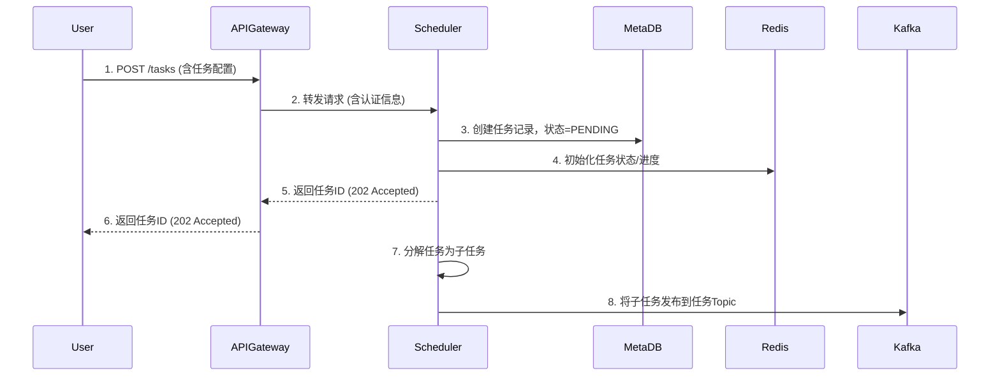
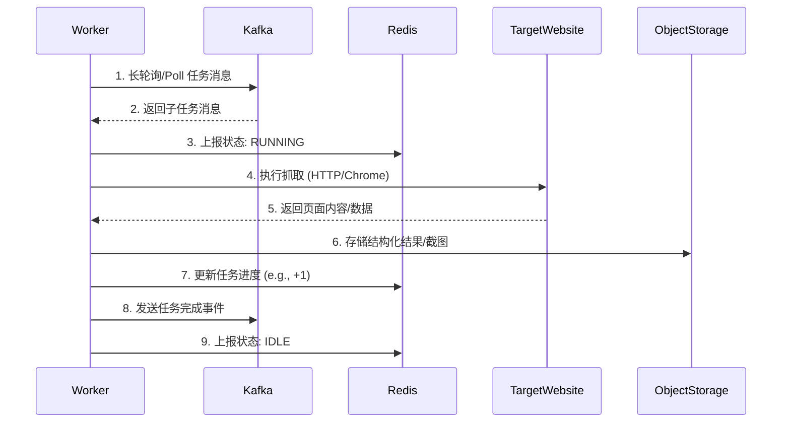
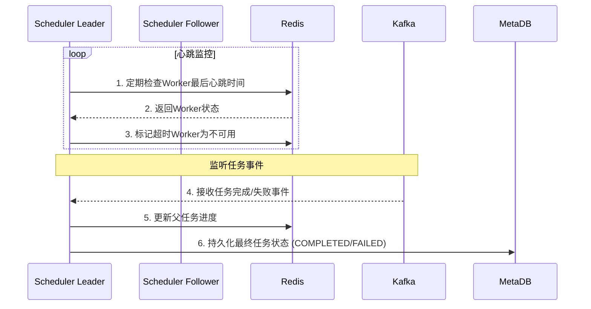
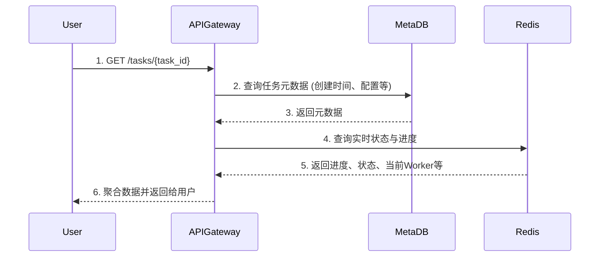

## 系统架构组件概览

在深入流程之前，我们先明确系统中的核心组件：

1.  **用户/客户端 (User/Client)**：提交任务和查询状态。
2.  **API 网关 (API Gateway)**：系统的统一入口，处理认证、路由和限流。
3.  **调度管理器 (Scheduler Manager)**：系统的大脑，负责协调资源、任务调度和状态管理。通常以集群形式部署。
4.  **消息队列 (Message Queue, e.g., Kafka)**：解耦组件，负责任务指令和事件的分发。
5.  **Worker 节点 (Worker Node)**：执行抓取任务的劳动力，可水平扩展。
6.  **元数据存储 (Metadata Storage, e.g., PostgreSQL/MySQL)**：存储任务、用户等持久化元数据。
7.  **状态缓存 (State Cache, e.g., Redis)**：存储快速变化的运行时状态（如心跳、进度、锁）。
8.  **对象存储 (Object Storage, e.g., S3/MinIO)**：存储抓取结果、截图等大型数据。

---

## 核心通信流程详解

### 流程 1: 任务提交与初始化

**目的**：用户创建一个新的抓取任务。

**流程说明**：
1.  用户通过 API 网关提交任务。
2.  API 网关进行身份验证和授权后，将请求转发给一个可用的调度器实例。
3.  调度器在元数据数据库中创建任务记录，初始状态为 `PENDING`。
4.  调度器在 Redis 中初始化该任务的实时状态（如进度、当前正在处理的 URL 等）。
5.  调度器立即向 API 网关返回响应，包含生成的任务 ID。此时任务尚未开始执行，符合异步设计。
6.  API 网关将响应返回给用户。
7.  调度器在内部将大型任务分解为更小的、可并行执行的子任务（如按 URL 分片）。
8.  调度器将这些子任务作为消息发布到 Kafka 的特定任务 Topic 中。这一步将任务调度与任务执行彻底解耦。

---

### 流程 2: Worker 获取与执行任务

**目的**：Worker 从消息队列拉取任务并执行。

**流程说明**：
1.  所有 Worker 都在监听同一个或多个 Kafka 任务 Topic。Kafka 的消费者组机制保证一个子任务只会被一个 Worker 消费。
2.  Worker 从 Kafka 获取到一个子任务消息。
3.  Worker 立即在 Redis 中更新自己和该子任务的状态为 `RUNNING`，并上报心跳。
4.  Worker 根据任务配置（HTTP 或 Chrome 模式）执行实际的抓取操作。
5.  目标网站返回响应。
6.  Worker 将抓取到的结构化数据（如 JSON）、HTML 或截图上传到对象存储（如 S3），并获得一个存储地址。
7.  Worker 在 Redis 中原子性地递增该父任务的完成计数器，其他组件可通过查询此计数器来计算总进度。
8.  Worker 向 Kafka 的“任务事件” Topic 发送一条消息，告知该子任务已完成，并包含结果存储路径。
9.  Worker 将自己状态重置为 `IDLE`，准备接收下一个任务。

---

### 流程 3: 调度器监控与状态聚合

**目的**：调度器集群监控任务执行进度和 Worker 健康状态。

**流程说明**：
1.  **Leader 调度器**（通过选举机制产生）定期扫描 Redis 中所有 Worker 的上次心跳时间戳。
2.  Redis 返回状态数据。
3.  如果某个 Worker 的心跳超时，Leader 调度器将其在 Redis 中的状态标记为 `UNHEALTHY`。其他调度器看到此状态后，不会再向该 Worker 分配任务。Leader 可能会触发该 Worker 上未完成任务的重新分配。
4.  所有调度器都订阅着 Kafka 的“任务事件” Topic，因此它们都能收到任务完成或失败的消息。
5.  当收到一个子任务完成的事件时，某个调度器（通常是 Leader）会负责在 Redis 中更新其父任务的进度。
6.  当 Redis 中的进度显示父任务的所有子任务均已完成时，调度器会更新元数据数据库中的任务最终状态（`COMPLETED`），或将结果归档。如果任务失败，则更新为 `FAILED`。

---

### 流程 4: 多调度器协同 (Leader Election & Coordination)

**目的**：确保多个调度器实例之间不会发生冲突，并能高效协同工作。

**原理与流程**：
*   **领导者选举 (Leader Election)**：
    *   调度器集群使用 **ZooKeeper** 或 **Redis** 实现领导者选举。
    *   所有调度器启动时都尝试在协调服务上创建一个 **Ephemeral** 节点（如 `/scheduler/leader`）。
    *   只有一个调度器能创建成功，它就成为 **Leader**，其他则成为 **Follower**。
    *   Leader 负责执行需要单例执行的关键任务（如全局 Worker 健康检查、重新分配故障 Worker 的任务、平衡负载）。
    *   Follower 仍然可以处理 API 请求和进行基本调度，但听从 Leader 的协调指令。
    *   如果 Leader 宕机，其持有的 Ephemeral 节点会自动消失，其他调度器会立即触发新一轮选举，产生新的 Leader，实现故障转移。

*   **数据同步与冲突避免**：
    *   **状态共享**：所有调度器都从 **Redis** 读取和写入 Worker 状态、任务进度等实时数据。Redis 是单一事实来源（Single Source of Truth），避免了状态不一致。
    *   **分布式锁**：当需要对某个资源（如一个特定的 Worker 或任务）进行原子操作时（如分配任务），调度器会从 Redis 获取一个**分布式锁**。只有拿到锁的调度器才能操作该资源，操作完成后释放锁。这防止了多个调度器将任务同时分配给同一个 Worker。
    *   **消息队列**：通过 Kafka 传递任务和事件，天然解耦了调度器和 Worker，无论有多少个调度器实例，都能通过消费者组机制保证任务不会重复执行。

---

### 流程 5: 用户查询任务状态

**目的**：用户查询自己提交的任务的当前状态和进度。

**流程说明**：
1.  用户向 API 网关发起查询请求。
2.  API 网关首先从元数据数据库中查询任务的静态信息（如创建时间、配置参数、最终状态）。
3.  元数据数据库返回信息。
4.  API 网关接着从 Redis 中查询该任务的动态信息（如实时进度百分比、当前状态`RUNNING`、正在处理它的 WorkerID）。
5.  Redis 返回信息。
6.  API 网关将来自数据库和 Redis 的数据聚合后，返回给用户一个完整的任务状态视图。

## 总结

整个系统的通信设计遵循了以下核心原则：

1.  **解耦 (Decoupling)**：通过 **Kafka** 将任务调度（调度器）与任务执行（Worker）分离，使两者可以独立扩展和演化。
2.  **状态分离 (State Segregation)**：使用 **元数据数据库** 存储持久化数据，使用 **Redis** 存储易变的运行时状态，各司其职，效率最大化。
3.  **单一事实来源 (Single Source of Truth)**：对于共享状态（如 Worker 状态、任务进度），所有组件都从 **Redis** 读写，避免数据不一致。
4.  **最终一致性 (Eventual Consistency)**：系统通过事件（Kafka 消息）驱动状态变化，允许短暂的状态延迟，但最终所有组件的状态会达成一致。
5.  **容错与高可用 (Fault Tolerance & High Availability)**：调度器通过 **领导者选举** 实现高可用，Worker 是无状态的可以随时替换，任务通过 **重试机制** 保证可靠性。

这些流程共同构成了一个弹性、可扩展且健壮的分布式爬虫系统。
