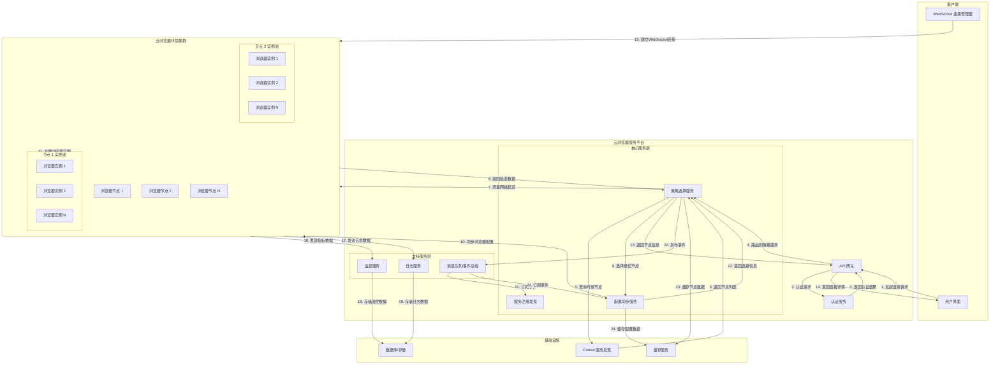
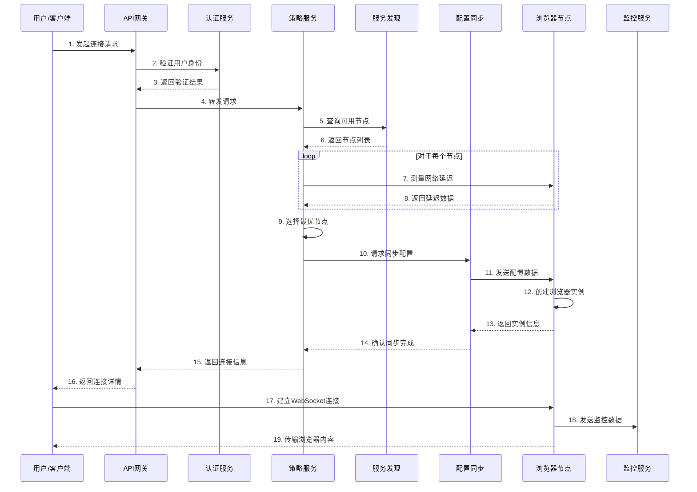
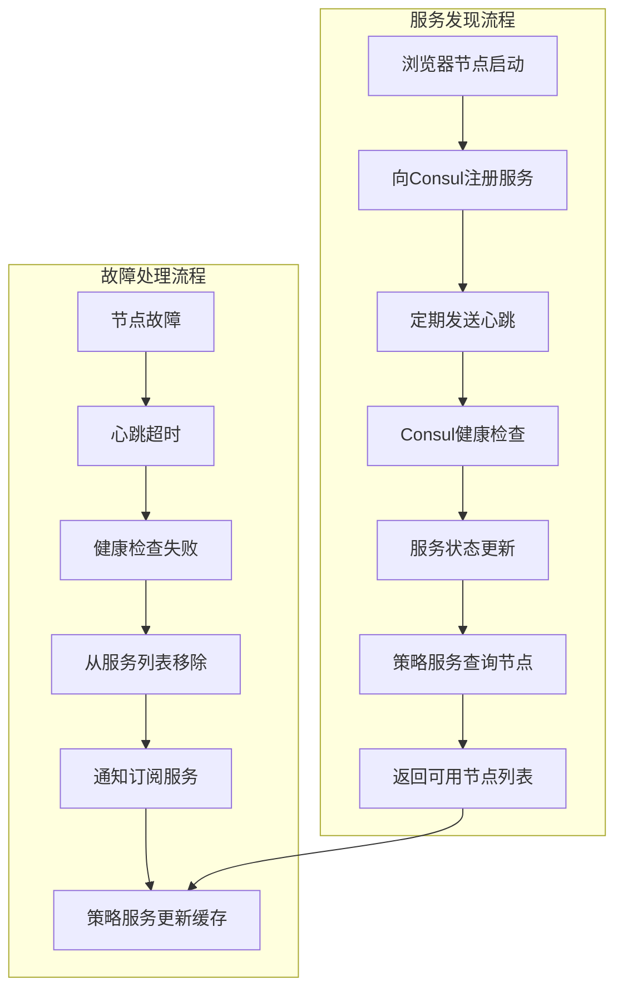

# 云浏览器服务架构设计与实现

基于您的需求，我将设计一个优化的云浏览器服务架构，实现根据网络延迟等策略选择最优云浏览器环境，并在连接成功后同步浏览器配置信息。

## 系统架构图

```
┌─────────────────┐    ┌─────────────────────────────────┐
│    客户端       │    │        云浏览器服务平台         │
│                 │    │                                 │
│  ┌─────────────┐│    │  ┌─────────────┐  ┌───────────┐ │
│  │  用户界面   ││    │  │  API网关    │  │ 认证服务  │ │
│  └─────────────┘│    │  └─────────────┘  └───────────┘ │
│        │        │    │         │               │        │
│  ┌─────────────┐│    │  ┌─────────────────────────────┐ │
│  │  WebSocket ││    │  │       策略选择服务           │ │
│  │  连接管理器 ││    │  └─────────────────────────────┘ │
│  └─────────────┘│    │         │               │        │
└─────────────────┘    │  ┌─────────────┐  ┌───────────┐ │
           │            │  │服务注册发现│  │配置同步服务│ │
           │            │  └─────────────┘  └───────────┘ │
           ▼            │         │               │        │
┌─────────────────────────────────────────────────────────┐
│                 │         ▼               ▼        │    │
│           ┌─────────────────────────────────────────────┐│
│           │           消息队列/事件总线                 ││
│           └─────────────────────────────────────────────┘│
│                 │               │               │        │
└─────────────────┘    ┌─────────────┐  ┌─────────────┐  │
                        │ 监控服务    │  │ 日志服务    │  │
                        └─────────────┘  └─────────────┘  │
                                 │               │        │
                        ┌─────────────────────────────────┐
                        │       云浏览器环境集群          │
                        │                                 │
                        │  ┌─────────┐  ┌─────────┐       │
                        │  │ 节点1   │  │ 节点2   │  ... │
                        │  └─────────┘  └─────────┘       │
                        │     │           │               │
                        │  ┌─────────────────────────────┐│
                        │  │      浏览器实例池           ││
                        │  └─────────────────────────────┘│
                        └─────────────────────────────────┘
```

## 核心服务实现

### 1. 策略选择服务 (Go实现)

```go
// strategy-service/main.go
package main

import (
	"encoding/json"
	"fmt"
	"log"
	"math"
	"net"
	"net/http"
	"sort"
	"sync"
	"time"

	"github.com/gorilla/mux"
	"github.com/hashicorp/consul/api"
)

type BrowserNode struct {
	ID         string  `json:"id"`
	Host       string  `json:"host"`
	Port       int     `json:"port"`
	Region     string  `json:"region"`
	Load       float64 `json:"load"`       // 当前负载 0-1
	Latency    int     `json:"latency"`    // 到客户端的延迟(ms)
	ActiveCons int     `json:"activeCons"` // 活动连接数
	MaxCons    int     `json:"maxCons"`    // 最大连接数
}

type ConnectionRequest struct {
	ClientIP      string                 `json:"client_ip"`
	UserID        string                 `json:"user_id"`
	BrowserConfig map[string]interface{} `json:"browser_config"`
	Preference    Preference             `json:"preference"`
}

type Preference struct {
	Region    string `json:"region,omitempty"`
	MaxLatency int    `json:"max_latency,omitempty"` // 最大可接受延迟
}

type StrategyService struct {
	consulClient *api.Client
	nodes        map[string]BrowserNode
	mutex        sync.RWMutex
}

func NewStrategyService(consulAddr string) (*StrategyService, error) {
	config := api.DefaultConfig()
	config.Address = consulAddr
	client, err := api.NewClient(config)
	if err != nil {
		return nil, err
	}

	return &StrategyService{
		consulClient: client,
		nodes:        make(map[string]BrowserNode),
	}, nil
}

// 测量节点延迟
func (s *StrategyService) measureLatency(node BrowserNode, clientIP string) int {
	start := time.Now()
	conn, err := net.DialTimeout("tcp", fmt.Sprintf("%s:%d", node.Host, node.Port), 2*time.Second)
	if err != nil {
		return math.MaxInt32 // 无法连接，返回极大值
	}
	defer conn.Close()
	
	return int(time.Since(start).Milliseconds())
}

// 选择最优节点
func (s *StrategyService) selectOptimalNode(clientIP string, preference Preference) (BrowserNode, error) {
	s.mutex.RLock()
	defer s.mutex.RUnlock()

	if len(s.nodes) == 0 {
		return BrowserNode{}, fmt.Errorf("no available browser nodes")
	}

	var candidates []BrowserNode
	
	// 筛选符合条件的节点
	for _, node := range s.nodes {
		// 测量延迟（实际中可以缓存测量结果）
		latency := s.measureLatency(node, clientIP)
		
		// 区域偏好匹配
		regionMatch := preference.Region == "" || node.Region == preference.Region
		
		// 延迟要求
		latencyAcceptable := preference.MaxLatency == 0 || latency <= preference.MaxLatency
		
		// 负载检查
		loadAcceptable := node.Load < 0.8 && node.ActiveCons < node.MaxCons
		
		if regionMatch && latencyAcceptable && loadAcceptable {
			candidate := node
			candidate.Latency = latency
			candidates = append(candidates, candidate)
		}
	}

	if len(candidates) == 0 {
		return BrowserNode{}, fmt.Errorf("no suitable browser nodes found")
	}

	// 根据综合评分排序
	sort.Slice(candidates, func(i, j int) bool {
		// 综合评分算法：延迟权重 + 负载权重
		scoreI := float64(candidates[i].Latency)*0.6 + float64(candidates[i].Load)*1000*0.4
		scoreJ := float64(candidates[j].Latency)*0.6 + float64(candidates[j].Load)*1000*0.4
		return scoreI < scoreJ
	})

	return candidates[0], nil
}

// 处理连接请求
func (s *StrategyService) handleConnectionRequest(w http.ResponseWriter, r *http.Request) {
	var req ConnectionRequest
	if err := json.NewDecoder(r.Body).Decode(&req); err != nil {
		http.Error(w, err.Error(), http.StatusBadRequest)
		return
	}

	// 选择最优节点
	node, err := s.selectOptimalNode(req.ClientIP, req.Preference)
	if err != nil {
		http.Error(w, err.Error(), http.StatusServiceUnavailable)
		return
	}

	// 同步浏览器配置到选定节点
	if err := s.syncBrowserConfig(node, req.BrowserConfig, req.UserID); err != nil {
		http.Error(w, fmt.Sprintf("failed to sync config: %v", err), http.StatusInternalServerError)
		return
	}

	// 返回节点信息
	w.Header().Set("Content-Type", "application/json")
	json.NewEncoder(w).Encode(map[string]interface{}{
		"node_id": node.ID,
		"host":    node.Host,
		"port":    node.Port,
		"latency": node.Latency,
	})
}

// 同步浏览器配置
func (s *StrategyService) syncBrowserConfig(node BrowserNode, config map[string]interface{}, userID string) error {
	// 这里实现将配置信息发送到指定节点的逻辑
	// 可以使用HTTP请求、gRPC或消息队列等方式
	
	configData, err := json.Marshal(map[string]interface{}{
		"user_id": userID,
		"config":  config,
	})
	if err != nil {
		return err
	}

	// 示例：使用HTTP POST发送配置
	url := fmt.Sprintf("http://%s:%d/api/config/sync", node.Host, node.Port)
	resp, err := http.Post(url, "application/json", bytes.NewReader(configData))
	if err != nil {
		return err
	}
	defer resp.Body.Close()

	if resp.StatusCode != http.StatusOK {
		return fmt.Errorf("failed to sync config, status: %d", resp.StatusCode)
	}

	return nil
}

// 监听节点变化
func (s *StrategyService) watchNodes() {
	// 使用Consul监听服务变化
	// 实际实现中应该使用Consul的watch机制
	ticker := time.NewTicker(10 * time.Second)
	defer ticker.Stop()

	for range ticker.C {
		services, _, err := s.consulClient.Catalog().Services(nil)
		if err != nil {
			log.Printf("Error querying services: %v", err)
			continue
		}

		s.mutex.Lock()
		for service := range services {
			if service == "browser-node" {
				nodes, _, err := s.consulClient.Health().Service(service, "", true, nil)
				if err != nil {
					log.Printf("Error querying service nodes: %v", err)
					continue
				}

				// 更新节点信息
				for _, node := range nodes {
					nodeID := node.Service.ID
					s.nodes[nodeID] = BrowserNode{
						ID:      nodeID,
						Host:    node.Service.Address,
						Port:    node.Service.Port,
						Region:  node.Service.Meta["region"],
						Load:    0.5, // 从节点获取实际负载
						MaxCons: 100, // 从节点配置获取
					}
				}
			}
		}
		s.mutex.Unlock()
	}
}

func main() {
	// 初始化策略服务
	strategyService, err := NewStrategyService("localhost:8500")
	if err != nil {
		log.Fatalf("Failed to create strategy service: %v", err)
	}

	// 启动节点监听
	go strategyService.watchNodes()

	// 设置HTTP路由
	r := mux.NewRouter()
	r.HandleFunc("/api/connect", strategyService.handleConnectionRequest).Methods("POST")

	log.Println("Strategy service started on :8080")
	log.Fatal(http.ListenAndServe(":8080", r))
}
```

### 2. 云浏览器节点服务 (Go实现)

```go
// browser-node/main.go
package main

import (
	"encoding/json"
	"fmt"
	"log"
	"net/http"
	"os"
	"sync"

	"github.com/gorilla/mux"
	"github.com/hashicorp/consul/api"
)

type BrowserInstance struct {
	ID           string                 `json:"id"`
	UserID       string                 `json:"user_id"`
	Config       map[string]interface{} `json:"config"`
	WebSocketURL string                 `json:"websocket_url"`
}

type BrowserNode struct {
	ID           string
	Host         string
	Port         int
	Region       string
	InstancePool map[string]BrowserInstance
	mutex        sync.RWMutex
	consulClient *api.Client
}

// 注册到Consul
func (n *BrowserNode) registerService() error {
	registration := &api.AgentServiceRegistration{
		ID:      n.ID,
		Name:    "browser-node",
		Address: n.Host,
		Port:    n.Port,
		Meta:    map[string]string{"region": n.Region},
		Check: &api.AgentServiceCheck{
			HTTP:     fmt.Sprintf("http://%s:%d/health", n.Host, n.Port),
			Interval: "10s",
			Timeout:  "5s",
		},
	}

	return n.consulClient.Agent().ServiceRegister(registration)
}

// 处理配置同步
func (n *BrowserNode) handleConfigSync(w http.ResponseWriter, r *http.Request) {
	var data struct {
		UserID string                 `json:"user_id"`
		Config map[string]interface{} `json:"config"`
	}

	if err := json.NewDecoder(r.Body).Decode(&data); err != nil {
		http.Error(w, err.Error(), http.StatusBadRequest)
		return
	}

	// 创建浏览器实例
	instanceID := fmt.Sprintf("%s-%s", data.UserID, generateRandomString(8))
	instance := BrowserInstance{
		ID:     instanceID,
		UserID: data.UserID,
		Config: data.Config,
		WebSocketURL: fmt.Sprintf("ws://%s:%d/ws/%s", n.Host, n.Port, instanceID),
	}

	n.mutex.Lock()
	n.InstancePool[instanceID] = instance
	n.mutex.Unlock()

	// 应用浏览器配置
	if err := n.applyBrowserConfig(instance); err != nil {
		http.Error(w, err.Error(), http.StatusInternalServerError)
		return
	}

	w.Header().Set("Content-Type", "application/json")
	json.NewEncoder(w).Encode(map[string]string{
		"instance_id":   instanceID,
		"websocket_url": instance.WebSocketURL,
	})
}

// 应用浏览器配置（伪代码）
func (n *BrowserNode) applyBrowserConfig(instance BrowserInstance) error {
	// 这里实现具体的浏览器配置逻辑
	// 可能包括：
	// 1. 启动浏览器进程/容器
	// 2. 应用用户配置（分辨率、插件、书签等）
	// 3. 设置WebSocket代理
	
	log.Printf("Applying config for instance %s: %+v", instance.ID, instance.Config)
	return nil
}

// 健康检查端点
func (n *BrowserNode) healthCheck(w http.ResponseWriter, r *http.Request) {
	w.Header().Set("Content-Type", "application/json")
	json.NewEncoder(w).Encode(map[string]interface{}{
		"status":    "healthy",
		"node_id":   n.ID,
		"instances": len(n.InstancePool),
	})
}

// 获取节点状态
func (n *BrowserNode) getStatus(w http.ResponseWriter, r *http.Request) {
	n.mutex.RLock()
	defer n.mutex.RUnlock()

	w.Header().Set("Content-Type", "application/json")
	json.NewEncoder(w).Encode(map[string]interface{}{
		"node_id":   n.ID,
		"host":      n.Host,
		"port":      n.Port,
		"region":    n.Region,
		"instances": len(n.InstancePool),
		"load":      float64(len(n.InstancePool)) / 100.0, // 简单负载计算
	})
}

func main() {
	// 获取环境变量
	nodeID := os.Getenv("NODE_ID")
	if nodeID == "" {
		nodeID = generateRandomString(8)
	}

	host := os.Getenv("HOST")
	if host == "" {
		host = "localhost"
	}

	port := 8080
	region := os.Getenv("REGION")
	if region == "" {
		region = "default"
	}

	// 初始化Consul客户端
	consulConfig := api.DefaultConfig()
	consulConfig.Address = os.Getenv("CONSUL_ADDR")
	if consulConfig.Address == "" {
		consulConfig.Address = "localhost:8500"
	}

	consulClient, err := api.NewClient(consulConfig)
	if err != nil {
		log.Fatalf("Failed to create Consul client: %v", err)
	}

	// 创建浏览器节点
	node := &BrowserNode{
		ID:           nodeID,
		Host:         host,
		Port:         port,
		Region:       region,
		InstancePool: make(map[string]BrowserInstance),
		consulClient: consulClient,
	}

	// 注册服务
	if err := node.registerService(); err != nil {
		log.Fatalf("Failed to register service: %v", err)
	}

	// 设置HTTP路由
	r := mux.NewRouter()
	r.HandleFunc("/api/config/sync", node.handleConfigSync).Methods("POST")
	r.HandleFunc("/health", node.healthCheck)
	r.HandleFunc("/status", node.getStatus)
	// WebSocket端点
	r.HandleFunc("/ws/{instanceId}", node.handleWebSocket)

	log.Printf("Browser node %s started on %s:%d", nodeID, host, port)
	log.Fatal(http.ListenAndServe(fmt.Sprintf(":%d", port), r))
}

func generateRandomString(length int) string {
	// 实现随机字符串生成
	return "random123"
}
```

### 3. API网关实现 (Go + Traefik)

```yaml
# docker-compose.yml
version: '3.8'

services:
  # API网关 (使用Traefik)
  traefik:
    image: traefik:v2.5
    command:
      - --api.insecure=true
      - --providers.docker=true
      - --providers.consulcatalog.endpoint.address=http://consul:8500
      - --entrypoints.web.address=:80
    ports:
      - "80:80"
      - "8080:8080" # Dashboard
    volumes:
      - /var/run/docker.sock:/var/run/docker.sock:ro
    depends_on:
      - consul

  # 服务发现
  consul:
    image: consul:1.10
    ports:
      - "8500:8500"
    command: agent -dev -client=0.0.0.0

  # 策略服务
  strategy-service:
    build: ./strategy-service
    environment:
      - CONSUL_ADDR=consul:8500
    labels:
      - "traefik.http.routers.strategy.rule=PathPrefix(`/api/connect`)"
      - "traefik.http.services.strategy.loadbalancer.server.port=8080"
    depends_on:
      - consul

  # 浏览器节点集群
  browser-node-1:
    build: ./browser-node
    environment:
      - NODE_ID=node-1
      - HOST=browser-node-1
      - PORT=8080
      - REGION=us-west
      - CONSUL_ADDR=consul:8500
    labels:
      - "traefik.enable=true"
    depends_on:
      - consul

  browser-node-2:
    build: ./browser-node
    environment:
      - NODE_ID=node-2
      - HOST=browser-node-2
      - PORT=8080
      - REGION=eu-central
      - CONSUL_ADDR=consul:8500
    labels:
      - "traefik.enable=true"
    depends_on:
      - consul

  # 监控和日志服务
  prometheus:
    image: prom/prometheus
    ports:
      - "9090:9090"
    volumes:
      - ./prometheus.yml:/etc/prometheus/prometheus.yml

  grafana:
    image: grafana/grafana
    ports:
      - "3000:3000"
    environment:
      - GF_SECURITY_ADMIN_PASSWORD=admin
    volumes:
      - grafana-data:/var/lib/grafana

volumes:
  grafana-data:
```

## 工作流程

1. **客户端连接**：
   - 客户端向API网关发送连接请求，包含客户端IP、用户ID和浏览器配置
   - API网关将请求路由到策略服务

2. **节点选择**：
   - 策略服务从Consul获取所有可用浏览器节点
   - 测量各节点到客户端的网络延迟
   - 根据延迟、负载和用户偏好选择最优节点

3. **配置同步**：
   - 策略服务将浏览器配置同步到选定节点
   - 浏览器节点创建实例并应用配置

4. **连接建立**：
   - 策略服务返回节点连接信息给客户端
   - 客户端通过WebSocket直接连接到浏览器节点

5. **会话管理**：
   - 浏览器节点管理浏览器实例的生命周期
   - 监控服务收集指标和日志

## 优化策略

1. **延迟优化**：
   - 实现延迟测量缓存，避免每次请求都测量
   - 使用CDN或边缘计算节点减少网络延迟

2. **负载均衡**：
   - 实现更复杂的负载均衡算法，考虑CPU、内存和网络带宽
   - 支持动态扩展和收缩节点集群

3. **容错机制**：
   - 实现节点健康检查和自动故障转移
   - 支持会话持久化和恢复

4. **安全性**：
   - 实现TLS加密通信
   - 添加身份验证和授权机制
   - 实施网络隔离和防火墙规则

这个架构提供了高度可扩展的云浏览器服务，能够根据网络延迟等策略智能选择最优节点，并确保浏览器配置的正确同步。

# 服务发现 Agent 实现

下面我将提供一个完整的服务发现 Agent 实现，使用 Go 语言编写，支持服务注册、健康检查和服务发现功能。

## 核心实现

```go
// discovery-agent/main.go
package main

import (
	"context"
	"encoding/json"
	"fmt"
	"log"
	"net"
	"net/http"
	"os"
	"os/signal"
	"sync"
	"syscall"
	"time"

	"github.com/hashicorp/consul/api"
	"github.com/hashicorp/consul/api/watch"
)

// ServiceInfo 服务信息结构
type ServiceInfo struct {
	ID      string            `json:"id"`
	Name    string            `json:"name"`
	Address string            `json:"address"`
	Port    int               `json:"port"`
	Tags    []string          `json:"tags,omitempty"`
	Meta    map[string]string `json:"meta,omitempty"`
}

// HealthCheck 健康检查配置
type HealthCheck struct {
	HTTP     string        `json:"http,omitempty"`     // HTTP检查端点
	Interval time.Duration `json:"interval,omitempty"` // 检查间隔
	Timeout  time.Duration `json:"timeout,omitempty"`  // 检查超时
	TTL      time.Duration `json:"ttl,omitempty"`      // TTL检查方式
}

// DiscoveryAgent 服务发现代理
type DiscoveryAgent struct {
	consulClient    *api.Client
	serviceID       string
	serviceInfo     ServiceInfo
	healthCheck     HealthCheck
	registered      bool
	watchPlans      map[string]*watch.Plan
	serviceCache    map[string][]*api.ServiceEntry
	cacheMutex      sync.RWMutex
	shutdownCh      chan struct{}
	shutdownOnce    sync.Once
}

// NewDiscoveryAgent 创建新的服务发现代理
func NewDiscoveryAgent(consulAddr string, serviceInfo ServiceInfo, healthCheck HealthCheck) (*DiscoveryAgent, error) {
	config := api.DefaultConfig()
	if consulAddr != "" {
		config.Address = consulAddr
	}

	client, err := api.NewClient(config)
	if err != nil {
		return nil, fmt.Errorf("failed to create Consul client: %v", err)
	}

	// 如果没有指定服务ID，生成一个
	if serviceInfo.ID == "" {
		hostname, _ := os.Hostname()
		serviceInfo.ID = fmt.Sprintf("%s-%s-%d", serviceInfo.Name, hostname, serviceInfo.Port)
	}

	// 如果没有指定地址，使用本地IP
	if serviceInfo.Address == "" {
		ip, err := getLocalIP()
		if err != nil {
			return nil, fmt.Errorf("failed to get local IP: %v", err)
		}
		serviceInfo.Address = ip
	}

	agent := &DiscoveryAgent{
		consulClient: client,
		serviceID:    serviceInfo.ID,
		serviceInfo:  serviceInfo,
		healthCheck:  healthCheck,
		watchPlans:   make(map[string]*watch.Plan),
		serviceCache: make(map[string][]*api.ServiceEntry),
		shutdownCh:   make(chan struct{}),
	}

	return agent, nil
}

// getLocalIP 获取本地IP地址
func getLocalIP() (string, error) {
	addrs, err := net.InterfaceAddrs()
	if err != nil {
		return "", err
	}

	for _, addr := range addrs {
		if ipnet, ok := addr.(*net.IPNet); ok && !ipnet.IP.IsLoopback() {
			if ipnet.IP.To4() != nil {
				return ipnet.IP.String(), nil
			}
		}
	}

	return "", fmt.Errorf("no non-loopback IP address found")
}

// Register 注册服务到Consul
func (a *DiscoveryAgent) Register() error {
	registration := &api.AgentServiceRegistration{
		ID:      a.serviceID,
		Name:    a.serviceInfo.Name,
		Address: a.serviceInfo.Address,
		Port:    a.serviceInfo.Port,
		Tags:    a.serviceInfo.Tags,
		Meta:    a.serviceInfo.Meta,
	}

	// 添加健康检查
	if a.healthCheck.HTTP != "" {
		registration.Check = &api.AgentServiceCheck{
			HTTP:                           a.healthCheck.HTTP,
			Interval:                       a.healthCheck.Interval.String(),
			Timeout:                        a.healthCheck.Timeout.String(),
			DeregisterCriticalServiceAfter: "10m", // 10分钟后自动注销不健康服务
		}
	} else if a.healthCheck.TTL > 0 {
		registration.Check = &api.AgentServiceCheck{
			TTL:    a.healthCheck.TTL.String(),
			Status: api.HealthPassing,
		}
	}

	err := a.consulClient.Agent().ServiceRegister(registration)
	if err != nil {
		return fmt.Errorf("failed to register service: %v", err)
	}

	a.registered = true
	log.Printf("Service %s registered successfully", a.serviceID)

	// 如果使用TTL检查，启动心跳
	if a.healthCheck.TTL > 0 {
		go a.heartbeat()
	}

	return nil
}

// Deregister 从Consul注销服务
func (a *DiscoveryAgent) Deregister() error {
	if !a.registered {
		return nil
	}

	err := a.consulClient.Agent().ServiceDeregister(a.serviceID)
	if err != nil {
		return fmt.Errorf("failed to deregister service: %v", err)
	}

	a.registered = false
	log.Printf("Service %s deregistered successfully", a.serviceID)
	return nil
}

// heartbeat TTL心跳
func (a *DiscoveryAgent) heartbeat() {
	ticker := time.NewTicker(a.healthCheck.TTL / 2)
	defer ticker.Stop()

	for {
		select {
		case <-ticker.C:
			err := a.consulClient.Agent().UpdateTTL("service:"+a.serviceID, "heartbeat", api.HealthPassing)
			if err != nil {
				log.Printf("Failed to send heartbeat: %v", err)
			}
		case <-a.shutdownCh:
			return
		}
	}
}

// WatchService 监听服务变化
func (a *DiscoveryAgent) WatchService(serviceName string) error {
	params := map[string]interface{}{
		"type":        "service",
		"service":     serviceName,
		"passingonly": true,
	}

	plan, err := watch.Parse(params)
	if err != nil {
		return fmt.Errorf("failed to create watch plan: %v", err)
	}

	plan.Handler = func(idx uint64, data interface{}) {
		entries, ok := data.([]*api.ServiceEntry)
		if !ok {
			log.Printf("Unexpected data type from watch: %T", data)
			return
		}

		a.cacheMutex.Lock()
		a.serviceCache[serviceName] = entries
		a.cacheMutex.Unlock()

		log.Printf("Service %s updated: %d instances", serviceName, len(entries))
	}

	a.watchPlans[serviceName] = plan

	// 启动监听
	go func() {
		if err := plan.RunWithClientAndHclog(a.consulClient, nil); err != nil {
			log.Printf("Watch for service %s failed: %v", serviceName, err)
		}
	}()

	log.Printf("Watching service %s for changes", serviceName)
	return nil
}

// GetService 获取服务实例列表
func (a *DiscoveryAgent) GetService(serviceName string) ([]*api.ServiceEntry, error) {
	a.cacheMutex.RLock()
	cached, exists := a.serviceCache[serviceName]
	a.cacheMutex.RUnlock()

	if exists {
		return cached, nil
	}

	// 如果没有缓存，直接查询
	services, _, err := a.consulClient.Health().Service(serviceName, "", true, nil)
	if err != nil {
		return nil, fmt.Errorf("failed to query service %s: %v", serviceName, err)
	}

	a.cacheMutex.Lock()
	a.serviceCache[serviceName] = services
	a.cacheMutex.Unlock()

	return services, nil
}

// GetServiceWithFilter 获取过滤后的服务实例
func (a *DiscoveryAgent) GetServiceWithFilter(serviceName string, filterFunc func(*api.ServiceEntry) bool) ([]*api.ServiceEntry, error) {
	services, err := a.GetService(serviceName)
	if err != nil {
		return nil, err
	}

	var filtered []*api.ServiceEntry
	for _, service := range services {
		if filterFunc(service) {
			filtered = append(filtered, service)
		}
	}

	return filtered, nil
}

// GetServiceByTag 根据标签获取服务实例
func (a *DiscoveryAgent) GetServiceByTag(serviceName, tag string) ([]*api.ServiceEntry, error) {
	return a.GetServiceWithFilter(serviceName, func(service *api.ServiceEntry) bool {
		for _, t := range service.Service.Tags {
			if t == tag {
				return true
			}
		}
		return false
	})
}

// GetServiceByMeta 根据元数据获取服务实例
func (a *DiscoveryAgent) GetServiceByMeta(serviceName, key, value string) ([]*api.ServiceEntry, error) {
	return a.GetServiceWithFilter(serviceName, func(service *api.ServiceEntry) bool {
		if metaVal, exists := service.Service.Meta[key]; exists {
			return metaVal == value
		}
		return false
	})
}

// StartHealthServer 启动健康检查服务器
func (a *DiscoveryAgent) StartHealthServer(port int) {
	http.HandleFunc("/health", func(w http.ResponseWriter, r *http.Request) {
		w.Header().Set("Content-Type", "application/json")
		json.NewEncoder(w).Encode(map[string]string{"status": "healthy"})
	})

	addr := fmt.Sprintf(":%d", port)
	log.Printf("Health check server started on %s", addr)
	go http.ListenAndServe(addr, nil)
}

// Shutdown 优雅关闭
func (a *DiscoveryAgent) Shutdown() {
	a.shutdownOnce.Do(func() {
		close(a.shutdownCh)

		// 停止所有监听
		for _, plan := range a.watchPlans {
			plan.Stop()
		}

		// 注销服务
		if err := a.Deregister(); err != nil {
			log.Printf("Error during deregistration: %v", err)
		}

		log.Println("Discovery agent shutdown completed")
	})
}

// WaitForSignal 等待终止信号
func (a *DiscoveryAgent) WaitForSignal() {
	sigCh := make(chan os.Signal, 1)
	signal.Notify(sigCh, syscall.SIGINT, syscall.SIGTERM)

	<-sigCh
	log.Println("Received shutdown signal")
	a.Shutdown()
}

// Run 运行服务发现代理
func (a *DiscoveryAgent) Run(healthPort int, watchServices []string) error {
	// 启动健康检查服务器
	if a.healthCheck.HTTP != "" {
		a.StartHealthServer(healthPort)
	}

	// 注册服务
	if err := a.Register(); err != nil {
		return err
	}

	// 监听指定服务
	for _, service := range watchServices {
		if err := a.WatchService(service); err != nil {
			log.Printf("Failed to watch service %s: %v", service, err)
		}
	}

	// 等待终止信号
	a.WaitForSignal()
	return nil
}
```

## 使用示例

```go
// main.go
package main

import (
	"log"
	"time"
)

func main() {
	// 服务配置
	serviceInfo := ServiceInfo{
		Name:    "browser-node",
		Address: "", // 自动获取
		Port:    8080,
		Tags:    []string{"cloud", "browser"},
		Meta: map[string]string{
			"region": "us-west",
			"zone":   "zone-a",
		},
	}

	// 健康检查配置
	healthCheck := HealthCheck{
		HTTP:     "http://:8080/health",
		Interval: 10 * time.Second,
		Timeout:  5 * time.Second,
	}

	// 创建服务发现代理
	agent, err := NewDiscoveryAgent("localhost:8500", serviceInfo, healthCheck)
	if err != nil {
		log.Fatalf("Failed to create discovery agent: %v", err)
	}

	// 要监听的服务列表
	watchServices := []string{
		"browser-node",
		"strategy-service",
		"config-service",
	}

	// 运行代理
	if err := agent.Run(8080, watchServices); err != nil {
		log.Fatalf("Failed to run discovery agent: %v", err)
	}
}
```

## Docker 集成

```dockerfile
# Dockerfile
FROM golang:1.19-alpine AS builder

WORKDIR /app

COPY go.mod ./
COPY go.sum ./
RUN go mod download

COPY *.go ./

RUN go build -o /discovery-agent

FROM alpine:3.16

RUN apk --no-cache add ca-certificates

WORKDIR /root/

COPY --from=builder /discovery-agent .

EXPOSE 8080

CMD ["./discovery-agent"]
```

## Kubernetes 部署配置

```yaml
# deployment.yaml
apiVersion: apps/v1
kind: Deployment
metadata:
  name: browser-node
  labels:
    app: browser-node
spec:
  replicas: 3
  selector:
    matchLabels:
      app: browser-node
  template:
    metadata:
      labels:
        app: browser-node
      annotations:
        consul.hashicorp.com/connect-inject: "true"
        consul.hashicorp.com/service-tags: "cloud,browser"
        consul.hashicorp.com/service-meta-region: "us-west"
        consul.hashicorp.com/service-meta-zone: "zone-a"
    spec:
      containers:
      - name: browser-node
        image: browser-node:latest
        ports:
        - containerPort: 8080
        env:
        - name: CONSUL_HTTP_ADDR
          value: "consul-server:8500"
        - name: NODE_ID
          valueFrom:
            fieldRef:
              fieldPath: metadata.name
        - name: POD_IP
          valueFrom:
            fieldRef:
              fieldPath: status.podIP
        - name: DISCOVERY_AGENT_ENABLED
          value: "true"
      - name: discovery-agent
        image: discovery-agent:latest
        env:
        - name: CONSUL_HTTP_ADDR
          value: "consul-server:8500"
        - name: SERVICE_NAME
          value: "browser-node"
        - name: SERVICE_PORT
          value: "8080"
        - name: SERVICE_ADDRESS
          valueFrom:
            fieldRef:
              fieldPath: status.podIP
        - name: SERVICE_TAGS
          value: "cloud,browser"
        - name: SERVICE_META_REGION
          value: "us-west"
        - name: SERVICE_META_ZONE
          value: "zone-a"
        - name: HEALTH_CHECK_PORT
          value: "8080"
---
apiVersion: v1
kind: Service
metadata:
  name: browser-node
  annotations:
    consul.hashicorp.com/service-tags: "cloud,browser"
    consul.hashicorp.com/service-meta-region: "us-west"
    consul.hashicorp.com/service-meta-zone: "zone-a"
spec:
  selector:
    app: browser-node
  ports:
  - name: http
    port: 8080
    targetPort: 8080
  clusterIP: None
```

## 配置管理

```yaml
# config.yaml
discovery:
  consul:
    address: "consul-server:8500"
    token: "" # ACL token if needed
  
  service:
    name: "browser-node"
    id: "" # auto-generated if empty
    address: "" # auto-detected if empty
    port: 8080
    tags: ["cloud", "browser"]
    meta:
      region: "us-west"
      zone: "zone-a"
  
  health:
    http: "/health"
    interval: "10s"
    timeout: "5s"
    ttl: "" # if using TTL instead of HTTP
  
  watch:
    services: ["browser-node", "strategy-service", "config-service"]
  
  health_server:
    port: 8080
```

## 高级功能扩展

```go
// advanced-features.go
package main

import (
	"crypto/tls"
	"net/http"
	"strings"

	"github.com/hashicorp/consul/api"
)

// TLSOptions TLS配置选项
type TLSOptions struct {
	Enabled    bool   `json:"enabled"`
	CAFile     string `json:"ca_file,omitempty"`
	CertFile   string `json:"cert_file,omitempty"`
	KeyFile    string `json:"key_file,omitempty"`
	ServerName string `json:"server_name,omitempty"`
}

// AdvancedDiscoveryAgent 高级服务发现代理
type AdvancedDiscoveryAgent struct {
	*DiscoveryAgent
	tlsOptions TLSOptions
}

// NewAdvancedDiscoveryAgent 创建高级服务发现代理
func NewAdvancedDiscoveryAgent(consulAddr string, serviceInfo ServiceInfo, healthCheck HealthCheck, tlsOptions TLSOptions) (*AdvancedDiscoveryAgent, error) {
	// 创建基本代理
	baseAgent, err := NewDiscoveryAgent(consulAddr, serviceInfo, healthCheck)
	if err != nil {
		return nil, err
	}

	// 如果启用TLS，配置HTTPS客户端
	if tlsOptions.Enabled {
		config := &tls.Config{
			ServerName: tlsOptions.ServerName,
		}

		if tlsOptions.CAFile != "" {
			// 加载CA证书
			// 实际实现中应该从文件加载证书
		}

		if tlsOptions.CertFile != "" && tlsOptions.KeyFile != "" {
			// 加载客户端证书
			// 实际实现中应该从文件加载证书
		}

		transport := &http.Transport{TLSClientConfig: config}
		baseAgent.consulClient = &api.Client{
			Address: consulAddr,
			Scheme:  "https",
			HttpClient: &http.Client{
				Transport: transport,
			},
		}
	}

	agent := &AdvancedDiscoveryAgent{
		DiscoveryAgent: baseAgent,
		tlsOptions:     tlsOptions,
	}

	return agent, nil
}

// WatchWithCustomFilter 使用自定义过滤器监听服务
func (a *AdvancedDiscoveryAgent) WatchWithCustomFilter(serviceName string, filter map[string]string) error {
	params := map[string]interface{}{
		"type":    "service",
		"service": serviceName,
	}

	// 添加过滤条件
	if len(filter) > 0 {
		var filterExpr []string
		for k, v := range filter {
			filterExpr = append(filterExpr, fmt.Sprintf("%s == %q", k, v))
		}
		params["filter"] = strings.Join(filterExpr, " and ")
	}

	plan, err := watch.Parse(params)
	if err != nil {
		return fmt.Errorf("failed to create watch plan: %v", err)
	}

	plan.Handler = func(idx uint64, data interface{}) {
		entries, ok := data.([]*api.ServiceEntry)
		if !ok {
			log.Printf("Unexpected data type from watch: %T", data)
			return
		}

		a.cacheMutex.Lock()
		a.serviceCache[serviceName] = entries
		a.cacheMutex.Unlock()

		log.Printf("Service %s updated with custom filter: %d instances", serviceName, len(entries))
	}

	a.watchPlans[serviceName] = plan

	// 启动监听
	go func() {
		if err := plan.RunWithClientAndHclog(a.consulClient, nil); err != nil {
			log.Printf("Watch for service %s failed: %v", serviceName, err)
		}
	}()

	log.Printf("Watching service %s with custom filter", serviceName)
	return nil
}

// GetHealthyServices 获取健康服务列表（带缓存）
func (a *AdvancedDiscoveryAgent) GetHealthyServices(serviceName string) ([]*api.ServiceEntry, error) {
	a.cacheMutex.RLock()
	cached, exists := a.serviceCache[serviceName]
	a.cacheMutex.RUnlock()

	if exists {
		return cached, nil
	}

	// 如果没有缓存，查询并缓存结果
	services, err := a.GetService(serviceName)
	if err != nil {
		return nil, err
	}

	return services, nil
}

// SubscribeToEvents 订阅Consul事件
func (a *AdvancedDiscoveryAgent) SubscribeToEvents(eventName string, handler func(*api.UserEvent)) error {
	params := map[string]interface{}{
		"type": "event",
		"name": eventName,
	}

	plan, err := watch.Parse(params)
	if err != nil {
		return fmt.Errorf("failed to create event watch plan: %v", err)
	}

	plan.Handler = func(idx uint64, data interface{}) {
		if event, ok := data.(*api.UserEvent); ok {
			handler(event)
		}
	}

	go func() {
		if err := plan.RunWithClientAndHclog(a.consulClient, nil); err != nil {
			log.Printf("Event subscription for %s failed: %v", eventName, err)
		}
	}()

	log.Printf("Subscribed to events: %s", eventName)
	return nil
}
```

## 监控和指标

```go
// metrics.go
package main

import (
	"expvar"
	"net/http"
	"time"

	"github.com/prometheus/client_golang/prometheus"
	"github.com/prometheus/client_golang/prometheus/promauto"
	"github.com/prometheus/client_golang/prometheus/promhttp"
)

// Metrics 监控指标
type Metrics struct {
	servicesDiscovered   prometheus.Gauge
	serviceUpdates       prometheus.Counter
	registrationAttempts prometheus.Counter
	registrationErrors   prometheus.Counter
	discoveryLatency     prometheus.Histogram
}

// NewMetrics 创建监控指标
func NewMetrics(reg prometheus.Registerer) *Metrics {
	return &Metrics{
		servicesDiscovered: promauto.With(reg).NewGauge(prometheus.GaugeOpts{
			Name: "discovery_services_discovered",
			Help: "Number of services currently discovered",
		}),
		serviceUpdates: promauto.With(reg).NewCounter(prometheus.CounterOpts{
			Name: "discovery_service_updates_total",
			Help: "Total number of service updates received",
		}),
		registrationAttempts: promauto.With(reg).NewCounter(prometheus.CounterOpts{
			Name: "discovery_registration_attempts_total",
			Help: "Total number of service registration attempts",
		}),
		registrationErrors: promauto.With(reg).NewCounter(prometheus.CounterOpts{
			Name: "discovery_registration_errors_total",
			Help: "Total number of service registration errors",
		}),
		discoveryLatency: promauto.With(reg).NewHistogram(prometheus.HistogramOpts{
			Name:    "discovery_query_latency_seconds",
			Help:    "Latency of service discovery queries",
			Buckets: prometheus.DefBuckets,
		}),
	}
}

// StartMetricsServer 启动指标服务器
func (a *DiscoveryAgent) StartMetricsServer(port int, metrics *Metrics) {
	// Prometheus指标
	http.Handle("/metrics", promhttp.Handler())
	
	// Expvar指标
	http.Handle("/debug/vars", expvar.Handler())
	
	// 健康检查
	http.HandleFunc("/health", func(w http.ResponseWriter, r *http.Request) {
		w.Header().Set("Content-Type", "application/json")
		status := "healthy"
		if !a.registered {
			status = "unhealthy"
			w.WriteHeader(http.StatusServiceUnavailable)
		}
		json.NewEncoder(w).Encode(map[string]string{"status": status})
	})

	addr := fmt.Sprintf(":%d", port)
	log.Printf("Metrics server started on %s", addr)
	go http.ListenAndServe(addr, nil)
}

// InstrumentedGetService 带监控的服务发现
func (a *DiscoveryAgent) InstrumentedGetService(serviceName string, metrics *Metrics) ([]*api.ServiceEntry, error) {
	start := time.Now()
	defer func() {
		metrics.discoveryLatency.Observe(time.Since(start).Seconds())
	}()

	services, err := a.GetService(serviceName)
	if err != nil {
		return nil, err
	}

	metrics.servicesDiscovered.Set(float64(len(services)))
	metrics.serviceUpdates.Inc()

	return services, nil
}
```

这个服务发现 Agent 实现提供了完整的服务注册、健康检查和服务发现功能，支持多种部署环境（包括 Docker 和 Kubernetes），并包含了监控和高级功能扩展。您可以根据实际需求进行调整和扩展。

# 云浏览器服务 Mermaid 流程图

根据我们的对话内容，我创建了以下 Mermaid 流程图来展示云浏览器服务的完整架构和工作流程：



## 详细流程说明

### 1. 客户端连接流程
1. 用户通过客户端界面发起连接请求
2. 请求到达API网关，进行认证
3. 认证服务验证用户身份
4. API网关将请求路由到策略选择服务
5. 策略服务查询服务发现获取可用节点列表
6. 策略服务测量各节点到客户端的网络延迟
7. 根据延迟、负载等因素选择最优节点
8. 配置同步服务将浏览器配置同步到选定节点
9. 浏览器节点创建实例并应用配置
10. 返回连接信息给客户端
11. 客户端通过WebSocket直接连接到浏览器节点

### 2. 服务治理流程
- 服务注册：浏览器节点启动时向Consul注册服务
- 健康检查：Consul定期检查节点健康状态
- 服务发现：策略服务通过Consul发现可用节点
- 负载均衡：策略服务根据节点负载进行智能路由
- 故障转移：当节点不可用时自动切换到备用节点

### 3. 数据流流程
- 监控数据：浏览器节点向监控服务发送性能指标
- 日志数据：所有服务向日志服务发送运行日志
- 事件通知：通过消息队列实现服务间解耦通信
- 缓存访问：频繁访问的数据缓存到Redis等缓存服务

## 组件交互时序图



## 服务发现详细流程



这个流程图展示了云浏览器服务的完整架构，包括客户端交互、服务间通信、服务发现机制和故障处理流程。每个组件都有明确的职责，并通过清晰的接口进行交互，确保了系统的高可用性和可扩展性。
