# LVS手册 

LVS手册是为了给LVS用户和开发者提供一个完整的参考手册。也希望大家提供LVS相关的好文章以及使用经验。
    
如何给出合理的框架和有效的设计方法，来建立高性能、高可伸缩、高可用的网络服务，这是摆在研究者和系统设计者面前极富挑战性的任务。下面文章就是围绕这一任务展开的。


##可伸缩网络服务的设计与实现
    
人类社会正在进入以网络为中心的信息时代，人们需要更快捷、更可靠、功能更丰富的网络服务。万维网的流行促进互联网使用的指数级增长，现在很多站点收到前所未有的访问负载，经常担心系统如何被扩展来满足不断增长的性能需求，同时系统如何保持24x7的可用性。未来的应用将需要更高的吞吐率、更好的交互性、更高的安全性，这要求服务平台具有更强的处理能力和更高的可用性。所以，如何给出合理的框架和有效的设计方法，来建立高性能、高可伸缩、高可用的网络服务，这是摆在研究者和系统设计者面前极富挑战性的任务。本文研究和设计的可伸缩网络服务便是围绕这一任务展开的。

1. [可伸缩网络服务的体系结构](#1)
    1. [可伸缩网络服务的定义](#1.1)
    2. [网络服务的需求](#1.2)
    3. [LVS集群的体系结构](#1.3)
        1. [LVS集群的通用结构](#1.3.1)
        2. [可伸缩Web和媒体服务](#1.3.2)
        3. [可伸缩Cache服务](#1.3.3)
        4. [可伸缩邮件服务](#1.3.4)
    4. [地理分布LVS集群的体系结构](#1.4)
        1. [体系结构](#1.4.1)
        2. [基于BGP的地理分布服务器集群调度](#1.4.2)
        3. [服务器集群间的负载均衡](#1.4.3)
    5. [小结](#1.5)
    
2. [IP负载均衡技术](#2)
    1. [通过NAT实现虚拟服务器（VS/NAT）](#2.1)
    2. [通过IP隧道实现虚拟服务器（VS/TUN）](#2.2)
    3. [通过直接路由实现虚拟服务器（VS/DR）](#2.3)
    4. [三种方法的优缺点比较](#2.4)
    5. [小结](#2.5)
    
3. [负载调度](#3)
    1. [内核中的连接调度算法](#3.1)
        1. [轮叫调度（Round-Robin Scheduling）](#3.1.1)
        2. [加权轮叫调度（Weighted Round-Robin Scheduling）](#3.1.2)
        3. [最小连接调度（Least-Connection Scheduling）](#3.1.3)
        4. [加权最小连接调度（Weighted Least-Connection Scheduling）](#3.1.4)
        5. [基于局部性的最少链接（Locality-Based Least Connections Scheduling）](#3.1.5)
        6. [带复制的基于局部性最少链接（Locality-Based Least Connections with Replication Scheduling）](#3.1.6)
        7. [目标地址散列调度（Destination Hashing Scheduling）](#3.1.7)
        8. [源地址散列调度（Source Hashing Scheduling）](#3.1.8)
    2. [动态反馈负载均衡算法](#3.2)
        1. [连接调度](#3.2.1)
        2. [动态反馈负载均衡机制](#3.2.2)
        3. [综合负载](#3.2.3)
        4. [权值计算](#3.2.4)
        5. [一个实现例子](#3.2.5)
    3. [小结](#3.3)
    
4. [IP虚拟服务器的实现和性能测试](#4)
    1. [系统实现的基本框架](#4.1)
    2. [系统实现的若干问题](#4.2)
        1. [Hash表](#4.2.1)
        2. [垃圾回收](#4.2.2)
        3. [ICMP处理](#4.2.3)
        4. [可装卸的调度模块](#4.2.4)
        5. [锁的处理和优化](#4.2.5)
        6. [连接的相关性](#4.2.6)
        7. [本地结点](#4.2.7)
        8. [数据统计](#4.2.8)
        9. [防卫策略](#4.2.9)
        10. [调度器间的状态同步](#4.2.10)
    3. [性能测试](#4.3)
    4. [LVS集群的应用](#4.4)
    5. [小结](#4.5)
    
5. [内核中的基于内容请求分发](#5)
    1. [基于内容的请求分发](#5.1)
    2. [内核中的基于内容请求分发KTCPVS](#5.2)
        1. [KTCPVS的体系结构](#5.2.1)
        2. [KTCPVS实现](#5.2.2)
        3. [KTCPVS高可用性](#5.2.3)

    3. [KTCPVS的调度算法](#5.3)
        1. [加权最小连接调度](#5.3.1)
        2. [基于局部性的最小连接调度](#5.3.2)
        3. [基于内容的调度](#5.3.3)    

6. [TCPHA的设计与实现](#6)


## <a name="1">1. 可伸缩网络服务的体系结构</a> 

针对网络服务的可伸缩性、高可用性、可维护性和价格有效性需求，本章给出了可伸缩网络服务的体系结构和设计方法，它提供了负载平衡、可伸缩性和高可用性。


### <a name="1.1">1.1 可伸缩网络服务的定义</a> 

可伸缩性（Scalability）是在当今计算机技术中经常用到的词汇。对于不同的人，可伸缩性有不同的含义。现在，我们来定义可伸缩网络服务的含义。
    
可伸缩网络服务是指网络服务能随着用户数目的增长而扩展其性能，如在系统中增加服务器、内存或硬盘等；整个系统很容易被扩展，无需重新设置整个系统，无需中断服务。换句话说，系统管理员扩展系统的操作对最终用户是透明的，他们不会知道系统的改变。

可伸缩系统通常是高可用的系统。在部分硬件（如硬盘、服务器、子网络）和部分软件（如操作系统、服务进程）的失效情况下，系统可以继续提供服务，最终用户不会感知到整个服务的中断，除了正在失效点上处理请求的部分用户可能会收到服务处理失败，需要重新提交请求。Caching和复制是建立高可用系统的常用技术，建立多个副本会导致如何将原件的修改传播到多个副本上的问题。

实现可伸缩网络服务的方法一般是通过一对多的映射机制，将服务请求流分而治之（Divide and Conquer）到多个结点上处理。一对多的映射可以在很多层次上存在，如主机名上的DNS系统、网络层的TCP/IP、文件系统等。虚拟（Virtual）是描述一对多映射机制的词汇，将多个实体组成一个逻辑上的、虚拟的整体。例如，虚存（Virtual Memory）是现代操作系统中最典型的一对多映射机制，虚存建立一个虚拟内存空间，将它映射到多个物理内存上。


### <a name="1.2">1.2 网络服务的需求</a> 

随着Internet的飞速发展和对我们生活的深入影响，越来越多的个人在互联网上购物、娱乐、休闲、与人沟通、获取信息；越来越多的企业把他们与顾客和业务伙伴之间的联络搬到互联网上，通过网络来完成交易，建立与客户之间的联系。互联网的用户数和网络流量正以几何级数增长，这对网络服务的可伸缩性提出很高的要求。例如，比较热门的Web站点会因为被访问次数急剧增长而不能及时处理用户的请求，导致用户进行长时间的等待，大大降低了服务质量。另外，随着电子商务等关键性应用在网上运行，任何例外的服务中断都将造成不可估量的损失，服务的高可用性也越来越重要。所以，对用硬件和软件方法实现高可伸缩、高可用网络服务的需求不断增长，这种需求可以归结以下几点：

* 可伸缩性（Scalability），当服务的负载增长时，系统能被扩展来满足需求，且不降低服务质量。
* 高可用性（Availability），尽管部分硬件和软件会发生故障，整个系统的服务必须是每天24小时每星期7天可用的。
* 可管理性（Manageability），整个系统可能在物理上很大，但应该容易管理。
* 价格有效性（Cost-effectiveness），整个系统实现是经济的、易支付的。

单服务器显然不能处理不断增长的负载。这种服务器升级方法有下列不足：
* 一是升级过程繁琐，机器切换会使服务暂时中断，并造成原有计算资源的浪费；
* 二是越往高端的服务器，所花费的代价越大；
* 三是一旦该服务器或应用软件失效，会导致整个服务的中断。

通过高性能网络或局域网互联的服务器集群正成为实现高可伸缩的、高可用网络服务的有效结构。这种松耦合结构比紧耦合的多处理器系统具有更好的伸缩性和性能价格比，组成集群的PC服务器或RISC服务器和标准网络设备因为大规模生产，价格低，具有很高的性能价格比。但是，这里有很多挑战性的工作，如何在集群系统实现并行网络服务，它对外是透明的，它具有良好的可伸缩性和可用性。

针对上述需求，我们给出了基于IP层和基于内容请求分发的负载平衡调度解决方法，并在Linux内核中实现了这些方法，将一组服务器构成一个实现可伸缩的、高可用网络服务的服务器集群，我们称之为Linux虚拟服务器（Linux Virtual Server）。在LVS集群中，使得服务器集群的结构对客户是透明的，客户访问集群提供的网络服务就像访问一台高性能、高可用的服务器一样。客户程序不受服务器集群的影响不需作任何修改。系统的伸缩性通过在服务机群中透明地加入和删除一个节点来达到，通过检测节点或服务进程故障和正确地重置系统达到高可用性。

### <a name="1.3">1.3 LVS集群的体系结构</a> 

下面先给出LVS集群的通用结构，讨论了它的设计原则和相应的特点；然后将LVS集群应用于建立可伸缩的Web、Media、Cache和Mail等服务。

#### <a name="1.3.1">1.3.1 LVS集群的通用结构</a> 
    
LVS集群采用IP负载均衡技术和基于内容请求分发技术。调度器具有很好的吞吐率，将请求均衡地转移到不同的服务器上执行，且调度器自动屏蔽掉服务器的故障，从而将一组服务器构成一个高性能的、高可用的虚拟服务器。


图2.1：LVS集群的体系结构

为此，在设计时需要考虑系统的透明性、可伸缩性、高可用性和易管理性。LVS集群的体系结构如图2.1所示，它有三个主要组成部分：

* 负载调度器（load balancer），它是整个集群对外面的前端机，负责将客户的请求发送到一组服务器上执行，而客户认为服务是来自一个IP地址上的。它可以是用IP负载均衡技术的负载调度器，也可以是基于内容请求分发的负载调度器，还可以是两者的结合。
* 服务器池（server pool），是一组真正执行客户请求的服务器，执行的服务有WEB、MAIL、FTP和DNS等。
* 后端存储（backend storage），它为服务器池提供一个共享的存储区，这样很容易使得服务器池拥有相同的内容，提供相同的服务。

调度器采用IP负载均衡技术、基于内容请求分发技术或者两者相结合。在IP负载均衡技术中，需要服务器池拥有相同的内容提供相同的服务。当客户请求到达时，调度器只根据负载情况从服务器池中选出一个服务器，将该请求转发到选出的服务器，并记录这个调度；当这个请求的其他报文到达，也会被转发到前面选出的服务器。在基于内容请求分发技术中，服务器可以提供不同的服务，当客户请求到达时，调度器可根据请求的内容和服务器的情况选择服务器执行请求。因为所有的操作都是在操作系统核心空间中将完成的，它的调度开销很小，所以它具有很高的吞吐率。

服务器池的结点数目是可变的。当整个系统收到的负载超过目前所有结点的处理能力时，可以在服务器池中增加服务器来满足不断增长的请求负载。对大多数网络服务来说，结点与结点间不存在很强的相关性，所以整个系统的性能可以随着服务器池的结点数目增加而线性增长。

后端存储通常用容错的分布式文件系统，如AFS、GFS、Coda和Intermezzo等。分布式文件系统为各服务器提供共享的存储区，它们访问分布式文件系统就像访问本地文件系统一样。同时，分布式文件系统提供良好的伸缩性和可用性。然而，当不同服务器上的应用程序同时访问分布式文件系统上同一资源时，应用程序的访问冲突需要消解才能使得资源处于一 致状态。这需要一个分布式锁管理器（Distributed Lock Manager），它可能是分布式文件系统内部提供的，也可能是外部的。开发者在写应用程序时，可以使用分布式锁管理器来保证应用程序在不同结点上并发访问的一致性。

负载调度器、服务器池和分布式文件系统通过高速网络相连，如100Mbps交换机、Myrinet、CompactNET和Gigabit交换机等。使用高速的网络，主要为避免当系统规模扩大时互联网络成为瓶颈。

Graphic Monitor是为系统管理员提供整个集群系统的监视器，它可以监视系统中每个结点的状况。Graphic Monitor是基于浏览器的，所以无论管理员在本地还是异地都可以监测系统的状况。为了安全的原因，浏览器要通过HTTPS（Secure HTTP）协议和身份认证后，才能进行系统监测，并进行系统的配置和管理。

* 为什么使用层次的体系结构
    
层次的体系结构可以使得层与层之间相互独立，允许在一个层次的已有软件在不同的系统中被重用。例如，调度器层提供了负载平衡、可伸缩性和高可用性等，在服务器层可以运行不同的网络服务，如Web、Cache、Mail和Media等，来提供不同的可伸缩网络服务。

 * 为什么是共享存储

共享存储如分布式文件系统在这个LVS集群系统是可选项。当网络服务需要有相同的内容，共享存储是很好的选择，否则每台服务器需要将相同的内容复制到本地硬盘上。当系统存储的内容越多，这种不共享结构（Shared-nothing Structure）的代价越大，因为每台服务器需要一样大的存储空间，所有的更新需要涉及到每台服务器，系统的维护代价也很高。

共享存储为服务器组提供统一的存储空间，这使得系统的维护工作比较轻松，如Webmaster只需要更新共享存储中的页面，对所有的服务器都有效。分布式文件系统提供良好的伸缩性和可用性，当分布式文件系统的存储空间增加时，所有服务器的存储空间也随之增大。对于大多数Internet服务来说，它们都是读密集型（Read-intensive）的应用，分布式文件系统在每台服务器使用本地硬盘作Cache（如2Gbytes的空间），可以使得访问分布式文件系统本地的速度接近于访问本地硬盘。

* 高可用性

集群系统的特点是它在软硬件上都有冗余。系统的高可用性可以通过检测节点或服务进程故障和正确地重置系统来实现，使得系统收到的请求能被存活的结点处理。通常，我们在调度器上有资源监视进程来时刻监视各个服务器结点的健康状况，当服务器对ICMP ping不可达时或者她的网络服务在指定的时间没有响应时，资源监视进程通知操作系统内核将该服务器从调度列表中删除或者失效。这样，新的服务请求就不会被调度到坏的结点。资源监测程序能通过电子邮件或传呼机向管理员报告故障，一旦监测到服务进程恢复工作，通知调度器将其加入调度列表进行调度。另外，通过系统提供的管理程序，管理员可发命令随时将一台机器加入服务或切出服务，很方便进行系统维护。

现在前端的调度器有可能成为系统的单一失效点。为了避免调度器失效导致整个系统不能工作，我们需要设立调度器的备份。两个心跳进程（Heartbeat Daemon）分别在主、从调度器上运行，它们通过串口线和UDP等心跳线来相互汇报各自的健康情况。当从调度器不能听得主调度器的心跳时，从调度器会接管主调度器的工作来提供负载调度服务。这里，一般通过ARP欺骗（Gratuitous ARP）来接管集群的Virtual IP Address。当主调度器恢复时，这里有两种方法，一是主调度器自动变成从调度器，二是从调度器释放Virtual IP Address，主调度器收回Virtual IP Address并提供负载调度服务。然而，当主调度器故障后或者接管后，会导致已有的调度信息丢失，这需要客户程序重新发送请求。


#### <a name="1.3.2">1.3.2 可伸缩Web和媒体服务</a> 

基于LVS可伸缩Web和媒体服务的体系结构如图2.2所示：在前端是一个负载调度器，一般采用IP负载均衡技术来获得整个系统的高吞吐率；在第二层是服务器池，Web服务和媒体服务分别运行在每个结点上；第三层是数据存储，通过分布式文件系统使得每个服务器结点共享相同的数据。集群中结点间是通过高速网络相连的。


图2.2：基于LVS的可伸缩Web和媒体集群

分布式文件系统提供统一的存储空间，这使得系统的维护工作比较方便，且系统运行比较高效。当所有服务器结点超载时，管理员可以很快地加入新的结点来处理请求，而无需将Web文档等复制到结点的本地硬盘上。Webmaster可以看到统一的文档存储空间，维护和更新页面比较方便，对分布式文件系统中页面的修改对所有的服务器都有效。大的媒体文件（如视频文件）分段存储在分布式文件系统的多个结点上，可以提高文件系统的性能和文件服务器间的负载均衡。

IP负载调度器（即VS/DR方法，将在下一章详细叙述）可以分别将Web服务和媒体服务负载均衡地分发到各个服务器上，服务器将响应数据直接返回给客户，这样可以极大地提高系统的吞吐率。

Real公司以其高压缩比的音频视频格式和音频视频播放器RealPlayer而闻名。Real公司正在使用以上结构将由20台服务器组成的LVS可伸缩Web和媒体集群，为其全球用户提供Web和音频视频服务。Real公司的高级技术主管声称LVS击败所有他们尝试的商品化负载均衡产品。

#### <a name="1.3.3">1.3.3 可伸缩Cache服务</a> 
    
有效的网络Cache系统可以大大地减少网络流量、降低响应延时以及服务器的负载。但是，若Cache服务器超载而不能及时地处理请求，反而会增加响应延时。所以，Cache服务的可伸缩性很重要，当系统负载不断增长时，整个系统能被扩展来提高Cache服务的处理能力。尤其，在主干上的Cache服务可能需要几个Gbps的吞吐率，单台服务器（如SUN目前最高端的Enterprise 10000服务器）远不能达到这个吞吐率。可见，通过PC服务器集群实现可伸缩Cache服务是很有效的方法，也是性能价格比最高的方法。

基于LVS可伸缩Cache集群的体系结构如图2.3所示：在前端是一个负载调度器，一般采用IP负载均衡技术来获得整个系统的高吞吐率；在第二层是Cache服务器池，一般Cache服务器放置在接近主干Internet连接处，它们可以分布在不同的网络中。调度器可以有多个，放在离客户接近的地方，可实现透明的Cache服务。


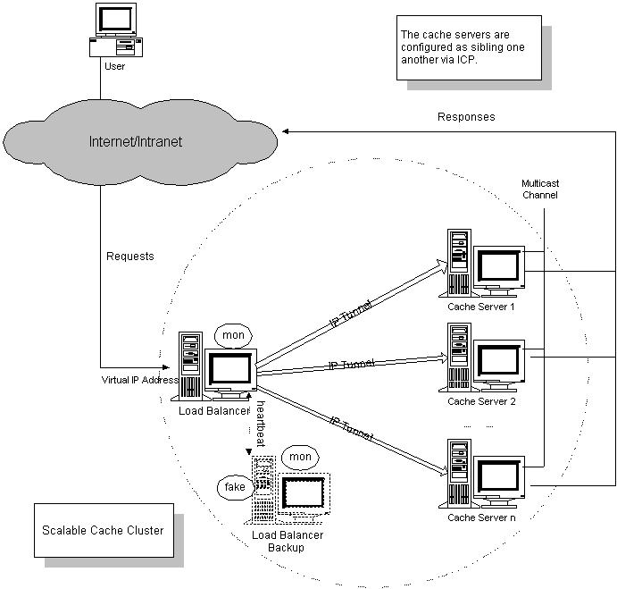
图2.3：基于LVS的可伸缩Cache集群

Cache服务器采用本地硬盘来存储可缓存的对象，因为存储可缓存的对象是写操作，且占有一定的比例，通过本地硬盘可以提高I/O的访问速度。Cache服务器间有专用的多播通道，通过ICP协议（Internet Cache Protocol）来交互信息。当一台Cache服务器在本地硬盘中未命中当前请求时，它可以通过ICP查询其他Cache服务器是否有请求对象的副本，若存在，则从邻近的Cache服务器取该对象的副本，这样可以进一步提高Cache服务的命中率。

为150多所大学和地区服务的英国国家Cache网在1999年11月用以上LVS结构实现可伸缩的Cache集群，只用了原有50多台相互独立Cache服务器的一半，用户反映网络速度跟夏天一样快（学生放暑假）。可见，通过负载调度可以摸平单台服务器访问的毛刺（Burst），提高整个系统的资源利用率。

#### <a name="1.3.4">1.3.4 可伸缩邮件服务</a> 

随着Internet用户不断增长，很多ISP面临他们邮件服务器超载的问题。当邮件服务器不能容纳更多的用户帐号时，有些ISP买更高档的服务器来代替原有的，将原有服务器的信息（如用户邮件）迁移到新服务器是很繁琐的工作，会造成服务的中断；有些ISP设置新的服务器和新的邮件域名，新的邮件用户放置在新的服务器上，如上海电信现在用不同的邮件服务器public1.sta.net.cn、public2.sta.net.cn到public9.sta.net.cn放置用户的邮件帐号，这样静态地将用户分割到不同的服务器上，会造成邮件服务器负载不平衡，系统的资源利用率低，对用户来说邮件的地址比较难记。


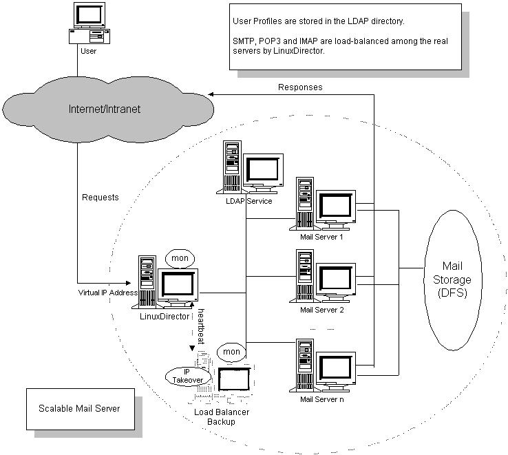
图2.4：基于LVS的可伸缩邮件集群

可以利用LVS框架实现可伸缩邮件服务。它的体系结构如图2.4所示：在前端是一个采用IP负载均衡技术的负载调度器；在第二层是服务器池，有LDAP（Light-weight Directory Access Protocol）服务器和一组邮件服务器。第三层是数据存储，通过分布式文件系统来存储用户的邮件。集群中结点间是通过高速网络相连的。

用户的信息如用户名、口令、主目录和邮件容量限额等存储在LDAP服务器中，可以通过HTTPS让管理员进行用户管理。在各个邮件服务器上运行SMTP（Simple Mail Transfer Protocol）、POP3（Post Office Protocol version 3）、IMAP4（Internet Message Access Protocol version 4）和HTTP服务。SMTP接受和转发用户的邮件，SMTP服务进程查询LDAP服务器获得用户信息，再存储邮件。POP3和IMAP4通过LDAP服务器获得用户信息，口令验证后，处理用户的邮件访问请求。SMTP、POP3和IMAP4服务进程需要有机制避免用户邮件的读写冲突。HTTP服务是让用户通过浏览器可以访问邮件。负载调度器将四种服务请求负载均衡地调度到各个服务器上。

系统中可能的瓶颈是LDAP服务器，对LDAP服务中B+树的参数进行优化，再结合高端的服务器，可以获得较高的性能。若分布式文件系统没有多个存储结点间的负载均衡机制，则需要相应的邮件迁移机制来避免邮件访问的倾斜。

这样，这个集群系统对用户来说就像一个高性能、高可靠的邮件服务器（上海电信只要用一个邮件域名public.sta.net.cn）。当邮件用户不断增长时，只要在集群中增加服务器结点和存储结点。


### <a name="1.4">1.4 地理分布LVS集群的体系结构</a> 

由于互联网用户分布在世界各地，通过地理分布的服务器让用户访问就近的服务器，来节省网络流量和提高响应速度。以下，我们给出地理分布的LVS集群系统，通过BGP路由插入使得用户访问离他们最近的服务器集群，并提供服务器集群之间的负载平衡。

#### <a name="1.4.1">1.4.1 体系结构</a>

地理分布LVS集群的体系结构如图2.5所示：有三个LVS集群系统分布在Internet上，他们一般放置在不同区域的Internet数据中心（Internet Data Center）中，例如他们分别放在中国、美国和德国的三个不同的IDC中。三个LVS集群系统都有自己的分布式文件系统，它们的内容是相互复制的，提供相同的网络服务。它们共享一个Virtual IP Address来提供网络服务。当用户通过Virtual IP Address访问网络服务，离用户最近的LVS集群提供服务。例如，中国的用户访问在中国的LVS集群系统，美国的用户使用美国的LVS集群系统，这一切对用户来说是透明的。


图2.5：地理分布LVS集群的体系结构

地理分布LVS集群系统可以带来以下好处：
* 使得用户访问离他们最近的系统，对用户来说体验到更快的响应速度，对服务提供商来说节约网络带宽，降低成本。
* 避免灾难导致系统中止服务。当一个地点发生地震、火灾等使得系统或者网络连接瘫痪时，所有的用户访问可以很快由其他地点的LVS集群来提供。除了已建立的连接中断以外，这一切对用户来说都是透明的。


#### <a name="1.4.2">1.4.2 基于BGP的地理分布服务器集群调度</a>

BGP（Border Gateway Protocol）是用于自治系统（Autonomous Systems）之间交换路由信息的协议，BGP可以设置路由策略，如政策、安全和经济上的考虑。

我们可以利用BGP协议在Internet的BGP路由器插入到Virtual IP Address的路由信息。在不同区域的LVS集群向它附近的BGP路由器广播到Virtual IP Address的路由信息，这样就存在多条到Virtual IP Address的路径，Internet的BGP路由器会根据评价函数选出最近的一条路径。这样，我们可以使得用户访问离他们最近的LVS集群。当一个LVS集群系统失效时，它的路由信息自然不会在Internet的BGP路由器中交换，BGP路由器会选择其他到Virtual IP Address的路径。这样，可以做到抗灾害性（Disaster Tolerance）。

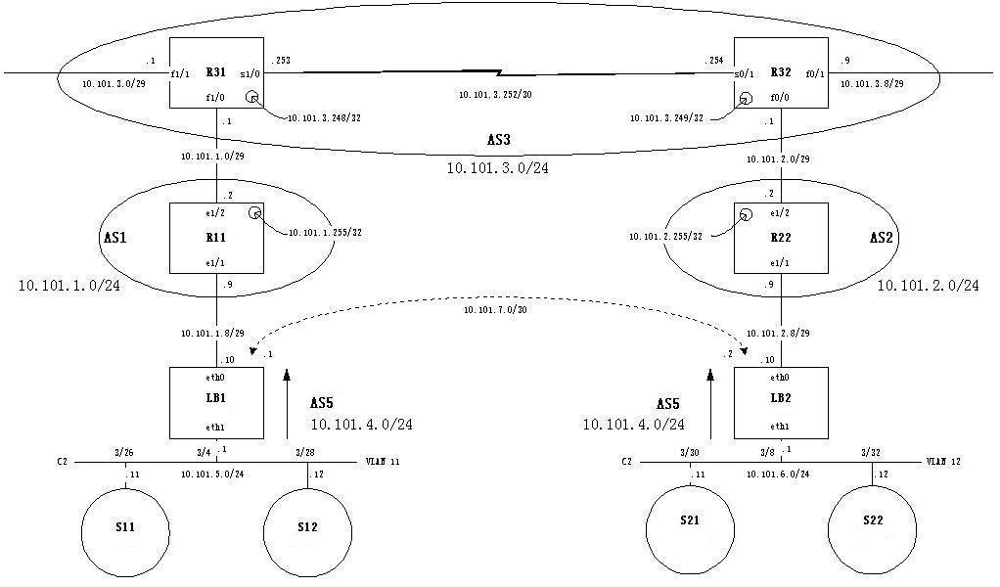
图2.6：基于BGP的地理分布服务器集群调度例子

下面我们举一个基于BGP的地理分布服务器集群调度例子，它也是我们在实验室中测试的。测试的例子如图2.6所示，R11、R22分别在不同自治系统AS1和AS2中的Internet服务提供商（Internet Service Provider），R31和R32表示在自治系统AS3中两个ISP。两个LVS集群系统分别放置在两个不同数据中心IDC1和IDC2中，LB1和LB2分别是两个LVS集群系统的负载调度器，它们对外提供网络服务的IP地址为10.101.4.1。在第一个集群中，请求被调度到服务器10.101.5.11和10.101.5.12执行。在第二个集群中，请求被调度到服务器10.101.6.11和10.101.6.12。10.101.4.1是在自治系统AS5的网络10.101.4.0/24中。LB1上的BGP服务进程将网络10.101.4.0/24的路由信息广播到邻近的AS1，LB2上的BGP服务进程将网络10.101.4.0/24的路由信息广播到邻近的AS2中。
    
我们在R31端口10.101.3.1相连的BGP路由器上查到AS5的自治系统路径为3→1→5。在与R32端口10.101.3.9相连的BGP路由器上查到AS5的自治系统路径为3→2→5，并在该路由器上访问10.101.4.1上提供的Web服务，是由服务器10.101.6.11处理的。当我们关掉LB2后，在该BGP路由器上查到AS5的自治系统路径变为3→1→5。
#### <a name="1.4.3">1.4.3 服务器集群间的负载均衡</a>

通过BGP插入路由信息的方法可以使得用户访问邻近的服务器集群，但是用户访问存在突发性，在某个区域的访问高峰可能会导致该区域的服务器集群系统超载，而其他服务器集群系统可能处于低负载状态，这时与其将请求在超载系统上排队等候，不如将请求送到远处的低负载系统上执行，可以提高响应速度。例如，中国用户在白天时间的一段访问高峰使得在中国的镜像服务器集群系统超载，而此时美国是晚上时间其镜像服务器集群系统处于低负载状态。

我们提出通过IP隧道的方法将请求从一个调度器转发到另一个调度器，再调度到真实服务器上执行。在下一章中将详细描述如何通过IP隧道作IP负载均衡调度。在通过IP隧道转发请求前，各个服务器集群需要定时交换负载信息（如2分钟交换一次），当确信远处的集群系统处于低负载状态，再转发请求。例如，当本地集群系统的综合负载大于1.1和远处集群系统的负载小于0.7时，调度器通过IP隧道将新的请求转发到远处的集群系统。若远处集群系统的负载超过0.7时，停止转发请求。当本地集群系统的负载降至1.0时，也停止转发请求，由本地服务器处理。这样，基本上可以避免两个调度器间相互转发一个请求。即使两个调度器间相互转发一个请求报文的例外情况发生，报文的TTL会降到零，报文被丢掉。


### <a name="1.5">1.5 小结</a> 

我们分析了现在和将来网络服务的需求，提出可伸缩网络服务的体系结构，分为负载调度器、服务器池和后端存储三层结构。负载调度器采用IP负载均衡技术和基于内容请求分发技术。它的实现将在Linux操作系统进行，将一组服务器组成一个高可伸缩的、高可用的服务器，故称之为Linux Virtual Server。它提供了负载平衡、可伸缩性和高可用性，可以应用于建立很多可伸缩网络服务，如Web、Cache、Mail和Media等服务。

在此基础上，我们给出了地理分布的LVS集群系统，通过BGP插入路由信息的方法可以使得用户访问邻近的服务器集群，通过IP隧道实现服务器集群间的负载均衡，进一步提高响应速度。地理分布的LVS集群系统可以节约网络带宽，改善网络服务质量，有很好的抗灾害性。


## <a name="2">2. IP负载均衡技术</a> 

上一章节讲述了可伸缩网络服务的几种结构，它们都需要一个前端调度器。在调度器的实现技术中，IP负载均衡技术是效率最高的。在已有的IP负载均衡技术中有通过网络地址转换（Network Address Translation）将一组服务器构成一个高性能的、高可用的虚拟服务器，我们称之为VS/NAT技术（Virtual Server via Network Address Translation），大多数商品化的IP负载均衡调度器产品都是使用此方法，如Cisco的LocalDirector、F5的Big/IP和Alteon的ACEDirector。在分析VS/NAT的缺点和网络服务的非对称性的基础上，我们提出通过IP隧道实现虚拟服务器的方法VS/TUN（Virtual Server via IP Tunneling），和通过直接路由实现虚拟服务器的方法VS/DR（Virtual Server via Direct Routing），它们可以极大地提高系统的伸缩性。

本章节将描述三种IP负载均衡技术VS/NAT、VS/TUN和VS/DR的工作原理，以及它们的优缺点。在以下描述中，我们称客户的socket和服务器的socket之间的数据通讯为连接，无论它们是使用TCP还是UDP协议。


### <a name="2.1">2.1 通过NAT实现虚拟服务器（VS/NAT）</a> 

由于IPv4中IP地址空间的日益紧张和安全方面的原因，很多网络使用保留IP地址（10.0.0.0/255.0.0.0、172.16.0.0/255.128.0.0和192.168.0.0/255.255.0.0）[64, 65, 66]。这些地址不在Internet上使用，而是专门为内部网络预留的。当内部网络中的主机要访问Internet或被Internet访问时，就需要采用网络地址转换（Network Address Translation, 以下简称NAT），将内部地址转化为Internets上可用的外部地址。NAT的工作原理是报文头（目标地址、源地址和端口等）被正确改写后，客户相信它们连接一个IP地址，而不同IP地址的服务器组也认为它们是与客户直接相连的。由此，可以用NAT方法将不同IP地址的并行网络服务变成在一个IP地址上的一个虚拟服务。

VS/NAT的体系结构如图3.1所示。在一组服务器前有一个调度器，它们是通过Switch/HUB相连接的。这些服务器提供相同的网络服务、相同的内容，即不管请求被发送到哪一台服务器，执行结果是一样的。服务的内容可以复制到每台服务器的本地硬盘上，可以通过网络文件系统（如NFS）共享，也可以通过一个分布式文件系统来提供。


图3.1：VS/NAT的体系结构

客户通过Virtual IP Address（虚拟服务的IP地址）访问网络服务时，请求报文到达调度器，调度器根据连接调度算法从一组真实服务器中选出一台服务器，将报文的目标地址Virtual IP Address改写成选定服务器的地址，报文的目标端口改写成选定服务器的相应端口，最后将修改后的报文发送给选出的服务器。同时，调度器在连接Hash表中记录这个连接，当这个连接的下一个报文到达时，从连接Hash表中可以得到原选定服务器的地址和端口，进行同样的改写操作，并将报文传给原选定的服务器。当来自真实服务器的响应报文经过调度器时，调度器将报文的源地址和源端口改为Virtual IP Address和相应的端口，再把报文发给用户。我们在连接上引入一个状态机，不同的报文会使得连接处于不同的状态，不同的状态有不同的超时值。在TCP连接中，根据标准的TCP有限状态机进行状态迁移；在UDP中，我们只设置一个UDP状态。不同状态的超时值是可以设置的，在缺省情况下，SYN状态的超时为1分钟，ESTABLISHED状态的超时为15分钟，FIN状态的超时为1分钟；UDP状态的超时为5分钟。当连接终止或超时，调度器将这个连接从连接Hash表中删除。

这样，客户所看到的只是在Virtual IP Address上提供的服务，而服务器集群的结构对用户是透明的。对改写后的报文，应用增量调整Checksum的算法调整TCP Checksum的值，避免了扫描整个报文来计算Checksum的开销。

在一些网络服务中，它们将IP地址或者端口号在报文的数据中传送，若我们只对报文头的IP地址和端口号作转换，这样就会出现不一致性，服务会中断。所以，针对这些服务，需要编写相应的应用模块来转换报文数据中的IP地址或者端口号。我们所知道有这个问题的网络服务有FTP、IRC、H.323、CUSeeMe、Real Audio、Real Video、Vxtreme / Vosiac、VDOLive、VIVOActive、True Speech、RSTP、PPTP、StreamWorks、NTT AudioLink、NTT SoftwareVision、Yamaha MIDPlug、iChat Pager、Quake和Diablo。

下面，举个例子来进一步说明VS/NAT，如图3.2所示：
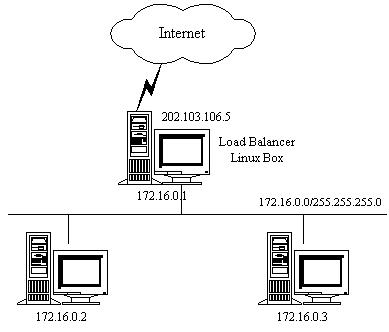
图3.2：VS/NAT的例子

VS/NAT的配置如下表所示，所有到IP地址为202.103.106.5和端口为80的流量都被负载均衡地调度的真实服务器172.16.0.2:80和172.16.0.3:8000上。目标地址为202.103.106.5:21的报文被转移到172.16.0.3:21上。而到其他端口的报文将被拒绝。

|Protocol|Virtual IP Address|Port|Real IP Address|Port|Weight|
|:---:|:---:|:---:|:---:|:---:|:---:|
|TCP|202.103.106.5|80|172.16.0.2|80|1
| -| -|- |172.16.0.3|8000|2
|TCP|202.103.106.5|21|172.16.0.3||21|1 

从以下的例子中，我们可以更详细地了解报文改写的流程。

访问Web服务的报文可能有以下的源地址和目标地址：

|SOURCE|202.100.1.2:3456|DEST|202.103.106.5:80
|:---:|:---:|:---:|:---:|:---:|:---:|

调度器从调度列表中选出一台服务器，例如是172.16.0.3:8000。该报文会被改写为如下地址，并将它发送给选出的服务器。

|SOURCE|202.100.1.2:3456|DEST|172.16.0.3:8000
|:---:|:---:|:---:|:---:|:---:|:---:|

从服务器返回到调度器的响应报文如下：

|SOURCE|172.16.0.3:8000|DEST|202.100.1.2:3456
|:---:|:---:|:---:|:---:|:---:|:---:|

响应报文的源地址会被改写为虚拟服务的地址，再将报文发送给客户：

|SOURCE|202.103.106.5:80|DEST|202.100.1.2:3456
|:---:|:---:|:---:|:---:|:---:|:---:|

这样，客户认为是从202.103.106.5:80服务得到正确的响应，而不会知道该请求是服务器172.16.0.2还是服务器172.16.0.3处理的。


### <a name="2.2">2.2 通过IP隧道实现虚拟服务器（VS/TUN）</a> 

在VS/NAT的集群系统中，请求和响应的数据报文都需要通过负载调度器，当真实服务器的数目在10台和20台之间时，负载调度器将成为整个集群系统的新瓶颈。大多数Internet服务都有这样的特点：请求报文较短而响应报文往往包含大量的数据。如果能将请求和响应分开处理，即在负载调度器中只负责调度请求而响应直接返回给客户，将极大地提高整个集群系统的吞吐量。

IP隧道（IP tunneling）是将一个IP报文封装在另一个IP报文的技术，这可以使得目标为一个IP地址的数据报文能被封装和转发到另一个IP地址。IP隧道技术亦称为IP封装技术（IP encapsulation）。IP隧道主要用于移动主机和虚拟私有网络（Virtual Private Network），在其中隧道都是静态建立的，隧道一端有一个IP地址，另一端也有唯一的IP地址。

我们利用IP隧道技术将请求报文封装转发给后端服务器，响应报文能从后端服务器直接返回给客户。但在这里，后端服务器有一组而非一个，所以我们不可能静态地建立一一对应的隧道，而是动态地选择一台服务器，将请求报文封装和转发给选出的服务器。这样，我们可以利用IP隧道的原理将一组服务器上的网络服务组成在一个IP地址上的虚拟网络服务。VS/TUN的体系结构如图3.3所示，各个服务器将VIP地址配置在自己的IP隧道设备上。

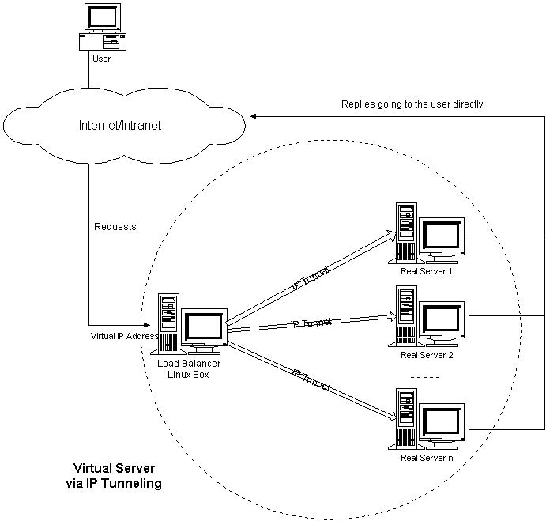
图3.3：VS/TUN的体系结构

VS/TUN的工作流程如图3.4所示：它的连接调度和管理与VS/NAT中的一样，只是它的报文转发方法不同。调度器根据各个服务器的负载情况，动态地选择一台服务器，将请求报文封装在另一个IP报文中，再将封装后的IP报文转发给选出的服务器；服务器收到报文后，先将报文解封获得原来目标地址为VIP的报文，服务器发现VIP地址被配置在本地的IP隧道设备上，所以就处理这个请求，然后根据路由表将响应报文直接返回给客户。


图3.4：VS/TUN的工作流程

在这里，请求报文的目标地址为VIP，响应报文的源地址也为VIP，所以响应报文不需要作任何修改，可以直接返回给客户，客户认为得到正常的服务，而不会知道是哪一台服务器处理的。

在VS/TUN中，响应报文根据服务器的路由表直接返回给客户，而不经过负载调度器，所以负载调度器只处于从客户到服务器的半连接中，VS/TUN的TCP状态迁移与VS/NAT的不同。我们给出半连接的TCP有限状态机，如图3.5所示，圈表示状态，箭头表示状态间的转换，箭头上的标识表示在当前状态上收到该标识的输入，迁移到下一个状态。VS/TUN的TCP状态迁移是按照半连接的TCP有限状态机进行的。


图3.5：半连接的TCP有限状态机


### <a name="2.3">2.3 通过直接路由实现虚拟服务器（VS/DR）</a> 

跟VS/TUN方法相同，VS/DR利用大多数Internet服务的非对称特点，负载调度器中只负责调度请求，而服务器直接将响应返回给客户，可以极大地提高整个集群系统的吞吐量。该方法与IBM的NetDispatcher产品中使用的方法类似，但IBM的NetDispatcher是非常昂贵的商品化产品，我们也不知道它内部所使用的机制，其中有些是IBM的专利。

VS/DR的体系结构如图3.6所示：调度器和服务器组都必须在物理上有一个网卡通过不分段的局域网相连，即通过交换机或者高速的HUB相连，中间没有隔有路由器。VIP地址为调度器和服务器组共享，调度器配置的VIP地址是对外可见的，用于接收虚拟服务的请求报文；所有的服务器把VIP地址配置在各自的Non-ARP网络设备上，它对外面是不可见的，只是用于处理目标地址为VIP的网络请求。

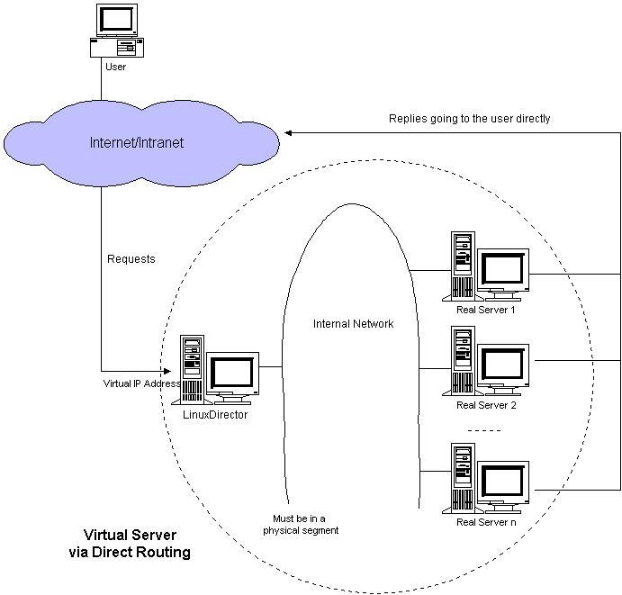
图3.6：VS/DR的体系结构

VS/DR的工作流程如图3.7所示：它的连接调度和管理与VS/NAT和VS/TUN中的一样，它的报文转发方法又有不同，将报文直接路由给目标服务器。在VS/DR中，调度器根据各个服务器的负载情况，动态地选择一台服务器，不修改也不封装IP报文，而是将数据帧的MAC地址改为选出服务器的MAC地址，再将修改后的数据帧在与服务器组的局域网上发送。因为数据帧的MAC地址是选出的服务器，所以服务器肯定可以收到这个数据帧，从中可以获得该IP报文。当服务器发现报文的目标地址VIP是在本地的网络设备上，服务器处理这个报文，然后根据路由表将响应报文直接返回给客户。


图3.7：VS/DR的工作流程

在VS/DR中，请求报文的目标地址为VIP，响应报文的源地址也为VIP，所以响应报文不需要作任何修改，可以直接返回给客户，客户认为得到正常的服务，而不会知道是哪一台服务器处理的。

VS/DR负载调度器也只处于从客户到服务器的半连接中，按照半连接的TCP有限状态机进行状态迁移。

### <a name="2.4">2.4 三种方法的优缺点比较</a> 

三种IP负载均衡技术的优缺点归纳在下表中：

|-|VS/NAT|VS/TUN|VS/DR|
|:---:|:---:|:---:|
|Server|any|Tunneling|Non-arp device
|server network|private|LAN/WAN|LAN
|server number|low (10~20)|High (100)|High (100)
|server gateway|load balancer|own router|Own router


注：以上三种方法所能支持最大服务器数目的估计是假设调度器使用100M网卡，调度器的硬件配置与后端服务器的硬件配置相同，而且是对一般Web服务。使用更高的硬件配置（如千兆网卡和更快的处理器）作为调度器，调度器所能调度的服务器数量会相应增加。当应用不同时，服务器的数目也会相应地改变。所以，以上数据估计主要是为三种方法的伸缩性进行量化比较。

*  Virtual Server via NAT
VS/NAT 的优点是服务器可以运行任何支持TCP/IP的操作系统，它只需要一个IP地址配置在调度器上，服务器组可以用私有的IP地址。缺点是它的伸缩能力有限，当服务器结点数目升到20时，调度器本身有可能成为系统的新瓶颈，因为在VS/NAT中请求和响应报文都需要通过负载调度器。 我们在Pentium 166 处理器的主机上测得重写报文的平均延时为60us，性能更高的处理器上延时会短一些。假设TCP报文的平均长度为536 Bytes，则调度器的最大吞吐量为8.93 MBytes/s. 我们再假设每台服务器的吞吐量为800KBytes/s，这样一个调度器可以带动10台服务器。（注：这是很早以前测得的数据）

    基于 VS/NAT的的集群系统可以适合许多服务器的性能要求。如果负载调度器成为系统新的瓶颈，可以有三种方法解决这个问题：混合方法、VS/TUN和 VS/DR。在DNS混合集群系统中，有若干个VS/NAT负载调度器，每个负载调度器带自己的服务器集群，同时这些负载调度器又通过RR-DNS组成简单的域名。但VS/TUN和VS/DR是提高系统吞吐量的更好方法。

    对于那些将IP地址或者端口号在报文数据中传送的网络服务，需要编写相应的应用模块来转换报文数据中的IP地址或者端口号。这会带来实现的工作量，同时应用模块检查报文的开销会降低系统的吞吐率。

*  Virtual Server via IP Tunneling
在VS/TUN 的集群系统中，负载调度器只将请求调度到不同的后端服务器，后端服务器将应答的数据直接返回给用户。这样，负载调度器就可以处理大量的请求，它甚至可以调度百台以上的服务器（同等规模的服务器），而它不会成为系统的瓶颈。即使负载调度器只有100Mbps的全双工网卡，整个系统的最大吞吐量可超过 1Gbps。所以，VS/TUN可以极大地增加负载调度器调度的服务器数量。VS/TUN调度器可以调度上百台服务器，而它本身不会成为系统的瓶颈，可以用来构建高性能的超级服务器。

    VS/TUN技术对服务器有要求，即所有的服务器必须支持“IP Tunneling”或者“IP Encapsulation”协议。目前，VS/TUN的后端服务器主要运行Linux操作系统，我们没对其他操作系统进行测试。因为“IP Tunneling”正成为各个操作系统的标准协议，所以VS/TUN应该会适用运行其他操作系统的后端服务器。
    
* Virtual Server via Direct Routing
跟VS/TUN方法一样，VS/DR调度器只处理客户到服务器端的连接，响应数据可以直接从独立的网络路由返回给客户。这可以极大地提高LVS集群系统的伸缩性。

    跟VS/TUN相比，这种方法没有IP隧道的开销，但是要求负载调度器与实际服务器都有一块网卡连在同一物理网段上，服务器网络设备（或者设备别名）不作ARP响应，或者能将报文重定向（Redirect）到本地的Socket端口上。

### <a name="2.5">2.5 小结</a> 

本章主要讲述了可伸缩网络服务LVS框架中的三种IP负载均衡技术。在分析网络地址转换方法（VS/NAT）的缺点和网络服务的非对称性的基础上，我们给出了通过IP隧道实现虚拟服务器的方法VS/TUN，和通过直接路由实现虚拟服务器的方法VS/DR，极大地提高了系统的伸缩性。


## <a name="3">3. 负载调度</a> 

在上一章中，我们主要讲述了LVS集群中实现的三种IP负载均衡技术，它们主要解决系统的可伸缩性和透明性问题，如何通过负载调度器将请求高效地分发到不同的服务器执行，使得由多台独立计算机组成的集群系统成为一台虚拟服务器；客户端应用程序与集群系统交互时，就像与一台高性能的服务器交互一样。

本章节将主要讲述在负载调度器上的负载调度策略和算法，如何将请求流调度到各台服务器，使得各台服务器尽可能地保持负载均衡。文章主要由两个部分组成。第一部分描述IP负载均衡软件IPVS在内核中所实现的各种连接调度算法；第二部分给出一个动态反馈负载均衡算法（Dynamic-feedback load balancing），它结合内核中的加权连接调度算法，根据动态反馈回来的负载信息来调整服务器的权值，来进一步避免服务器间的负载不平衡。

在下面描述中，我们称客户的socket和服务器的socket之间的数据通讯为连接，无论它们是使用TCP还是UDP协议。对于UDP数据报文的调度，IPVS调度器也会为之建立调度记录并设置超时值（如5分钟）；在设定的时间内，来自同一地址（IP地址和端口）的UDP数据包会被调度到同一台服务器。


### <a name="3.1">3.1 内核中的连接调度算法</a> 

IPVS在内核中的负载均衡调度是以连接为粒度的。在HTTP协议（非持久）中，每个对象从WEB服务器上获取都需要建立一个TCP连接，同一用户的不同请求会被调度到不同的服务器上，所以这种细粒度的调度在一定程度上可以避免单个用户访问的突发性引起服务器间的负载不平衡。

在内核中的连接调度算法上，IPVS已实现了以下十种调度算法：
* 轮叫调度（Round-Robin Scheduling）
* 加权轮叫调度（Weighted Round-Robin Scheduling）
* 最小连接调度（Least-Connection Scheduling）
* 加权最小连接调度（Weighted Least-Connection Scheduling）
* 基于局部性的最少链接（Locality-Based Least Connections Scheduling）
* 带复制的基于局部性最少链接（Locality-Based Least Connections with Replication Scheduling）
* 目标地址散列调度（Destination Hashing Scheduling）
* 源地址散列调度（Source Hashing Scheduling）
* 最短预期延时调度（Shortest Expected Delay Scheduling）
* 不排队调度（Never Queue Scheduling）

下面，我们先介绍这八种连接调度算法的工作原理和算法流程，会在以后的文章中描述怎么用它们。

#### <a name="3.1.1">3.1.1 轮叫调度（Round-Robin Scheduling）</a> 

轮叫调度（Round Robin Scheduling）算法就是以轮叫的方式依次将请求调度不同的服务器，即每次调度执行i = (i + 1) mod n，并选出第i台服务器。算法的优点是其简洁性，它无需记录当前所有连接的状态，所以它是一种无状态调度。

在系统实现时，我们引入了一个额外条件，当服务器的权值为零时，表示该服务器不可用而不被调度。这样做的目的是将服务器切出服务（如屏蔽服务器故障和系统维护），同时与其他加权算法保持一致。所以，算法要作相应的改动，它的算法流程如下：

### 轮叫调度算法流程 

假设有一组服务器S = {S0, S1, …, Sn-1}，一个指示变量i表示上一次选择的服务器，W(Si)表示服务器Si的权值。变量i被初始化为n-1，其中n > 0。

```C
j = i;
do {
	j = (j + 1) mod n;
	if (W(Sj) > 0) {
		i = j;
		return Si;
	}
} while (j != i);
return NULL;
```

轮叫调度算法假设所有服务器处理性能均相同，不管服务器的当前连接数和响应速度。该算法相对简单，不适用于服务器组中处理性能不一的情况，而且当请求服务时间变化比较大时，轮叫调度算法容易导致服务器间的负载不平衡。

虽然Round-Robin DNS方法也是以轮叫调度的方式将一个域名解析到多个IP地址，但轮叫DNS方法的调度粒度是基于每个域名服务器的，域名服务器对域名解析的缓存会妨碍轮叫解析域名生效，这会导致服务器间负载的严重不平衡。这里，IPVS轮叫调度算法的粒度是基于每个连接的，同一用户的不同连接都会被调度到不同的服务器上，所以这种细粒度的轮叫调度要比DNS的轮叫调度优越很多。

#### <a name="3.1.2">3.1.2 加权轮叫调度（Weighted Round-Robin Scheduling）</a> 

轮叫调度（Round Robin Scheduling）算法就是以轮叫的方式依次将请求调度不同的服务器，即每次调度执行i = (i + 1) mod n，并选出第i台服务器。算法的优点是其简洁性，它无需记录当前所有连接的状态，所以它是一种无状态调度。

在系统实现时，我们引入了一个额外条件，当服务器的权值为零时，表示该服务器不可用而不被调度。这样做的目的是将服务器
切出服务（如屏蔽服务器故障和系统维护），同时与其他加权算法保持一致。所以，算法要作相应的改动，它的算法流程如下：

###加权轮叫调度算法流程

假设有一组服务器S = {S0, S1, …, Sn-1}，W(Si)表示服务器Si的权值，一个指示变量i表示上一次选择的服务器，指示变量cw表示当前调度的权值，max(S)表示集合S中所有服务器的最大权值，gcd(S)表示集合S中所有服务器权值的最大公约数。变量i初始化为-1，cw初始化为零。

```C
while (true) {
  i = (i + 1) mod n;
  if (i == 0) {
     cw = cw - gcd(S); 
     if (cw <= 0) {
       cw = max(S);
       if (cw == 0)
         return NULL;
     }
  } 
  if (W(Si) >= cw) 
    return Si;
}
```

轮叫调度算法假设所有服务器处理性能均相同，不管服务器的当前连接数和响应速度。该算法相对简单，不适用于服务器组中处理性能不一的情况，而且当请求服务时间变化比较大时，轮叫调度算法容易导致服务器间的负载不平衡。

虽然Round-Robin DNS方法也是以轮叫调度的方式将一个域名解析到多个IP地址，但轮叫DNS方法的调度粒度是基于每个域名服务器的，域名服务器对域名解析的缓存会妨碍轮叫解析域名生效，这会导致服务器间负载的严重不平衡。这里，IPVS轮叫调度算法的粒度是基于每个连接的，同一用户的不同连接都会被调度到不同的服务器上，所以这种细粒度的轮叫调度要比DNS的轮叫调度优越很多。

#### <a name="3.1.3">3.1.3 最小连接调度（Least-Connection Scheduling）</a> 

最小连接调度（Least-Connection Scheduling）算法是把新的连接请求分配到当前连接数最小的服务器。最小连接调度是一种动态调度算法，它通过服务器当前所活跃的连接数来估计服务器的负载情况。调度器需要记录各个服务器已建立连接的数目，当一个请求被调度到某台服务器，其连接数加1；当连接中止或超时，其连接数减一。

在系统实现时，我们也引入当服务器的权值为零时，表示该服务器不可用而不被调度，它的算法流程如下：

###最小连接调度算法流程


假设有一组服务器S = {S0, S1, ..., Sn-1}，W(Si)表示服务器Si的权值，C(Si)表示服务器Si的当前连接数。
```C
for (m = 0; m < n; m++) {
	if (W(Sm) > 0) {
		for (i = m+1; i < n; i++) {
			if (W(Si) <= 0)
				continue;
			if (C(Si) < C(Sm))
				m = i;
		}
		return Sm;
	}
}
return NULL;
```

当各个服务器有相同的处理性能时，最小连接调度算法能把负载变化大的请求分布平滑到各个服务器上，所有处理时间比较长的请求不可能被发送到同一台服务器上。但是，当各个服务器的处理能力不同时，该算法并不理想，因为TCP连接处理请求后会进入TIME_WAIT状态，TCP的TIME_WAIT一般为2分钟，此时连接还占用服务器的资源，所以会出现这样情形，性能高的服务器已处理所收到的连接，连接处于TIME_WAIT状态，而性能低的服务器已经忙于处理所收到的连接，还不断地收到新的连接请求。

#### <a name="3.1.4">3.1.4 加权最小连接调度（Weighted Least-Connection Scheduling）</a> 

加权最小连接调度（Weighted Least-Connection Scheduling）算法是最小连接调度的超集，各个服务器用相应的权值表示其处理性能。服务器的缺省权值为1，系统管理员可以动态地设置服务器的权值。加权最小连接调度在调度新连接时尽可能使服务器的已建立连接数和其权值成比例。加权最小连接调度的算法流程如下：

###加权最小连接调度的算法流程

假设有一组服务器S = {S0, S1, ..., Sn-1}，W(Si)表示服务器Si的权值，C(Si)表示服务器Si的当前连接数。所有服务器当前连接数的总和为CSUM = ΣC(Si)  (i=0, 1, .. , n-1)。当前的新连接请求会被发送服务器Sm，当且仅当服务器Sm满足以下条件
    (C(Sm) / CSUM)/ W(Sm) = min { (C(Si) / CSUM) / W(Si)}  (i=0, 1, . , n-1)    

其中W(Si)不为零。因为CSUM在这一轮查找中是个常数，所以判断条件可以简化为
        C(Sm) / W(Sm) = min { C(Si) / W(Si)}  (i=0, 1, . , n-1)
其中W(Si)不为零

因为除法所需的CPU周期比乘法多，且在Linux内核中不允许浮点除法，服务器的权值都大于零，所以判断条件
    C(Sm) / W(Sm) > C(Si) / W(Si) 
可以进一步优化为
    C(Sm)*W(Si) > C(Si)* W(Sm)。
同时保证服务器的权值为零时，服务器不被调度。所以，算法只要执行以下流程。

```C
for (m = 0; m < n; m++) {
	if (W(Sm) > 0) {
		for (i = m+1; i < n; i++) {
			if (C(Sm)*W(Si) > C(Si)*W(Sm))
				m = i;
		}
		return Sm;
	}
}
return NULL;
```


#### <a name="3.1.5">3.1.5 基于局部性的最少链接（Locality-Based Least Connections Scheduling）</a> 

基于局部性的最少链接调度（Locality-Based Least Connections Scheduling，以下简称为LBLC）算法是针对请求报文的目标IP地址的负载均衡调度，目前主要用于Cache集群系统，因为在Cache集群中客户请求报文的目标IP地址是变化的。这里假设任何后端服务器都可以处理任一请求，算法的设计目标是在服务器的负载基本平衡情况下，将相同目标IP地址的请求调度到同一台服务器，来提高各台服务器的访问局部性和主存Cache命中率，从而整个集群系统的处理能力。

LBLC调度算法先根据请求的目标IP地址找出该目标IP地址最近使用的服务器，若该服务器是可用的且没有超载，将请求发送到该服务器；若服务器不存在，或者该服务器超载且有服务器处于其一半的工作负载，则用“最少链接”的原则选出一个可用的服务器，将请求发送到该服务器。该算法的详细流程如下：

###LBLC调度算法流程

假设有一组服务器S = {S0, S1, ..., Sn-1}，W(Si)表示服务器Si的权值，C(Si)表示服务器Si的当前连接数。ServerNode[dest_ip]是一个关联变量，表示目标IP地址所对应的服务器结点，一般来说它是通过Hash表实现的。WLC(S)表示在集合S中的加权最小连接服务器，即前面的加权最小连接调度。Now为当前系统时间。

```C
if (ServerNode[dest_ip] is NULL) then {
	n = WLC(S);
	if (n is NULL) then return NULL;
	ServerNode[dest_ip].server = n;
} else {
	n = ServerNode[dest_ip].server;
	if ((n is dead) OR
	    (C(n) > W(n) AND
	     there is a node m with C(m) < W(m)/2))) then {
		n = WLC(S);
		if (n is NULL) then return NULL;
		ServerNode[dest_ip].server = n;
	}
}
ServerNode[dest_ip].lastuse = Now;
return n;
```

此外，对关联变量ServerNode[dest_ip]要进行周期性的垃圾回收（Garbage Collection），将过期的目标IP地址到服务器关联项进行回收。过期的关联项是指哪些当前时间（实现时采用系统时钟节拍数jiffies）减去最近使用时间超过设定过期时间的关联项，系统缺省的设定过期时间为24小时。

#### <a name="3.1.6">3.1.6 带复制的基于局部性最少链接（Locality-Based Least Connections with Replication Scheduling）</a>

带复制的基于局部性最少链接调度（Locality-Based Least Connections with Replication Scheduling，以下简称为LBLCR）算法也是针对目标IP地址的负载均衡，目前主要用于Cache集群系统。它与LBLC算法的不同之处是它要维护从一个目标IP地址到一组服务器的映射，而LBLC算法维护从一个目标IP地址到一台服务器的映射。对于一个“热门”站点的服务请求，一台Cache 服务器可能会忙不过来处理这些请求。这时，LBLC调度算法会从所有的Cache服务器中按“最小连接”原则选出一台Cache服务器，映射该“热门”站点到这台Cache服务器，很快这台Cache服务器也会超载，就会重复上述过程选出新的Cache服务器。这样，可能会导致该“热门”站点的映像会出现在所有的Cache服务器上，降低了Cache服务器的使用效率。LBLCR调度算法将“热门”站点映射到一组Cache服务器（服务器集合），当该“热门”站点的请求负载增加时，会增加集合里的Cache服务器，来处理不断增长的负载；当该“热门”站点的请求负载降低时，会减少集合里的Cache服务器数目。这样，该“热门”站点的映像不太可能出现在所有的Cache服务器上，从而提供Cache集群系统的使用效率。

LBLCR算法先根据请求的目标IP地址找出该目标IP地址对应的服务器组；按“最小连接”原则从该服务器组中选出一台服务器，若服务器没有超载，将请求发送到该服务器；若服务器超载；则按“最小连接”原则从整个集群中选出一台服务器，将该服务器加入到服务器组中，将请求发送到该服务器。同时，当该服务器组有一段时间没有被修改，将最忙的服务器从服务器组中删除，以降低复制的程度。LBLCR调度算法的流程如下：

###LBLCR调度算法流程

假设有一组服务器S = {S0, S1, ..., Sn-1}，W(Si)表示服务器Si的权值，C(Si)表示服务器Si的当前连接数。ServerSet[dest_ip]是一个关联变量，表示目标IP地址所对应的服务器集合，一般来说它是通过Hash表实现的。WLC(S)表示在集合S中的加权最小连接服务器，即前面的加权最小连接调度；WGC(S)表示在集合S中的加权最大连接服务器。Now为当前系统时间，lastmod表示集合的最近修改时间，T为对集合进行调整的设定时间。

```C
if (ServerSet[dest_ip] is NULL) then {
	n = WLC(S);
	if (n is NULL) then return NULL;
	add n into ServerSet[dest_ip];
} else {
	n = WLC(ServerSet[dest_ip]);
	if ((n is NULL) OR
	    (n is dead) OR
	    (C(n) > W(n) AND
	     there is a node m with C(m) < W(m)/2))) then {
		n = WLC(S);
		if (n is NULL) then return NULL;
		add n into ServerSet[dest_ip];
	} else
	if (|ServerSet[dest_ip]| > 1 AND
	    Now - ServerSet[dest_ip].lastmod > T) then {
		m = WGC(ServerSet[dest_ip]);
		remove m from ServerSet[dest_ip];
	}
}
ServerSet[dest_ip].lastuse = Now;
if (ServerSet[dest_ip] changed) then
	ServerSet[dest_ip].lastmod = Now;
return n;
```

此外，对关联变量ServerSet[dest_ip]也要进行周期性的垃圾回收（Garbage Collection），将过期的目标IP地址到服务器关联项进行回收。过期的关联项是指哪些当前时间（实现时采用系统时钟节拍数jiffies）减去最近使用时间（lastuse）超过设定过期时间的关联项，系统缺省的设定过期时间为24小时。

#### <a name="3.1.7">3.1.7 目标地址散列调度（Destination Hashing Scheduling）</a> 

 目标地址散列调度（Destination Hashing Scheduling）算法也是针对目标IP地址的负载均衡，但它是一种静态映射算法，通过一个散列（Hash）函数将一个目标IP地址映射到一台服务器。

目标地址散列调度算法先根据请求的目标IP地址，作为散列键（Hash Key）从静态分配的散列表找出对应的服务器，若该服务器是可用的且未超载，将请求发送到该服务器，否则返回空。该算法的流程如下：

###目标地址散列调度算法流程

假设有一组服务器S = {S0, S1, ..., Sn-1}，W(Si)表示服务器Si的权值，C(Si)表示服务器Si的当前连接数。ServerNode[]是一个有256个桶（Bucket）的Hash表，一般来说服务器的数目会运小于256，当然表的大小也是可以调整的。算法的初始化是将所有服务器顺序、循环地放置到ServerNode表中。若服务器的连接数目大于2倍的权值，则表示服务器已超载。

```C
n = ServerNode[hashkey(dest_ip)];
if ((n is dead) OR
	(W(n) == 0) OR
    (C(n) > 2*W(n))) then
	return NULL;
return n;
```

在实现时，我们采用素数乘法Hash函数，通过乘以素数使得散列键值尽可能地达到较均匀的分布。所采用的素数乘法Hash函数如下：

###素数乘法Hash函数

```C
static inline unsigned hashkey(unsigned int dest_ip)
{
    return (dest_ip* 2654435761UL) & HASH_TAB_MASK;
}
```

其中，2654435761UL是2到2^32 (4294967296)间接近于黄金分割的素数，

```C
  (sqrt(5) - 1) / 2 =  0.618033989
  2654435761 / 4294967296 = 0.618033987
```


#### <a name="3.1.8">3.1.8 源地址散列调度（Source Hashing Scheduling）</a> 

源地址散列调度（Source Hashing Scheduling）算法正好与目标地址散列调度算法相反，它根据请求的源IP地址，作为散列键（Hash Key）从静态分配的散列表找出对应的服务器，若该服务器是可用的且未超载，将请求发送到该服务器，否则返回空。它采用的散列函数与目标地址散列调度算法的相同。它的算法流程与目标地址散列调度算法的基本相似，除了将请求的目标IP地址换成请求的源IP地址，所以这里不一一叙述。

在实际应用中，源地址散列调度和目标地址散列调度可以结合使用在防火墙集群中，它们可以保证整个系统的唯一出入口。

### <a name="3.2">3.2 动态反馈负载均衡算法</a> 

动态反馈负载均衡算法考虑服务器的实时负载和响应情况，不断调整服务器间处理请求的比例，来避免有些服务器超载时依然收到大量请求，从而提高整个系统的吞吐率。图4.1显示了该算法的工作环境，在负载调度器上运行Monitor Daemon进程，Monitor Daemon来监视和收集各个服务器的负载信息。Monitor Daemon可根据多个负载信息算出一个综合负载值。Monitor Daemon将各个服务器的综合负载值和当前权值算出一组新的权值，若新权值和当前权值的差值大于设定的阀值，Monitor Daemon将该服务器的权值设置到内核中的IPVS调度中，而在内核中连接调度一般采用加权轮叫调度算法或者加权最小连接调度算法。


图4.1：动态反馈负载均衡算法的工作环境

#### <a name="3.2.1">3.2.1 连接调度</a> 

当客户通过TCP连接访问网络访问时，服务所需的时间和所要消耗的计算资源是千差万别的，它依赖于很多因素。例如，它依赖于请求的服务类型、当前网络带宽的情况、以及当前服务器资源利用的情况。一些负载比较重的请求需要进行计算密集的查询、数据库访问、很长响应数据流；而负载比较轻的请求往往只需要读一个HTML页面或者进行很简单的计算。

请求处理时间的千差万别可能会导致服务器利用的倾斜（Skew），即服务器间的负载不平衡。例如，有一个WEB页面有A、B、C和D文件，其中D是大图像文件，浏览器需要建立四个连接来取这些文件。当多个用户通过浏览器同时访问该页面时，最极端的情况是所有D文件的请求被发到同一台服务器。所以说，有可能存在这样情况，有些服务器已经超负荷运行，而其他服务器基本是闲置着。同时，有些服务器已经忙不过来，有很长的请求队列，还不断地收到新的请求。反过来说，这会导致客户长时间的等待，觉得系统的服务质量差。

###简单连接调度

简单连接调度可能会使得服务器倾斜的发生。在上面的例子中，若采用轮叫调度算法，且集群中正好有四台服务器，必有一台服务器总是收到D文件的请求。这种调度策略会导致整个系统资源的低利用率，因为有些资源被用尽导致客户的长时间等待，而其他资源空闲着。

###实际TCP/IP流量的特征

文献说明网络流量是呈波浪型发生的，在一段较长时间的小流量后，会有一段大流量的访问，然后是小流量，这样跟波浪一样周期性地发生。文献揭示在WAN和LAN上网络流量存在自相似的特征，在WEB访问流也存在自相似性。这就需要一个动态反馈机制，利用服务器组的状态来应对访问流的自相似性。

#### <a name="3.2.2">3.2.2 动态反馈负载均衡机制</a> 

 TCP/IP流量的特征通俗地说是有许多短事务和一些长事务组成，而长事务的工作量在整个工作量占有较高的比例。所以，我们要设计一种负载均衡算法，来避免长事务的请求总被分配到一些机器上，而是尽可能将带有毛刺（Burst）的分布分割成相对较均匀的分布。

我们提出基于动态反馈负载均衡机制，来控制新连接的分配，从而控制各个服务器的负载。例如，在IPVS调度器的内核中使用加权轮叫调度（Weighted Round-Robin Scheduling）算法来调度新的请求连接；在负载调度器的用户空间中运行Monitor Daemon。Monitor Daemon定时地监视和收集各个服务器的负载信息，根据多个负载信息算出一个综合负载值。Monitor Daemon将各个服务器的综合负载值和当前权值算出一组新的权值。当综合负载值表示服务器比较忙时，新算出的权值会比其当前权值要小，这样新分配到该服务器的请求数就会少一些。当综合负载值表示服务器处于低利用率时，新算出的权值会比其当前权值要大，来增加新分配到该服务器的请求数。若新权值和当前权值的差值大于设定的阀值，Monitor Daemon将该服务器的权值设置到内核中的IPVS调度中。过了一定的时间间隔（如2秒钟），Monitor Daemon再查询各个服务器的情况，并相应调整服务器的权值；这样周期性地进行。可以说，这是一个负反馈机制，使得服务器保持较好的利用率。

在加权轮叫调度算法中，当服务器的权值为零，已建立的连接会继续得到该服务器的服务，而新的连接不会分配到该服务器。系统管理员可以将一台服务器的权值设置为零，使得该服务器安静下来，当已有的连接都结束后，他可以将该服务器切出，对其进行维护。维护工作对系统都是不可少的，比如硬件升级和软件更新等，零权值使得服务器安静的功能很主要。所以，在动态反馈负载均衡机制中我们要保证该功能，当服务器的权值为零时，我们不对服务器的权值进行调整。

#### <a name="3.2.3">3.2.3 综合负载</a> 
    
在计算综合负载时，我们主要使用两大类负载信息：输入指标和服务器指标。输入指标是在调度器上收集到的，而服务器指标是在服务器上的各种负载信息。我们用综合负载来反映服务器当前的比较确切负载情况，对于不同的应用，会有不同的负载情况，这里我们引入各个负载信息的系数，来表示各个负载信息在综合负载中轻重。系统管理员根据不同应用的需求，调整各个负载信息的系数。另外，系统管理员设置收集负载信息的时间间隔。

输入指标主要是在单位时间内服务器收到新连接数与平均连接数的比例，它是在调度器上收集到的，所以这个指标是对服务器负载情况的一个估计值。在调度器上有各个服务器收到连接数的计数器，对于服务器Si，可以得到分别在时间T1和T2时的计数器值Ci1和Ci2，计算出在时间间隔T2-T1内服务器 Si收到新连接数Ni = Ci2 - Ci1。这样，得到一组服务器在时间间隔T2-T1内服务器Si收到新连接数{Ni}，服务器Si的输入指标INPUTi为其新连接数与n台服务器收到平均连接数的比值，其公式为
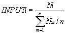

服务器指标主要记录服务器各种负载信息，如服务器当前CPU负载LOADi、服务器当前磁盘使用情况Di、当前内存利用情况Mi和当前进程数目 Pi。有两种方法可以获得这些信息；一是在所有的服务器上运行着SNMP（Simple Network Management Protocol）服务进程，而在调度器上的Monitor Daemon通过SNMP向各个服务器查询获得这些信息；二是在服务器上实现和运行收集信息的Agent，由Agent定时地向Monitor Daemon报告负载信息。若服务器在设定的时间间隔内没有响应，Monitor Daemon认为服务器是不可达的，将服务器在调度器中的权值设置为零，不会有新的连接再被分配到该服务器；若在下一次服务器有响应，再对服务器的权值进行调整。再对这些数据进行处理，使其落在[0, ∞)的区间内，1表示负载正好，大于1表示服务器超载，小于1表示服务器处于低负载状态。获得调整后的数据有DISKi、MEMORYi和 PROCESSi。


另一个重要的服务器指标是服务器所提供服务的响应时间，它能比较好地反映服务器上请求等待队列的长度和请求的处理时间。调度器上的Monitor Daemon作为客户访问服务器所提供的服务，测得其响应时间。例如，测试从WEB服务器取一个HTML页面的响应延时，Monitor Daemon只要发送一个“GET /”请求到每个服务器，然后记录响应时间。若服务器在设定的时间间隔内没有响应，Monitor Daemon认为服务器是不可达的，将服务器在调度器中的权值设置为零。同样，我们对响应时间进行如上调整，得到RESPONSEi。

这里，我们引入一组可以动态调整的系数Ri来表示各个负载参数的重要程度，其中ΣRi = 1。综合负载可以通过以下公式计算出：
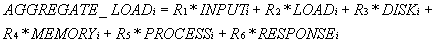

例如，在WEB服务器集群中，我们采用以下系数{0.1, 0.3, 0.1, 0.1, 0.1, 0.3}，认为服务器的CPU负载和请求响应时间较其他参数重要一些。若当前的系数Ri不能很好地反映应用的负载，系统管理员可以对系数不断地修正，直到找到贴近当前应用的一组系数。

 另外，关于查询时间间隔的设置，虽然很短的间隔可以更确切地反映各个服务器的负载，但是很频繁地查询（如1秒钟几次）会给调度器和服务器带来一定的负载，如频繁执行的Monitor Daemon在调度器会有一定的开销，同样频繁地查询服务器指标会服务器带来一定的开销。所以，这里要有个折衷（Tradeoff），我们一般建议将时间间隔设置在5到20秒之间。

#### <a name="3.2.4">3.2.4 权值计算</a> 

 当服务器投入集群系统中使用时，系统管理员对服务器都设定一个初始权值DEFAULT_WEIGHTi，在内核的IPVS调度中也先使用这个权值。然后，随着服务器负载的变化，对权值进行调整。为了避免权值变成一个很大的值，我们对权值的范围作一个限制[DEFAULT_WEIGHTi, SCALE*DEFAULT_WEIGHTi]，SCALE是可以调整的，它的缺省值为10。
    
 Monitor Daemon周期性地运行，若DEFAULT_WEIGHTi不为零，则查询该服务器的各负载参数，并计算出综合负载值AGGREGATE_LOADi。我们引入以下权值计算公式，根据服务器的综合负载值调整其权值。
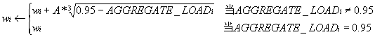

在公式中，0.95是我们想要达到的系统利用率，A是一个可调整的系数（缺省值为5）。当综合负载值为0.95时，服务器权值不变；当综合负载值大于0.95时，权值变小；当综合负载值小于0.95时，权值变大。若新权值大于SCALE*DEFAULT_WEIGHTi，我们将新权值设为 SCALE*DEFAULT_WEIGHTi。若新权值与当前权值的差异超过设定的阀值，则将新权值设置到内核中的IPVS调度参数中，否则避免打断 IPVS调度的开销。我们可以看出这是一个负反馈公式，会使得权值调整到一个稳定点，如系统达到理想利用率时，权值是不变的。

在实际使用中，若发现所有服务器的权值都小于他们的DEFAULT_WEIGHT，则说明整个服务器集群处于超载状态，这时需要加入新的服务器结点到集群中来处理部分负载；反之，若所有服务器的权值都接近于SCALE*DEFAULT_WEIGHT，则说明当前系统的负载都比较轻。

#### <a name="3.2.5">3.2.5 一个实现例子</a> 

我们在RedHat集群管理工具Piranha[6]中实现了一个简单的动态反馈负载均衡算法。在综合负载上，它只考虑服务器的CPU负载（Load Average），使用以下公式进行权值调整：


服务器权值调整区间为[DEFAULT_WEIGHTi, 10*DEFAULT_WEIGHTi]，A为DEFAULT_WEIGHTi /2，而权值调整的阀值为DEFAULT_WEIGHTi /4。1是所想要达到的系统利用率。Piranha每隔20秒查询各台服务器的CPU负载，进行权值计算和调整。

### <a name="3.3">3.3 小结</a> 

本章主要讲述了IP虚拟服务器在内核中实现的八种连接调度算法：

* 轮叫调度（Round-Robin Scheduling）
* 加权轮叫调度（Weighted Round-Robin Scheduling）
* 最小连接调度（Least-Connection Scheduling）
* 加权最小连接调度（Weighted Least-Connection Scheduling）
* 基于局部性的最少链接（Locality-Based Least Connections Scheduling）
* 带复制的基于局部性最少链接（Locality-Based Least Connections with Replication Scheduling）
* 目标地址散列调度（Destination Hashing Scheduling）
* 源地址散列调度（Source Hashing Scheduling）

因为请求的服务时间差异较大，内核中的连接调度算法容易使得服务器运行出现倾斜。为此，给出了一个动态反馈负载均衡算法，结合内核中的加权连接调度算法，根据动态反馈回来的负载信息来调整服务器的权值，来调整服务器间处理请求数的比例，从而避免服务器间的负载不平衡。动态反馈负载算法可以较好地避免服务器的倾斜，提高系统的资源使用效率，从而提高系统的吞吐率。


## <a name="4">4.  IP虚拟服务器的实现和性能测试</a> 

本章主要讲述IP负载均衡技术和连接调度算法在Linux内核中的实现，称之为IP虚拟服务器（IP Virtual Server，简写为IPVS），再叙述了实现中所遇到关键问题的解决方法和优化。最后，对IPVS软件进行性能测试，并列举该软件的应用情况。

### <a name="4.1">4.1 系统实现的基本框架</a> 

我们分别在Linux 内核2.0和内核2.2中修改了TCP/IP协议栈，在IP层截取和改写/转发IP报文，实现了三种IP负载均衡技术，并提供了一个ipvsadm程序进行虚拟服务器的配置和管理。在Linux 内核2.4和2.6中，我们把它实现为NetFilter的一个模块，很多代码作了改写和进一步优化，目前版本已在网上发布，根据反馈信息该版本已经较稳定。

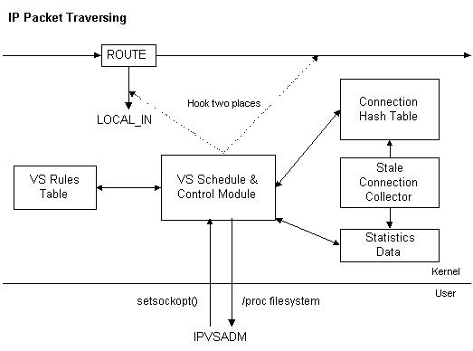
图5.1：系统的主要功能模块

系统的主要功能模块如图5.1所示，“VS Schedule & Control Module”是虚拟服务器的主控模块，它挂接在IP报文遍历的LOCAL_IN链和IP_FORWARD链两处，用于截取/改写IP报文；“VS Rules Table”用于存放虚拟服务器的规则，“Connections Hash Table”表是用于记录当前连接的Hash表；“Stale Connection Collector”模块用于回收已经过时的连接；“Statistics Data”表记录IPVS的统计信息。用户空间的ipvsadm管理程序通过setsockopt()函数将虚拟服务器的规则写入“VS Rules Table”表中，通过/proc文件系统把“VS Rules Table”表中的规则读出。

当一个IP报文到达时，若报文的目标地址是本地的IP地址，IP报文会转到LOCAL_IN链上，否则转到IP_FORWARD链上。IPVS模块主要挂接在LOCAL_IN链和IP_FORWARD链两处。当一个目标地址为Virtual IP Address的报文到达时，该报文会被挂接在LOCAL_IN链上的IPVS程序捕获，若该报文属于在连接Hash表中一个已建立的连接，则根据连接的信息将该报文发送到目标服务器，否则该报文为SYN时，根据连接调度算法从一组真实服务器中选出一台服务器，根据IP负载调度设置的规则将报文发送给选出的服务器，并在连接Hash表中记录这个连接。挂接在IP_FORWARD链上的IPVS程序是改写VS/NAT中服务器响应报文的地址。

连接的Hash表可以容纳几百万个并发连接，在Linux内核2.2和内核2.4的IP虚拟服务器版本中每个连接只占用128Bytes有效内存，例如一个有256M可用内存的调度器就可调度两百万个并发连接。连接Hash表的桶个数可以由用户根据实际应用来设定，来降低Hash的冲突率。

在每个连接的结构中有连接的报文发送方式、状态和超时等。报文发送方式有VS/NAT、VS/TUN、VS/DR和本地结点，报文会被以连接中设定的方式发送到目标服务器。这意味着在一个服务器集群中，我们可以用不同的方式（VS/NAT、VS/TUN或VS/DR）来调度不同的服务器。连接的状态和超时用于记录连接当前所在的状态，如SYN_REC、ESTABLISHED和FIN_WAIT等，不同的状态有不同的超时值。

### <a name="4.2">4.2 系统实现的若干问题</a>

本节讲述实现时所遇到的若干主要问题和它们的解决方法或者优化处理。

#### <a name="4.2.1">4.2.1 Hash表</a>

在系统实现中，我们多处用到Hash表，如连接的查找和虚拟服务的查找。选择Hash表优先Tree等复杂数据结构的原因是Hash表的插入和删除的复杂度为O(1)，而Tree的复杂度为O(log(n))。Hash表的查找复杂度为O(n/m)，其中n为Hash表中对象的个数，m为Hash表的桶个数。当对象在Hash表中均匀分布和Hash表的桶个数与对象个数一样多时，Hash表的查找复杂度可以接近O(1)。

因为连接的Hash表要容纳几百万个并发连接，并且连接的Hash表是系统使用最频繁的部分，任何一个报文到达都需要查找连接Hash表，所以如何选择一个高效的连接Hash函数直接影响到系统的性能。连接Hash函数的选择要考虑到两个因素，一个是尽可能地降低Hash表的冲突率，另一个是Hash函数的计算不是很复杂。

一个连接有客户的、虚拟服务的和目标服务器的等元素，其中客户的是每个连接都不相同的，后两者在不同的连接经常重叠。所以，我们选择客户的来计算Hash Key。在IPVS版本中，我们用以下快速的移位异或Hash函数来计算。

```C
#define IP_VS_TAB_BITS  CONFIG_IP _VS_TAB_BITS
#define IP_VS_TAB_SIZE  (1 << IP_VS_TAB_BITS)
#define IP_VS_TAB_MASK  (IP_VS_TAB_SIZE - 1)
inline unsigned ip_vs_hash_key(unsigned proto, unsigned addr, unsigned port)
{
    return (proto ^ addr ^ (addr>>IP_VS_TAB_BITS) ^ port) 
         & IP_VS_TAB_MASK;
}
```

为了评价Hash函数的效率，我们从一个运行IPVS的真实站点上取当前连接的样本，它一共含有35652个并发连接。在有64K桶的Hash表中，连接分布如下：

```
桶的长度（Lj）	该长度桶的个数（Nj）
5	              16
4	              126
3	              980
2	              5614
1	              20900
```

通过以下公式算出所有连接查找一次的代价：
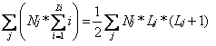

所有连接查找一次的代价为45122，每个连接查找的平均代价为1.266（即45122/35652）。我们对素数乘法Hash函数进行分析，素数乘法Hash函数是通过乘以素数使得Hash键值达到较均匀的分布。

```C
inline unsigned ip_vs_hash_key(unsigned proto, unsigned addr, unsigned port)
{
    return ((proto+addr+port)* 2654435761UL) & IP_VS_TAB_MASK;
}
```

其中，2654435761UL是2到2^32间黄金分割的素数，

```
2654435761 / 4294967296 = 0.618033987
```

在有64K桶的Hash表中，素数乘法Hash函数的总查找代价为45287。可见，现在IPVS中使用的移位异或Hash函数还比较高效。

在最新的Linux内核2.4和2.6中，连接的Hash函数是使用Jenkins函数。

参考文献
* [http://burtleburtle.net/bob/hash/](http://burtleburtle.net/bob/hash/)
* [Jenkins Hash](http://www.burtleburtle.net/bob/hash/doobs.html)


#### <a name="4.2.2">4.2.2 垃圾回收</a>

为了将不再被使用的连接单元回收，我们在连接上设置一个定时器，当连接超时，将该连接回收。因为系统中有可能存在几百万个并发连接，若使用内核中的定时器，几百万个连接单元系统的定时器的列表中，系统每隔1/100秒进行单元的迁移和回收已超时的连接单元，这会占用很多系统的开销。

因为连接的回收并不需要很精确，我们可以让系统的定时器每隔1秒启动连接回收程序来回收那些超时的连接。为此，我们设计了一个慢定时器，连接的定时都是以1秒钟为单位。用三个时间大转盘，第一个转盘有1024个刻度，定时在1024秒钟之内的连接都挂接在第一个转盘的各个刻度上；第二个转盘有256个刻度，定时在[210, 218)区间的落在第二个转盘上；第三个转盘有256个刻度，定时在[218, 226)区间的落在第三个转盘上。

慢定时器处理程序每隔1秒由系统定时器启动运行一次，将第一个转盘当前指针上的连接进行回收，再将指针顺时针转一格。若指针正好转了一圈，则对第二个转盘当前指针上的连接进行操作，根据他们的定时迁移到第一个转盘上，再将指针顺时针转一格。若第二个转盘的指针正好转了一圈，则对第三个转盘当前指针上的连接进行操作，根据他们的定时迁移到第二个转盘上。

使用这种慢定时器极大地提高了过期连接的回收问题。在最初的版本中，我们是直接使用系统的定时器进行超时连接的回收，但是当并发连接数增加到500,000时，系统的CPU使用率已接近饱和，所以我们重新设计了这种高效的垃圾回收机制。

#### <a name="4.2.3">4.2.3 ICMP处理</a>

负载调度器需要实现虚拟服务的ICMP处理，这样进来的虚拟服务ICMP报文会被改写或者转发给正确的后端服务器，出去的ICMP报文也会被正确地改写和发送给客户。ICMP处理对于客户和服务器间的错误和控制通知是非常重要的。

ICMP消息可以发现在客户和服务器间的MTU（Maximum Transfer Unit）值。在客户的请求被VS/DR调度到一台服务器执行，服务器将执行结果直接返回给客户。例如响应报文的MTU为1500个字节，在服务器到客户的路径中有一段线路的MTU值为512个字节，这时路由器会向报文的源地址（即虚拟服务的地址）发送一个需要分段为512个字节的ICMP消息。该ICMP消息会到达调度器，调度器需要将ICMP消息中原报文的头取出，再在Hash表中找到相应的连接，然后将该ICMP消息转发给对应的服务器。这样，服务器就会将原有的报文分段成512个字节进行发送，客户得到服务的响应。

#### <a name="4.2.4">4.2.4 可装卸的调度模块</a>

为了提高系统的灵活性，我们将连接调度做成可装卸的模块（Loadable Modules），如ip_vs_rr.o、ip_vs_wrr.o、ip_vs_lc.o、ip_vs_wlc.o、ip_vs_lblc.o、ip_vs_lblcr.o、ip_vs_dh.o、ip_vs_sh.o、ip_vs_sed.o和ip_vs_nq.o。当虚拟服务设置时，会将相应的模块调到内核中。这样，有助于提高系统的使用效率，不装载不被使用的资源。

#### <a name="4.2.5">4.2.5 锁的处理和优化</a>

在系统中虚拟服务规则的读和写需要锁来保证处理的一致性。在连接的Hash表中，同样需要锁来保证连接加入和删除的一致性。连接的Hash表是系统使用最频繁的资源，任何一个报文到达都需要查找连接Hash表。如果只有一个锁来管理连接Hash表的操作，锁的冲突率会很高。为此，我们引入有n个元素的锁数组，每个锁分别控制1/n的连接Hash表，增加锁的粒度，降低锁的冲突率。在两个CPU的SMP机器上，假设CPU操作Hash表的部位是随机分布的，则两个CPU同时操作同一区域的概率为1/n。在系统中n的缺省值为16。

#### <a name="4.2.6">4.2.6 连接的相关性</a>

到现在为止，我们假设每个连接都相互独立的，所以每个连接被分配到一个服务器，跟过去和现在的分配没有任何关系。但是，有时由于功能或者性能方面的原因，一些来自同一用户的不同连接必须被分配到同一台服务器上。

FTP是一个因为功能设计导致连接相关性的例子。在FTP使用中，客户需要建立一个控制连接与服务器交互命令，建立其他数据连接来传输大量的数据。在主动的FTP模式下，客户通知FTP服务器它所监听的端口，服务器主动地建立到客户的数据连接，服务器的端口一般为20。IPVS调度器可以检查报文的内容，可以获得客户通知FTP服务器它所监听的端口，然后在调度器的连接Hash表中建立一个相应的连接，这样服务器主动建立的连接可以经过调度器。但是，在被动的FTP模式下，服务器告诉客户它所监听的数据端口，服务器被动地等待客户的连接。在VS/TUN或VS/DR下，IPVS调度器是在从客户到服务器的半连接上，服务器将响应报文直接发给客户，IPVS调度器不可能获得服务器告诉客户它所监听的数据端口。

SSL（Secure Socket Layer）是一个因为性能方面原因导致连接相关性的例子。当一个SSL连接请求建立时，一个SSL的键值（SSL Key）必须要在服务器和客户进行选择和交换，然后数据的传送都要经过这个键值进行加密，来保证数据的安全性。因为客户和服务器协商和生成SSL Key是非常耗时的，所以SSL协议在SSL Key的生命周期内，以后的连接可以用这个SSL Key和服务器交换数据。如果IPVS调度器将以后的连接调度到其他服务器，这会导致连接的失败。

我们现在解决连接相关性的方法是持久服务（Persistent Service）的处理。使用两个模板来表示客户和服务器之间的持久服务，模板〈protocol, client_ip, 0, virtual_ip, virtual_port, dest_ip, dest_port〉表示来自同一客户client_ip到虚拟服务〈virtual_ip, virtual_port〉的任何连接都会被转发到目标服务器〈dest_ip, dest_port〉，模板〈protocol, client_ip, 0, virtual_ip, 0 dest_ip, 0〉表示来自同一客户client_ip到虚拟服务器virtual_ip的任何连接都会被转发到目标服务器dest_ip，前者用于单一的持久服务，后者用于所有端口的持久服务。当一个客户访问一个持久服务时，IPVS调度器会在连接Hash表中建立一个模板，这个模板会在一个可设置的时间内过期，如果模板有所控制的连接没有过期，则这个模板不会过期。在这个模板没有过期前，所有来自这个客户到相应服务的任何连接会被发送到同一台服务器。

持久服务还可设置持久的粒度，即可设置将来自一个C类地址范围的所有客户请求发送到同一台服务器。这个特征可以保证当使用多个代理服务器的客户访问集群时，所有的连接会被发送到同一服务器。

虽然持久服务可能会导致服务器间轻微的负载不平衡，因为持久服务的一般调度粒度是基于每个客户机的，但是这有效地解决连接相关性问题，如FTP、SSL和HTTP Cookie等。

#### <a name="4.2.7">4.2.7 本地结点</a>

本地结点（Local Node）功能是让调度器本身也能处理请求，在调度时就相当一个本地结点一样，在实现时就是根据配置将部分连接转交给在用户空间的服务进程，由服务进程处理完请求将结果返回给客户。该功能的用处如下：

当集群中服务器结点较少时，如只有三、四个结点，调度器在调度它们时，大部分的CPU资源是闲置着，可以利用本地结点功能让调度器也能处理一部分请求，来提高系统资源的利用率。

在分布式服务器中，我们可以利用IPVS调度的本地结点功能，在每台服务器上加载IPVS调度模块，在一般情况下，利用本地结点功能服务器处理到达的请求，当管理程序发现服务器超载时，管理程序将其他服务器加入调度序列中，将部分请求调度到其他负载较轻的服务器上执行。

在地理上分布的服务器镜像上，镜像服务器利用本地结点功能功能处理请求，当服务器超载时，服务器通过VS/TUN将请求调度到邻近且负载较轻的服务器上。

#### <a name="4.2.8">4.2.8 数据统计</a>

在IPVS虚拟服务使用情况的统计上，我们实现了如下计数器：

* 调度器所处理报文的总数
* 调度器所处理连接的总数
* 调度器中所有并发连接的数目
* 每个虚拟服务处理连接的总数
* 每个服务器所有并发连接的数目

在单位时间内，我们可以根据调度器所处理报文总数之差得出调度器的报文处理速率，根据调度器所处理连接总数之差得出调度器的连接处理速率。同样，我们可以算出每个虚拟服务的连接处理速率。

#### <a name="4.2.9">4.2.9 防卫策略</a>

IPVS调度器本身可以利用Linux内核报文过滤功能设置成一个防火墙，只许可虚拟服务的报文进入，丢掉其他报文。调度器的脆弱之处在于它需要记录每个连接的状态，每个连接需要占用128个字节，一些恶意攻击可能使得调度器生成越来越多的并发连接，直到所有的内存耗尽，系统出现拒绝服务（Denial of Service）。但是，一般SYN-Flooding攻击调度器是非常困难的，假设系统有128Mbytes可用内存，则系统可以容纳一百万个并发连接，每个处理接受SYN连接的超时（Timeout）为60秒，SYN-Flooding主机需要生成16,666 Packets/Second的流量，这往往需要分布式SYN-Flooding工具，由许多个SYN-Flooding主机同时来攻击调度器。

为了避免此类大规模的恶意攻击，我们在调度器中实现三种针对DoS攻击的防卫策略。它们是随机丢掉连接、在调度报文前丢掉1/rate的报文、使用更安全的TCP状态转换和更短的超时。在系统中有三个开关分别控制它们，开关处于0表示该功能完全关掉。1和2表示自动状态，当系统的有效内存低于设置的阀值时，该防卫策略被激活，开关从1状态迁移到2状态；当系统的有效内存高于设置的阀值时，该防卫策略被关掉，开关从2状态迁移到1状态。3表示该策略永远被激活。

#### <a name="4.2.10">4.2.10 调度器间的状态同步</a>

尽管IPVS虚拟服务器软件已被证明相当鲁棒，但调度器有可能因为其他原因而失效，如机器的硬件故障和网络线路故障等。所以，我们引入一个从调度器作为主调度器的备份，当主调度器失效时，从调度器将接管VIP等地址进行负载均衡调度。在现在的解决方案中，当主调度器失效时，调度器上所有已建立连接的状态信息将丢失，已有的连接会中断，客户需要向重新连接，从调度器才会将新连接调度到各个服务器上。这对客户会造成一定的不便。为此，我们考虑一种高效机制将主调度器的状态信息及时地复制到从调度器，当从调度器接管时，绝大部分已建立的连接会持续下去。

因为调度器的连接吞吐率是非常高的，如每秒处理一万多个连接，如何将这些变化非常快的状态信息高效地复制到另一台服务器？我们设计利用内核线程实现主从同步进程，在操作系统的内核中，直接将状态信息发送到从调度器上，可以避免用户空间和核心的切换开销。其结构如图5.2所示：


图5.2：主从调度器间的状态同步 

在主从调度器的操作系统内核中分别有两个内核线程ConnSyncd，主调度器上的ConnSyncd每隔1/10秒钟唤醒一次从更新队列中将更新信息读出，将更新信息发给从调度器上的ConnSyncd，然后在从调度器内核中生成相应的状态信息。为了减少主从调度器间的通讯开销，在主调度器的更新队列中只放新连接生成的信息，在从调度器中生成连接信息，设置定时器，当连接超时，该连接会自动被删除。

主从调度器间状态复制的代码正在编写中。因为主从调度器间的状态复制会降低调度器的吞吐率，所以主从调度器间状态复制会以模块的形式出现，当用户特别需要时，可以将该模块加入内核中


### <a name="4.3">4.3 性能测试</a>

在美国VA Linux公司的高级工程师告诉我，他们在实验室中用一个IPVS调度器（VS/DR方式）和58台WEB服务器组成一个WEB集群，想测试在真实网络服务负载下IPVS调度器的性能，但是他们没有测试IPVS调度器的性能，当58台WEB服务器都已经满负荷运行时，IPVS调度器还处于很低的利用率（小于0.2）。他们认为系统的瓶颈可能在网卡的速度和报文的转发速度，估计要到几百台服务器时，IPVS调度器会成为整个系统的瓶颈。

我们没有足够的物理设备来测试在真实网络服务负载下IPVS调度器的性能，况且在更高的硬件配置下（如两块1Gbps网卡和SMP机器），调度器肯定会有更高的性能。为了更好地估计在VS/DR和VS/TUN方式下IPVS调度器的性能，我们专门写一个测试程序testlvs，程序不断地生成SYN的报文发送给调度器上的虚拟服务，调度器会生成一个连接并将SYN报文转发给后端服务器，我们设置后端服务器在路由时将这些SYN报文丢掉，在后端服务器的网卡上我们可以获得进来的报文速率，从而估计出调度器的报文处理速率。

我们的测试环境如图5.3所示：有四台客户机、三台服务器和一个Pentium III 500MHz、128M内存和2块100M网卡的调度器，四台客户机和调度器通过一个100M交换机相连，三台服务器和调度器也通过一个100M交换机相连。它们都运行Linux操作系统。
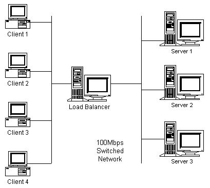
图5.3：IPVS调度器的性能测试环境

在VS/NAT的性能测试中，我们分别在三台服务器启动三个Netpipe服务进程，在调度器上开启三个虚拟服务通过网络地址转换到三台服务器，用三台客户机运行Netpipe分别向三个虚拟服务进行测试，调度器已经满负荷运行，获得三个Netpipe的累计吞吐率为89Mbps。在正常网络服务下，我们假设每个连接的平均数据量为10Kbytes，VS/NAT每秒处理的连接数为1112.5 Connections/Second。

在VS/DR和VS/TUN的性能测试中，我们设置后端服务器在路由时将这些SYN报文丢掉，后端服务器就像一个黑洞将报文吸掉，它的处理开销很小，所以我们在后端服务器只用两台。我们在后端服务器上运行程序来测试进来报文的速率，在调度器上将一虚拟服务负载均衡到两台后端服务器，然后在四台客户机上运行testlvs不断地向虚拟服务发SYN报文，报文的源地址是随机生成的，每个报文的大小为40个字节。测试得VS/DR的处理速率为150,100 packets/second，VS/TUN的处理速率为141,000packets/second，可见将IP隧道的开销要比修改MAC地址要大一些。在实际实验中，我们测得平均文件长度为10K的HTTP连接，从客户到服务器方向的报文为6个。这样，我们可以推出VS/DR或VS/TUN调度器的最大吞吐率为25,000 Connections/Second。

### <a name="4.4">4.4 LVS集群的应用</a>

Linux虚拟服务器项目（Linux Virtual Server Project）的网址是http://www.LinuxVirtualServer.org/， LVS中的IPVS第一个版本源程序于1998年5月在网上发布。至今，本项目受到不少关注，LVS系统已被用于很多重负载的站点，就我们所知该系统已在美、中、英、德、澳等国的近百个站点上正式使用。

我们没有上百台机器和高速的网络来测试LVS的终极性能，所以举LVS的应用实例来说明LVS的高性能和稳定性。我们所知的一些大型LVS应用实例如下：

* 英国国家JANET Cache Service（wwwcache.ja.net）是为英国150所以上的大学提供Web Cache服务。他们用28个结点的LVS集群代替了原有现50多台相互独立的Cache服务器，用他们的话说现在速度就跟夏天一样，因为夏天是放假期间没有很多人使用网络。
* Linux的门户站点（www.linux.com）用LVS将很多台VA Linux SMP服务器组成高性能的WEB服务，已使用将近一年。
* SourceForge（sourceforge.net）是在全球范围内为开发源码项目提供WEB、FTP、Mailing List和CVS等服务，他们也使用LVS将负载调度到十几台机器上。
* 世界上最大的PC制造商之一采用了两个LVS集群系统，一个在美洲，一个在欧洲，用于网上直销系统。
* 以RealPlayer提供音频视频服务而闻名的Real公司（www.real.com）使用由20台服务器组成的LVS集群，为其全球用户提供音频视频服务。在2000年3月时，整个集群系统已收到平均每秒20,000个连接的请求流。
* NetWalk（www.netwalk.com）用多台服务器构造LVS系统，提供1024个虚拟服务，其中本项目的一个美国镜像站点（www.us.linuxvirtualserver.org）。
* RedHat（www.redhat.com）从其6.1发行版起已包含LVS代码，他们开发了一个LVS集群管理工具叫Piranha，用于控制LVS集群，并提供了一个图形化的配置界面。
* VA Linux（www.valinux.com）向客户提供基于LVS的服务器集群系统，并且提供相关的服务和支持。
* TurboLinux的“世界一流Linux集群产品”TurboCluster实际上是基于LVS的想法和代码的，只是他们在新闻发布和产品演示时忘了致谢 。
* 红旗Linux和中软都提供基于LVS的集群解决方案，并在2000年9月召开的Linux World China 2000上展示。


### <a name="4.5">4.5 小结</a>

本章主要讲述了IP虚拟服务器在Linux内核中的实现、关键问题的解决方法和优化处理、以及IP虚拟服务器的性能测试和应用情况。IP虚拟服务器具有以下特点：

* 三种IP负载均衡技术，在一个服务器集群中，不同的服务器可以使用不同的IP负载均衡技术。
* 可装卸连接调度模块，共有五种连接调度算法。
* 高效的Hash函数
* 高效的垃圾回收机制
* 虚拟服务的数目没有限制，每个虚拟服务有自己的服务器集。
* 支持持久的虚拟服务
* 正确的ICMP处理
* 拥有本地结点功能
* 提供系统使用的统计数据
* 针对大规模DoS攻击的三种防卫策略

通过IP虚拟服务器软件和集群管理工具可以将一组服务器组成一个高性能、高可用的网络服务。该系统具有良好的伸缩性，支持几百万个并发连接。无需对客户机和服务器作任何修改，可适用任何Internet站点。该系统已经在很多大型的站点得到很好的应用。


## <a name="5">5. 内核中的基于内容请求分发</a>

前面几章讲述了在Linux虚拟服务器（Linux Virtual Server）的框架下，先在Linux内核中实现了含有三种IP负载均衡技术的IP虚拟服务器，可将一组服务器构成一个实现高可伸缩、高可用的网络服务的服务器集群。在IPVS中，使得服务器集群的结构对客户是透明的，客户访问集群提供的网络服务就像访问一台高性能、高可用的服务器一样。客户程序不受服务器集群的影响不需作任何修改。系统的伸缩性通过在服务机群中透明地加入和删除一个节点来达到，通过检测节点或服务进程故障和正确地重置系统达到高可用性。

IPVS基本上是一种高效的Layer-4交换机，它提供负载平衡的功能。当一个TCP连接的初始SYN报文到达时，IPVS就选择一台服务器，将报文转发给它。此后通过查发报文的IP和TCP报文头地址，保证此连接的后继报文被转发到相同的服务器。这样，IPVS无法检查到请求的内容再选择服务器，这就要求后端的服务器组是提供相同的服务，不管请求被送到哪一台服务器，返回结果都应该是一样的。但是在有一些应用中后端的服务器可能功能不一，有的是提供HTML文档的Web服务器，有的是提供图片的Web服务器，有的是提供CGI的Web服务器。这时，就需要基于内容请求分发 (Content-Based Request Distribution)，同时基于内容请求分发可以提高后端服务器上访问的局部性。
 

### <a name="5.1">5.1 基于内容的请求分发</a>

根据应用层（Layer-7）的信息调度TCP负载不是很容易实现，对于所有的TCP服务，应用层信息必须等到TCP连接建立（三次握手协议）以后才能获得。这就说明连接不能用Layer-4交换机收到一个SYN报文时进行调度。来自客户的TCP连接必须在交换机上被接受，建立在客户与交换机之间 TCP连接，来获得应用的请求信息。一旦获得请求信息，分析其内容来决定哪一个后端服务器来处理，再将请求调度到该服务器。

现有两种方法实现基于内容的调度。一种是TCP网关（TCP Gateway），交换机建立一个到后端服务器的TCP连接，将客户请求通过这个连接发到服务器，服务器将响应结果通过该连接返回到交换机，交换机再将结果通过客户到交换机的连接返回给客户。另一种是TCP迁移（TCP Migration），将客户到交换机TCP连接的交换机端迁移到服务器，这样客户与服务器就可以建立直接的TCP连接，但请求报文还需要经过交换机调度到服务器，响应报文直接返回给客户。

就我们所知，Resonate实现了TCP迁移方法，他们称之为TCP连接跳动（TCP Connection Hop），他们的软件是专有的。TCP迁移需要修改交换机的TCP/IP协议栈，同时需要修改所有后端服务器的TCP/IP协议栈，才能实现将TCP连接的一端从一台机器及其迁移到另一台上。Rice大学和IBM的研究人员简要地描述了它们的TCP Handoff Protocol，在交换机和后端服务器上安装TCP Handoff协议，交换机获得客户请求后，通过TCP Handoff协议将TCP连接的交换机端转给后端服务器。但是，他们没有提供任何其他文档或研究报告描述他们的TCP Handoff协议和实现。他们提出的提高局部性调度算法LARD只考虑静态文档。虽然在交换机获得客户请求后，TCP迁移方法比较高效，但是该方法实现工作量大，要修改交换机和后端服务器的操作系统，不具有一般性。

因此，TCP网关方法被绝大部分Layer-7交换的商业产品和自由软件所使用，如ArrowPoint的CS-100和CS-800 Web交换机（Web Switch）、Zeus负载调度器、爱立信实验室的EDDIE、自由软件Apache和Squid等。TCP网关方法不需要更改服务器的操作系统，服务器只要支持TCP/IP即可，它具有很好的通用性。但是，TCP网关一般都是在用户空间实现的，其处理开销比较大，如图6.1所示。
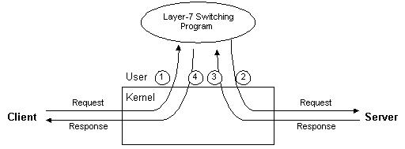

图6.1：用户空间的TCP Gateway

从图中我们可以看出，对于任一TCP请求，客户将请求发到交换机，计算机将请求报文从内核传给用户空间的Layer-7交换程序，Layer-7交换程序根据请求选出服务器，再建一个TCP连接将请求发给服务器，返回的响应报文必须先由内核传给用户空间的Layer-7交换程序，再由Layer-7交换程序通过内核将结果返回给客户。对于一个请求报文和对应的响应报文，都需要四次内核与用户空间的切换，切换和内存复制的开销是非常高的，所以用户空间TCP Gateway的伸缩能力很有限，一般来说一个用户空间TCP Gateway只能调度三、四台服务器，当连接的速率到达每秒1000个连接时，TCP Gateway本身会成为瓶颈。所以，在ArrowPoint的CS-800 Web交换机中集成了多个TCP Gateway。

虽然Layer-7交换比Layer-4交换处理复杂，但Layer-7交换带来以下好处：

* 相同页面的请求被发送到同一台的服务器，所请求的页面很有可能会被服务器缓存，可以提高单台服务器的主存Cache使用效率。
* 一些研究[94]表明WEB访问流中存在空间的局部性。Layer-7交换可以充分利用访问的局部性，将相同类型的请求发送到同一台服务器，使得每个后端服务器收到的请求相似性好，有利于进一步提高单台服务器的主存Cache使用效率，从而在有限的硬件配置下提高系统的整体性能。
* 后端的服务器可运行不同类型的服务，如文档服务，图片服务，CGI服务和数据库服务等。

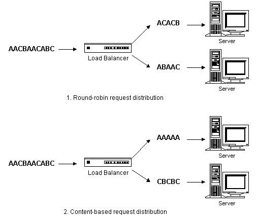

图6.2：基于内容的请求分发

图6.2举例说明了基于内容请求分发可以提高后端服务器的Cache命中率。在例子中，一个有两台后端服务器的集群来处理进来的请求序列AACBAACABC。在基于内容的请求分发中，调度器将所有请求A发到后端服务器1，将请求B和C序列发到后端服务器2。这样，有很大的可能性请求所要的对象会在后端服务器的Cache中找到。相反在轮叫请求分发中，后端服务器都收到请求A、B和C，这增加了Cache不命中的可能性。因为分散的请求序列会增大工作集，当工作集的大小大于后端服务器的主存Cache时，导致Cache不命中。

在基于内容的请求分发中，不同的请求被发送到不同的服务器，当然这有可能导致后端服务器的负载不平衡，也有可能导致更差的性能。所以，在设计基于内容请求分发的服务器集群中，我们不仅要考虑如何高效地进行基于内容的请求分发，而且要设计有效的算法来保证后端服务器间的负载平衡和提高单个服务器的Cache命中率。

### <a name="5.2">5.2 内核中的基于内容请求分发KTCPVS</a>

由于用户空间TCP Gateway的开销太大，导致其伸缩能力有限。为此，我们提出在操作系统的内核中实现Layer-7交换方法，来避免用户空间与核心空间的切换开销和内存复制的开销。在Linux操作系统的内核中，我们实现了Layer-7交换，称之为KTCPVS（Kernel TCP Virtual Server）。以下几小节将介绍KTCPVS的体系结构、实现方法、负载平衡和高可用特征等。

#### <a name="5.2.1">5.2.1 KTCPVS的体系结构</a>

KTCPVS集群的体系结构如图6.3所示：它主要由两个组成部分，一是KTCPVS交换机，根据内容不同将请求发送到不同的服务器上；二是后端服务器，可运行不同的网络服务。KTCPVS交换机和后端服务器通过LAN/WAN互联。


图6.3 ：KTCPVS集群的体系结构

KTCPVS交换机能进行根据内容的调度，将不同类型的请求发送到不同的后端服务器，再将结果返回给客户，后端服务器对客户是不可见的。所以，KTCPVS集群的结构对客户是透明的，客户访问集群提供的网络服务就像访问一台高性能、高可用的服务器一样，故我们也称之为虚拟服务器。客户程序不受服务器集群的影响不需作任何修改。

#### <a name="5.2.2">5.2.2 KTCPVS实现</a>

在Linux 内核2.4中，我们用内核线程（Kernel thread）实现Layer-7交换服务程序，并把所有的程序封装在可装卸的KTCPVS模块。KTCPVS的主要功能模块如图6.4所示：当KTCPVS模块被加载到内核中时，KTCPVS主内核线程被激活，并在/proc文件系统和setsockopt上挂接KTCPVS的内核控制程序，用户空间的管理程序tcpvsadm通过setsockopt函数来设置KTCPVS服务器的规则，通过/proc文件系统把KTCPVS服务器的规则读出。基于内容调度的模块被做成可装卸的模块（Loadable Module），不同的网络服务可以使用不同的基于内容调度模块，如HTTP和RTSP等。另外，系统的结构灵活，用户也可以为自己不同类型的网络服务编写相应的模块。

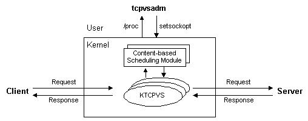
图6.4：KTCPVS系统的主要功能模块

可以通过tcpvsadm命令使得KTCPVS主线程生成多个子线程监听在某个端口。这组子线程可以接受来自客户的请求，通过与其绑定的基于内容的调度模块获得能处理当前请求的服务器，并建立一个TCP连接到该服务器，将请求发到服务器；子线程获得来自服务器的响应结果后，再将结果返回给客户。所有的请求和响应数据处理都是在操作系统的内核中进行的，所以没有用户空间与核心空间的切换开销和内存复制的开销，其处理开销比用户空间的TCP Gateway小很多。

#### <a name="5.2.3">5.2.3 KTCPVS高可用性</a>

KTCPVS集群系统的高可用性可分为二部分达到，一是服务器故障处理，二是KTCPVS调度器故障处理。

在服务器故障处理上，我们可以一种或者组合多种方法来检测服务器或者网络服务是否可用。例如，一是资源监测器每隔t个毫秒对每个服务器发ARP（Address Resolve Protocol）请求，若有服务器过了r毫秒没有响应，则说明该服务器已发生故障，资源监测器通知调度器将该服务器的所有服务进程调度从调度列表中删除。二是资源监测器定时地向每个服务进程发请求，若不能返回结果则说明该服务进程发生故障，资源监测器通知调度器将该服务进程调度从KTCPVS调度列表中删除。资源监测器能通过电子邮件或传呼机向管理员报告故障，一旦监测到服务进程恢复工作，通知调度器将其加入调度列表进行调度。通过检测节点或服务进程故障和正确地重置系统，可以将部分结点或软件故障对用户屏蔽掉，从而实现系统的高可用性。

在KTCPVS调度器故障处理上，跟IPVS调度器故障处理类似，通过心跳或者VRRP来实现KTCPVS调度器的高可用性。

### <a name="5.3">5.3 KTCPVS的调度算法</a>

KTCPVS的负载均衡调度是以TCP连接为粒度的。同一用户的不同连接可能会被调度到不同的服务器上，所以这种细粒度的调度可避免不同用户的访问差异引起服务器间的负载不平衡。

在调度算法上，我们先实现了加权最小连接调度（Weighted Least-Connection Scheduling），因为该算法都较容易实现，便于调试和测试。另外，KTCPVS交换机网络配置比Layer-4交换机的简单，KTCPVS交换机和服务器只要有网络相连，能进行TCP/IP通讯即可，安装使用比较方便，所以在整个系统规模不大（例如不超过10个结点）且结点提供的服务相同时，可以利用以上算法来调度这些服务器，KTCPVS交换机仍是不错的选择。同时，在实际的性能测试中，这些调度算法可以用作比较。

我们给出基于局部性的最小连接调度（Locality-Based Least-Connection Scheduling）和基于内容的调度（Content-based Scheduling）算法。基于局部性的最小连接调度是假设后端服务器都是相同的，在后端服务器的负载基本平衡情况下，尽可能将相同的请求分到同一台服务器，以提高后端服务器的访问局部性，从而提高后端服务器的Cache命中率。基于内容的调度是考虑后端服务器不相同时，若同一类型的请求有多个服务器可以选择时，将请求负载均衡地调度到这些服务器上。

#### <a name="5.3.1">5.3.1 加权最小连接调度</a>

最小连接调度（Least-Connection Scheduling）是把新的连接请求分配到当前连接数最小的服务器。最小连接调度是一种动态调度算法，它通过服务器当前所活跃的连接数来估计服务器的负载情况。调度器需要记录各个服务器已建立连接的数目，当一个请求被调度到某台服务器，其连接数加1；当连接中止或超时，其连接数减一。

加权最小连接调度（Weighted Least-Connection Scheduling）是最小连接调度的超集，各个服务器用相应的权值表示其处理性能。服务器的缺省权值为1，系统管理员可以动态地设置服务器的权值。加权最小连接调度在调度新连接时尽可能使服务器的已建立连接数和其权值成比例。

#### <a name="5.3.2">5.3.2 基于局部性的最小连接调度</a>

在基于局部性的最小连接负载调度（Locality-Based Least-Connection Scheduling）中，我们假设任何后端服务器都可以处理任一请求。算法的目标是在后端服务器的负载平衡情况下，提高后端服务器的访问局部性，从而提高后端服务器的主存Cache命中率。

在WEB应用中，来自不同用户的请求很有可能重叠，WEB访问流中存在空间的局部性，容易获得WEB请求的URL，所以，LBLC算法主要针对WEB应用。静态WEB页面的请求格式如下：

```C
    <scheme>://<host>:<port>/<path>
```
其中，区分页面不同的变量是文件的路径<path>，我们将之记为请求的目标。CGI动态页面的格式如下：
```C
<scheme>://<host>:<port>/<path>?<query>
```

我们将其中的CGI文件路径<path>记为请求的目标。因为CGI程序一般要读一个或者多个文件来生成一个动态页面，若在服务器负载基本平衡情况下将相同的CGI请求发送到同一服务器，可以提高服务器文件系统的Cache命中率。
LBLC算法的基本流程如下：
```C
while (true) {
  get next request r;
  r.target = { extract path from static/dynamic request r };
  if (server[r.target] == NULL) then {
    n = { least connection node };
    server[r.target] = n;
  } else {
    n = server[r.target];
    if (n.conns > n.high && a node with node.conns < node.low) || 
      n.conns >= 2*n.high then {
      n = { least connection node };
      server[r.target] = n;
    }
  }
  if (r is dynamic request) then
    n.conns = n.conns + 2;
  else
    n.conns = n.conns + 1;
  send r to n and return results to the client;
  if (r is dynamic request) then
    n.conns = n.conns - 2;
  else
    n.conns = n.conns - 1;
}
```

在算法中，我们用后端服务器的活跃连接数（n.conns）来表示它的负载，server是个关联变量，它将访问的目标和服务器对应起来。在这里，假设动态页面的处理是静态页面的2倍。开销算法的意图是将请求序列进行分割，相同的请求去同一服务器，可以提高访问的局部性；除非出现严重的负载不平衡了，我们进行调整，重新分配该请求的服务器。我们不想因为微小或者临时的负载不平衡，进行重新分配服务器，会导致Cache不命中和磁盘访问。所以，“严重的负载不平衡”是为了避免有些服务器空闲着而有服务器超载了。

我们定义每个结点有连接数目的高低阀值，当结点的连接数（node.conns）小于其连接数低阀值（node.low）时，表明该结点有空闲资源；当结点的连接数（node.conns）大于其连接数高阀值（node.high）时，表明该结点在处理请求时可能会有一定的延时。在调度中，当一个结点的连接数大于其高阀值并且有结点的连接数小于其低阀值时，重新分配，将请求发到负载较轻的结点上。还有，为了限制结点过长的响应延时，当结点的连接数大于2倍的高阀值时，将请求重新分配到负载较轻的结点，不管是否有结点的连接数小于它的低阀值。

我们在调度器上进行限制后端服务器的正在处理连接数必须小于∑node.high，这样可以避免所有结点的连接数大于它们的2倍的高阀值。这样，可以保证当有结点的连接数大于2倍的高阀值时，必有结点的连接数小于其高阀值。

正确选择结点的高低阀值是根结点的处理性能相关的。在实践中，结点的低阀值应尽可能高来避免空闲资源，否则会造成结点的低吞吐率；结点的高阀值应该一个较高的值并且结点的响应延时不大。选择结点的高低阀值是一个折衷平衡的过程，结点的高低阀值之差有一定空间，这样可以限制负载不平衡和短期负载不平衡，而不破坏访问的局部性。对于一般结点，我们选择高低阀值分别为30和60；对于性能很高的结点，可以将其阀值相应调高。

在基本的LBLC算法中，在任何时刻，任一请求目标只能由一个结点来服务。然而，有可能一个请求目标会导致一个后端服务器进入超载状态，这样比较理想的方法就是由多个服务器来服务这个文档，将请求负载均衡地分发到这些服务器上。这样，我们设计了带复制的LBLC算法，其流程如下：
```C
while (true) {
  get next request r;
  r.target = { extract path from static/dynamic request r };
  if (serverSet[r.target] == ∮) then {
    n = { least connection node };
    add n to serverSet[r.target];
  } else {
    n = {least connection node in serverSet[r.target]};
    if (n.conns > n.high && a node with node.conns < node.low) || 
      n.conns >= 2*n.high then {
      n = { least connection node };
      add n to serverSet[r.target];
    }
    if |serverSet[r.target]| > 1 
      && time()-serverSet[r.target].lastMod > K then {
      m = {most connection node in serverSet[r.target]};
      remove m from serverSet[r.target];
    }
  }
  if (r is dynamic request) then
    n.conns = n.conns + 2;
  else
    n.conns = n.conns + 1;
  send r to n and return results to the client;
  if (r is dynamic request) then
    n.conns = n.conns - 2;
  else
    n.conns = n.conns - 1;
  if (serverSet[r.target] changed) then
    serverSet[r.target].lastMod = time();
}
```
这个算法与原来算法的差别是调度器维护请求目标到一个能服务该目标的结点集合。请求会被分发到其目标的结点集中负载最轻的一个，调度器会检查是否发生结点集中存在负载不平衡，若是，则挑选所有结点中负载最轻的一个，将它加入该目标的结点集中，让它来服务该请求。另一方面，当请求目标的结点集有多个服务器，并且上次结点集的修改时间之差大于K秒时，将最忙的一个结点从该目标的结点集中删除。在实验中，K的缺省值为60秒。

#### <a name="5.3.3">5.3.3 基于内容的调度</a>

在基于内容的调度（Content-based Scheduling）中，不同类型的请求会被送到不同的服务器，但是同一类型的请求有多个服务器可以选择，例如，CGI应用往往是CPU密集型的，需要多台CGI服务器去完成，这时需要将请求负载均衡地调度到这些服务器上。其基本算法如下：
```C
while (true) {
  get next request r;
  extract path from static/dynamic request and set r.target;
  if (definedServerSet[r.target] ==∮) then
    n = {least connection node in defaultServerSet};
  else
    n = {least connection node in definedServerSet[r.target]};
  send r to n and return results to the client;
}
```

当请求目标有定义的结点集，即该类型的请求有一些服务器能处理，从该结点集中挑选负载最轻的一个，把当前的请求发到该服务器。当请求目标没有定义好的结点集，则从缺省的结点集中选负载最轻的结点，由它来处理该请求。

在上面的算法中，只考虑了结点间的负载平衡和结点上静态分割好的局部性，没有考虑动态访问时的局部性。我们对该算法改进如下：
```C
while (true) {
  get next request r;
  r.target = { extract path from static/dynamic request r };
  if (definedServerSet[r.target] ==∮) then
    staticServerSet = defaultServerSet;
  else
    staticServerSet = definedServerSet[r.target];
  if (serverSet[r.target] == ∮) then {
    n = { least connection node in statisServerSet};
    add n to serverSet[r.target];
  } else {
    n = {least connection node in serverSet[r.target]};
    if (n.conns > n.high && a node in staticServerSet with 
       node.conns < node.low) || 
      n.conns >= 2*n.high then {
      n = { least connection node in staticServerSet};
      add n to serverSet[r.target];
    }
    if |serverSet[r.target]| >1 
      && time()-serverSet[r.target].lastMod > K then {
       m = {most connection node in serverSet[r.target]};
       remove m from serverSet[r.target];
    }
  }
  if (r is dynamic request) then
    n.conns = n.conns + 2;
  else
    n.conns = n.conns + 1;
  send r to n and return results to the client;
  if (r is dynamic request) then
    n.conns = n.conns - 2;
  else
    n.conns = n.conns - 1;
  if serverSet[r.target] changed then
    serverSet[r.target].lastMod = time();
}
```

## <a name="6">6. TCPHA的设计与实现</a> 

TCPHA是在Linux内核中使用TCP迁移（TCP Handoff）技术实现基于内容调度的集群系统。

这里是汪黎编写的技术报告[《TCP迁移技术报告》](TcpHandoff.pdf)。
